<p id='top'></p>Table of contents: <br><ul><li><a href="#introductory_statements.md">introductory_statements.md</a></li><li><a href="#topic_September_1st.md">topic_September_1st.md</a></li></ul>Your English resources: <ul><li>HEADLINE: RESOURCE_FILES</li><li><a href="#mermaid_English_prefixes_roots_suffixes.md">mermaid_English_prefixes_roots_suffixes.md</a></li><li>HEADLINE: ENGLISH_TENSES</li><li><a href="#tense_present_simple.md">tense_present_simple.md</a></li><li><a href="#tense_present_perfect_continuous.md">tense_present_perfect_continuous.md</a></li><li><a href="#tense_present_perfect.md">tense_present_perfect.md</a></li><li><a href="#tense_present_continuous.md">tense_present_continuous.md</a></li><li><a href="#tense_past_simple.md">tense_past_simple.md</a></li><li><a href="#tense_past_perfect_continuous.md">tense_past_perfect_continuous.md</a></li><li><a href="#tense_past_perfect.md">tense_past_perfect.md</a></li><li><a href="#tense_past_continuous.md">tense_past_continuous.md</a></li><li><a href="#tense_future_simple.md">tense_future_simple.md</a></li><li><a href="#tense_future_perfect_continuous.md">tense_future_perfect_continuous.md</a></li><li><a href="#tense_future_perfect.md">tense_future_perfect.md</a></li><li><a href="#tense_future_continuous.md">tense_future_continuous.md</a></li><li>HEADLINE: English Support</li><li><a href="#English_dialogues_work_rules.md">English_dialogues_work_rules.md</a></li><li><a href="#English_discussion_life_rules.md">English_discussion_life_rules.md</a></li><li><a href="#English_discussion__life_sequence.md">English_discussion__life_sequence.md</a></li><li><a href="#English_opposites.md">English_opposites.md</a></li><li><a href="#English_pronunciation_tips.md">English_pronunciation_tips.md</a></li><li><a href="#English_Tenses.md">English_Tenses.md</a></li><li><a href="#grammar_advice_vs_advise.md">grammar_advice_vs_advise.md</a></li><li><a href="#grammar_conjunctive_adverbs.md">grammar_conjunctive_adverbs.md</a></li><li><a href="#grammar_correlative_conjunctions.md">grammar_correlative_conjunctions.md</a></li><li>HEADLINE: Grammar in use</li><li><a href="#English_in_use_1500_common_words.md">English_in_use_1500_common_words.md</a></li><li><a href="#English_in_use_acronyms.md">English_in_use_acronyms.md</a></li><li><a href="#English_in_use_comparative_and_superlative_adjectives.md">English_in_use_comparative_and_superlative_adjectives.md</a></li><li><a href="#English_in_use_dialogues.md">English_in_use_dialogues.md</a></li><li><a href="#English_in_use_idioms.md">English_in_use_idioms.md</a></li><li><a href="#English_in_use_idioms_in_business.md">English_in_use_idioms_in_business.md</a></li><li><a href="#English_in_use_NATO_alphabet.md">English_in_use_NATO_alphabet.md</a></li><li><a href="#English_in_use_personality_test.md">English_in_use_personality_test.md</a></li><li><a href="#English_in_use_phrases.md">English_in_use_phrases.md</a></li><li><a href="#English_in_use_phrases_asking_opinions.md">English_in_use_phrases_asking_opinions.md</a></li><li>HEADLINE: Grammar</li><li><a href="#grammar_elements_adjectives.md">grammar_elements_adjectives.md</a></li><li><a href="#grammar_elements_adverbs.md">grammar_elements_adverbs.md</a></li><li><a href="#grammar_elements_conditionals.md">grammar_elements_conditionals.md</a></li><li><a href="#grammar_elements_coordinating_conjunctions.md">grammar_elements_coordinating_conjunctions.md</a></li><li><a href="#grammar_elements_determiners.md">grammar_elements_determiners.md</a></li><li><a href="#grammar_elements_modals.md">grammar_elements_modals.md</a></li><li><a href="#grammar_elements_nouns.md">grammar_elements_nouns.md</a></li><li><a href="#grammar_elements_plurals.md">grammar_elements_plurals.md</a></li><li><a href="#grammar_elements_prepositions.md">grammar_elements_prepositions.md</a></li><li><a href="#grammar_elements_pronouns.md">grammar_elements_pronouns.md</a></li><li><a href="#grammar_elements_subordinating_conjunctions.md">grammar_elements_subordinating_conjunctions.md</a></li><li><a href="#grammar_elements_verbs.md">grammar_elements_verbs.md</a></li><li>HEADLINE: English in Use</li><li><a href="#grammar_in_use_by_vs_until.md">grammar_in_use_by_vs_until.md</a></li><li><a href="#grammar_in_use_comparatives.md">grammar_in_use_comparatives.md</a></li><li><a href="#grammar_in_use__reported_speech.md">grammar_in_use__reported_speech.md</a></li><li><a href="#grammar_in_use_say_vs_tell.md">grammar_in_use_say_vs_tell.md</a></li><li><a href="#grammar_in_use_superlatives.md">grammar_in_use_superlatives.md</a></li><li><a href="#grammar_in_use__teach_vs_learn.md">grammar_in_use__teach_vs_learn.md</a></li><li><a href="#grammar_in_use_time_clauses.md">grammar_in_use_time_clauses.md</a></li><li><a href="#grammar_in_use_used_to.md">grammar_in_use_used_to.md</a></li><li>HEADLINE: Mermaid Graphs</li><li><a href="#mermaid_adjectives_suffixes.md">mermaid_adjectives_suffixes.md</a></li><li><a href="#mermaid_basic_regulatory_process.md">mermaid_basic_regulatory_process.md</a></li><li><a href="#mermaid_basic_sequence_diagram.md">mermaid_basic_sequence_diagram.md</a></li><li><a href="#mermaid_car_journey.md">mermaid_car_journey.md</a></li><li><a href="#mermaid_controller_software.md">mermaid_controller_software.md</a></li><li><a href="#mermaid_day_in_the_life_journey.md">mermaid_day_in_the_life_journey.md</a></li><li><a href="#mermaid_diagram_mermaid.md">mermaid_diagram_mermaid.md</a></li><li><a href="#mermaid_diagram_the_story_cycle.md">mermaid_diagram_the_story_cycle.md</a></li><li><a href="#mermaid_dialog_coffee.md">mermaid_dialog_coffee.md</a></li><li><a href="#mermaid_English_prefixes_roots_suffixes.md">mermaid_English_prefixes_roots_suffixes.md</a></li><li><a href="#mermaid_English_roots.md">mermaid_English_roots.md</a></li><li><a href="#mermaid_grammar_by.md">mermaid_grammar_by.md</a></li><li><a href="#mermaid_grammar_since.md">mermaid_grammar_since.md</a></li><li><a href="#mermaid_grammar_until.md">mermaid_grammar_until.md</a></li><li><a href="#mermaid_journey_moving.md">mermaid_journey_moving.md</a></li><li><a href="#mermaid_seq_diag_code_review.md">mermaid_seq_diag_code_review.md</a></li><li><a href="#mermaid_sequence_diagram_a.md">mermaid_sequence_diagram_a.md</a></li><li><a href="#mermaid_sequence_diagram_mermaid.md">mermaid_sequence_diagram_mermaid.md</a></li><li><a href="#mermaid_SMART_goals.md">mermaid_SMART_goals.md</a></li><li><a href="#mermaid_state_of_machine.md">mermaid_state_of_machine.md</a></li><li><a href="#mermaid_status-of-project.md">mermaid_status-of-project.md</a></li><li><a href="#mermaid_steps_to_a_happy_home.md">mermaid_steps_to_a_happy_home.md</a></li><li><a href="#mermaid_user_journey.md">mermaid_user_journey.md</a></li><li>HEADLINE: English Exercises</li><li><a href="#grammar_exercise_say_vs_tell.md">grammar_exercise_say_vs_tell.md</a></li><li><a href="#grammar_exercise_prepositions.md">grammar_exercise_prepositions.md</a></li><li>HEADLINE: English resources</li><li><a href="#English_resources.md">English_resources.md</a></li></ul><p id=introductory_statements.md></p>

# We discussed:  introductory_statements.md <a href='#top'>↑</a> 
Hello! Open this file with your favorite Markdown viewer.


I use VS Code (https://code.visualstudio.com/3) for viewing markdown.


It's free, fast and quite a good text tool as well.

 

You can also use


https://markdownlivepreview.com/


# Thank you


Thank you for working with me! If you know of someone else who would be interested in English conversation practice please share my details with them. My details are below!


---


This file contains some of the materials we worked with today.


---


Remember to book your classes soon:


calendar: https://calendly.com/englishhelpsyourcareer/english-with-a-californian-tech-guy


---


My web page:


https://www.englishhelpsyourcareer.com/home


  

---


My github repo:


https://github.com/pleabargain/EnglishHelpsYourCareer


  


---


# Contact


To contact me via email


dennis@englishhelpsyourcareer.com


  


---


For chat, I primarily use Telegram:


https://t.me/dennisdaniels


  


You can also find me here on Skype:


dennisdaniels


---


Again, thank you! Please scroll down below for some notes from our session.
 --- 
<p id=topic_September_1st.md></p>

# We discussed:  topic_September_1st.md <a href='#top'>↑</a> 
# questions

- What do you remember about your last September 1st at school?

# statements

- The last few years at school kind of blended together.


# dialogues


# phrases


# verbs


# nouns


# adjectives


# adverbs


# resources

 --- 


# please check out the resources below: 


# RESOURCE_FILES
<p id='mermaid_English_prefixes_roots_suffixes.md'></p><a href='#top'>↑</a>


## mermaid_English_prefixes_roots_suffixes.md

# mermaid diagrams


# http://www.uefap.com/vocab/build/building.htm


To view as diagrams on Chrome, you need to install: 


https://chrome.google.com/webstore/detail/github-%2B-mermaid/goiiopgdnkogdbjmncgedmgpoajilohe/related


Or use VS Code or any other MarkDown viewer.


# adjectives suffixes


## -able Meaning: capable of being > adjective

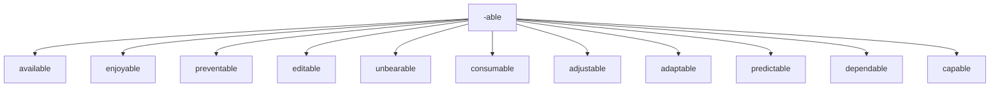


## -ate showing; full of'

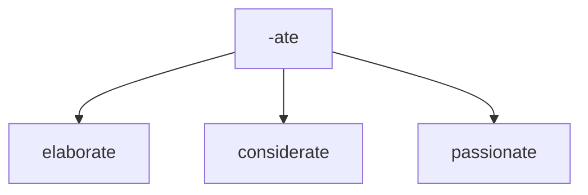


## -ible Meaning: capable of being > adjective 

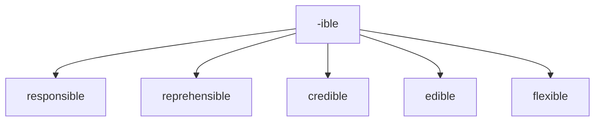


## -al 

Meaning: pertaining to > adjective


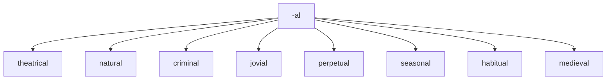


## -al Meaning: result of Verb > noun


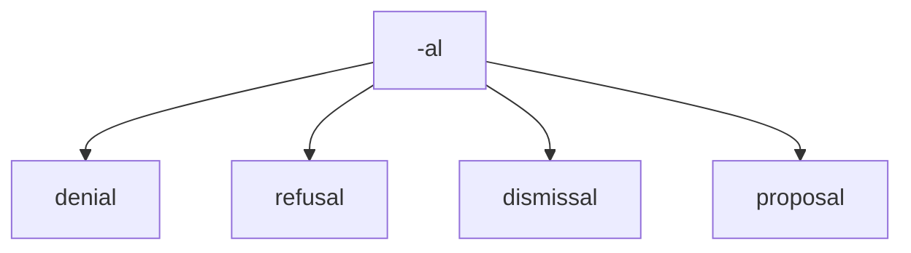


# suffix

## -cede

to go or yield 

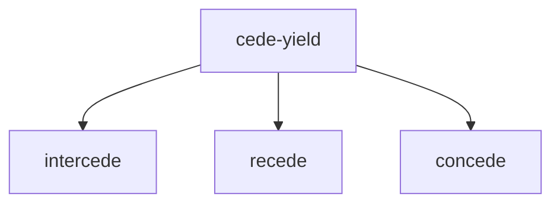


## -ant 

Meaning:  person who is V+ant > noun 


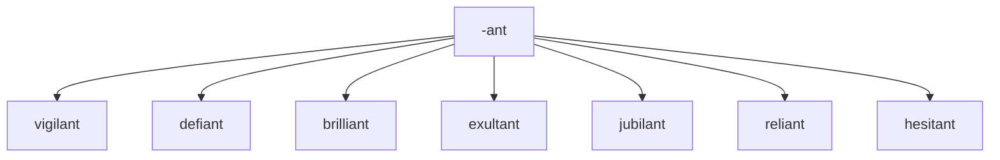


## -scope

viewing or staring


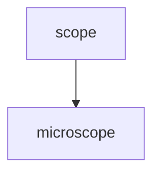


## -ary 

Meaning: of or relating to


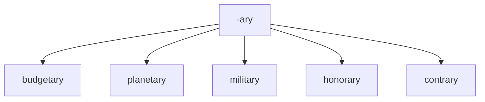


## -ent 

Meaning:  person who is V+ent > noun 


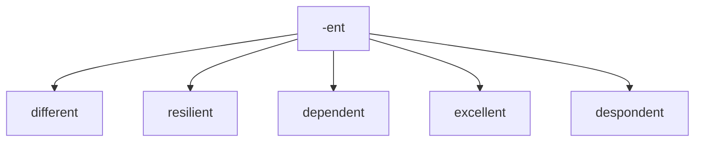


## -ful 

Meaning: full of or notable of (adjective)


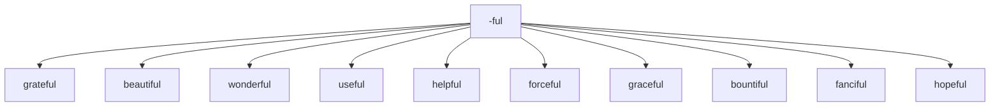


## -ic 

Meaning: relating to

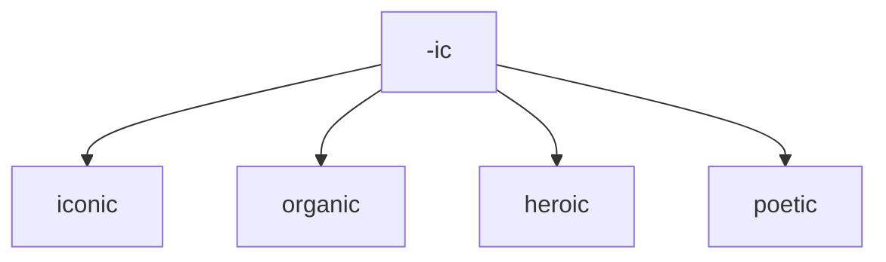


## -ious 

Meaning: having qualities of


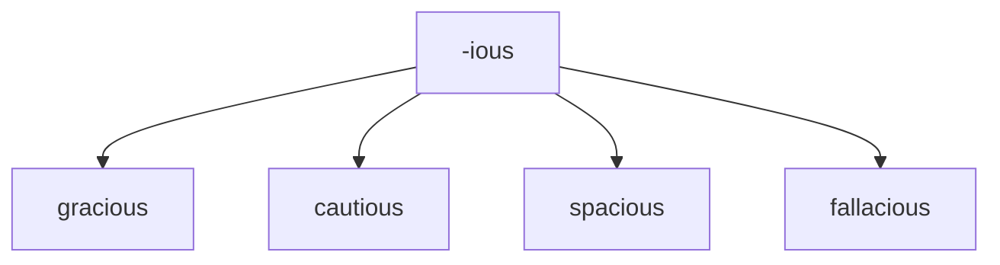


## -ous 

Meaning: having qualities of


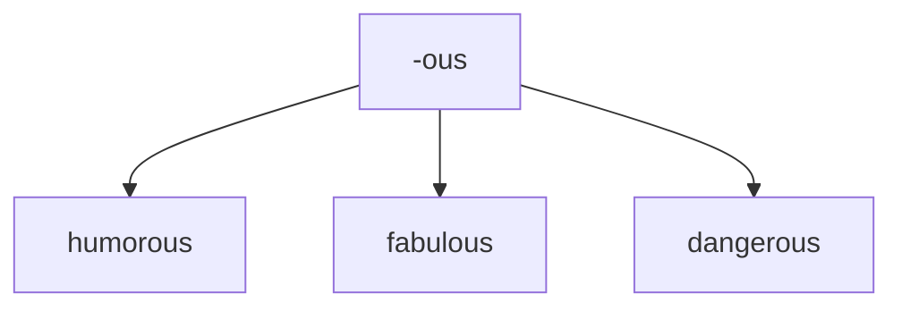


## -ive 

Meaning: quality or nature of


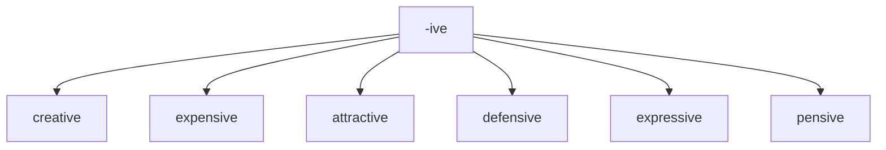


## -less 

Meaning: without something


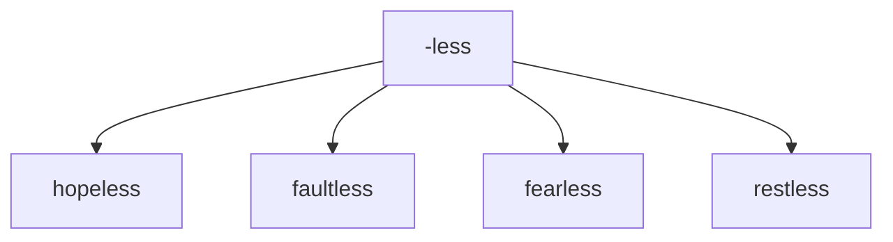


## -y 

Meaning: made up of or characterized by

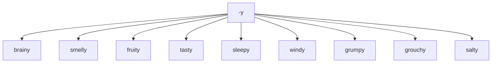


# Prefixes to create negatives 	Examples


## IM-

negative + adjective > adjective


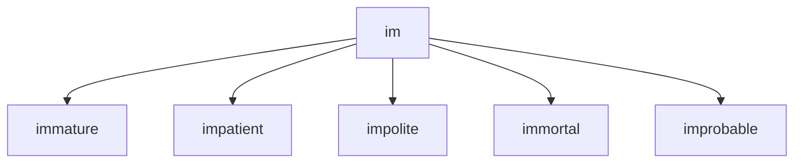


## IL-

negative + adjective > adjective


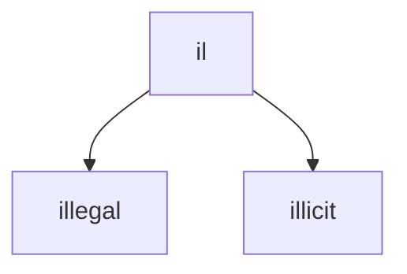


## IN-

not or no

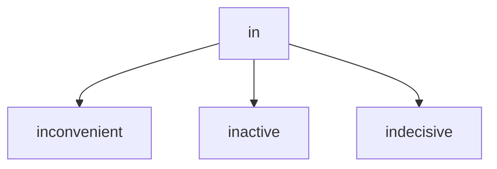


## IR -

not, or no

```mermaid

graph TD; 

 

ir --> irreplaceable;

ir --> irresponsible;

ir --> irrational;

ir --> irregular;


```


## pro - 

"**forward, forth, toward the front**"

```mermaid

graph TD;

pro--> protect; 

pro--> profession; 

pro--> proceed; 

pro--> protest; 

pro--> proactive;

pro--> proclamation; 


```


## UN -

negative + adjective > adjective


```mermaid

graph TD; 


un --> unfortunate; 

un --> uncomfortable;

un --> unbelievable;

un --> unforgivable;

un -->  unjust;


```

## NON -

negative + adjective > adjective


```mermaid

graph TD; 


non- --> non-fiction; 

non- --> non-political; 

non- --> non-neutral;


```


## DIS -

negative + adjective > adjective

apart, not, away from

```mermaid

graph TD; 

dis --> disloyal;

dis -->  dissimilar;

dis -->  disagree;

dis -->  dismember;

dis -->  dishonest;

dis --> disperse;

dis -->  disobey;


```


# Prefixes 


## dia -

complete, through


```mermaid

graph TD; 

dia --> diagnose;

dia --> dialogue;

dia --> dialysis;

dia --> diameter;

dia --> diaphanous;

dia --> diarrhea;


```


## con- 

prefix

with

```mermaid

graph TD;

con -->concieve;

con -->convince;

con -->consider;

```


## em  -

put in or into, bring to a certain state

```mermaid

graph TD; 

em --> embellishment;

em --> embarrassment;

em--> embraced;


```


## en -

within, in

```mermaid

graph TD; 

en --> endorse;

en-->endanger;

en -->encounter;

en -->enclose;

en --> enable;

```


## ex-

**out of**


```mermaid

graph TD; 

ex --> exclaim;

ex --> explain;

```


## anti -

without or against

```mermaid

graph TD; 

anti --> antipathy;

anti -->antitrust;


```


## re-

meaning: again or back

```mermaid

graph TD; 

re --> restructure;

re --> revisit;

re --> repulsive;


re --> reinstate;

```


## dis - 

meaning: reverse the meaning of the word


```mermaid

graph TD; 

dis --> disappear;

 dis --> disapprove;

 dis --> discharge;

 dis --> discourage;

 dis --> disperse;

 dis --> distress;

 


```


## over - 

meaning: too much


```mermaid

graph TD; 

over --> overkill;

over --> overwork;

over --> overlook;

over --> oversee;

over --> overcharge;


```

## un - 

meaning: reverse the meaning of the word


```mermaid

graph TD; 

un --> undead;

un --> unfasten;

un --> undo;

un-->unable;


```


## mis- 

meaning: badly or wrongly 	


```mermaid

graph TD; 

mis --> misunderstand; 

mis --> misbehave; 

mis --> mislead; 

mis --> misinform; 

mis --> misidentify;


```


## out- 

meaning: more or better than others 	


```mermaid

graph TD; 


out -->outperform;

out --> outbid;

```


## be- 	

meaning: make or cause 	


```mermaid

graph TD; 


be--> befriend;

be--> belittle;

be-->beguiled;

```


## co- 	

meaning: together 	


This prefix has a couple of different spellings.


```mermaid

graph TD; 


co --> coexist; 

co --> cooperate; 

co --> co-own;

```


## de- 	

meaning: do the opposite of 	


```mermaid

graph TD; 


de--> devalue; 

de--> deselect;


```


## fore- 

meaning: earlier, before 	


```mermaid

graph TD; 


fore--> forecast; 

fore--> foreclose; 

fore--> forethought; 

fore--> foresee; 

fore--> foreskin; 


```


## inter- 

meaning between 	


```mermaid

graph TD;


inter --> interact; 

inter --> intermix; 

inter --> interface; 

inter --> intercede;

```


## pre- 

meaning: before 	


```mermaid

graph TD;


pre--> prejudice;

pre--> prevent;

pre--> prepare;

pre--> predate;

pre--> prejudge;

pre--> pretest;

```


## sub- 

meaning under/below 	


```mermaid

graph TD;

sub--> subcontract;

sub-->  subdivide;

sub-->  subcontinent;

sub-->  subordinate;

sub-->  subscribe;


```


## trans- 	

meaning across, over 	


```mermaid

graph TD;

trans --> transform;

trans -->  transcribe;

trans -->  transplant;

trans --> transparent;

```


## under - 

meaning: not enough


```mermaid

graph TD;

under--> underbelly;

under--> underperform;

under--> undermine;

```


# suffixes 


## -logy 

study of

```mermaid

graph TD;

-logy --> psychology;

-logy --> caridologist;


```


## -ity 

state or quality of being


```mermaid

graph TD;

-ity --> ability;

-ity --> stability;


```


## -ness 

state or quality of being


```mermaid

graph TD;

-ness --> darkness;

-ness --> illness;

```


## -cy 

state or quality of being


```mermaid

graph TD;

-cy --> frequency;


```


## -er 

person concerned with N


```mermaid

graph TD;

-er --> programmer;

-er --> plumber;

-er --> painter;


```


## -atic 

**of the nature of the thing specified**


```mermaid

graph TD;

-atic --> systematic;

-atic --> problematic;

-atic --> erratic;


```


## -ism 

doctrine of N


```mermaid

graph TD;

-ism --> capitalism;

-ism --> communism;

-ism --> socialism;


```


## -ship 

state of being  


```mermaid

graph TD;

-ship --> leadership;

-ship --> friendship;


```


## -age 

collection of N > noun


```mermaid

graph TD;

-age --> baggage;

-age --> storage;

-age --> sabotage;


```


## -age 

action result of > noun


```mermaid

graph TD;

-age --> wastage;

-age --> heritage;

-age --> garbage;

-age -->hostage;

```


## -tion 

meaning action/instance of V-ing > NOUN


```mermaid

graph TD;

-tion --> alteration;

-tion -->  demonstration;

-tion -->  documentation;


```


## -sion 

meaning action/instance of V-ing > NOUN


```mermaid

graph TD;

-sion --> expansion; 

-sion -->inclusion;

-sion -->exclusion;


-sion --> admission;

```


## -ment 

meaning	action/instance of V-ing > NOUN


```mermaid

graph TD;

-ment -->development; 

-ment -->punishment; 

-ment -->augment;

-ment --> impedement;

-ment--> embellishment;


-ment -->unemployment;

-ment -->enticement;

```


# roots


## ratio

logic;  

reason;  

judgment


```mermaid

	graph TD;

	ratio(logic)-->rational;

	


```


## act

to move or do (actor, acting, reenact)

```mermaid

	graph TD;

	act(do)-->actor;

	act(do)-->acting;

	act(do)-->reenact;

	act(do)-->interact;


```


## ambul

to move or walk

```mermaid

	graph TD;

	ambul(to move)-->ambulance;

	ambul(to move)-->ambulate;


```


## arbor

tree


```mermaid

	graph TD;

	arbor(tree)-->arboreal;

	arbor(tree)-->arboretum;


	arbor(tree)-->arborist;


```


## cardio

heart

```mermaid

	graph TD;

	cardio(heart)-->cardiovascular;

	cardio(heart)-->cardiology;

	cardio(heart)-->electrocardiogram;


```


## crypt

to hide

```mermaid

	graph TD;

	crypt(hide)-->apocryphal;

	crypt(hide)--> cryptic;

	crypt(hide)-->encrpyt;

	crypt(hide)-->cryptography;


```


## acri

bitter

```mermaid

	graph TD;

	acri(bitter)-->acrid;

	acri(bitter)-->acrimony;

	acri(bitter)--> acridity;


```

## astro

stars

```mermaid

	graph TD;


	astro(star)-->astronaut;

	astro(star)--> astronomy;

	astro(star)-->astrophysics;


```


## aud

hear

```mermaid

	graph TD;


	aud(hear)-->audience;

	aud(hear)--> audible;

	aud(hear)-->audio;


```


## auto

self

```mermaid

	graph TD;


	auto(self)-->autonomy;

	auto(self)--> autocrat;

	auto(self)-->automatic;

	auto(self)-->autodidact;


```


## bene

good

```mermaid

	graph TD;


	bene(good)-->benefactor;

	bene(good)--> benevolent;

	bene(good)--> beneficial;

	

```


## carn

flesh

```mermaid

	graph TD;


	carn(flesh)-->carnal;

	carn(flesh)--> carnivorous;

	carn(flesh)--> carnivore;

	carn(flesh)--> reincarnate;

	carn(flesh)--> incarnate;

	

	

```


## corp

body

```mermaid

	graph TD;


	corp(body)-->corporal;

	corp(body)--> corporate;

	corp(body)--> corpse;

		

```


## cred

believe

```mermaid

	graph TD;


	cred(believe)-->credible;

	cred(believe)-->credence;

	cred(believe)-->incredible;

			

```


## dem


people

```mermaid

	graph TD;


	dem(people)-->democracy;

	dem(people)-->democrat;

	dem(people)-->demographic;

			

```


## derm

skin


```mermaid

	graph TD;


	derm(skin)-->dermatology;

	derm(skin)-->epidermis;

	

			

```


## dict

say

```mermaid

	graph TD;


	dict(say)-->diction;

	dict(say)-->dictionary;

	dict(say)-->interdict;

	dict(say)-->dictate;

	dict(say)-->edict;

			

```


## ego

I

```mermaid

	graph TD;


	ego(I)-->egotist;

	ego(I)-->egocentric;

	ego(I)-->egomaniac;

			

```


## equi

equal


```mermaid

	graph TD;


	equi(equal)-->equidistant;

	equi(equal)-->equity;

	equi(equal)-->equilateral;

	

			

```


## eu

```mermaid

	graph TD;


	eu(good)-->euphoric;

	eu(good)-->Europe;

	

			

```


## fac


```mermaid

	graph TD;


	fac(to do)-->factory;

	fac(to do)-->faculty;

	fac(to do)-->faction;

			

```


## herb

plants

```mermaid

	graph TD;


	herb(plants)-->herbivore;

			

```


## hypo

sleep

```mermaid

	graph TD;

	

	hypno(sleep)-->hypnosis;

	hypno(sleep)-->hypnotic;

	hypno(sleep)-->hypnotism;

	

```


## intra

within or into

```mermaid

	graph TD;

	

	intra(within)-->intrapersonal;

	intra(within)-->intramural;

	intra(within)-->intravenous;

```


## gen

```mermaid

	graph TD;

	

	gen(birth)-->genesis;

	gen(birth)-->genetics;

	gen(birth)-->generate;

```


## lum

light

```mermaid

	graph TD;

	

	lum(light)-->lumen;

	lum(light)-->luminary;

	lum(light)-->luminous;

```


## micro

 small

```mermaid

	graph TD;

	

	micro(small)-->microbiology;

	micro(small)-->microcosm;

	micro(small)-->microscope;

	

```


## multi

many

```mermaid

	graph TD;

	

	multi(many)-->multilingual;

	multi(many)-->multiple;

	multi(many)-->multifaceted;


```


## port

```mermaid

	graph TD;

	

	port(carry)-->portal;

	port(carry)-->portable;

	port(carry)-->transport	;

```


# scrib

write

```mermaid

	graph TD;

	

	scrib(write)-->transcribe;

	scrib(write)-->subscribe;

	

	

```


 --- 

# ENGLISH_TENSES
<p id='tense_present_simple.md'></p><a href='#top'>↑</a>


## tense present simple.md

[[English Tenses]]


---

1.  Use the present form of the verb. You use this for plural subjects (that means more than one), and for those crazy singular pronouns I and you. 

2.  Add s to present form of the verb. You'll only do this when your subject is singular. 

3.  Add es to the present form of the verb.


---


-   I work in London.

-   {NAME} works in London.

-   This program complies with the state regulations.

-   This project combines a lot of services into one.

-   I'm nineteen years old. 

-   I play football every weekend.

-   The human body contains 206 bones. ...

-   My daughter goes to school everyday.


- They drive to work daily.


- She talks a lot.


- She avoids that part of town.


- I don't read comic books.


- Every day I cook breakfast for us.


- The chair is upholstered in cheap nylon.


- The chair is fashioned out of wood and leather.


- I always arrive on time.


- He perseveres.


- He perserveres in the face of all obstacles.


- Determination is important if you want to acheive your goals.


- I wear my striped socks with pride.


- I run daily.


- I feel like I jog all the time.


- I drive my car everyday to work.


- I feel like I worry all the time.


- I feel like I work all the time.


- I feel like I sit all the time.


- I feel like I think all the time.


- I feel like I'm afraid all the time.


- I feel like I'm hungry all the time.

- I feel like I'm sleepy all the time.

- I feel like I'm tired all the time.

- She promotes her marketing services every month on Linked In.

- I type very slowly.

- My family eats dinner together regularly.

- He walks his dog in the morning.

- She normally sits under that tree.

- They paint slowly.

- He fixes computers for a living.


- They like to travel.


- I study late at night.

-   I sometimes go to the cinema. ...

-   The school term starts next week.

- My phone is full of photos... [[tense present simple]]


I do, I do do


* I study programming(gerund) everyday so that I continue to grow as a professional.

* We have a house in the country.

*  --- 
<p id='tense_present_perfect_continuous.md'></p><a href='#top'>↑</a>


## tense present perfect continuous.md

[[English Tenses]]


The present perfect continuous is formed using the construction has/have been + the present participle (root + -ing).


-   I have been studying for three hours.

-   I have been watching TV since 7pm.

-   {NAME} hasn't been feeling well for two weeks.

-   {NAME} hasn't been visiting us since {MONTH}.

- Statement: You **have been waiting** here for two hours.

- **Have** you **been waiting** here for two hours?

- I have been driving around for hours looking for a parking place. [[topic cars]]

-   Negative: You **have not been waiting** here for two hours.

-   They **have been talking** for the last hour.

-   She **has been working** at that company for three years.

-   What **have** you **been doing** for the last 30 minutes? #questions

-   {NAME} **has been teaching** at the university since {MONTH}.

-   We **have been waiting** here for over two hours!

-   Why **has** {FEMALE_NAME} **not been taking** her medicine for the last three days?

-   I have been preparing.

-   I have been reading about X.

-   Recently, I **have been feeling** really tired.

-   She **has been watching** too much television lately.

-   **Have** you **been exercising** lately?

-   {FEMALE_NAME} **has been feeling** a little depressed.

-   {FEMALE_NAME} **has not been practicing** her English.

-   {MALE_NAME}**has had** his car for two years.

-   What **have** you **been doing**?


 --- 
<p id='tense_present_perfect.md'></p><a href='#top'>↑</a>


## tense present perfect.md

[[English Tenses]]


---


To make the positive present perfect tense, use:


-   **'have' / 'has'** + the **past participle**

-   Make the past participle by adding **'ed' to regular verbs** (for example, 'play' becomes 'played')

-   There are a few verbs that change their spelling when you add 'ed' (for example, 'study' becomes 'studied')


---


= HAVE / HAS + MAIN VERB (PAST PARTICIPLE)


Examples:


1.  I --have finished-- all my homework.

2.  She --has gone-- to the store.

3.  We --have lived-- here for three years.


-   Has lived: She has lived here all her life.

-   I have been on the metro for hours.

-   Have written: They have written three letters already.

-   Have worked: I have worked here since I graduated school.

-   Has done: He has finished his homework.

-   Have been: We have been to {COUNTRY}.

-   Has forgotten: She has forgotten her folder.

- He has seen that movie several times. (present perfect)

- I have been promoted! (passive)

- I have had many meetings last week.

- I have [finished, completed,done] this task.

- I have spread myself too thin! (idiomatic) I am trying to  do everything at the same time.

- It has happened before.

- I haven't heard that news. 

- They have spread some [nasty,mean,bad] gossip about the new guy.

- I have visited {COUNTRY}.

- I have finished the task.

- We have brought in another team to help us on this project.

- I have spent four hours completing this task.

- We **have lived** here since {YEAR}. [and we still live here]  

- I **have been working** at the university for over ten years.
 --- 
<p id='tense_present_continuous.md'></p><a href='#top'>↑</a>


## tense present continuous.md

[[English Tenses]]


---


We make the Present Continuous tense **by adding -ing to the base verb**. Normally it's simple: we just add -ing. But sometimes we have to change the word a little. Perhaps we double the last letter, or we drop a letter.


---


-   She is crying.

-   He is talking to his friend.

-   We are observing massive changes in the earth's atmosphere.

-   I'm living at my brother's place.

-   The baby is sleeping in his crib.

-   We are visiting the museum in the afternoon.

-   Am you reading a book right now?

-   Is he speaking on the phone with your manager?

-   Is the baby still crying?

-   Is the dog eating his food now?

-   Are we cooking tonight?

-   Are the children sleeping yet? --- 
<p id='tense_past_simple.md'></p><a href='#top'>↑</a>


## tense past simple.md

[[English Tenses]]


---


We make the past simple just like the present simple except we use 'did' instead of 'do / does'. It's really easy because 'did' doesn't change, even with 'he / she / it'. The positive: We usually make the positive by adding '-ed' to the infinitive.


Past simple sentences are created by changing a regular verb into its past tense form, we normally add –ED to the end of the verb.


---


- They found out later that it was a different neighbor making the noise.

- I went to school.

- She arrived last night. [[grammar elements verbs#arrive arrived d reg]]

- I watched TV. [[grammar elements verbs#watch watched t reg]]

- I thought about the world.

- We ate earlier.

- I made a good cup of coffee!

- I went to a cafe.

- We fostered a new group of young developers to become better coders.


- A few weeks ago I finished a very good book.

- I left my previous company two years ago.

- Our trees produced a lot of fruit.

- I went to Odessa one year ago.


- We grew a number of crops this summer.


- We planted a lot of trees in our orchard.


- Our PO launched this initiative six months ago.


- Yesterday our friend was really determined to get vaccinated.


- Yesterday our friend was really determined to finish his work so that he could enjoy a quiet weekend.


- He showed great determination to learn how to dance.


- She had determination.


- I had lunch.


- I drank bottled water from Fiji!


- I danced all night.


- I rested yesterday.


- Last week I booked a table in a nice restaurant.


- I jogged around the city last month.


- I jogged around my neighborhood last month.


- They liked my new dress.


- We knew that he was lying.


- He worked hard to finish on time.


- I sent you a message earlier.


- We saw the tree fall on that car!


- I walked home after work.


- I cleaned the apartment before they arrived.


- I took a nap on the couch.


- I sat and cried for awhile.


- I drove home slowly.


- I carried her up the stairs.


- He fed his children and then put them to bed.


- I bought a new phone!


- I made a bad decision.


- I spoke to the landlord about the leaking faucet.


- We celebrated our wedding anniversary.


- I slept like a baby.


- She went ballistic when she heard the news.


- She watched with horror as her kitchen got swallowed in flames.


- I put a lot of effort into getting this to work.


- My spouse cooked dinner last night.


- My business partner said I was useless!

- Yesterday was an abnormally hot day. [[grammar elements adverbs]]

- She doesn't want to speak {LANGUAGE}.

- {FEMALE_NAME}  fell and broke her leg.

-   I saw a movie yesterday.

-   We caught a lot of fish. [[topic fishing]]

- The film **started** at seven thirty.  

- We **arrived** home before dark._

-   I didn't see a play yesterday.

-   My visa expired. [[topic travel]]

-   How long did you work at X?

-   Last year, I traveled to {COUNTRY}.

-   Last year, I didn't travel to {COUNTRY}.

-   Did you have dinner last night?

-   {FEMALE_NAME}  washed her car.

-   {MALE_NAME}  didn't wash his car.


# dialogues

-   How long did you work at X?

-   I worked at X for three years.

  ---
 --- 
<p id='tense_past_perfect_continuous.md'></p><a href='#top'>↑</a>


## tense past perfect continuous.md

[[English Tenses]]


---


The past perfect continuous tense (also known as the past perfect progressive tense) shows that an **action that started in the past continued up until another time in the past**. The past perfect continuous tense is constructed using **had been** + the verb's present participle (**root + -ing**).


---


-   He **had been drinking** milk out the carton when Mom walked into the kitchen.

-   I **had been working** at the company for five years when I got the promotion.

-   We **had been working** on project X for two years and then the budget got cut.

-   We **had been thinking** about buying a new car when we found out that there will be a new bus station next door.

-   I **had been sitting** at my desk for 44 minutes when my cat appeared on my laptop!

-  

-   {FEMALE_NAME} **had been walking** three miles a day before she broke her leg.

-   The program that was terminated **had been working** well since 1945.

-   I **had been going** to school with my mind closed.


- I had been driving for hours before I stopped for a technical break.


- They had been knocking down beers all day long.


- The phone had been working up until I dropped it.


- We had been squeezing lemons for hours before the picnic began.


- We had been squeezing lemons for hours before we started selling lemonade.


- We had been squeezing lemons for hours before we opened our lemonade stand.


- During the negotiations we had been squeezing the client for more money before we found a trade off.


- The thieves had been breaking into cars all day long and they were tired.


- We had been hearing lots of stories about wandering wizards in times of trouble.


- During antic times, they had been telling stories of evil wizards in the forests.


- They had been knocking down the wall when we arrived.


- She had been shopping earlier that day.


- I had been living happily until I got married.


- I had been living happily when I got married but all of that soon changed.


- I had been preparing for years for my first trip into space.


- I had been spending a lot of time looking into my telescope searching the universe for meaning.


- I had been looking forward to having a vacation for awhile when my wife told me she had bought tickets to Egypt.


- I had not been traveling with my phone because I didn't want to be connected.


- I had not been traveling with my phone because I didn't want to be disturbed.


- I had been sleeping in the office for two days while we searched for the bug.


- We had been eating leftovers all week long before we went shopping.


- She had been talking to the police for hours.


- We had been determining the reason for the server failure for two days when we finally found the bug.


- The fans had been crowding the musicians before the concert began.


- We had been planning the trip for months.


- I had been working on a new project when I got offered a new job.


- The sailors had been calling for help but the radio didn't work.


- They had been crowding the restaurant ever since Lady Gaga showed up.


- It had been working well right up until it didnt' work anymore.


 --- 
<p id='tense_past_perfect.md'></p><a href='#top'>↑</a>


## tense past perfect.md

[[English Tenses]]


---


We use the past perfect simple (**had** + past participle) to talk about time up to a certain point in the past.


---


-   After {FEMALE_NAME} **had finished** her work, she went to lunch.

-   I washed the floor after the painter **had gone**.

-   I **had finished** my work when I my mother called me.

-   I **had completed** most of my onboarding training. [[topic onboarding]]

-   Harold **had known **about it for a while.

-    I **had misplaced** the keys and therefore my wife was not able to find them.

-   My cat **had started **coughing. [[topic cats]]

-   I didn't say anything until she **had finished** talking.

-   After she **had moved** out, I found her notes.

-   Before I knew it, she **had run** out the door.

-   I wasn't hungry. I **had just eaten**.

-   I **had finished** resolving the issue before my PM arrived.

-    {FEMALE_NAME} suddenly remembered she **had left** her keys in the car.  

- When we **had done** all our shopping, we caught the bus home.  

- They wanted to buy a new computer, but they **hadn't saved** enough money. 

- I **had had** a call with the developer after I assigned the ticket to him.

- They would have bought a new computer if they **had saved** enough money._

-  **She'd published** her first book when she was twenty four.

-  **I'd** met all of my peers at the meeting.

-  **They'd eaten** lunch before coming over.

- **We'd finished** all the drinking water before we were halfway up the mountain.  

- I **had [finished|emptied]** my coffee thermos before I arrived to work.

- Had the parcel arrived when you called yesterday?

- They were hungry. They **had not eaten** for five hours.

- I didn't know who he was. I **had never seen** him before.

- He told us that the train had left.

- I thought I had met her before, but I was wrong.

- He explained that he had closed the window because of the rain.

- I wondered if I had been there before.

- I asked them why they had not finished.

- We had eaten sushi the night before.


- I had just finished cooking the meal when my guests arrived.


- I didn't want to watch the film, as I had already seen it.


- I had activated my account before taking the exam.


- We had seen the movie before.


- I hadn't been sick before I started working in the clinic and now I'm sick all of the time.


- They had leveraged all of their available resources.


- I had not traveled with my in-laws before.


- I had cleaned the apartment yesterday after work and now it's a mess again!


- I hadn't planted any trees last year because I was worried about frost.


- I had implemented the new module before my boss told me to.


- I had hung the picture on the wall before they arrived.


- I had created the marketing plan before writing the content.


- She had felt that something was wrong for awhile.


- I had walked to the end of the street before I realized I had forgotten my keys.


- They had negotiated for hours but didn't arrive to a solution.


- We had built our dreams on sand.


- We had used the last of our money.


- I had driven the road only during the day and quickly got lost in the night.


- We had visited her mother in the hospital.


- They had painted over the mural.


- She had baited me before we got married and now I'm hooked!


- They had fixed the stove before I got home.


- I had slept well the night before.


- I had bought a bicycle for my wife for her birthday but she never rode it.


- I had talked to her about this problem before but nothing had changed.


- He had acted [strangely, weirdly] before meeting his friends. --- 
<p id='tense_past_continuous.md'></p><a href='#top'>↑</a>


## tense past continuous.md

[[English Tenses]]


---


The past continuous tense is **formed by combining the past tense of to be** (i.e., was/were) with the verb's present participle (-ing word). There are many situations in which this verb tense might be used in a sentence. For example, it is often used to describe conditions that existed in the past. The past continuous is formed using **was/were + present participle**.


Questions are indicated by inverting the subject and was/were. Negatives are made with not.


---


- I was going to call her.

- I was considering a new job.

- They were going  to call her at six o clock but they didn't.

- We were eating a lot of ice cream before we noticed how fat we had gotten.

- She was taking her time to answer.

- It was living here for awhile.

- I was buying foreign currency when my wife [distracted,disturbed] me with some bad news: the dollar was rising in value!

- They were discovering a lot of pitfalls during the project analysis phase.

- The bird was living here for awhile.

- I was trying to find a way to test a remote API before I noticed that there was already a solution on the confluence page.


- I was trying to find a way to test a remote API before I noticed that someone had already posted a solution.


- While I was working on the project, Natalie cooked lunch for me.


- The dog was living here for three months.


- I was promoting her to our manager because she was qualified.


- I was planning on meeting my manager but the power went off!


- They were preparing dinner all afternoon.


- I was sunbathing five years ago on the beach.


- Yesterday I was running for one hour.


- Yesterday I was jogging for one hour.


- He was playing ball when I arrived.


- The sun was shining every day that summer.


- As I spoke, the children were laughing at my cleverness.


- The audience was applauding until he fell off the stage.


- I was making dinner when she arrived.


- I was waiting for my wife to call when my daughter arrived.


- I was doing my homework in my room.


- He was working very hard.


- I was living in Paris in 2001.


- She was talking to her mother.


- The sun was shining every day that summer.


- It was snowing every day that winter.


- As I spoke, the children were laughing at my cleverness.


- The audience was applauding until he fell off the stage.


- I was making dinner when she arrived.


- At 6 o'clock, I was eating dinner.


- She was talking constantly in class in those days.


- At noon, he was arriving.


- They were painting the ceiling in their apartment.


- He was coding up a solution when the server went down.


- I was sleeping when the phone called.


- We were chatting about her family when her mother called.


- We were talking about something, but I don't remember what.


- They were leaving the country and they were happy.


- He was behaving strangely when they arrived!


- They were playing football.


- I was doing something, but I don't remember what!


- She was crying over spilled milk!

-   The sun was shining every day last summer. 

-   As I spoke, the children were laughing at my cleverness. 

 -   They were waiting for the bus when the accident happened.

-   Caroline was skiing when she broke her leg.

-   When we arrived he was having a bath.

-   When the fire started I was watching television.

-   The audience was applauding until he fell off the stage. 

-   I was making dinner when she arrived.

-   At 6 o'clock, I was eating dinner.

-   I was working at X company in 2018.

-   She was talking constantly in class in those days. --- 
<p id='tense_future_simple.md'></p><a href='#top'>↑</a>


## tense future simple.md

[[English Tenses]]


---


The formula for the simple future is **will + [root form of verb]**.


---


- They will arrive later.

- I will need to speak more English in the future.

-   I will meet him later (I'll ..)

-   You will come (you'll..)

 -   What **shall I tell** the boss about this issue?

-   It **will rain** tomorrow.

-   I will arrive in {CITY} early {DAY} morning.

-   **I'll do** the dishes later.

 -   **Shall I open** the [door|window]?

-   We will start testing soon.

-   The baby **won't eat** his soup.

-   It will rain tomorrow (it'll)

-   She will be late (she'll..)

-   He will help us later (he'll..)

-   We will get married in September (we'll)

-   They will cook dinner (they'll..) --- 
<p id='tense_future_perfect_continuous.md'></p><a href='#top'>↑</a>


## tense future perfect continuous.md

[[English Tenses]]


---


The future perfect continuous consists of **will + have + been + the verb's present participle (verb root + -ing)**. When we describe an action in the future perfect continuous tense, we are projecting ourselves forward in time and looking back at the duration of that activity.


---


- I will have been playing football for three years this January.

- I had been driving for hours when I got a flat tire.

- I had been hoping for a promotion when I learned that my manager had been fired. --- 
<p id='tense_future_perfect.md'></p><a href='#top'>↑</a>


## tense future perfect.md

[[English Tenses]]


---


The future perfect is made with the future simple of 'have' (will have) and the past participle. For regular past participles add 'ed' to the verb ('play' becomes 'played').


---


- I will have been studying X for six hours by the end of the day.

- What will you have [completed, done] by Sunday night?

- He will have connected to the conference call by the time we start the meeting.

- We will have talked to our doctor about our next appointment.

- I will have started my courses by 15DEC.

- The house will have been heated by the time my family arrives.

- I will have activated the relays for the heater remotely so that the house will be warm when we arrive.

- My son will have finished high school by the time he turns 18. --- 
<p id='tense_future_continuous.md'></p><a href='#top'>↑</a>


## tense future continuous.md

[[English Tenses]]


---


The future continuous tense, sometimes also referred to as the future progressive tense, is a verb tense that indicates that something will occur in the future and continue for an expected length of time. It is formed **using the construction will + be + the present participle (the root verb + -ing)**.


To form the future continuous with going to, you need to use the correct present form of the verb **to be** (am/is/are). Then use going to be. Then use the -ing form of the verb. am going to be working.


---

-   I will be writing articles on different topics.

-   Robert will be reading various kinds of books.

-   

-   They will be playing football in that field.

-   April will be having coffee in this coffee shop.

-   I am going to meet my friends.

-   Bob will be going to the library.

-   We will be shopping in that market this Monday. --- 

# English Support
<p id='English_dialogues_work_rules.md'></p><a href='#top'>↑</a>


## English dialogues work rules.md

## work rule : Language evaluation interview

* If you are being evaluated for your English language skills, you should turn on your video camera.

* If you are being evaluated for your English language skills, you should review your English grammar rules.

* If you are being evaluated for your English language skills, you should ask around to find someone who has recently been evaluated.

* If you are being evaluated for your English language skills, you should verify the requirements for your target level.


## work rule:  You must take part in the daily meeting.

mngr: You must take part in the daily meeting.

noob: Why?

mngr: If you need to know why, then we can't work together.

noob: Why?

mngr: Because in the daily meeting we share what we have done.

noob: Why?

mngr: Because sharing helps us work as a team!

noob: Why?

mngr: Because working as a team you can get and give help to your team.


* If nothing is working, then check the log files.

* You must take part in the daily meeting.

* If you have a problem you should notify someone to get help to resolve it.

* If you get stuck, ask for help.

* If you spot a new issue, then you must create a new ticket.

* If you have written new code, there must be test coverage of same.

* db manager: If the data is not correct you need to verify it.

* db manager: If we need to display some data, we need to create a report or dashboard.

* If you find an interesting article related to work, share it with your colleagues.

* email: If am CCed on an email, I will ignore it.

* If the internet is not working call tech support.

* If there is a meeting, don't be late.

* If there is a meeting you need to join the meeting in advance.

* If you don't know how to fix a problem you should research it first then if you don't find an answer then ask your colleague.

* If you spend more than fifteen minutes figuring out an issue, then you should ask for help from your colleagues.

* If the meeting is not relevant to you, don't go.

* Before committing your code, you should review it first.

* If you have any work related questions, contact your manager.

* If you are taking an exam, read the question carefully.


## work rule: If you are in an open space office, please use a different room for your phone calls.

Dad: If you are in an open space office, please use a different room for your phone calls.

Son: Why?

Dad: Because we don't want to interrupt our colleagues.

Son: Why?

Dad: Because we don't like to be interrupted.

Son: Why?

Dad: Because your voice can break their concentration.

Son: Why is that important?

Dad: Because their work requires a lot of concentration.

Son: Why?

Dad: Because they are trying to solve difficult problems.

Son: Just like me Dad! Now I why I should not talk on my office in an open space office! Thanks Dad!


 --- 
<p id='English_discussion_life_rules.md'></p><a href='#top'>↑</a>


## English discussion life rules.md

# life rule: no fires allowed in the tent


# life rule: close the tent as soon as possible


# life rule : no alcohol while camping 


# life rule :  be careful where you walk


# life rule: Be careful with the boiling water.

uncle: Be careful with the boiling water.

nephew: Why?

uncle: Because it's very dangerous and you can be injured by the hot water and the hospital is far from here.

nephew: Why is boiling water dangerous?

uncle: The boiling water will burn you and we won't be able to help you!

nephew:  Why won't you be able to help me?

uncle: Because we don't have the equipment to help you!

nephew: Why don't you have the equipment to help me?

uncle: Because I'm not a doctor. For burn treatment we need more specialized equipment?

nephew: Why aren't you a doctor?

uncle: Because I don't like being around sick people.


# life rule: be ready for challenges in relationships


# life rule: Be prepared to negotiate in the relationship


# life rule: When choosing a rental car use a qualified rental company.


# life rule: When choosing a rental car get full insurance.


# life rule: Before driving a rental car away, check all of the cosmetics and systems.

Dad: Before driving a rental car away, check all of the cosmetics and systems.


Son: Why, Dad?


Dad: Because you want to verify that the vehicle is safe!


Son: Why, Dad?


Dad: You have to be sure that the car lights are functioning and that the brake system and the gear system are all functioning properly. This might help you avoid unexpected problems while driving!


Son: But Dad, I'm not a car mechanic! What should I do?


Dad: I'm not a mechanic either! But before you get into the car you need to check the headlights, the turn lights, the brake system, you must adjust the mirrors, and you need to adjust the driver's seat and you need to adjust drive mode. And don't forget to confirm and take a photo of the odometer and the fuel gauge before you drive away!


Son: Thanks Dad! You're the best!


Dad: You might consider buying your own car but that's a different story!


# life rule: four year old girls should not smoke cigars


# life rule: children shouldn't play with electricity

Dad: Please don't use this wall adapter!

Daughter: Why not, Dad?

Dad: Because this adapter is damaged?

Daughter:  Why is it damaged, Dad?

Dad: Because the wire for the adapter is broken?

Daughter: Why, Dad? How did it get broken?

Dad: Because you were playing with this adapter with your dolls!

Daughter: DAD! NOT TRUE! IT WAS TIMMY!

Dad: Why were your dolls wrapped around the wire?

Daughter: It wasn't me! It way TIMMY! He hates my dolls and he wanted to electrocute them!


# life rule: children shouldn't bite other people


# life rule: couples should be honest with each other


nephew: What's a good rule in a relationship?

uncle: Couples should be honest and [loyal|true] to each other.

nephew: Why?

uncle: If a couple wants to be happy they should follow this simple rule.

nephew: How can a couple be happy?

uncle: If a couple loves each other, and if they are honest and loyal to each, 100% they will be happy!


# life rule: children shouldn't be allowed to smoke


# life rule: small children shouldn't be allowed to play around cars without adult supervision


# life rule: you should express your gratitude to the women in your life on Women's Day


# life rule You should think before you act.


Dad: You should think before you act.


daughter: Why is that important?


Dad: Because if you don't think before you act, bad things will happen!


daughter: But that's life, I must learn from my mistakes!


Dad: If you don't care about yourself, try to think about your parents! We don't want bad things to happen to you!


daughter: But this is my life! Not yours!


Dad: Ok, do what you want but I don't want to hear about your regrets...


daughter: Ok, I will never tell you about my regrets (door slams, daughter disappears, she shows up on the news five years later!)


# life rule: You shouldn't waste your time!

Mom: You shouldn't waste your time!


son: Why?


Mom: Because time is very important and you can't get it back. 


son:  But what if I don't care about wasting time?


Mom: Right now you don't care about time... but maybe in ten or twenty years you will regret things that you didn't even try because you were wasting your time.


son: Thanks for your advice but I want to be happy right now!


Mom: I just want you to consider my ideas.


son: Thanks Mom!


# life rules: muddy outside

Mom: You should wear your rubber boots because it is muddy outside!

Son: Why should I wear rubber boots?

Mom: Because you will get dirty otherwise.

Son: Why will I get dirty?

Mom: Because you like to play in puddles.

Son: Why are there puddles?

Mom: Because it was raining and the roads are not properly maintained.

Son: Why are the roads not maintained?

Mom: Who knows!

Son: Whom can I ask?

Mom: Write a letter to Santa and ask him!


# life rules: wealth

Dad: If you want wealth, you should dream about it.

daughter: Why should I dream about wealth?

Dad: Because otherwise without dreaming about it you won't get it!

daughter: Why?

Dad: Because when you are dreaming about something you are visualizing it.

daughter: I'm dreaming about cash. But I'm not getting it! Why?

Dad: Because you are just dreaming and not visualizing it. That's why you are not getting cash.

daughter: I see many presidents on green paper! Where is my money?

Dad: Money won't make you happy. You need to visualize the stuff that you will buy with this money!

daughter: I am visualizing a red car with horses.


# life rules: fireman

Dad: If there are firemen, you should not interfere with them.

Son: Why not?

Dad: Because they are busy putting out a fire.

Son: Why?

Dad: Because they are trying to save the building.

Son: Why?

Dad: Because the building is being used(d) by somebody.

Son: Why?

Dad: Because people usually live in buildings.

Son: Why?

Dad: Because people need shelter at night against the weather.

son: Why?

Dad: Because people are not wild animals and won't survive without shelter.


# life rules: rainstorm

Dad: If there is a rainstorm, you should take an umbrella.

daughter: Why?

Dad: Because without an umbrella you will get wet!

daughter: Why?

Dad: Because the rain falls from the sky!

daughter: Why?

Dad: Because it is a natural process.

daughter: Why?

Dad: Because when it was hot the water rose into the sky!

daughter: Why?

Dad: Because it is a feature of water. When it is hot it becomes a gas and gas is very light.


# life rules: loud neighbors


# life rules: don't park in the handicapped zone


# piano

* If you want to learn you should learn how to play with both hands from the beginning.


# metronome

* If you are learning an instrument you should use a metronome.


# chicken

* If the chicken is ready to eat, you should eat it soon!	


# butter

* If the butter is fresh, you should buy it.


# bag

* If I forget my bag at home, I should go back and get it!

* If your bag was stolen, you should call the police!


# kettle

* If the kettle is hot, you should not touch it.


# pump 

* If the pump is not working, you should contact a repairman.


# sea

* If there is a storm at sea, you should avoid the water.


# weather

* If the weather is snowy, you should stay at home.


# dad~ father

* If you are a dad, then you should demonstrate good habits to your children.


# book

* If you are done with your books, then you should put them away.

* Don't continue reading the book if it's not interesting anymore.


# cross the road

* Look both ways before you cross the road.


* If I haven't finished my work, I don't watch TV.

* life rule: If you are in a stressful situation, then try to keep calm. Do as the British: Keep calm and carry on!

* life rule: To be creative you must understand what you have on hand.

* life rule:money: If you want to save your money, stay at home and turn off the internet and maybe your phone too.

* If you are feeling ill, you must stay at home.

* Teach your children to not touch fire.

* rule: Before repairing a a machine, make sure it is not running.

* If you are in the library then you must be quiet.


* rule: interviews: Your collar should always be clean and white.


What do you think about ...?

How much time do you spend trying to answer a question before you ask for help?

How do you monitor how much time you spend solving problems? --- 
<p id='English_discussion__life_sequence.md'></p><a href='#top'>↑</a>


## English discussion  life sequence.md

# life

## infant

be born

learn to cry

learned how to be held

learn to hold head up

learn to turn over

learn to sit alone

learn to hold the bottle

learn to crawl

learn to escape from the bed

learn to stand

get the first tooth

## child

learn to speak first words

learn to walk

learn to read

learn to count

learn how to ride a bike

## school

start school

made friends

lose the first tooth

graduate from high school

go to a technical college

attended a technical college

learn how to drive a car

go to college

learn how to program

go to university

rent an apartment

get a job

commute to work

buy a car

date

fall in love

get engaged

get married

buy a house/an apartment

be pregnant

have a baby

raise a family

move

get sick

take a vacation

celebrate a birthday

celebrate an anniversary

celebrate a wedding

become a grandparent

retire

travel

die/pass away


 --- 
<p id='English_opposites.md'></p><a href='#top'>↑</a>


## English opposites.md

unusual <> usual


strengths <> weaknesses.


safe<>dangerous


soft<>rigid

flexible<>rigid


finite<>infinite


clean <>dirty


sincere<>insincere


manual<>automatic


innocent<>guilty


sane<>insane


yesterday<>tomorrow


unhealthy<>healthy


inedible<>edible


deep<>shallow


guilty <>innocent


unleash <> leash


inner <> outer

* We were under the hood looking at the inner workings.


inconsistent<>consistent


inaccurate<>accurate


impolite<>polite


rude<>polite


desirable<>undesirable


configured<>misconfigured


get sick <>recover


suitable<>unsuitable


rural<>urban

* She doesn't live in the city. She lives in a very rural community.

calm<>manic

* He's not calm! He's manic.

sharp knife<>dull knife

* I bought a bought a sharp knife a while ago but not it's dull.

sharp person<>stupid person


entertaining<>dull

* There are both entertaining and dull shows on Netflix.


vertical<>horizontal


waste of time <> more efficient


happy<>sad


major<>minor

disciplined<>undisciplined


legal<>illegal


drunk<>sober


logical<>illogical


odd <> even

black <> white

hungry <> full

normal <>abnormal

wet<>dry

busy <> free

busy <> not busy

poor <> rich

fast <> slow

long <> short

cold <> hot

cold <> warm

comfortable <> uncomfortable

convenient <> inconvenient

loud <> silent

loud <> quiet

procrastinate<>act

new<>old

sick<>healthy

chaos<>order

sunny<>cloudy

clear<>murky

happiness<>sadness

leafy<>bare

hard<>soft

sharp<>dull

open<>close

life<>death


 --- 
<p id='English_pronunciation_tips.md'></p><a href='#top'>↑</a>


## English pronunciation tips.md

# pronunciation of past tense ed

## pronunciation rules for past tense 

* 'p'	stopped (t)

* 'gh'	laughed (t)

* 's'	promised (t)

* 'ch'    watched (t)

* 'ch'   researched (t)

* 'ch'   matched (t)

* 'ch'   launched (t)

* 'sh'    finished (t)

* 'k'	walked (t)

* 'x' fixed (t)


## pronunciation with (id) sound at the end

* 't' wanted (want-id)

* 'd' ended	(end-id)

* 't' listed (end-id)

* 'd' decided	(decide-id)

* admitted	(admit-id)

* suggested	(suggest-id)

* recommended	(recommend-id)

* 't' hated	(hate-id)

* intended	(intend-id)

* 't' interested	(intend-id)

* 't' started	(start-id)

* 't' sedated

* baited

* inflated

* Parted

* started

* ended

* over rated

* laminated

* sated

* stated


## pronunciation with (T) sound at the end

* talked (t)

* typed

* smoked

* spooked

* cracked

* crashed

* forced

* backed

* smacked

* stacked

* duked

	*	They really duked it over who was the best boxer!

* marked

* stocked

* stopped

* blushed

* Locked

* Kicked

* discussed

* Splashed

* squashed

* Kissed

* Passed

* Hooked

* Cooked

* Looked

* Rocked

* Socked (to sock)


## pronunciation with soft d sound

* 'w' allowed

* 'i' cried

* 'i' lied

* 'i' died

* 'i' fried

* 'w' borrowed

* 'y' enjoyed

* 'n' cleaned

* 'n' imagined

* 'n' determined

* 'g' changed

* 'z' realized

* 'z'  recognized

* 'n'learned

* 'g' arranged

* 'n' planned

* 'v' Arrived

* 'y' played

* 'z' apologized


# pronunciation of other letters

## silent b (don't pronounce the B!)

* climb

* comb

* crumb

* dumb

* lamb

* subtle

* debt

* doubt

* plumber

* thumb

* womb

* tomb


## silent c

- yachts

- muscle

- scissors 

- ascent 

- fascinate


## silent h (don't pronounce the H!)

https://pronunciationstudio.com/h/

* honest

* whistle

* HONOUR

* HOUR

* HONEST

* HEIR


## silent k (don't pronounce the K!)

* knee

* knock

* know

* knife

* knead

* kneel

* knight

* knowledge


## silent p

https://englishlive.ef.com/blog/language-lab/silent-letter-english-words-silent-letters-pronounce/

- psyche

- psychologist

- psychiatry

- psychological

-  psychotic 

- pseudo


## silent t (don't pronounce the T!)

* bustle

* castle

* whistle

* listen

* mortgage

* hustle

* fasten


## Pronunciation of -ths

* youths

* months (munce)

  * Two months ago I bought new clothes.

* clothes (cloze/close)

* Beth's

* oaths

* paths

* baths

* strengths

* goths (gawths)

* moths

* sloths


## silent w  (don't pronounce the W!)

* answer

* sword


## pronunciation common errors

* recipe

* months
 --- 
<p id='English_Tenses.md'></p><a href='#top'>↑</a>


## English Tenses.md


# [[tense present continuous]]


- From X to Z I’m working on Y project.

- I am doing all of the code review while I’m on this project.

- I am drinking hot tea.

- I am in a meeting until 6 o'clock. (gerund)


# [[tense present perfect continuous]]


- I have been doing my [laundry,expenses, homework].


- We have been cleaning the house today.


# [[tense past simple]]


I did, I did do


- The neighbor's dog bit him.


- I found a solution.


- We had a snow ball fight last year.


- I drove to work yesterday.


- It’s usually me that does the hardest tasks.


- She had a house out in the country.


- I said that I will not go to work tomorrow. (reported speech)


- I told my manager that I will take the day off tomorrow.


## [[tense past continuous]]

- She was cooking when I [came in|arrived].

- "We're approaching the airport in Nairobi now."

- I was sitting in the kitchen while she was cooking.

- I was waiting for my coffee while the barista was making it.

- We were in the meeting while the server was rebooting.

- I was driving to work while the snow was falling.

- I was talking to my mother when my son entered the kitchen.

- When I was studying, I spent my summer holidays with my grandmother.


## [[tense past perfect]]

- I had ordered food before he arrived. (Past Perfect)

- It has had a positive impact. (Past Perfect)

- When I returned from work, lunch had been prepared for me by my loving wife! (Past Perfect)

- I had worked at X for three years before I changed my job.(Past Perfect)


## [[tense future simple]]


- I will start a new course today so that I can continue to develop my skills. (Future Simple)

- I will be in the office tomorrow. (Future Simple)

- I will be X # of years in three months.

- He will come back in a few minutes. (Future Simple)


## [[tense future continuous]]


- I will be vacationing when they start the new project. (Future Continuous)

- I am going to join a yoga course for three months. (Future Continuous)

- We will be traveling to Egypt after the New Year. (Future Continuous)


## [[tense future perfect]] (rarely used)

- I will have been studying X for six hours by the end of the day.

- What will you have [completed, done] by Sunday night?

- He will have connected to the conference call by the time we start the meeting.

- We will have talked to our doctor about our next appointment.

- I will have started my courses by 15DEC.

- The house will have been heated by the time my family arrives.

- I will have activated the relays for the heater remotely so that the house will be warm when we arrive.

- My son will have finished high school by the time he turns 18.


## [[tense future perfect continuous]] (rarely used)

- I will have been playing football for three years this January.

- I had been driving for hours when I got a flat tire.

- I had been hoping for a promotion when I learned that my manager had been fired.


 --- 
<p id='grammar_advice_vs_advise.md'></p><a href='#top'>↑</a>


## grammar advice vs advise.md


Pick the correct word:


- I don't want to hear your advise advice.

- He advised adviced me to take the train and not the bus.


# resources


 --- 
<p id='grammar_conjunctive_adverbs.md'></p><a href='#top'>↑</a>


## grammar conjunctive adverbs.md

# Conjunctive Adverbs


## accordingly    

 - George knew about the letter and acted _accordingly_.

- We wanted to do it right so accordingly we read the manual before we began work.

 - We have to discover his plans and act _accordingly_.


 - When we receive your instructions we shall act _accordingly_.


## furthermore   

- She is an excellent dancer. **Furthermore**, many people are unaware that she also has a beautiful singing voice.  

  

- Drunk driving is dangerous, and **furthermore**, it is both immoral and illegal.  

- Writing bad code is a bad habit and furthermore it slows down the software development process.

  

- She won the race, and **furthermore**, she established a new world record.

## moreover      

-   The car looked good; **moreover**, the price was right.

-   Mark is handsome; **moreover**, he is rich.

-   Smoking is a bad habit; **moreover**, it is very expensive.

-   Excessive alcohol drinking alcohol is a bad for your health; moreover it is harmful to society.

-   In the making of domestic policy; **moreover** , she is often at sea.

-   The student’s essay was badly written. **Moreover**, it was too short.

## similarly

- It was obvious from the deafening applause the other concert goers were similarly impressed by the singer’s performance. 

- We encourage our coders to write similarly styled code.

- We were similarly occupied when our manager walked in.

- They speak similarly and I don't understand either of them!

- They dress similarly.


- The students were asked to dress similarly for the graduation ceremony. 

## also          

- She works very hard but she also goes to the gym every week.

- I work on X and I also work on Y.

- I’ve been working in the garden this week, and I’ve also been reading a lot.

## hence         

- She was not going to make the meeting hence we started the meeting without her.

- A year **hence** she won’t be here.

- Five years hence I will be living in my own house.

- Two years hence I will be in the United States.

- We are a one-income family now; hence we will not be taking two vacation trips this year. 

- When the teenagers started to fight in the park, a shot rang out, and hence the police were called.  

- We modded the software and hence there is a new feature.

- The weather was much better this year; hence the orange crop is larger.  

## namely        

- We will have to consider another vendor, namely AWS as they are the largest cloud services provider at this time.

- The team is overworked. Namely, Eric, as he has just returned from a 3 week business trip.

- It was a great combination of a scooter and a bike, namely a large wheel.

- I prefer reading before going to bed, namely science fiction novels.

- I use a select set of tools to fix my bike, namely an adjustable wrench.

- She is a great singer, namely of Opera and Country Western.

- They brought lunch, namely sandwiches and soda.

## still

- When he heard the news, he stood **completely** still.

- The house felt **strangely** still.

## anyway

- The road got worse, but they kept going anyway.

- I didn't expect her to say “yes,” but I asked her anyway.

- It makes no difference what we say anyway.

- She's going to do what she wants anyway.

## however       

## nevertheless  

- We don't like them, nevertheless we will continue working with them.

- Her attitude was terrible, nevertheless management kept her on.

- The weather was beautiful, nevertheless we had to stay in the office and finish our work.

- I was very tired but nevertheless I kept working.

- I don't like onions, nevertheless I ate my grandmother's onion soup.

- My manager canceled my vacation, nevertheless I will call in sick.

## then

## besides       

## incidentally  

- The city’s plans include a new football stadium, which incidentally, is going to be paid for with taxpayer dollars.


## next         

-   The next train to Baltimore is at ten.

-   The next six months will be the hardest.

-   The next chapter deals with the post-war situation.

## thereafter

-   She married at 17 and gave birth to her first child shortly thereafter.

## certainly  

-   Without treatment, she will almost certainly die.

-   Certainly, the early years are crucial to a child's development.

-   I'm certainly never going there again.

-   I certainly hope we can do this again.

-   She was certainly attractive but you couldn’t call her beautiful.

-   It is certainly true that individual earthquakes are difficult to predict with any accuracy.

-   This will certainly make them think again.

 ## indeed      

 -   Thank you very much indeed!

-   I was very sad indeed to hear of your father's death.

-   The last three months have been very good indeed for the company.

 ## nonetheless   

 -   The book is too long but, nonetheless, informative and entertaining.

-   The problems are not serious. Nonetheless, we shall need to tackle them soon.

 ## therefore

 ergo

 

 - She was not going to make the meeting therefore we started without her.

 - She was not going to make the meeting ergo we started without her.

 

 

 ## consequently  

 -   This poses a threat to agriculture and the food chain, and consequently to human health.

-   She failed her exams and was consequently unable to start her studies at college.

 ## instead   

 -   He didn't reply. Instead, he turned on his heel and left the room.

-   She said nothing, preferring instead to save her comments till later.

-   She might have pursued a successful career in business, but she chose instead to become a nun.

-   The UN resisted any tougher sanctions, opting instead for more time to give talks a chance.

 ## now          

 - Now my whole life is different.

 - Now, he remembered why he had come.

 - Now listen, we must do something about this.

 ## thus

 - He is the eldest son and thus heir to the estate.We do not own the building. 

 - Thus, it would be impossible for us to make any major changes to it.

 ## finally      

 -  The performance finally started half an hour late.

-   The law was finally passed in May 2019.

-   I finally managed to get her attention.

-   Are you finally going to tell me why I’m here?

-   When they finally arrived it was well past midnight.

 ## likewise      

 - Just water the plants twice a week in the bathroom and likewise the plants in the kitchen.

 ## otherwise     

 - Because her hands were otherwise occupied, she left it there.

 ## undoubtedly

 - This was an area where he undoubtedly knew best.

 - It could undoubtedly be  increased.

 - She is undoubtedly the best candidate for this role.

 - The sun will rise undoubtedly in the east tomorrow morning.

 - Undoubtedly it will be difficult to come up with a solution that satisfies everyone.

 ## further       

 - She did it to further her goals.

 ## meanwhile

 The children were playing in the park. Meanwhile, their parents were sipping coffee in the cafe. --- 
<p id='grammar_correlative_conjunctions.md'></p><a href='#top'>↑</a>


## grammar correlative conjunctions.md

# correlative conjunctions

## either or

- We can either go to the movies or stay inside and watch Netflix. The sound was either a firework or a gunshot.


## neither nor

- Neither {COUNTRY} nor {COUNTRY} got to the quarter finals last year.


## both and

- Both {COUNTRY}  and {COUNTRY}  agree on the treaty.

- She played both hockey and basketball when she was a student.


## not only but also

- The war caused not only destruction and death but also generations of hatred between the two communities.


- The car not only is economical but also feels good to drive.


- This investigation is not only one that is continuing and worldwide but also one that we expect to continue for quite some time.

## whether or


Fill in the blank:


- ___ I was watching the football match on TV, electricity went off.

- ___ it is raining, they are swimming in the pool.

 - We can meet you ___ you want.

  - ___ I was playing with the children, he came the park.

- Michael has a lot of money.  ___ , he’s not all that happy.


- She usually eats at home, ___ she likes cooking.

 - You will go to that meeting ___ they don’t want you.

  - She arrived early ___ she could be the first to apply for the job .

 - ___ it rained a lot, we enjoyed the holiday.

  - She is very funny ___ he is boring.


---


 - **Just as** I was watching the football match on TV, electricity went off.

  - **Though** it is raining, they are swimming in the pool.

  - We can meet you **wherever** you want.

  - **While** I was playing with the children, he came the park.

  - Michael has very much money. **However**, he’s not all that happy.

  - She usually eats at home, **because** she likes cooking.

  - You will go to that meeting **even if** they don’t want you.

  - She arrived early **so that** she could be the first to apply for the job .

  - **Even though** it rained a lot, We enjoyed the holiday.

  - She is very funny **whereas** he is boring. --- 

# Grammar in use
<p id='English_in_use_1500_common_words.md'></p><a href='#top'>↑</a>


## English in use 1500 common words.md

- draw

- battle

- it

- assumption

	- I made the assumption that it would rain today.

- appeal

- duty

	- Today we assigned a new guy to be on duty.

- plant

- rough

- anything

- constant

- script

- diet

- value

- story

- can

- cup

- egg

- task

- somewhere

- situation

- loan

- truth

- problem

- credit

- result

- inspector

- champion

- chip

- illegal

	- Transporting drugs across the border is illegal.

- drag

- statement

- uncle

- cancer

- order

- book

- physical

- turn

- strain

- deal

- catch

- minor

- selection

	- You have made a fine selection, sir! That is a great choice!

	- The judges have made their selection! They have chosen NK^2 as the best of the best!

- tomorrow

- mother

- pick

- read

- star

- possibility

- tackle

- leg

- upstairs

- departure

- security

- football

- device

- husband

- employer

- whereas

	- She's always late whereas I am always on time.

	- 

- poet

- safe

- community

- teaching

- sandwich

- broad

- scale

- steak

- parking

- mix

- gate

- freedom

- positive

- station

- factor

	- We need to take into account all of the risk factors.

- plenty

- depression

- lesson

- gene

- estate

- special

- city

- character

- wait

- environment

- lift

- employment

- theme

- national

- blind

- success

- sand

- bird

- baseball

- area

	- After we finished the chip design, we found that the area of the chip was about 1sq mm.

- wish

- miss

- shirt

- afternoon

- dog

- wear

- pop

- string

- stretch

- gold

- dimension

- nose

- senior

- discount

- dead

- past

- highlight

- replacement

- produce

- energy

- picture

- name

- put

- hair

- green

- sign

- breakfast

- muscle

	- During rush hour people muscle each other to get in and out of the metro.

- photo

- appointment

- complex

- hunt

- tap

- event

- salad

- keep

- comparison

- belt

- library

- yesterday

- bed

- construction

- business

- boat

- word

	- He worded the sentence very strangely!

	- We are studying 1500 words!

- male

- calendar

- initiative

- blood

- silly

- stage

- committee

- bath

- a

- fuel

- permission

- war

- stock

- zone

- independent

- coach

- history

- rate

- machine

- independence

- transition

- advice

- clothes

- struggle

- net

- original

- conflict

- official

- release

- mirror

- perception

- boy

- responsibility

- ride

- imagination

- weekend

- ship

- grab

	- When I'm hungry, I want to grab something from the fridge.

- judgment

- physics

- chemical

- negative

- revolution

- consideration

- property

- courage

- recommendation

- type

- nurse

- hurry

- refuse

- notice

- science

- panic

- maintenance

- variation

- fault

- shoe

- chair

- hospital

- counter

	- A counter is a typical element of a control system.

- economics

- sell

- relief

- childhood

- course

- member

- contribution

- toe

- god

- honey

- resist

- foundation

- classic

- neat

- guess

- condition

- son

- push

- air

- confidence

- skill

- cut

- water

- young

- enthusiasm

- private

- animal

- essay

- cell

- piece

- promotion

- laugh

- sad

- permit

- camera

- purchase

- assistant

- investment

- chocolate

- file

- arm

- entrance

- interest

- work

- solution

- drama

- internal

- brother

- law

- scheme

- orange

- bench

- complaint

- strip

- blow

- simple

- inside

- plate

- pull

- date

- concert

- familiar

- idea

- capital

- part

- satisfaction

- hotel

- limit

- bother

- poetry

- yard

- dig

- pressure

- reflection

- crack

- shelter

- couple

- top

- development

- procedure

- crazy

- ice

- suspect

- horse

- influence

- spiritual

- preparation

- travel

- carpet

- storage

- topic

- wheel

- rest

- move

- convert

- transportation

- recover

- guarantee

- objective

- temporary

- tea

- demand

- reading

- singer

- disease

- subject

- bowl

- purple

- public

- leave

- finger

- platform

- stroke

- youth

- due

- normal

- play

- reward

- agency

- economy

- lack

- desk

- native

- bite

- body

- advertising

- education

- formal

- celebration

- aside

- damage

- writing

- surround

- dark

- game

- industry

- skin

- union

- holiday

- few

- initial

- nerve

- revenue

- choice

- analysis

- jacket

- spell

- possession

- kiss

- criticism

- dirt

- wonder

- fee

- finance

- garden

- target

- opinion

- mouse

- moment

- fall

- reveal

- long

- speech

- remove

- student

- burn

- paint

- nature

- tie

- square

- title

- touch

- direction

- mention

- principle

- split

- mortgage

- republic

- common

- television

- sink

- buddy

- click

- example

- crew

- carry

- wine

- guidance

- hit

- dealer

- cousin

- page

- reserve

- vegetable

- amount

- church

- organization

- respond

- extent

- swim

- exchange

- background

- mouth

- screw

- chain

- answer

- shame

- cycle

- black

- thing

- operation

- classroom

- day

- nail

- sea

- midnight

- sensitive

- excuse

- attempt

- wind

- concern

- assist

- period

- stable

- half

- edge

- floor

- office

- let

- cash

- information

- mobile

- tool

- back

- ideal

- highway

- morning

- bad

- payment

- company

- listen

- repair

- joke

- register

- membership

- clock

- escape

- employee

- relation

- talk

- girl

- sympathy

- virus

- tune

- suck

- studio

- light

- bake

- homework

- bonus

- potato

- decision

- strength

- telephone

- cat

- boyfriend

- claim

- explanation

- abuse

- hang

- manner

- habit

- spirit

- application

- abroad

- management

- position

- alternative

- bank

- sleep

- beer

- child

- shift

- worker

- hire

- minute

- beat

- shop

- sort

- annual

- summer

- buyer

- funny

- regret

- group

- towel

- radio

- bend

- guard

- room

- glad

- surgery

- score

- track

- command

- personal

- expert

- control

- attack

- consist

- scratch

- charge

- savings

- count

- cigarette

- leader

- hate

- debt

- smell

- care

- peace

- red

- crash

- sky

- future

- lady

- ladder

- drawing

- spite

- garbage

- airline

- high

- break

- man

- manufacturer

- pack

- handle

- country

- jump

- hole

- resource

- hide

- level

- repeat

- chemistry

- soft

- swimming

- lip

- relative

- mess

- earth

- instruction

- feel

- drunk

- grass

- resort

- mine

- difference

- fishing

- appearance

- image

- mom

- bedroom

- fix

- band

- drink

- cap

- fight

- standard

- bag

- ad

- adult

- pleasure

- whole

- upper

- box

- growth

- effort

- guide

- welcome

- strike

- emotion

- meet

- marketing

- manager

- breast

- oven

- expression

- shock

- home

- dump

- team

- mistake

- gas

- royal

- psychology

- help

- lock

- being

- tank

- cake

- meat

- head

- package

- rise

- good

- system

- spread

- desire

- hurt

- stupid

- cause

- health

- medium

- rush

- cost

- point

- series

- vast

- indication

- personality

- reach

- display

- ticket

- item

- hope

- stranger

- brave

- while

	- I am petting my cat while I'm taking my English class.

- arrival

- dress

- evidence

- share

- agent

- emphasis

- street

- invite

- cloud

- luck

- hook

- glass

- lawyer

- occasion

	- In this particular occasion, you are right.

- reputation

- voice

- rent

- combination

- importance

- prior

- piano

- marriage

- leather

- focus

- performance

- competition

- shower

- dance

- village

- association

- county

- airport

- landscape

- pattern

- start

- army

- bottom

- punch

- schedule

- road

- grade

- client

- perspective

- world

- mountain

- oil

- quarter

- percentage

- self

- fail

- frame

- ear

- actor

- lay

- vehicle

- elevator

- chapter

- spot

- balance

- role

- smile

- ease

- deposit

- phrase

- intention

- network

- park

- quantity

- hand

- material

- living

- mail

- bike

- form

- roll

- throat

- anybody

- brilliant

- pride

- fly

- pool

- unit

- argument

- brown

- switch

- bitter

- visit

- sound

- power

- shopping

- block

- difficulty

- apple

- menu

- taste

- debate

- stress

- flow

- great

- family

- currency

- candle

- article

- ambition

- housing

- process

- father

- nasty

- plan

- advance

- specialist

- skirt

- agreement

- cancel

- size

- hell

- nobody

- sweet

- sector

- access

- watch

- flight

- heavy

- clue

- implement

- negotiation

- place

- pass

- passage

- extension

- unique

- recognition

- designer

- bug

- speaker

- boot

- assignment

- farmer

- benefit

- leadership

- passion

- film

- consequence

- pound

- progress

- depth

- volume

- force

- stomach

- pain

- tongue

- search

- prize

- staff

- glove

- building

- ratio

- king

- excitement

- meaning

- knife

- big

- purpose

- impression

- calm

- wave

- many

- tax

- front

- leading

- major

- advantage

- chest

- software

- contract

- look

- society

- dream

- pitch

- love

- candy

- pair

- conference

- budget

- brain

- nation

- reception

- emergency

- guitar

- boss

- climate

- year

- understanding

- slip

- change

- sock

- fold

- partner

- cook

- maybe

- march

- obligation

- commercial

- average

- injury

- try

- potential

- phase

- court

- button

- pen

- sick

- tree

- shot

- fat

- professor

- cabinet

- end

- weight

- price

- evening

- impress

- attention

- act

- east

- store

- weather

- efficiency

- print

- trash

- check

- ruin

- worry

- truck

- math

- sugar

- account

- press

- copy

- routine

- quality

- income

- address

- increase

- western

- path

- college

- newspaper

- most

- cow

- definition

- design

- coffee

- user

- remote

- stay

- disaster

- poem

- trust

- eat

- heart

- meeting

- confusion

- time

- outside

- warning

- communication

- sister

- fan

- trouble

- grandmother

- alarm

- university

- coast

- reaction

- substance

- object

- step

- breath

- engineer

- extreme

- lunch

- base

- quote

- valuable

- memory

- ordinary

- mixture

- examination

- quiet

- contest

- mud

- exit

- shake

- safety

- interaction

- external

- alcohol

- gift

- sale

- site

- camp

- comfort

- letter

- hello

- bus

- solid

- police

- peak

- birthday

- dot

- shape

- height

- parent

- lab

- pipe

- board

- hold

- sun

- prompt

- post

- practice

- pin

- clerk

- database

- mission

- screen

- gear

- comfortable

- finding

- chicken

- money

- context

- spend

- house

- exam

- soil

- reality

- experience

- mind

- make

- garage

- respect

- rain

- significance

- foot

- model

- gain

- medicine

- wing

- sample

- master

- weird

- action

- raw

- log

- blank

- guy

- patient

- comment

- walk

- pie

- mark

- connection

- list

- literature

- culture

- language

- school

- class

- hat

- lecture

- equivalent

- give

- theory

- owner

- championship

- hearing

- layer

- channel

- state

- wash

- primary

- rock

- flower

- basket

- equipment

- age

- working

- assistance

- hour

- pension

- fire

- feedback

- teacher

- accident

- daughter

- song

- motor

- winter

- brick

- setting

- still

- might

- request

- month

- rich

- smoke

- bread

- thanks

- tone

- worth

- knee

- driver

- suggestion

- golf

- particular

- kill

- field

- candidate

- ground

- election

- resolution

- anxiety

- number

- heat

- way

- addition

- salt

- basis

- you

- project

- tension

- devil

- section

- opening

- bat

- door

- professional

- region

- middle

- cookie

- car

- roof

- meal

- grandfather

- side

- visual

- beautiful

- mood

- sentence

- paper

- technology

- girlfriend

- bone

- winner

- friendship

- beginning

- person

- temperature

- requirement

- will

- question

- scene

- structure

- cream

- following

- snow

- noise

- spray

- farm

- establishment

- computer

- aspect

- sex

- anywhere

- drop

- refrigerator

- tooth

- report

- introduction

- variety

- support

- combine

- campaign

- discipline

- card

- painting

- kind

- land

- party

- government

- relationship

- representative

- thought

- wedding

- draft

- equal

- wake

- activity

- dish

- player

- award

- call

- market

- branch

- supermarket

- kid

- contact

- loss

- silver

- entry

- fun

- historian

- tower

- north

- length

- wife

- tough

- usual

- woman

- seat

- delivery

- till

- match

- promise

- buy

- save

- grand

- suit

- interview

- editor

- presence

- case

- blame

- load

- rip

- race

- life

- beyond

- brief

- mall

- main

- bit

- friend

- return

- review

- beach

- engine

- tale

- metal

- text

- art

- category

- tradition

- improvement

- deep

- affair

- affect

- bridge

- range

- human

- method

- gather

- total

- mode

- other

- creative

- delay

- insect

- bell

- figure

- ring

- pollution

- pot

- cable

- sing

- harm

- goal

- spare

- engineering

- low

- lake

- offer

- trainer

- tennis

- analyst

- river

- knowledge

- sense

- feeling

- death

- serve

- fish

- message

- measurement

- train

- novel

- league

- sir

- record

- shoot

- quit

- entertainment

- round

- challenge

- opposite

- white

- bid

- pizza

- preference

- closet

- dinner

- angle

- milk

- resolve

- web

- matter

- current

- judge

- lead

- incident

- town

- shoulder

- table

- insurance

- trade

- lie

- customer

- profit

- possible

- plastic

- note

- run

- bet

- bunch

- detail

- double

- blue

- trick

- trip

- curve

- writer

- job

- presentation

- philosophy

- response

- distance

- neck

- ball

- error

- employ

- local

- opportunity

- chart

- profile

- secretary

- key

- rule

- reply

- profession

- recipe

- discussion

- host

- inspection

- proposal

- food

- awareness

- service

- instance

- option

- program

- patience

- guest

- shine

- birth

- cold

- cross

- line

- finish

- iron

- necessary

- dust

- degree

- joint

- status

- nothing

- monitor

- queen

- rope

- ask

- natural

- fill

- island

- baby

- feed

- wood

- spring

- dear

- second

- witness

- weakness

- west

- vacation

- risk

- hall

- department

- term

- director

- corner

- horror

- career

- research

- general

- issue

- eye

- traffic

- politics

- training

- disk

- population

- effect

- collar

- salary

- exercise

- function

- signature

- movie

- attitude

- swing

- surprise

- grocery

- today

- anger

- outcome

- drive

- maximum

- win

- go

- location

- news

- conversation

- drawer

- sail

- use

- tour

- apartment

- border

- pay

- collection

- priority

- wealth

- proof

- associate

- tip

- storm

- bathroom

- jury

- link

- plane

- regular

- rice

- space

- inflation

- female

- signal

- document

- face

- row

- mate

- estimate

- product

- passenger

- south

- internet

- impact

- ability

- cheek

- window

- president

- slice

- distribution

- kick

- source

- chance

- rub

- yellow

- test

- reference

- set

- brush

- code

- doctor

- stand

- club

- penalty

- kitchen

- style

- fortune

- twist

- teach

- bill

- restaurant

- district

- pause

- audience

- version

- study

- recording

- sport

- treat

- join

- data

- concept

- coat

- steal

- bicycle

- raise

- stuff

- protection

- tourist

- single

- show

- music

- commission

- minimum

- charity

- tell

- map

- effective

- strategy

- cover

- craft

- video

- fact

- people

- junior

- policy

- stick

- author

- priest

- resident

- gap

- phone

- bar

- feature

- concentrate

- conclusion

- magazine

- present

- reason

- forever

- view

- soup

- diamond

- speed

- cry

- wall

- individual

- divide

- she

- active

- secret

- media

- wrap

- week

- slide

- fear

- specific

- survey

- doubt

- description

- international

- night

- session

- administration

- final

- tear

- stop

- juice

- if

- funeral

- dare

- failure

- bottle

- season

- officer

- fruit

- pace

- tonight

- inevitable

- bear

- dependent

- atmosphere --- 
<p id='English_in_use_acronyms.md'></p><a href='#top'>↑</a>


## English in use acronyms.md

# SCORM 

Shareable Content Object Reference Model [[topic education]]


# OCD

Obsessive compulsive disorder [[topic psychology]]


# COE

Center of Excellence


# KMS

key management service [[topic cyber security]] 

https://en.wikipedia.org/wiki/Key_management


# MFA 

- multi-factor authentication [[topic cyber security]] 


# L & D

- Learning and Development [[topic education]]


# SSL

- secure services layer [[topic cyber security]] 


# ACL

-  access control list [[topic cyber security]] 

# TLS

- transfer layer service [[topic cyber security]] 

# BPMN

 - Business Process Modeling and Notification BPMN [[topic business analyst]]

# CFO

- chief financial officer

# CEO

- chief executive officer


# PII

- Personally identifiable information [[topic cyber security]] 


# IAM

- identity and access management [[topic cyber security]]


# SQL

- structured query language


# RFP

- RFP request for proposal


# RFQ

- RFQ request for quote


# CPG

Consumer packaged goods


# FMCG

fast moving consumer goods


# SDD

system design document 


# AFAICT

As far as I can tell


# AFAIK

- As far as I know


# AFK

- away from keyboard


# ASAP

- As soon as possible


# BRB

- be right back


# BTW

- By the way


# CC

 - carbon copy


# BCC

- blind carbon copy


# PS

- post script


# DND

- Do Not Disturb


# FYI

For your information


# IDC

I don't care


# IDK

I don't know


# IMHO

in my humble opinion


# TY

thank you


# T&C

terms and conditions


# RTFD

read the fucking documents


# TBD

to be determined


# TL;DR 

too long; didn't read


# RCA 

root cause analysis


# DIY

Do it yourself


# JK

Just kidding


# BFF

Best friends forever


# FWIW

for what it's worth


# NP

no problem


# TCO

total cost of ownership


# OKR

objectives key results


# KPI

key performance indicators


# WIP


work in progress


# POC

Proof of concept


# MVP

minimum viable product


# 2FA

two factor authorization


# IP

intellectual property


# NDA

non disclosure agreement


# IMHO

In my humble opinion


# FOC

free of charge


# PITA

pain in the ass


# ROI

return on investment


# ROMI

 Return on Marketing Investment


# NSFW

not safe for work


# TR

tech review


# QA

quality assurance


# QC

quality control


# ASAP 

as soon as possible


# MVP

Minimum Viable Product


# MVP 

- Most Valuable Player 


# TMI

- Too Much Information


# SOP

- Standard Operating Procedure


# SLA

Service Level Agreement


# DCS

distributed control system


# VC

venture capital


# SPAC

Special Purpose Acquisition Company


# UI

- user interface --- 
<p id='English_in_use_comparative_and_superlative_adjectives.md'></p><a href='#top'>↑</a>


## English in use comparative and superlative adjectives.md

We use **comparative [adjectives](https://learnenglish.britishcouncil.org/english-grammar-reference/adjectives)** to show change or make comparisons:


> _This car is certainly **better**, but it's much **more expensive**.  

> I'm feeling **happier** now.  

> We need a **bigger** garden._


We use _than_ when we want to **compare one thing with another**:


> _She is two years older **than** me.  

> New York is much bigger **than** Boston.  

> He is a better player **than** Ronaldo.  

> France is a bigger country **than** Britain._


When we want to **describe how something or someone changes** we can use two comparatives with _and_:


> _The balloon got **bigger and bigger**.  

> Everything is getting **more and more expensive**.  

> Grandfather is looking **older and older**._ 


We often use [_the_](https://learnenglish.britishcouncil.org/english-grammar-reference/definite-article-the) with comparative adjectives to **show that one thing depends on another**:


> _**The faster** you drive, **the more dangerous** it is._   

> (= When you drive faster, it is more dangerous.)

> 

> _**The higher** they climbed,_ **the colder** _it got._   

> (= When they climbed higher, it got colder.) --- 
<p id='English_in_use_dialogues.md'></p><a href='#top'>↑</a>


## English in use dialogues.md


# weather


Ana:   What is your opinion of the current weather?


Bob:   I like this weather! The snow is beautiful!  I [walked |went by foot] to the park and it was magnificent!


# location

Ana: Where are they?


Bob: They are AT the supermarket.


# trouble


Ana: Are they in trouble?


Bob: They were at the scene of the crime but I don't know if they are in trouble.


# contracts


Ana: Have you taken a look at the contract?


Bob: No, but I need to look into it soon.


# enjoy


Ana: She's really enjoying herself!


Bob: Yep! She's clearly into the music! (idiomatic phrase)


# asking for status


Ana: Everything ok?


Bob: Yeah. We're good.


# doing


Ana: What were you doing yesterday at lunch time? 


Bob: I was being examined by my doctor. (past-continuous)


# party


Bob: I don't want to go to the party! What will we do there?


Ana: We can dance at the party!


Bob: Of course, we can dance at the party my love. But, first I must drink!


# yesterday


Bob: What did you do yesterday?


Ana: I painted my apartment yesterday. (simple past tense)


# documents


Ana: We have documents that need to be signed.


Bob: We must sign and send them as soon as possible.


---


Ana: Could you speak to William tomorrow?


Bob: Sure. What do you want me to speak with him about?


Ana: I would like you to talk to him about raising my salary.


Bob: Sure, I can talk to him about that.


---


Ana: How was your day?


Bob: I had a [wonderful,awful] day


---


Ana: What did you do yesterday before school?


Bob: I had finished my homework before leaving. (past perfect)


---


Ana: I don't know what to do? What should I do?


Bob: Don't worry, I will try to help you.


---


Ana: What did you do yesterday?


Bob: I did my yoga exercises in the morning.


---


Ana: What did Yulia do yesterday?


Bob: I don't know.


---


Ana: What does she do everyday? (present simple)


Bob: She is working. (present continuous) She works everyday, like the rest of us!


---

Ana: What was your presentation about?


Bob: In my presentation last week, I [talked about,showed] our approach to the solution.


---


Ana: Should I say this to him?


Bob: Yes, you must tell him the truth.


---

Ana: What did she say to you?


Bob: She said that I should buy this shampoo.


---

Ana: What does the meter say?


Bob: The meter says 1.0 degrees.


---

Ana: What does the thermometer say?


Bob: The thermometer says 1.0 degrees.


---


Ana: What did you say?


Bob: I said that I need to study for my exam.


---

Ana: What did you say to your manager?


Bob: I told him that I want to take a day off next Monday. (reported speech)


---

Ana: What did you say to your manager?


Bob: I said that I was tired.


---

Ana: What did you say? (past simple)


Bob: I said that the weather will be better tomorrow. (reported speech)


---

Ana: What did she say to you?


Bob: She said that I was a loser!


---

Bob: What kind of mood are you in?


Ana: I said that I am in a Christmas mood.


---

---


Bob: What were you talking to Oleg about?


Ana: I talked to Oleg about his budget request.


--- 


Bob: Where can we talk?


Ana: We will talk in the park.


---


---


Ana: What did you tell her?


Bob: I told her that we will leave at 6 p.m.


---


---


Ana: Would you like to taste my new cocktail? 


Bob: Oh, just a sip please.


---


---


Bob: What must you do before we leave?


Ana: I must eat my breakfast before we leave.


---


Bob: What did you do this morning?


Ana: I ate breakfast this morning.


---


Bob: What did you eat for breakfast?


Ana: I ate fried eggs and an apple.


---


---

Ana: I don't really get along with my brother.


Bob: You need to try to get along with your brother because he's your only family left after the tragic plane crash in Africa. 


Ana: Yes, well my brother was flying that plane, so there!


---


--- 


Ana: I will be worried about you if you are driving at night. (conditional)


Bob: You [needn't,mustn't,shouldn't] worry about me! I'm driving the new Tesla with SkyNet installed!


---


---

Ana: We may hire another engineer to help us on our project.


Bob: That sounds good! We need the help!


Ana: We can expect a new person as early as next [week,month,year].


---


---

Ana: Did you get the documents?


Bob: I got the documents before the project started.


---

Ana: When will you get home tonight?


Bob:I will get home late tonight. I have a lot of work to do!


---

Ana: When did you get home?


Bob:I got home at 6 a.m.


---


Ana: I have [prepared,typed] some notes for today's meeting. (present perfect)


Bob: Could you share with me your notes?


Ana: Sure. Can you send me your email?


Bob: I will send you my email [as soon as possible, ASAP, at my earliest convenience].


---


---


Ana: Your mother told me to tell you that you need to chew your food better!


Bob: Thank you for the reminder! I'll chew on that idea later!


# documentation


Ana: You should read the documentation about the new API that we are using.


Bob: I'll read it. Thanks for the recommendation. Do you have anything else for me?


Ana: You should get in touch with the other devs and discuss the API with them.


# read the book


Ana: I have never read this book.


Bob: I think you could find it on Google.


Ana: I will look for it.


Bob: In my opinion, you must read this book. (strong opinion)


Bob: In my opinion, you should read this book. (opinion)


# assign


Ana: I need to decide who will be assigned this task.


Bob: Let's check who has availability.


Ana: We should check the JIRA board.


# decide


Ana: What did you decide to do?


Bob:I decided to postpone my trip.


---


# rewind

Ana: Did you rewind the string?


Bob: Yes, I rewound the string yesterday.


# check out


Ana: You can pay for that at the [cashier |check out counter].


Bob: I want to check out(to look at) some other things first.


Ana: Are you sure? You look kind of spacey! You look like you have already checked out!


# party


Ana: Where did you go during the party?


Bob: I fled for an hour or so to the bar down the street to get away from that annoying guy from the accounting department!


---


Ana: What did you decide to do?


Bob: I made the decision to postpone my trip.


---


Ana: When did you go home?


Bob:I went home at 5.


# been


Ana: Where have you been?


Bob: I went to my mother's to help her.

I went to my mother's home to help her.


# information


Ana: We don't have enough information.


Bob: Additional information will be provided today.


---


Ana: We didn't get the information.


Bob: Igor should have provided the information to you already.

 


---


Ana: What have you been doing the last couple of [hours,days,weeks,months,years]?


Bob: I have spent several days resolving this issue.


# win

Ana: Did you know that you would win?


Bob:I knew that I would win the scholarship. (past simple)


# my place

Ana: How long have you known how to get to my [home,place]?


Bob:I have known the best direction to your [home,place] for months. (present perfect)


# Xmas Tree


Ana: Did you go see the big Christmas tree?


Bob: No, we didn't have time to see it. 


# TV

Ana: Do you watch TV?


Bob: No, I don't watch TV.


# option


Ana: Why do you think the first option is not good enough?


Bob: Because he doesn't have enough hands-on experience with X.


Ana: Oh! I didn't know that. Maybe we might go with the second option.


---


# budget


Bob: Have you thought about my budget request?


Ana: I have thought about your budget request.


---


Bob: What did you think about it?


Ana: I think there are problems in your request.


---


Bob: Will you travel this year?


Ana: I can think about traveling after the quarantine lifts.


---


Ana: Why is it taking so long? What's the hold up?


Bob: They had thought that the challenge was easy.


---


Bob: Have you been looking for a new apartment?


Ana:We have looked at a lot of apartments.


---


Bob: What did you do today?


Ana: I did a lot of things! Including, I ran today at four o'clock in the afternoon.


---


Ana: Doug has the new signed contract but he will be off tomorrow.


Bob: So, you must meet him today.


---


Bob: What can we do after work?


Ana: We can walk in the park after work.


---


Bob: What did you do after work?


Ana: I walked after work.


---


Ana: What was the last thing that you discovered?


Bob: I have never discovered anything!


---


---


Ana: Did you find the source of the problem?


Bob: Yes. Do you want to hear what was the problem?


---


--- 


Ana:How long have you been working with him?


Bob: He's on my team but I don't work with him directly.


---

---


Ana:Can you swim?


Bob: No, I can't swim.


---

---


Ana: What are your feelings about the situation?


Bob: I took [the,this] situation too seriously!


---


---


Bob: What did you write?


Ana: I wrote letters for work.


---


Ana: I wrote down some notes from our last meeting.


Bob: What notes did you write down?


---


Bob: What do you need to do now?


Ana: I need to write letters to my clients.


---


Ana: Is Peter bringing Steve to my party?


Bob: Yes, Peter will bring Steve to the party. 


---


Ana: Can you research this product for me on the Internet?


Bob: Sure I can. What is the budget?


Ana: Money is not an issue but it must be high quality.


Bob: Do you understand that this could be VERY expensive?


Ana: What would you call very expensive?


Bob: It might cost 500USD or higher!


Ana: I agree with you, that is expensive. Maybe you can find something a little cheaper but with high quality.


Bob: I will do my best.


---


---


Ana: Someone stole my phone!


Bob: Ah shit man! That's a bummer!


---


Ana: What do you want for dinner? 


Bob: It's up to you.

---


Ana: How's your day?


Bob: Oh, you know. Same shit, different day.


---


Ana: Where are you?!


Bob: I'm on my way!


---


Ana: Are we still on for Monday?


Bob: Yep. Nothing has changed on my side!


---


Ana: Would you like to share a taxi with me?


Bob: Sure, can you drop me off at the train station?


---


---


Ana: How are you?


Bob: Everything's good! I've got it made in the shade!


---

Ana: What is the point of these lessons?


Bob: The whole point of these lessons is to improve my English.


---


Ana: I couldn't help hearing what you said about the end of the world. Is that happening today?


Bob: No. Come back later!


---


Ana: My niece is going to turn 1 year old! We should buy her a present?


Bob: Why bother! She doesn't even recognize you!


---

Ana: Dinner was good wasn't it? How you feeling?


Bob: Fat and happy!


---


Ana: Did you sleep well last night honey? 


Bob: I slept like a baby!


---


Ana: How was the movie?


Bob: Damn good!


---


Ana: How are you doing?


Bob: Damn good!


---


Ana: O, should we start that new project?


Bob: Game on!


---


Ana: What do you think about doing X?


Bob: Let' go ahead with that!


---


Ana: How's it goin?


Bob: So-far so good!


---


Ana: Why did you do it?!


Bob: I did it intentionally! 


---


Ana: Does this look good on me?


Bob: It's a good look for you.


---


Ana: Are you meeting anyone after work?


Bob: I am meeting my girlfriend after work.


---


Ana: What are you doing right now?


Bob: I am doing the dishes.


---


Ana: What are they doing right now?


Bob: They are having an English lesson right now.


---


Ana: How much coffee have you had today?


Bob:I have drunk two cups of coffee this morning.


---


Ana: What have you been doing all day?


Bob: I have been reviewing his code all day.


---


Ana:What were you doing today?


Bob: I was doing my [laundry,expenses, homework].


---


Ana:What were you doing today?


Bob:I was walking with my dog.


---


Ana: What had you done earlier today?


Bob: I had done the dishes.


---


Ana: Where had your dog gone?


Bob: He(the dog) had gone to the park.


---


Ana: Where had you been when your mother called?


Bob: I had been working in my office.


--- 


Ana:Where will you go tomorrow?


Bob: I will go to the store and do some shopping.


---


Ana:What will you be doing for New Years?


Bob: We will have a quiet evening at home.


---


Ana: What will you be doing tomorrow?


Bob: I will be watching a movie with my family.


---


Ana: How long will you have been living in your current apartment?


Bob: I will have been living in my apartment for three years in January. 


---


Ana: His disability prevents him from driving!


Bob: What is his disability?


Ana: He's an idiot!


---


Ana: What do you think about their decision to cancel the contract?


Bob: I think that was a wise decision.


Ana: I think that time will tell. (idiomatic phrase)


---


Ana: What were the results of the implementation on the team?


(Ana: What are the results of the PEEX evaluation on your team?)


Bob: It has had a positive impact on our team.


---


Bob: How did you spend your weekend?


Ana: We had a splendid weekend with the family.


---


Bob: How would you rate his knowledge of the project? Does he know the history of this project?


Ana: He has a rudimentary knowledge of the history of our project.


---


Ana: There are so many problems on this project!


Bob: Yes, there are but they are all manageable. We can manage them.


---


Ana: What is AWS?


Bob: Amazon infrastructure in the cloud. You can run your virtual environments in AWS. This you don't need to use on premises resources. You can change the available resources very quickly. You can scale up and down as you [wish,want].


Ana: What is AMI?


Bob: Amazon Machine Image. It's a ready image for your preferred operating system. You can load your own image if you want.


Ana: What is EBS?


Bob: Elastic Block Storage. EBS is connected to ECS. EBS offers persistent storage after your EBS is blown away. EBS is good for up to 64TB.


Ana: What is the largest storage instance you have ever worked with?


Bob: 1 or 2TB on a local environment.


Ana: What are the different types of instances on AWS?


Bob: There are five types. General Purpose, computer optimized, memory optimized, storage optimized, accelerated computing (used for training ML models)


Ana: What should you teach your mentee about AWS?


Bob: We have a library of scripts for creating environments.


Ana: Are the scripts documented?


Ana: Does your mentee know that the scripts are in the repo?


Ana: Is your mentee working on his AWS certificate.


---


--- 


Ana: How much data do you think we need to get a working model?


Bob: The golden rule is the more data we can use the better the model we can build. And, We have another golden rule: garbage in, garbage out. So, let's try with a small clean data set and begin building our model from there.


Ana: Great! Thank you for your short and sweet answer! Let's get started!


---


Ana: What accuracy score did you get after you processed your model?


Bob: We got a 91% accuracy on the model. This is a good result as the state of the art suggests a score of 95%. So, we're close!


Ana: Bob, I'm a business analyst! Not a Kaggler! For me the most important thing is what value can we bring to our client not about how close we are to the state of the art!


---


---


Bob:  How do I begin the onboarding process?


Ana: The first thing to do is to look over the onboarding check list.


Bob: And then what do I do?


Ana: After you have completed the onboarding checklist,you will need to read the documentation about the team structure and project specifics.


Bob: How long will it take to complete the checklist?


Ana: You can expect to complete the checklist in a few weeks.


Bob: What kind of documentation do you need from me?


Ana: I don't need any documentation for now. As of now, we're good. After you complete the onboarding process you will be able to start working.


Bob: Thank you Ana! Who should I contact if I have questions?


Ana: You can ask me any questions. If I'm not available, you can ask Chris.


---


Ana: What seems to be the problem?


Bob: My daughter is not feeling well. She has a temperature.


Ana: Has she been eating?


Bob: She's been less than usual.


Ana: Have you given her anything to feel better? Any medicines?


Bob: We gave her ibuprofen.


Ana: Anything else?


Bob: We gave her Paracetamol to treat her fever.


Ana: How long has she been feeling unwell?


Bob: For about two days... we came to you because she has a cough. I would like you to listen to her lungs.


Ana: What is your daughter's name?


Bob: Her name is Polina.


Ana: OK... Polina, let's listen to you!


---


---


Ana: Why is this issue important?


Bob: This issue is important because the women that have been violated don't have help from the government nor access to the justice system.


Ana: What help do these women need?


Bob: These women need psychological and medical help.


Ana: Is this all that they need?


Bob: No, but this would begin to cover their basic needs.


Ana: What else do they need?


Bob: These women need legal help and they need support from the police in catching the perpetrators.


Ana: And, why is this an issue now?


Bob: The police don't want to work on old rape cases.


Ana: Why don't the police want to work on old rape cases?


Bob: Because it's a hard problem and they don't want to get involved.


Ana: What then is the solution? What does your organization propose?


Bob: The police don't want to work with old evidence. The crime happened a long time ago. We propose to simplify how the police work with evidence. 


Ana: Specifically? Can you tell me more details?


---


Ana: What is your message to the government?


Bob: Women that have been violated should have the right to seek justice. Women that have been violated should have the right to seek reparation from the government.


# front end designer interview


Ana: Tell me all about your previous job responsibilities as a front end designer.


Bob: At last my last job, I was doing basically the same thing I'm doing today.


Ana: What exactly what were you doing before?


Bob: I was creating user interfaces. I was designing the things that you see on the web when using your browser.


Ana: What tools do you use in your design process?


Bob: Front End devs use design patterns. They are like templates that help us speed up the process and to build cope using industry best practices.


Ana: What are some best practices in Front End design? Which best practice do you subscribe to most?


Bob: There are many of them.


Ana: Which one do you use most?


Bob: I like to use pre-processors for styles. It helps me to write cleaner and faster code!


Ana: Thank you for talking to me. We'll continue this conversation later.


--- 


Ana: What was the difference in performance?


Bob: I didn't measure it exactly but it was obvious that it's not as good as before.


# cause


Ana: What was the cause of the issue??


Bob: I'm not sure yet.


---

Ana: How did you learn about this issue? Did the client notify you?


Bob: I was testing a feature and I noticed that the performance was not as good

as before.


---

Ana: Are you going to investigate the root cause?


Bob: I notified the developers of the issue.


# beaches in Thailand


Ana: Where are the most beautiful beaches in Thailand?


Bob: The best beaches are on Ko Lanta Island.


Ana: Where can I go surfing in Thailand?


Bob: There are lots of places... I'll have to look it up for you.


Ana: Where is the best shopping?


Bob: In my opinion, Bangkok has some of the best shopping in Asia.


---


Ana: What should I know about Grafana? What does it do?


Bob: Allow me to explain. Grafana is necessary for visualizing certain metrics. 


Ana: How do I go about planning an implementation of Grafana? How do I go about setting up Grafana?


Bob: Read the set up documentation for Grafana. I would recommend you follow those steps for setting up Grafana.


Ana: Could you send me the links to the documentation?


Bob: Sure. I will send them to you as soon as I can.


Ana: Thanks for your help! I'll wait for the links from you!


# grafana

Ana: What do you need to do today?


Bob: I need to finish a couple of my tasks.


Ana: Is there anything preventing you from completing your tasks? 


Bob: I am waiting for information from Ivan.


Ana: Let me know if Ivan doesn't send you the information that you need. What else are you working on? What exactly are you working on?


Bob :  Right now I'm working on Grafana dashboards based on user defined metrics.


Ana: Cool. What have you learned about Grafana?


Bob: I have learned a lot about Grafana variables and Grafana in general.


Ana: What else are you learning these days?


Bob: I'm preparing to take my Google certification exam.


Ana: That's good to hear! GCP is important for our company.


Bob: Yes, I know! I need to spend more time studying!


# mentees


Ana: How would you go about selecting mentees in the future?


Bob: I would choose people who want to learn.


Ana: How do you identify people who want to learn?


Bob: That's a good question!


# mentor


Ana: What advice would you offer to another new mentor?


Bob: It's not that hard to mentor a team. You should establish a single line of communication. You should identify a team lead and the team communicates via the team lead.


# mentor again

Ana: Would you consider being a mentor again?


Bob: I would like to mentor a team again because I want to use what I learned from my previous mentoring experience.


# weekend


Ana: Hey Bob! What are you planning to do next weekend?


Bob: Hey Ana! I'm planning to go to the movies this weekend. Would you like to join?


Ana: Yah! Sure. What movie did you want to see?


Bob: I want to see Titanic again!


Ana: Oh, that's a great movie! Sure, I could see it again.


Bob: Ok, we can meet Saturday night at 6 p.m. near the XYZ cinema.


Ana: Ok, see you on Saturday.


# what are you doing


Ana: Hey, Ira! What are you going to do this weekend?


Ira: I'm planning to go to a party this weekend. Do you want to [roll with,come with] me?


Ana: Of course! That's a great idea. Where's the party?


Ira: The party is at some guy's villa near the center of town.


Ana: We can meet before the party at our bar.


Ira: Oh...cool! Let's do that!


Ana: I will meet you at our bar at 8 p.m.


Ira: Wait girl! I didn't tell you what day was the party!


Ana: Oh, I already know about this party! I'm in the know! (idiomatic)


# come over


Ira: Hey Ana, I'm coming over to your place before we go to the bar! Is that ok?


Ana: Good idea! Come on over! When will you get here?


Ira: I'm at your door now!


Ana: Oh, shit let me hide my mess!


Ira: Don't worry about it!


(Ira enters Ana's home)

Ana: Hello Ira! Sam says hello too! Come on in! Would you like something to drink? Tea? Coffee? Water? Something stronger?


Ira: Yeh... I would like a glass of water with a shot of your best!


Ana: OK! 

(bring a glass of water with a shot of your best cognac)


Ira: What should I wear tonight?!


Ana: You should wear something cute and comfortable!


Ira: But, I don't have anything that is cute and comfortable.


Ana: You can check what I've got. Look in my wardrobe.


Ira: You're the best! Thank you! Can I wear this!?


Ana: Yes. Of course! As long as you don't destroy it!


Ira: Of course I'll be careful with it!


Ana: Ira! It's late it's time to go! We need to get an Uber!


# feedback


Bob: What kind of feedback have you received from your colleagues?


Ana: I got excellent feedback from my colleagues and I hope to get the same from you!


Bob: Can you be more specific about the nature of the feedback you received?


Ana: My team lead said that I was productive and effective over the last three months. And the customer mentioned that the client is happy working with me.


Bob: What courses are you taking now?


Ana: I've been participating in English courses and I am going to  start an SQL professional course.


Bob: Are you getting enough [feedback,support] from the career development?


Ana: Yes, I'm happy with the support I've been getting.


# working with teams


Ana: Good morning! Have you had issues while working with your teams?


Bob: Good morning! There are a lot of talented people on my team. I'm happy to be working with them.


Ana: What kind of feedback have you received from your colleagues? By the way, I wrote some feedback for you. Have you read it?


Bob: I got good feedback from my team mates. I got constructive feedback on what I can improve. And, of course, I read your feedback.


Ana: I saw the feed back from your team and I think you should get a raise. I would like to suggest that we create a career plan for you now!


Bob: Sounds good! I like hearing that I'm doing a good job and that I'm getting recognized.


# great design

Ana: I've got a great new design ready to go!


Bob: Great! Looks good! That should knock 'em dead!


# thanks for the invite


Ana: Hi Bob! Thanks for inviting me over!


Bob: Come on in! Make yourself at home.


Ana: Hey, is that a bottle of red wine?


Bob: Sure, help yourself!


# good luck


Ana: Good luck at your performance tonight!


Bob: Ana! It's bad luck to wish an actor good luck before a show!


Ana: Oh right! Break a leg!


# analysis

Ana: What is your analysis of the situation?


Bob: Which situation are you [talking about,referring to]?


Ana: I'm referring to the situation of the roads in downtown...


Bob: This morning the situation was very stressful and dreadful. I hope that the situation will be better when I leave work tonight.


# going to the store


Ana: I'm going to the store! 


Bob: Gotcha!


---


Ana: The party starts in two hours. Please finish sweeping the floor.


Bob: Gotcha!


---


Ana: What was he planning to do? 

Bob: He planned to stay here for two weeks but they need him back at work immediately. 


---

Ana: How long was he been planning to stay?

Bob: He planned to stay here for two weeks but they need him back at work immediately. 


---

Bob: When can you deliver the new monitors? We need them before next Friday at the latest. 


Bob: When are you able to make the delivery? We need them before next Friday at the latest. 


Bob: Could you deliver the new computer monitors by the end of this week? We need them before next Tuesday at the latest. 


----

Ana: How long did you wait for her call? 

Bob: I waited for her call until 6 p.m. but she didn't call. I suppose she was busy. 


Ana: Why didn't she call? 

Bob: I waited for her call until 6 p.m. but she didn't call. I am guessing she was busy.


--------

Ana: Who was allowed to use written materials? 

Bob:  No one was allowed to use any written materials during  the exam. 


Ana: Was anyone allowed to use written materials during the exam?

Bob: No one was allowed to use any written materials during  the exam. 


-------


Ana: Where the hell is he?! Has he arrived yet?

I hope he hasn't had an accident. He said he would be here [at, around,about, by] six but he hasn't come yet. 


 --- 
<p id='English_in_use_idioms.md'></p><a href='#top'>↑</a>


## English in use idioms.md

# the grass is always greener on the other side


# state of the art


# They don't want to get their hands dirty!

* Management doesn't like to get their hands dirty!


# We need to step it up a gear!

* My manager told us that we need to step it up a gear!


# In the driver seat


# Does any of this ring a bell?


# striking a chord with me

* This painting really strikes a chord with me.

* These words will strike a chord with all parents of teenagers.

* Burke's sentiments undoubtedly struck a responsive chord in Parliament.


# The ball is in your court!


# I'm going to carry the ball!


# Many hands makes for light work.


# Keep Your Eyes Peeled(To be watchful; paying careful attention to something.)

* Keep your eyes peeled for snipers on the roof!

* Keep your eyes peeled for a guy wearing a  red cap! He's my contact!

* Keep your eyes peeled for security breaches.


# On the Same Page

* Thinking alike or understanding something in a similar way with others.

* I wanted to make sure we are on the same page!

* We were on the same page.


# Cry Wolf

* Someone that calls for help when it is not needed. Someone who is lying.

* We can ignore him. Don't take him seriously! He's always crying wolf! 


# I'm in a state of limbo (unknown state)


# On Cloud Nine

* Having strong feelings of happiness or satisfaction. 

* I had a great day! In fact, I'm on cloud nine!


# Tug of War

* It can refer to the popular rope pulling game or it can mean a struggle for authority.

* I have encountered this phrase before.

*  My wife and I are in a bit of a tug of war over the color of the couch. She wants green and I want yellow.

* UA and RU are in a violent tug of war over eastern Ukraine.


# It makes my head spin!

* Nothing is clear! All of this makes my head spin!


# Your days are numbered!

* Everybody's days are numbered.

* If news of this gets out to the public, your days as a senator are numbered!

* My phone's days are definitely numbered—the battery won't last more than an hour.

* The captain of the wrestling team found out that I kissed his girlfriend, so my days are numbered now!


# It's pretty much the same.


# That ship has sailed!

* I got an offer from my boss for a different project but when I contacted him about it, he told me that that ship has sailed!


# You snooze, you lose!

* You better get moving if you want a good seat! Otherwise, you snooze! You lose!


# Down And Out((1) A term used in a boxing. (2) Someone who has become incapacitated. (3) Someone who has fallen on bad times.)

* I saw a guy at the bus stop and he was down and out!


# Wouldn't Harm a Fly (Nonviolent; someone who is mild or gentle.)

* My colleague, Svetlana, wouldn't harm a fly.


# In a Pickle(Being in a difficult predicament; a mess; an undesirable situation.)

* I'm in a real pickle here! I don't know what to do about the national debt!

* He's in a pickle! We need to help him!


# Don’t panic

When was the last time you told someone, "Don't Panic!"?

I don't remember precisely when but it was sometime in the last two weeks. I'm teaching my wife how to drive a car. There were a few times when I told her, "Don't panic. Everything will be okay!."

* Don't panic! Everything will be okay!


# Cherish today

* When was the last time you used a similar phrase?

  * I don't remember when I said this phrase but I think someone on a video that I watched recently said something similar to cherish today.


# Fish Out Of Water :Someone being in a situation that they are unfamiliar or unsuited for.

* I felt like a fish out of water when I went to BBQ. I am a vegetarian and everyone was eating meat!

* For several years I wanted to try and become a BA. I tried it last weekend and I felt like a fish out of water.


# Don't Count Your Chickens Before They Hatch (Do not rely on something you are not sure of.)

* Last weekend I had a call with my old friend. He described to me his big new startup idea and how much money he was going to make. I interrupted him, and said "Don't count your chickens before they hatch!"


# Drives Me [Crazy, Bananas, Insane,Nuts]

* It drives him crazy when I leave my shoes in the hallway.

* It drives me crazy when my wife leaves a wet towel on the bed.


# Limited edition

* There are only a few copies of this book. I have a limited edition.


# Stretch limits

* When was the last time you stretched your limits?

  * I stretched my limits a couple of days ago when I worked until 11 p.m.


# Good night

* He said, "Good night".

* I replied, "I wish you a pleasant evening".


# Loosen up

* You are high strung.  Loosen up!

* You are too stressed out! Loosen up man!

* I often say this to myself, "Loosen up girl!"


# Take it easy

* Relax. Everything will be okay. Take it easy!


# Rise above

* My mother always told me that I should try to rise above the situation.

* In this situation, I [believe,think] you might want to rise above.

* I tried to rise above their petty arguments.


# guilt free

* I live a guilt free life!


# My plate is full

* I have got so much on my plate! I am very busy! My plate is full!


# Yada Yada Yada


# hands down

* Hands down, this is the best thing I have ever eaten.

* Hands down, Moana is the best movie ever.


# not my cup of tea

* I'm not into Anime. It's really not my cup of tea!


# Cup Of Joe

* Let's go get a cup of joe! There's a great cafe down the road!

* I want to meet an old friend and get a cup of joe!


# dead in the water

* We are dead in the water without a signed contract.


# You snooze? You lose!

* IF you are not paying attention,you will miss out! We like to say: You snooze! You lose! (conditional)


# to miss out

* You missed out!  The party is already over!


# snake in the grass

* He's real snake in the grass! He's always playing mean tricks on people. Don't trust him!


# under the hood


# I had a lot of things going!

* I  had a busy couple of weeks! I had a lot of things going on at work and school!


# Knock them dead!


# Make yourself at home


# Break a leg!


# Cut The Mustard

Meaning: To cut the mustard is to meet a required standard, or to meet expectations.

This report doesn't cut the mustard! You are missing the TPS cover page.


# figure it out

* I can figure it out.

* If you can't figure it out, call me.


# Money Doesn't Grow On Trees

Meaning: Suggests that money is a resource that must be earned and is not one that's easily acquired.

Nothing is for free! Money doesn't grow on trees!

Not long ago, my mother reminded me that money doesn't grow on trees.


# Throw In the Towel

Meaning: Giving up; to surrender.

I don't normally throw in the towel at the first sign of trouble!


 --- 
<p id='English_in_use_idioms_in_business.md'></p><a href='#top'>↑</a>


## English in use idioms in business.md

## a tough break


When something unfortunate happens, it can be called a "tough break."


<details><summary><b>Examples</b></summary>

<p>

It was a tough break for us when Dennis quit. He was one of our top performers.


We all agreed it was a tough break when our customer decided not to continue the contract.

</p>

</details>


## ahead of the curve


To be "ahead of the curve" means to be more advanced than the competition.


<details><summary><b>Examples</b></summary>

<p>

We're investing a lot of money in research and development so we can stay ahead of the curve.


Our company is ahead of the technology curve.


Magento is ahead of the curve when compared to other e-commerce platforms.


</p>

</details>


## ahead of the pack


To be "ahead of the pack" means to be better or more successful than the competition.


<details><summary><b>Examples</b></summary>

<p>

If we want to stay ahead of the pack, we're going to have to work hard and continue to innovate.


Developers need to stay on the cutting edge of the  technology curve to stay ahead of the pack.


</p>

</details>


## at stake


"At stake" means at risk.


<details><summary><b>Examples</b></summary>

<p>

I'm a little nervous about giving this presentation. There's a lot at stake.


We have a lot at stake here. Please keep this in mind.

</p>

</details>


## back to square one


To go "back to square one" means to start something over again.


<details><summary><b>Examples</b></summary>

<p>


Our programmers identified what they thought the problem was with the software. After working for several hours, it turns out that the problem is something different. We're back to square one, unfortunately.


My friend moved to Kyiv to open his own business but he failed and returned home to square one.


My friend moved to Kyiv to open his own business but he failed and returned to his village and back to square one.


</p>

</details>


## back to the drawing board


To go "back to the drawing board" means to start something over and go back to the planning stage.

<details><summary><b>Examples</b></summary>

<p>


The prototype wasn't successful. We have to go back to the drawing board.

</p>

</details>


## backroom deal


A "backroom deal" is an agreement or decision that is made without the public knowing about it.

<details><summary><b>Examples</b></summary>

<p>

I think they got the government contract because of a backroom deal.


A backroom deal is another way of saying corrupt practices.

</p>

</details>


## ballpark number/figure


A "ballpark number" is a very inexact estimate.

<details><summary><b>Examples</b></summary>

<p>

I'm not sure what a Super Bowl commercial costs, but to give you a ballpark figure I'd say about three million dollars.

</p>

</details>


## behind the scenes


What happens in secret or not in front of the general public is said to happen "behind the scenes."

<details><summary><b>Examples</b></summary>

<p>

They make it look so effortless, but they do a lot of hard work and planning behind the scenes.

</p>

</details>


## big picture


Everything that is involved with a particular

situation is called "the big picture."

<details><summary><b>Examples</b></summary>

<p>

Even though we all have very specific tasks to do, our manager makes sure we don't lose sight of the big picture.


We lost track of the big picture and the client wasn't happy.


I don't see the big picture here.Why are we doing this?


We can create this feature for you but we need the big picture to know if this is the right solution.


</p>

</details>


## blue collar


A "blue collar worker" is someone who works with his hands (manufacturing, construction, maintenance, etc.).


The opposite is a "white collar worker." A white collar worker is someone who works in an office (customer service, management, sales, etc.). "Blue collar" (and "white collar") can also be used to describe a job, position, or a place. 


<details><summary><b>Examples</b></summary>

<p>

It's a blue collar town with a lot of farmers and factory workers.

</p>

</details>


## by the book


To do things "by the book" means to do things according to company policy or the law. It means to follow the rules 100%.


<details><summary><b>Examples</b></summary>

<p>

We are regularly audited by several regulatory agencies. It's important that we do everything by the book.

</p>

</details>


 

## call it a day


To "call it a day" means to decide to stop working for the day.

<details><summary><b>Examples</b></summary>

<p>

Well, John, it's 7:00 and I'm getting hungry. How about we call it a day?

</p>

</details>


## catch someone off guard


To "catch someone off guard" means to surprise someone by doing something that he or she was not expecting.

<details><summary><b>Examples</b></summary>

<p>

Mike was caught off guard when they asked him to direct the meeting.

She was caught off guard by his question.

</p>

</details>


## cave (or cave in)


To "cave" or "cave in" means to give in or agree to something that someone previously did not want to accept.


<details><summary><b>Examples</b></summary>

<p>

The employees complained about the change in policy, but the supervisor refused to cave in.

</p>

</details>


## change of pace


"A change of pace" is something different from a normal routine or schedule.


<details><summary><b>Examples</b></summary>

<p>

It's nice to go on business trips because it's a change of pace.

</p>

</details>


## come up short


To "come up short" means to try to achieve something but fail. We often say that someone has "come up short" when someone fails to achieve a goal, but not completely.


<details><summary><b>Examples</b></summary>

<p>

The charity fund raiser was supposed to raise three million dollars, but it came up short.

</p>

</details>


## corner a market


To "corner a market" means to dominate a particular market.

<details><summary><b>Examples</b></summary>

<p>

Apple has tried to corner the market on smart phones. They have a large percentage of market share.

</p>

</details>


## cut corners


To "cut corners" means to take shortcuts and find an easier or cheaper way to do something.

<details><summary><b>Examples</b></summary>

<p>

We don't cut corners on our luxury products.

</p>

</details>


## cut one's losses


To "cut one's losses" means to stop doing something that is unproductive and won't ever generate results.

<details><summary><b>Examples</b></summary>

<p>

Our advertising campaign was expensive and not showing any positive results, so we cut our losses.

</p>

</details>


## cut-throat


"Cut-throat" is used to describe something that is very intense, aggressive, and merciless.

<details><summary><b>Examples</b></summary>

<p>

In business school, the competition was cut-throat.

As in life, in business: everything is cut-throat.

</p>

</details>


## diamond in the rough


A "diamond in the rough" is something or someone that has a lot of potential but first requires a lot of work.

<details><summary><b>Examples</b></summary>

<p>

He was a diamond in the rough. He was intelligent and had great ideas, but his management and English skills weren't very good.

</p>

</details>


## easy come, easy go


"Easy come, easy go," is an expression used to communicate that something gained easily is also lost easily. We often use this expression after something has been lost.

<details><summary><b>Examples</b></summary>

<p>

A lot of people who inherit money waste it on stupid things. I guess it's easy come, easy go.

</p>

</details>


## from the ground up


If you start a business, project, or  something else from zero, you start it "from the ground up." synonym : from scratch

<details><summary><b>Examples</b></summary>

<p>

Bill Gates built Microsoft from the ground up.


Entrepreneurs often have to start from the ground up.


We can't use the previous code. We must build this [module,service,API, function, script] from the ground up.


</p>

</details>


## game plan


A "game plan" is a strategy or plan.

<details><summary><b>Examples</b></summary>

<p>


They're not sure what their game plan is for the upcoming election.

</p>

</details>


## get back in/into the swing of things


To "get back in/into the swing of things" means to get used to doing something again after having a break from that activity.

<details><summary><b>Examples</b></summary>

<p>

Our company shuts down operations for three weeks during the holiday season. When I go back to work in January, it's difficult to get back in the swing of things.

</p>

</details>


## get down to business


To "get down to business" means to stop making small talk and start talking about serious topics related to business.

<details><summary><b>Examples</b></summary>

<p>

Now that everyone's here, let's get down to business and talk about the proposal.

</p>

</details>


## get something off the ground


To "get something off the ground" means to start a project or business.

<details><summary><b>Examples</b></summary>

<p>

We're glad the planning process is over. We're looking forward to getting the project off the ground.

</p>

</details>


## get the ball rolling


To "get the ball rolling" means to start something (a project, for example).

<details><summary><b>Examples</b></summary>

<p>

We need to get the ball rolling on this project. The deadline is in June, and it's already April.

</p>

</details>


## get/be on the good side of someone


If someone likes you, you are "on the good side" of that person.

<details><summary><b>Examples</b></summary>

<p>

I always remember my coworkers' birthdays and get them a card or small gift. I like to get on people's good side.


I've been trying to get on the good side of my mother-in-law.


</p>

</details>


## get/have one's foot in the door


To "get or have one's foot in the door" means to take a low-level position with a company with the goal of eventually getting a better position with the same company.

<details><summary><b>Examples</b></summary>

<p>


My son just took a low-paying internship position with a large company. He was happy to get his foot in the door at a well-known, respected company.

</p>

</details>


## give someone a pat on the back


To "give someone a pat on the back" means to tell someone that they did a good job.

<details><summary><b>Examples</b></summary>

<p>

The boss gave Jason a pat on the back for coming up with such a good idea.

</p>

</details>


## give the thumbs down


To "give something or someone the thumbs down" means to deny approval.

<details><summary><b>Examples</b></summary>

<p>

I can't believe she gave us the thumbs down. I thought it was a great idea.

</p>

</details>


## give the thumbs up


To "give something or someone the thumbs up" means to give approval.

<details><summary><b>Examples</b></summary>

<p>

They gave our new proposal the thumbs up. We're going out to celebrate tonight.

</p>

</details>


## go broke


To "go broke" means to go bankrupt or to lose all the money a person or business had.

<details><summary><b>Examples</b></summary>

<p>

There was too much competition and their expenses were too high. They eventually went broke.


The restaurant went broke during the pandemic.


</p>

</details>


## go down the drain


When someone wastes or loses something, it is said to "go down the drain."

<details><summary><b>Examples</b></summary>

<p>

He dropped out of college in his third year and never continued his studies. All of his hard work and money went down the drain.


We watched all of our efforts go down the drain as the river carried away our farm.


</p>

</details>


## go the extra mile


To "go the extra mile" means to do more than what people expect.

<details><summary><b>Examples</b></summary>

<p>


We go the extra mile for our customers. If someone is dissatisfied with a purchase, we refund their money and offer them a discount on their next purchase.


I promise I will go the extra mile to ensure your satisfaction.


</p>

</details>


## go through the roof

If something is "going through the roof," it means it is rapidly increasing.

<details><summary><b>Examples</b></summary>

<p>


We're happy our number of Facebook followers has gone through the roof.


Sales of face masks went through the roof in 2020.

</p>

</details>


## gray area


If something is in a "gray area,” it means that it is something undefined and not easily categorized.

<details><summary><b>Examples</b></summary>

<p>

I asked our lawyers if it was legal, and they said it wasn't clear. It's a gray area.


The client isn't clear on their requirements which puts the whole project into a gray area.


</p>

</details>


## ground-breaking


If something is "ground-breaking," it means it is new and innovative.

<details><summary><b>Examples</b></summary>

<p>

The iPhone was a ground-breaking piece of technology when it was released in 2008.


Space-X represents ground-breaking technology in rocket science.

</p>

</details>


## hands are tied


Someone's "hands are tied" if they do not have control over a situation.

<details><summary><b>Examples</b></summary>

<p>


I would love to get you a job at my company, but my hands are tied. Management isn't hiring any

additional employees this year.

</p>

</details>


## have someone's work cut out


If you have a lot of work to do or a particularly difficult assignment, you "have your work cut out for you."

<details><summary><b>Examples</b></summary>

<p>

She has to sell $35,000 worth of products by the end of the month. She has her work cut out for her.

</p>

</details>


## hit the nail on the head


To "hit the nail on the head" means to do or say something 100% correctly.

<details><summary><b>Examples</b></summary>

<p>

I agree with John 100%. I think he really hit the nail on the head.


</p>

</details>


## in a nutshell


"In a nutshell" means in a few words.

<details><summary><b>Examples</b></summary>

<p>

In a nutshell, this book is about how to motivate employees.

</p>

</details>


## in full swing


If a project is "in full swing," it means that it has been completely started and that it is progressing or moving as fast as it ever will.

<details><summary><b>Examples</b></summary>

<p>

Construction on the new site is in full swing now.

</p>

</details>


## in the black


If a company is "in the black," it means that it is making a profit.

<details><summary><b>Examples</b></summary>

<p>

We're not having a great year, but at least we're in the black.

</p>

</details>


## in the driver's seat


To be "in the driver's seat" means to be in control.

<details><summary><b>Examples</b></summary>

<p>

I'm not used to being in the driver's seat. I should probably read some management books.

</p>

</details>


## in the red


If a company is "in the red," it means that is not profitable and is operating at a loss.

<details><summary><b>Examples</b></summary>

<p>


When I started my own business, we were in the red for the first two years. We didn't see a profit

until the third year.

</p>

</details>


## keep one's eye on the ball


To "keep one's eye on the ball" means to give something one's full attention and to not lose focus.

<details><summary><b>Examples</b></summary>

<p>


I know we can do it. We just need to keep our eye on the ball and not lose focus.

</p>

</details>


## last straw


The "last straw" means the last annoyance, disturbance, or betrayal which causes someone to

give up, lose their patience, or become angry.

<details><summary><b>Examples</b></summary>

<p>


Our boss had been unhappy with Brian's performance for a while, but it was the last straw

when he came to work three hours late without calling.

</p>

</details>


## learn the ropes


To "learn the ropes" means to learn the basics of something.

<details><summary><b>Examples</b></summary>

<p>

I like my new position. I'm starting to learn the ropes.

</p>

</details>


## long shot


A "long shot" is something that has a very low probability of happening.

<details><summary><b>Examples</b></summary>

<p>


Winning the lottery is a long shot, but millions of people still buy lottery tickets.

</p>

</details>


## loophole


A legal "loophole" occurs if a law is unclear or omits information.

<details><summary><b>Examples</b></summary>

<p>


This lack of legal clarity allows people or corporations to pay less in taxes or gain some other advantage. Some people complain that millionaires avoid paying taxes by finding loopholes in tax laws.

</p>

</details>


## lose ground (opposite: gain ground)


To "lose ground" means to lose some type of an advantage (market share, for example) to a

competitor. 

<details><summary><b>Examples</b></summary>

<p>

Apple lost some ground to Samsung last quarter.

</p>

</details>


## lose-lose situation (or no-win situation)


A "lose-lose situation" is when there will be a negative outcome regardless of what decision is

made.

<details><summary><b>Examples</b></summary>

<p>


It's a lose-lose situation. If they lay off more workers, they'll get bad press. If they don't lay off more workers, they won't be able to compete.

</p>

</details>


## no brainer


If a decision is really obvious or really easy to make, the decision is a "no brainer."

<details><summary><b>Examples</b></summary>

<p>


Taking the new job was a no brainer. They offered me more money, a better schedule, and more

vacation days.

</p>

</details>


## not going to fly


If a solution isn't effective, we can say that it "isn't going to fly."

<details><summary><b>Examples</b></summary>

<p>


I don't think that idea is going to fly. We need something better.


</p>

</details>


## off the top of one's head


If someone says something "off the top of their head," it means that they give a response without

thinking about it much or doing any research on the subject.

<details><summary><b>Examples</b></summary>

<p>


I have no idea how many branches they have. Off the top of my head, I'd say about 20.


Off the top of my head, I'd say that it'll cost about 50USD.

</p>

</details>


## on a roll


If someone is "on a roll," it means that he or she has had several successes in a row.

<details><summary><b>Examples</b></summary>

<p>

Our profits have been above our projected numbers for five months in a row. We're really on a

roll.

</p>

</details>


## on the ball


To be "on the ball" means to be alert and aware of things.


<details><summary><b>Examples</b></summary>

<p>

My new personal assistant is working out well. He's really on the ball.


</p>

</details>


## on the same page


If two people are "on the same page," they are in

agreement about something.

<details><summary><b>Examples</b></summary>

<p>


Let's go over the details of what we agreed on to make sure we're on the same page.

</p>

</details>


## on top of something


To be "on top of something" means to be in control of a situation and aware of changes.

<details><summary><b>Examples</b></summary>

<p>

I read a lot to stay on top of the latest changes in my industry.


We're not on top of this situation. It keeps getting worse!

</p>

</details>


## on your toes


To be "on your toes" means to be alert.

<details><summary><b>Examples</b></summary>

<p>

Stay on your toes. Anything can happen.

</p>

</details>


## out in the open


If something is "out in the open," it is public knowledge and not hidden from people.

<details><summary><b>Examples</b></summary>

<p>


I think it's good to do things out in the open because people get suspicious if you do things in

secret.


Well, now that the bad news is out in the open, can we talk about it?

</p>

</details>


## out of the loop (opposite: in the loop)


To be "out of the loop" means to not know something that a select group of people knows.

The opposite, to be "in the loop," means to be part of a select group with knowledge that others do not

have.

<details><summary><b>Examples</b></summary>

<p>


I felt like I was out of the loop after being on vacation for two weeks.

</p>

</details>


## pink slip


Someone who gets the "pink slip," has been fired by their employer.

<details><summary><b>Examples</b></summary>

<p>


They gave him the pink slip. He wasn't performing very well.

</p>

</details>


## play hardball


To "play hardball" means to be competitive in a cruel and merciless way. Playing hardball means doing anything possible to win.

<details><summary><b>Examples</b></summary>

<p>

He played hardball to get where he is, so I would be careful what you say and do around him.

</p>

</details>


## put all one's eggs in one basket


To "put all one's eggs in one basket," means to rely on only one thing to bring success.

<details><summary><b>Examples</b></summary>

<p>


It's not good to only invest in the stock market. You don't want to put all your eggs in one basket.

</p>

</details>


## put the cart before the horse


To "put the cart before the horse" means to do or think about things in the wrong order.

<details><summary><b>Examples</b></summary>

<p>

They were trying to find investors without even having a business plan. They were putting the cart before the horse.


</p>

</details>


## raise the bar


To "raise the bar" means to set the standards or expectations higher, usually by achieving or

creating something better than what had previously existed.


<details><summary><b>Examples</b></summary>

<p>

The new software is getting great reviews. It looks like we have raised the bar on the competition.


</p>

</details>


## read between the lines


To "read between the lines" means to understand something that isn't communicated directly.

Reading between the lines involves understanding what someone is implying or suggesting but not

saying directly.

<details><summary><b>Examples</b></summary>

<p>

He didn't exactly say that he wants to leave the company, but I can read between the lines. He's not happy here.


</p>

</details>


## red tape


"Red tape" refers to excessive rules, procedures, and regulations that make it difficult to accomplish something. We usually use "red tape" to talk about government requirements that create difficult, time-consuming barriers for people and businesses. In other words, bureaucracy.


<details><summary><b>Examples</b></summary>

<p>

The new law is going to create a lot of red tape, and we're going to have to pay our lawyers a lot more money.


</p>

</details>


## rock the boat


To "rock the boat" means to cause problems or disrupt a peaceful situation.

<details><summary><b>Examples</b></summary>

<p>

I want to ask for a raise, but I don't want to rock the boat.


</p>

</details>


## round-the-clock


"Round the clock" means 24 hours a day.


<details><summary><b>Examples</b></summary>

<p>

We have round-the-clock production at all our manufacturing facilities.


</p>

</details>


## run/go around in circles


To "run (or go) around in circles" means to do the same thing over and over again without getting any

results.

<details><summary><b>Examples</b></summary>

<p>

Everyone kept restating their opinions but nothing was agreed on. We were running around in circles.


</p>

</details>


## safe bet


A "safe bet" means something that will probably happen.

<details><summary><b>Examples</b></summary>

<p>

It's a safe bet that smartphones will be much more advanced in 10 years.


</p>

</details>


## same boat


If people are in the same situation, they're in the "same boat."

<details><summary><b>Examples</b></summary>

<p>

We're all worried about losing our jobs. We're in the same boat.


During the Covid19, we were all in the same boat of worry, sickness, and death.


</p>

</details>


## second nature


When someone does something so well that it seems like they were born knowing how to do it, we say that the activity is "second nature" to that person.

<details><summary><b>Examples</b></summary>

<p>

She's been a computer programmer for ten years. At this point, programming is second nature to her.


</p>

</details>


## see eye to eye


To "see eye to eye" with someone means to agree with that person.

<details><summary><b>Examples</b></summary>

<p>


We don't always see eye to eye, but I respect her opinions and appreciate her honesty.


</p>

</details>


## see something through


To "see something through" means to do something until it is finished.

<details><summary><b>Examples</b></summary>

<p>


I told my boss that I really wanted to see this project through before taking on another project.

</p>

</details>


## sever ties


To "sever ties" means to end a relationship.

<details><summary><b>Examples</b></summary>

<p>

We had to sever ties with several of our suppliers due to late shipments.

</p>

</details>


## shoot something down


To "shoot something down" means to reject something, such as a proposal or idea. 

<details><summary><b>Examples</b></summary>

<p>


My manager shot down my idea.

</p>

</details>


## state of the art


Something that is "state of the art" is modern and technologically advanced.

<details><summary><b>Examples</b></summary>

<p>

We have a brand new, state-of-the-art facility. 

</p>

</details>


## smooth/clear sailing


"Smooth sailing" is a term used to describe a situation where success is achieved without difficulties.

<details><summary><b>Examples</b></summary>

<p>

One of our largest competitors went out of business and it's been smooth sailing ever since.

</p>

</details>


## snail mail


"Snail mail" is the term used for the traditional mail that goes through the post office.

<details><summary><b>Examples</b></summary>

<p>


If you want to fill out form 41-a and send it to the government, you have to do it using snail mail. They don't allow you to scan the document.

</p>

</details>


## on track

To be on track means on schedule.

<details><summary><b>Examples</b></summary>

<p>

We are on track to complete on time.

</p>

</details>


## stand one's ground


To "stand one's ground" means to not change one's opinion or position.

<details><summary><b>Examples</b></summary>

<p>


Management stood its ground in the face of repeated attacks from the unions.


Clare stood her ground in the meeting and refused to be intimidated even when Michael got angry.


We tried to change the dress code, but Human Resources stood their ground.

</p>

</details>


## take the bull by the horns


To "take the bull by the horns" means to directly confront a difficult situation.

<details><summary><b>Examples</b></summary>

<p>

Why don't you take the bull by the horns and tell him to leave?


One of our mid-level managers wasn't very popular and was causing some problems, so we took the bull by the horns and replaced him with somebody else.


</p>

</details>


## start off on the right foot


To "start off on the right foot" means to start something in a positive way.


<details><summary><b>Examples</b></summary>

<p>


He really got off on the right foot with my mother.


We offered them a very generous price on their first order and everything shipped on time. We really started off on the right foot.

</p>

</details>


## take something lying down


To "take something lying down" means to accept something unpleasant without fighting back.

<details><summary><b>Examples</b></summary>

<p>

The proposed law would kill our industry, but we're not going to take it lying down. We're going to fight back and make sure the law isn't passed.


I can’t take that criticism lying down.

</p>

</details>


## talk someone out of something


To "talk someone out of something" means to convince someone not to do something.

<details><summary><b>Examples</b></summary>

<p>

I wanted to make a real estate investment, but my financial adviser talked me out of it.


I talked him out of running on his sore ankle.


My daughter wants to become a mercenary and fight in Syria. We are trying to talk her out of it.


</p>

</details>


## the elephant in the room


"The elephant in the room" refers to an obvious problem or controversial issue that no one wants to talk about.

<details><summary><b>Examples</b></summary>

<p>


I don't want to ask the question, but it is the big elephant in the room.


We should have been talking about our huge debt, but no one wanted to talk about the elephant in the room.


</p>

</details>


## think outside the box


To "think outside the box" means to think of creative, unconventional solutions instead of common ones.

<details><summary><b>Examples</b></summary>

<p>


Creating a product that no one has sold before is an example of thinking outside the box.


Everybody talks about thinking outside of the box but very few people explain why.


</p>

</details>


## throw in the towel


To "throw in the towel" means to quit.

<details><summary><b>Examples</b></summary>

<p>


Three of the original five candidates for the presidential nomination have now thrown in the towel.


I was trying to learn Russian, but I got frustrated and threw in the towel.

</p>

</details>


## touch base


To "touch base" means to make contact with someone.

<details><summary><b>Examples</b></summary>

<p>


I just wanted to quickly touch base with you: did you get an email from my secretary about the meeting?


Let me make a few phone calls to try to get an answer to your question. I'll touch base with you later today.


Can we chat later? I need to touch base with you on a couple of things.


I don't know if I will be able join you for beers tonight! I need to touch base with my wife first.


</p>

</details>


## twist someone's arm


To "twist someone's arm" means to persuade or convince someone to do something that he or she does not want to do.

<details><summary><b>Examples</b></summary>

<p>

The owner thought the budget was a little high. We had to twist his arm to get him to agree to it.


I didn’t want to go to the exhibition, but Linda twisted my arm.


I hate to twist your arm on this but remember that your employee evaluation is coming up. You will complete this task before tomorrow.

</p>

</details>


## up in the air


If something is undecided, it is "up in the air."

<details><summary><b>Examples</b></summary>

<p>

We're looking for a test market right now, but nothing has been decided yet. Everything's still up in the air.


We're still up in the air on which platform we should use.


The whole future of the project is still up in the air.


</p>

</details>


## uphill battle


Something that is difficult to achieve because of

obstacles and difficulties is an "uphill battle.”

<details><summary><b>Examples</b></summary>

<p>

Getting promoted to team lead is going to be an uphill battle.

He doesn't have much support at the moment.


The soldiers were climbing the hill and fighting the enemy on the hill top. It was an uphill battle.


It'll be an uphill battle to get the new proposals accepted.


</p>

</details>


## upper hand


If someone has an advantage over someone else,

he or she has the "upper hand."

<details><summary><b>Examples</b></summary>

<p>


After hours of fierce negotiations, the president got the upper hand.


John is more experienced and well respected, so

he had the upper hand in the argument.


We have to get the upper hand on this situation! We are losing too many staff to head hunters!


</p>

</details>


## white collar


A "white collar worker" is someone who works in an office (customer service, management, sales, etc.). The opposite of a white collar worker is a "blue collar worker." A blue collar worker is someone who works with his hands (manufacturing, construction, maintenance, etc.). "White collar" (and "blue collar") can also be used to describe a job, position, or place.

<details><summary><b>Examples</b></summary>

<p>

There are mostly manufacturing positions outside of the city. There aren't many white-collar jobs.


These days, few white-collar workers actually wear white shirts.


The company plans to cut 1,450 white-collar jobs as part of a restructuring.


</p>

</details>


## writing on the wall


The "writing on the wall" refers to the evidence and clues that something (usually negative) is going to happen.

<details><summary><b>Examples</b></summary>

<p>

I'm going to update my resume. I can see the writing on the wall.


The signal has been given and the writing is on the wall for those who want to read it.


It will not disappear suddenly, but the writing is on the wall.


The writing is on the wall and, as we know, some people are more equal than others when it comes to human rights.


This project is doomed. The writing is on the wall.

</p>

</details>


 --- 
<p id='English_in_use_NATO_alphabet.md'></p><a href='#top'>↑</a>


## English in use NATO alphabet.md

# NATO Alphabet


A	Alfa/Alpha	● ▬	AL FAH


B	Bravo	▬ ● ● ●	BRAH VOH


C	Charlie	▬ ● ▬ ●	CHAR LEE


D	Delta	▬ ● ●	DELL TAH


E	Echo	●	ECK OH


F	Foxtrot	● ● ▬ ●	FOKS TROT


G	Golf	▬ ▬ ●	GOLF


H	Hotel	● ● ● ●	HOH TELL


I	India	● ●	IN DEE AH


J	Juliett	● ▬ ▬ ▬	JEW LEE ETT


K	Kilo	▬ ● ▬	KEY LOH


L	Lima	● ▬ ● ●	LEE MAH


M	Mike	▬ ▬	MIKE


N	November	▬ ●	NO VEMBER


O	Oscar	▬ ▬ ▬	OSS CAH


P	Papa	● ▬ ▬ ●	PAH PAH


Q	Quebec	▬ ▬ ● ▬	KEH BECK


R	Romeo	● ▬ ●	ROW ME OH


S	Sierra	● ● ●	SEE AIRRAH


T	Tango	▬	TANG OH


U	Uniform	● ● ▬	YOU NEE FORM


V	Victor	● ● ● ▬	VIK TAH


W	Whiskey	● ▬ ▬	WISS KEY


X	X-ray	▬ ● ● ▬	ECKS RAY


Y	Yankee	▬ ▬ ● ●	YANG KEY


Z	Zulu	▬ ▬ ▬ ▬ ▬	ZOO LOO --- 
<p id='English_in_use_personality_test.md'></p><a href='#top'>↑</a>


## English in use personality test.md

## personality test


# Are you a worrier?

Ana: Are you a worrier?


Bob: I am a 'worrier'.


Bob: No, I'm not a worrier. I don't really care about anything other than my family.


Bob: Not at all. I'm selfish. I'm calm and chill about most everything.


---


Ana: Do you worry a lot?


Bob: I'm a little bit of worrier. When an unexpected situation happens I can worry about it a lot.


Bob: Unfortunately, I worry a lot.


Ana: What troubles you?


Bob: I worry about unimportant things.


---


Ana: Do you stress a lot?


Bob: Sometimes I stress a little bit.


Ana: What makes you feel uneasy?


Bob: Unexpected situations at work or in life can stress me out (idiomatic)


---


Ana: Do you stress a lot?


Bob: I used to but now things don't bother me as much.


Ana: How are you able to control your stress?


Bob: To be honest, I'm not able to control it. I observe my breathing. I control my breathing.


---


# Do you easily make friends?


---

Ana: Do you easily make friends?


Bob: I make friends easily.

---

Ana: Do you easily make friends?


Bob: It depends on the people and the situation.


---


Ana: Can you make new friends easily?


Bob: Yes, I like to meet new people.


---


Ana: Is it easy for you to make new friends?


Bob: It's not very easy for me to make new friends. I don't let people get close to me.


---


Ana: Is it easy for you to make friends?


Bob: I used to make friends easily but now I'm married! But my wife is extremely shy so I don't want to bother her with new people.


---

Ana: Is it hard for you to make friends?


Bob: When I don't people at all, then it's hard to make friends. But, when I know someone in the group it's easier for me.


# Ana: Do you have a vivid imagination?

Ana: Can you imagine things vividly?


Ana: Is a vivid imagination necessary to be a good engineer?


Bob: I have a vivid imagination.


Bob: In some regards, yes. I don't remember everything that I have experienced. I cannot imagine everything so it makes it hard for me to grasp new concepts.


Bob: I have a vivid imagination but sometimes I can't imagine anything at all! 


Bob: It's important to have a vivid imagination to be a good developer.


# Do you trust other people?

Ana: Do you trust other people?


Ana: Is it difficult to trust other people?


Bob: I trust others.


Bob: Yes, I trust other people. It's easier to trust than be suspicious.


Bob: I don't think it's difficult to trust other people. Is that person telling me the truth or is he trying to trick me? 


# Did you complete your tasks successfully today?


Ana: Did you complete your tasks successfully today?


Bob: I complete tasks successfully.


---


Ana: Is it easy for you to complete your tasks?


Bob: My tasks today were to conduct meetings! So, yeah! I completed my tasks.


---


Ana: Is it easy for you to complete your tasks?


Bob: If the task is easy then yes! If the task is difficult then we'll see!


#  Do you get angry easily?


#  Do you really enjoy large parties and gatherings?


#  Do you think art is important?


# Are you manipulative?


Ana: Are you manipulative?


Bob: I use and manipulate others to get my own way!


---


Ana: Are you manipulative?


Bob: I don't think I'm a manipulative person. Sometimes I have to manipulate others to get what I want.


---


#  Do you like things to be a mess - do like to tidy up?


#  Do you often feel sad?


#  Do you like to take charge of situations and events?


#  Do you experience deep and varied emotions?


#  Do you love to help others?


#  Do you keep my promises?


#  Do you find it difficult to approach others?


#  I am always busy - always on the go


#  Do you prefer variety to routine?


#  Do you love a good argument - a good fight


#  Do you work hard?


#  Do you over-indulge and go on 'binges'?


#  Do you love excitement?


#  Do you enjoy reading challenging books and articles?


#  Do you believe that I am better than others?


#  Are you always prepared?


#  Do you panic easily?


#  Are you a really cheerful person?


#  Do you tend to support political candidates who favour progress and reform?


#  Do you sympathize with the homeless?


#  Are you  very spontaneous? Can you act without thinking?


#  Do you fear for the worst?


#  Do you feel comfortable around people?

Ana: Do you feel comfortable around people?


Bob: Usually I don't feel comfortable around people. It's hard to explain why. Maybe it's because I'm an introvert. I keep a few people close to me. When there are a lot of people around me that I don't know, it makes me feel uncomfortable.


---


#  Do you enjoy 'wild flights of fantasy'?


#  Do you believe that people basically have good intentions?


#  When you do something, do you always do it well?

Ana:When you do something, do you always do it well?


Bob: When I do something, I can't always do it well. If it's important for myself and others then I will do it well. If it's not important, then I'll just do it without concern for the results.


---


#  Do you get irritated easily?


#  Do you always chat to lots of different people at parties?


#  Do you see beauty in things that others might not notice?


#  Do you cheat to get ahead?


#  Do you often forget to put things back in their proper place?


#  Do you dislike yourself?


#  Do you try to be in charge - to lead others?


#  Are you  empathetic - I feel others' emotions?


#  Are you  concerned about others?


# Are you an honest person?


#  Do you tell the truth?

Ana: Do you always tell the truth?


Bob: I tell the truth almost always.


Ana: Really? Are you sure? Because I know that everybody tells a lie from time to time. 


Bob: Like I said, I almost always tell the truth.


Ana: When do you lie? How does it make you feel?


Bob: I lie when I think the truth will hurt the other person's feelings!


Ana: I see. But I think sometimes it is better to tell the truth.


Bob: How should I know when to tell the truth?


Ana: When your information can help others to be better.


#  Are you  afraid to draw attention to myself?


#  Do you ever sit still - are you always on the go?


#  Do you prefer to stick with things that you know?


#  Do you shout and yell at people?


#  Do you do more than what's expected of me?


#  Do you rarely over-indulge?


#  Do you go out of my way to seek adventure?


#  Do you avoid philosophical discussions?


#  Do you think highly of myself


#  Do you get the job done and carry out my plans?


#  Do you become overwhelmed by events?


#  Do you have a lot of fun?

Ana: Do you have a lot of fun?


Bob: I haven't had a lot of fun in awhile. It's hard to have fun when you are stuck at home all day long. Some people can have fun when stuck at home. 


#  Do you believe that there is no absolute right or wrong?


#  Do you feel sympathy for those who are worse off than myself


#  Do you make rash decisions?


#  Are you  afraid of many things?


#  Do you avoid coming into contact with people if I can help it


#  Do you love to daydream


#  Do you trust what people say


#  Do you handle tasks methodically


#  Do you frequently lose my temper


#  Do you prefer to be alone?


#  I do not like poetry


#  Do you take advantage of others?


#  Do you always leave the place in a mess?


#  Are you  often down in the dumps?


#  Do you take control of situations?


#  Do you rarely notice my emotional reactions and feelings?


#  Are you indifferent to the feelings of others?


#  Do you break rules?


#  Do you only really feel comfortable with friends?


#  Do you do a lot in your spare time?


#  Do you dislike changes?


#  Do you insult people?


#  Do you do just enough work to get by?


#  Do you easily resist temptations?


Ana: Do you easily resist temptations?


Bob: No. For me it is difficult to resist temptations.


Ana: Why is it hard for you to resist?


Bob: Because if I want to do something then I just do it!


#  Do you enjoy being reckless?


#  Do you have difficulty understanding abstract ideas?


#  Do you have a high opinion of yourself


#  Do you waste my time?


#  Do you feel that you're unable to deal with things?


#  Do you love life?

Ana: Do you love life?


Bob: Yes. I love life because my life is fun and I exactly what I want!


Ana: What do you like to do?


Bob: I like to play with my ball. I like to eat tasty food. I like to eat sausages. I like to walk in the park with my friends.


Ana: Do you want to go for a walk with me now?


Bob! Ruff!


#  Do you tend to support political candidates who favour conventional and traditional views?


#  Are you interested in other people's problems?


#  Do you rush into things?


#  Do you get stressed out easily?


#  Do you keep others at a distance?


#  Do you like to get lost in thought


#  Do you distrust people?


#  Do you know how to get things done?


#  Are you easily annoyed?


# Do you have an exercise routine?


Ana: Do you have an exercise routine?


Bob: I have taken a second job so I don't have time to exercise.


Bob: I've become too lazy to do any exercise.


#  Do you avoid crowds?


Ana: Do you avoid crowds?


Bob: Yes, I try to avoid crowds!


Ana: What was the last big concert that you went to? Were there a lot of people there?


Bob: It was a year ago... it was a DJ. There were about 400 people there.


Ana: Did it bother you to be in that crowd?


Bob: Crowds at a concert are okay! Crowds in the metro are NOT okay!


#  Do you do not enjoy going to art galleries or exhibitions?


#  Are you un-cooperative - I obstruct other peoples' plans?


#  Do you leave my 'bits and pieces' and belongings around?


#  Do you feel comfortable with myself


#  Do you wait for others to take the lead?


#  Do you understand why people who get emotional?

Ana: Do you understand why people who get emotional?


Bob: Yes, I understand these people.


Ana: Because, I'm an emotional person.


Bob: What do you get emotional about?


Ana: I get emotional about animals, being in nature. 


#  Do you have time for other people?


#  Do you break my promises?


#  Are you not bothered by difficult social situations?


#  Do you like to take it easy


#  Are you attached to conventional ways?


#  Do you always even the score with others?


#  Do you put little time and effort into my work


#  Are you able to control your cravings?


Ana: Are you able to control your cravings?


Bob: I'm not able to control my cravings!


#  Do you act zany and outrageously


#  Are you interested in theoretical discussions?


#  Do you boast about my virtues?


#  Do you have difficulty starting tasks?


#  Do you remain calm under pressure?


#  Do you look at the bright side of life?


#  Do you believe that we should be very tough on crime?


#  Do you try not to think about the needy?


#  Do you act without thinking?


# Are you an adrenaline junkie? --- 
<p id='English_in_use_phrases.md'></p><a href='#top'>↑</a>


## English in use phrases.md

# talk him down

- The police are trying to talk him down off the roof.


# shit happens


# to get cut off

- He just cut me off! Some drivers are so rude!

# stressing out

- He is stressing out over the project.

# over reacting

- Why are you over reacting?


# impartial observer

- I will be an impartial observer at the contest.

- I will be an impartial observer at the election.


# impartial bystander

- I was an impartial bystander until the policeman started to question me.


# I got the impression.

- I got the impression that we were wasting our time.


# like a fish out of water

- I'm like a fish out of water! I don't what to do!


# a blanket statement

---

-  A: All Ukrainian men drink vodka every night!

- B: That's a prejudiced and untrue blanket statement!

---


# give me a minute to think

- Hold on! I don't know! Give me a minute to think!


# don't hold your breath

---

- He said that he will pay me back. 

- Don't hold your breath, he has no money!

---


# anytime soon

- I won't be able to do it anytime soon.


# to click with someone

- I clicked immediately with her.


# to be run down

No one takes care of the park so it looks really run down.


# to jump for joy

- My wife was jumping for joy when I surprised her with a new ring.


# to count on someone

- You can count on me.


# assume the worst

- We can assume the worst!

# bring the house down

- She really brought the house down when she sang "I'm Sexy and I Know It".


# I scratch your back. You scratch mine.


# What's he talking about?


# daily life

- We all must bear the pressures of daily life.

# we have a bad connection

- I'm sorry, can you repeat that? We have a bad connection.

# by the deadline

- I need to get this done by the deadline.


# no matter what we do

- No matter what we do at this point, the seas will continue to rise for generations.

# just for your information

- Just for your information, it's supposed to rain tonight.


# common practice

- It's common practice to hold the door open for people.


# cross selling


# to get used to

- I need to get used to the hot weather.


# stresses me out

- This music really stresses me out!

- Owning a car really stresses me out.


# wax and wane

- His interest in exercising waxes and wanes.


# ebb and flow

- I watched the ebb and flow of the party with great interest.


# coined a term

- I just coined a new term: evaluatable.


# same shit, different day

---

- How's it going?

- Same shit. Different day!


---


# in any case


# so on and so forth


# If not now, when?


# come and go


# to be green

- He's green to the industry.

# history buff

- He's a history buff.

- She's an art buff.


# to take a lead role

- I have asked the manager from the other team to take a lead role at the next meeting.


# they are key players

We need to include them as they are key players.


# master of ceremonies

- She will be the master of ceremonies at our next event.


# couch potato

![[Pasted image 20210818121556.png]]


# honestly speaking


# quiet as a church mouse


# to say the least

# to level up

- I need to level up your skills.


# to bump up

- You need to bump up your game!


# to pump up

- Pump up the volume! I love this song.


# Take as much time as you want!


# got sunburned

- I got sunburned over the weekend.


# know thyself


# depends on

- We depend on her to deliver.


# to show off

- She likes to show off her new diamond.


# to be laser focused


# to be in a rut

- I felt like I was in a rut at work.

# marriage is a two-way street


# marriage is a tug of war

# marriage is a game of give and take


# get to know each other


# spoiler alert


# word salad

- He spilled his thoughts on us like a word salad.


# idea salad


# spit balling

- We were just spit balling ideas.


# off-the-cuff


# over the moon


- I'm over the moon with joy that my wife left the hospital feeling better.


# outlook on life

- How do you maintain your positive outlook on life?

# deadly serious

- I'm deadly serious about this: don't mess up!

# to man up

- We need to man up and do this thing!

# I need to switch gears.

- Hold on a sec. I need to switch gears.


# it's a piece of cake

- It's a piece of cake to fall off a bike.


# awhile ago

- He met his father in the hospital awhile ago.


# in my opinion

- In my opinion, X is the most important idea.

- In my opinion, we haven't budgeted enough time?


# common sense

Common sense is not common. [[topic common sense]]


# Perfect enemy is good.


# butcher's bill

Our army paid a high butcher's bill after our last battle.

# It's a step in the right direction.

# to zip up

We need to zip up this project.

Can you please zip me up? 


# pay off

Our bet paid off! [[tense past simple]]

This will investment will never pay off. [[tense future simple]]


# to sneak around

- The pentesters were sneaking around in the network.

- Why are you sneaking around behind my back?

- Why are you sneaking around in my desk?


# to be screwed

- We are totally screwed! 


# screwed up


- I screwed up the dates.

- I screwed up the production server.


# I've got good intel on X.

- Where did you get this intel?


# to crack a joke

- He likes to crack a joke every now and then.


# slow and steady

Slow and steady wins the race.


# slow your roll

- You need to calm down! You need to slow your roll!


# bark up the wrong tree

- I think you are barking up the wrong tree.


# fool around

- Don't fool around in a production environment.


# to fool around with someone

- My wife and I were fooling around last night.


# from the ground up

- We built this company from the ground up.


# put down

- I am going to put this down right here.

# as far as I know

- As far as I know, she will be arriving tonight.

- As far as I know, it's not required.


# If you don't have anything nice to say then don't say anything at all.


# this too shall pass

Don't worry about the small things, this too shall pass.


# to put out fires

I feel like a fireman. All I did was put out fires.


# eye opening event


# eye opener


# criss-cross

She criss-crossed  the country.


# leaning towards

I'm leaning towards this idea more than that idea.


# let me try to remember

Give me a second. Let me try to remember the name of the company.


# clerical error


# it could have been much worse

It was bad, but it could have been much worse.

# the plan went pear shaped

We had to admit that we had failed and our plans went pear shaped.


# the plan fell apart

Our plan fell apart in the face of COVID19.


# adding an addition

We are adding an additional bathroom to our home.


# to pay our respects

We paid our respects to his memory.


# It's inspiring!

The view from here is inspiring.


# part of my routine is to...

It's part of my routine to ride my bike to work on Thursday.


# sooner or later

It will happen sooner or later.


# I can't explain it.

I can't explain it very well but I think I love you.


# spur of the moment

It was a spur of the moment idea.


# control freak

She is such a control freak! Everything has to be her way!


# buyer's remorse

He felt buyer's remorse after his new sport car.


# too many chiefs not enough Indians

This is a classic case of of too many chiefs not enough Indians.


# to make cosmetic fixes


# follow your logic

I'm not sure I follow your logic.


# out-of-body-experience

I had an out-of-body-experience while I was on the surgeon's table.


# to turn the other cheek

We were taught to turn the other cheek.


# sweeping statement

To say that all Americans are X is a sweeping statement.


# the benefit of the doubt

We should give him the benefit of the doubt.


# that's an understatement

To say that she is difficult to work with is an understatement.


# flaky

Phoebe is very flaky.


# pushover

She will do whatever you ask. She's such a pushover.


# push back

We got a lot of push back 


# your days are numbered

I have to tell you that your days are numbered here. You will get fired on Friday!


# moral obligation

I feel no moral obligation to help the drunk passed out on the bus bench.


# I'm interested in how it turns out. 


# I'm interested in seeing how it turns out.


# I'll give it a try.


# decent amount of X

We have a decent amount of food for the party.


# to take risk

I am going to take a risk here and say that you are feeling uncomfortable.


# night owl

He likes to stay up late like a night owl.


# early bird

She's quite the early bird.


# the rules of the road

You need to follow the rules of the road.


# stuck in a situation

I'm stuck in a bad situation.


# the lay of the land

I took me awhile to learn the lay of the land.


# lost time

We lost time when we had to cross through the city.


# waste time

I feel like I'm wasting my time at this job.


# no strings attached

She said that there were no strings attached but you know what that means.


# atone for sins

I need to atone for my sins.


# go through the motions

- I just went through the motions!


# an eye opener


# start from scratch


# make from scratch


# don't sweat the small stuff

- My grandmother told me not to sweat the small stuff.


# don't overthink it


# it's foolhardy

- It's foolhardy to think that human behavior will change any time soon.

- It's foolhardy to think that everyone will agree with you!


# in my humble opinion (IMHO)

- In my humble opinion, you are wrong.


# no strings attached

- You promised me that there were no strings attached but now you are asking for more from me!


# to nail it

- You nailed it! You got it right!


# I'm looking forward to seeing...

- I'm looking forward to seeing to how they do it.

- I'm looking forward to seeing you next week.

  

# asking for time

- Give me a second.


# planned obsolescence

- There is evidence that planned obsolescence is systematic.


# eye opening experience

- My first colonoscopy was an eye opening experience!


# put in my two senses


# don't sweat the small stuff

- My grandmother told me not to sweat the small stuff.


# we were at a total standstill

- After the server went down, we were at a total standstill!


# to touch base


# There's more than one way to skin a cat.

- We can do it any way you like! There's more than one way to skin a cat.


# Italian strike

- Do the job but do the job poorly, that's an Italian strike.


# no holds barred

- The fight was really bad! It was no holds barred.


# hit below the belt


# cook up a storm

- She cooks up a storm when her friends come over.


# dancing on the edge of a knife

- He's dancing on the edge of a knife.


# on thin ice

- You better be careful! You are on thin ice.


# you are on the razor's edge

- You are on the razor's edge!


# constantly on alert for something

- I'm constantly on alert for fire!


# no/don't rush

- Don't rush!

- Please get me that file but there's no rush.


# don't rush anything

- My grandmother used to say that's it's best not to rush anything.


# to stock up


# look forward to

- I look forward to seeing you this weekend.


# it's up to you

- You can have whichever one you want. It's up to you.

#It's up to you to decide.


# fair enough

We agreed that the deal was fair enough.


# it's not up to you

- This decision is not up to you to decide.


# keep out of it

- I don't want you to get involved. So please just keep out of it.


# pet peeve

- My pet peeve is not having breakfast in the morning.

- His pet peeve is weak coffee at the office.

- In general, sloppiness is my pet peeve.

- Mandatory recycling is his pet peeve.

- Wet towels on the bed are my pet peeve.

- What is your biggest pet peeve about restaurants?

- My neighbor's bouncing a ball early in the morning is my pet peeve.


# ring a bell


- Does any of this ring a bell?

- Does it ring a bell?

- Does that ring a bell?

- Hey, that rings a bell! I just remembered what we were talking about.

- I said, "Hello Eugene, does any of this ring a bell, Eugene?"  ## Hey Eugene


[Pink Martini](https://www.google.com/search?sxsrf=ALeKk0299Mkdi1_AA6bueZ9CwGmXEEImFg:1627644128871&q=Pink+Martini&stick=H4sIAAAAAAAAAONgVuLUz9U3MM2tLMtdxMoTkJmXreCbWFSSmZcJAH00jO0cAAAA&sa=X&ved=2ahUKEwiIpfzw1oryAhWghf0HHeYpDKUQMTAAegQIBxAD)


# red herring

- We all fell for the con man's red herring.

- The politician dangled a red herring of cleaner streets to hide his call for higher taxes.


# grey area

- The new law does does nothing to reduce the grey area around who is responsible for cleaning up the streets.

- How governments will tax crypto currency is a grey area.


# green light

- The construction project got the green light from the city.

- My wife gave me the green light to buy a new car.


# red light

- Amsterdam is famous for it's red light district. 

- We got the red light from the manager on the new feature.


# got the blues

- He's got a bad case of the blues since his girl left him.

- I'm beginning to get the blues.

- As Johnny Cash sang, "Get rhythm when you get the blues".

- I've got a case of the blues.


# goes without saying

- It goes without saying that your well-being is more important than any contemporary issue.

- In that case, what's being said without being said is that Emma is sleeping with Jerry.

- It goes without saying that politicians are corrupt.

- It goes without saying that Putin is a crook.


# Bored to death

- I have nothing to do. I'm bored to death.

- I hate it when I'm bored to death.

- Would you rather be super busy or bored to death?


# it begins to wear thin

- After some time, even the best of things begins to wear thin.


# one foot in the grave

- He was clearly not doing well. He had one foot in the grave.


# ASAP

-  I want it ASAP!

-  Our manager is not very patient. He wants everything ASAP.


# story of my life

- "It's the story of my life".

- She smiled and replied, "Story of my life".

- That sounds like the story of my life.


# on the road to health

- He's been sick for awhile but now he's on the road to health.


# enjoy the simple life

 - You've enjoyed the simple life, doing your own thing and not worrying about anyone.


# Money laundering

- There is no evidence of money laundering.

- He was also held on suspicion of money laundering.

- He is a moneylender and has been caught stealing from his victims.

- There are also acute concerns over money laundering.

- In the end, the jury convicted them of money laundering.


# seventh heaven

- Everybody thinks it is seventh heaven.

- "We're in seventh heaven," she whispers.

- "He was in seventh heaven with that thing".


# cloud nine

- He's exhausted but on cloud nine.

- I returned to work on cloud nine.

- "Confidence-wise, I'm on cloud nine right now," Bickell said.


# over the moon with happiness

- "When I found out I was pregnant, I was over the moon with happiness," she says.

- I am over the moon with joy.

- We brought him home, and the kids were over the moon with joy.


# hit the books

- I need to [hit the books,study] before my exam!

- College is not only where you hit the books.

- Hit the books and "pay attention and get it right".


# red tape

- I hate [red tape,bureaucracy].

- Red tape interferes with everyone's business!

- Private firms are strangled with red tape.

  


# out of the blue

- My uncle called me out of the blue!

- My colleague got fired out of the blue! He didn't see it coming!

- The client asked for new functionality out of the blue!

- A knock on the door out of the blue interrupts your reading and you walk downstairs to open it.


# to get rid of syn~ to purge

- What do you need to get rid of?

- I need to get rid of toxic relationships in my life.

- I need to get rid of some old clothes.

- I need to get rid of unhealthy habits.

- Let's get rid of those old boxes.


# to get out of something

- I need to get out of this place!

- I need to get out of this mood!

- I need to get out of this relationship!

- I need to get out of this {noun}!


# white elephant

- Our monolithic code has become a white elephant so we've decided to move into micro-services.

- Is it another white elephant like the Concorde?

- We wanted to ensure it didn't become a white elephant".


# mouth watering

- It makes my mouth water.

- It's making my mouth water.

- The idea is mouth watering!

- She is mouth watering! (informal)


# over the rainbow

- I'm over the rainbow with happiness!


# a little bird told me

- Later he added, "A little bird told me that if I get off, I'll never know why".

- So either a little bird told the company this was a possibility, or more likely it's just a smart option to include when your craft and apps are being put into national security and life-and-death type situations.

- A little bird told us that you are trying to conceive, so let's cut to the chase now, shall we?


# to find common ground

- Use your findings to find common ground and build rapport.

- "We're trying to find common ground".

- He advised both to find common ground.


# bone to pick

- "I have a bone to pick with you," Meryl Streep said to the Bagger.


# here on Earth

- Why are we traveling to the moon when we haven't explored our oceans here on Earth?


# close the [sale,deal]

- He couldn't quite close the sale.

- Clearly this was not enough to close the sale.

- We wanted to close the deal but the client had another question.


# If I was in your shoes...


# fall into depression

- I could have fallen into depression but I decided to move on.

- The United States is not going to fall into depression.

- It's very easy to fall into depression in this industry and it's important to have my family there to support me".


#  keep your [eyes,ears] open for something

- "Keep your eyes open," she advised.

- I always say you should trust everyone but also keep your eyes open".

#Keep your eyes open for helpful material that you may not have been expressly looking for.


# found no [trace,sign] of something

- The searchers found no trace of him.

- They found no trace of her.

- "The FBI has found no trace of forgery".


# page turner


# from time to time

- I see her from time to time.


# She's doing her own thing.


# Are you into X?


# pay my respects

- I need to pay my respects to the family of the dead man.


# in a hurry

- I can't talk right now, I'm in a hurry.


# to do a favor


# to tune it out

- You have to learn to tune it out or it would drive you crazy.

- "I had to learn to tune it out," she said.


# enough is enough

- "Enough is enough already," he said.


# to vent to

- I think it was a way for her to vent to other women.


# to change the subject

- Not at all, I'll change the subject.

- We're going to change the subject.


# a heck of a lot

- That's a heck of a lot of first-class stamps!

- It just looks a heck of a lot better.

- The economy has gotten a heck of a lot worse.


# working things out

- "The richer villagers have ways of working things out," he said.

- He still prefers working things out with pencil and paper.


# it is none of their business

- "It is none of their business," she says, with a wave of her hand.

- Then again, it is none of their business, because they have little say over the sports-car maker's managers or strategy.


# aches and pains

- As you get older, you will experience more aches and pains!

- I've got aches and pains all over.


#  get their hands dirty

- The more established agencies didn't want to get their hands dirty with derelict houses.

- Money managers need to get their hands dirty and find out more about crops.

- We never see them get their hands dirty, so to speak.


- #  Ready to use

- He must be ready to use force.

- Refrigerate until ready to use.


#  the big step

- It's a big step from thinking about a new business to creating a new business.


# quit for the day

- I'm quitting for the day and going home.


# it was a big surprise for everyone


# down fall

- She was the cause of his down fall.


# due diligence

- Make sure you do your homework. Due diligence makes all of the difference.


# copy cat

- You are a copy cat!


# more important than ever

- It's more important than ever to be empathetic.


# the first thing that came to mind

- That was the first thing that came to mind!


# just getting started

- Hold on. We're just getting started.

- The show's just getting started.


# over the weekend

- We're planning on going to the mountains over the weekend.

- I'd like to visit my parents over the weekend.


# overtime

- I like to work overtime because I get paid more!

- We don't get paid overtime, so I don't stay in the office longer than I have to.


# we can handle it on our own

- We don't need your help, we can handle this on our own.


# to run out

- (figurative) Honey we have run out of milk. I'm going to the store to pick up some more.

- (literal) I need to run out for a minute to collect a delivery.

- We must stop buying useless things or we will run out of money!


# use common sense

- Common sense is not much more than understanding the rules of cause and effect.


# make compromises

- We don't like making compromises but we have to do it anyway.


#  to cut someone slack

- You should go easy on him. Cut him some slack because he's had a rough week.


# to cool off

- (literal) If you are overheating, you need to cool off or you might suffer a heat stroke.

- (figurative) Hey, you are clearly upset. Your yelling woke up the children. You need to cool [off,down].


# try to keep it simple

- I will try to keep it simple for you; lotteries are for people who can't do math.


# in the long term

- You know in the long term, none of this matters.


# plan B

- What's your plan B?


# in our modern world

- There are some who say that in our modern world, everything is possible. I say to them, yes, and we should be afraid.


# every choice has its [downfalls,drawback]

- My grand mother told me over and over, every choice has its drawbacks.


# Perfect is the enemy of good

- Let's not forget that perfect is the enemy of good.


# to hate on

- Many people love to hate on the Chinese, but have never met a Chinese person.

- Advertising is easy to hate on, but it's what lets companies like Facebook, Google, and Twitter offer their services for free to everyone.

- It's hard to hate on bikes — they're one of the most efficient ways to travel.

- She went on to state that "Blair is one character that is fun to hate on.

- "A lot of people want to hate on me for doing what I did because they couldn't do it".


# to be called on

- They need your help over there. They called on you specifically.

- In that case, voters would be called on again, for a special election.

- In such a class, every student can expect to be called on to explain something.


# to make the hard call

- It's clear Kat and Co. are willing to make the hard call and cut off under performing divisions.

- Indeed, it could be argued to be necessary: NGOs play a vital oversight role, and governments make the hard calls.

- Groupon "made the hard call to allow the team to focus on what really matters".


# trade off

- After negotiating for awhile, we found a good trade off.


# bad omens

This project is plagued with bad omens.


# at face value

- I will take your offer at face value.


# end up

- We ended up doing nothing. The whole weekend we spent on the couch.


# BS

- Bullshit!


# to grow tired of someone/something

- I really don't want to hear anymore from you! I've grown tired of your BS!


# to hang out with someone/somebody

- I hung out with my school buddies at the cafe.


# it forces me to think

- This will force me to rethink the situation.


#  take on a situation

- My take on the situation is X.


# might give it some thought

- I might give it some thought.


# pain in the ass

- This is a real pain in the ass!


# to get back on track

- We need to get back on track.


# don't fall off the radar


# stay in touch

- Let's stay in touch! (informal)


# at any time

- You can call me at any time.


# I'm in transition!

I don't what to think about anything anymore. I'm in transition.


# I lost track of time!

- I'm sorry. I lost track of time!


# bummer

- That sucks! That's a bummer!


# movable feast

- Easter is a movable feast, whereas Christmas is not.


# bear with me

- Please bear with me while I figure this problem out.


# bear in mind

- I want you to bear in mind that the woman is always right!


# make up your mind

- I couldn't make up my mind! Do I want a latte or a cappuccino!


# scope creep

- We are suffering from scope creep! The client keeps adding new features!


# at face value

- I accepted her offer at face value.


# I was very popular...

I was very popular at the party because I brought some good wine.


# so far so good

He told me that it's so far so good.


# let's take it outside


# good [manners|etiquette]


# typical [boy|girl|male|female]


# just signed up


# go through with the deal


# I feel meh.


# [good |bad] mood

- She's in a good mood.

- He's in a bad mood.


# I don't know how it's going to work out.


# What's the plan, Stan?


# rebuild from the bottom up


# from top to bottom

- We need to re-evaluate the situation from top to bottom.


# I run every other day


# It's pretty much the same.


# We'll go over the material later!


# practice what you preach


# lead by example


# from womb to tomb

- The Chinese communist government promised it's citizens that the the government would take care of them from womb to tomb.


# my mouth was working faster than my brain


# same shit, different day


# to free up your mind

- I need to disconnect for a bit and free up my mind.


# It's a work in progress!


# it's on the tip of my tongue

- It's on the tip of my tongue, but I don't remember!


# got sidetracked

- I didn't finish doing the dishes because I got sidetracked by the kids.


# there's something wrong with my ...

- There's something wrong with my internet?


# wipe that smug off of your mug!

- My mother told me to wipe that smug off of my mug after I told her that I kissed the beauty queen!


# to sort out

- I took me awhile to sort it out.


# to check in at a hotel


# to grab something


# to pass through customs


# to take advantage

- I took advantage of the open bar!


# stuck in line

- We were stuck in line for hours!


# more than he bargained for

- His new job turned out to be more than he bargained for! He's working ten hours a day, six days a week.


# to be surprised by

- I was surprised by her answer.


# run into someone

- I ran into a former colleague in the metro.

- I ran into Uncle Tom at the airport.


# run into something

- Honey! I've got bad news! I ran into the wall in the car.

- I ran into wall and broke my nose!

- She ran right into me and knocked me over!


# run an idea by someone

- Let me run an idea by you. I think this will be the next Uber of X!


# [came,ran] across something

- Honey! I ran across some good news! Flights to Milan are 40USD round trip!

- I ran across the report. It looks good.

- I came across an interesting article. I will share it with you later.


# take turns

- My girlfriend and I take turns when preparing breakfast.

- We take turns for the deployment process.

- We take turns doing the dishes.


# gone for the day

- I'm sorry, he's not here! He's gone for the [day,week,month].


# she's not available

- I'm sorry, she's not available. Can I take a message?


# off the top of my head

- I can't think of anything off the top of my head!

- I can't think of stuff off the top of my head!


# as good as it gets

- I'm sorry, this is as good as it gets.


# What do you think about increasing security on our application?


# What do you think about increasing my salary?


# Are we still on for Monday?


# held up

- I got held up in traffic!


# to raise the issue

- I raised the issue during the meeting.


# free time

- I don't have a lot of free time.


# to take pictures

- I like to take pictures.


# kicked to the curb

- I got tired of his lying and kicked him to the curb.

- I can't believe that I got kicked to the curb after 20 years of hard work for that company!

- I think it's about time for this old computer to get kicked to the curb.

- I heard Jenny's new boyfriend has already gotten kicked to the curb. Easy come, easy go!


# by nine o'clock

- I will eat dinner by 8 o'clock tonight.


# it slipped my mind

- My wife asked me to buy eggs. I forgot and didn't buy the eggs. It slipped my mind!


# once every two weeks


# that's cheesy

-  That love song is so cheesy!

-  https://www.youtube.com/watch?v=FAyDmJvjxbg

-  https://www.youtube.com/watch?v=yStmrLoNKms


# can't get it to work

- Please help me! I can't get this code to work! 

- I couldn't get it to work!


# not my first rodeo


# the same as

- This library does the same as the other one.

- I have the same car as my neighbor! It confuses the hell out of my wife!

- He has the same hoodie as me!

- MLOPS is the same as DEVOPS.


# go ahead

- Should we go ahead with this plan?

- They can go ahead and we will see them later.

- He asked me if he could go ahead without me and I said, "Go ahead!"


# right away

- My son needs to start working on his homework right away!

- Should I start this project right away?


# in a (time)

- I will go to the market in two hours.

- In a few minutes, I will sit down for lunch.


# drop something off

- I dropped my car off at the repair shop.


# drop someone off

- I dropped my son off near his school.

- Could you please drop me off near the shop?

  


# the day after tomorrow

- I will have English classes the day after tomorrow!

- We will have a meeting with the customer the day after tomorrow!


# the day before yesterday

- The day before yesterday we spent a quiet day at home.


# been waiting for 

- I have been waiting for my new driver's license for weeks. 

- I have been waiting all morning for my manager to call me about the new budget.

- I have been waiting for the pizza guy for hours!


# been looking for

- I have been looking for a new job.

- https://www.youtube.com/watch?v=FAyDmJvjxbg


# put up with 

- I had to put up with my neighbor's construction noise for three weeks.

- We had to put up with our kids studying from home for nearly a year!

- We had to put up with wearing face masks while we were in the [train,plane].


# about to do something

- We are about to start testing our new robot!


# set up (collocation)

- We should set up the tent before night fall.


# get cut off

- I was talking to my grandfather yesterday but we got cut off.

- Somebody cut me off on the freeway and I missed by exit!


# on my way


- I should have bought food on my way home but I forgot and now I'm eating ramen!


# comes in 

- The signal is coming in loud and clear.

- My headset comes in black and dark black.

- My t-shirt comes in four sizes.

- They tell me that this t-shirt comes in four sizes.

- There are many sizes available. This one comes in 8 different sizes, for example.


# drop off something

- My shoes have a hole in them. I need to drop them off to get repaired.

- I should have dropped off my shoes earlier.

- I can drop you off at your apartment if you like. I live near you.

- We can drop off the kids at the park, while we go shopping at the market.

- I'm going to drop the kids off at school and then go to work.


# nothing fazes her

- She's seen it all! Nothing fazes her! Nothing bothers her!


# with a twist

- Your birthday will be the usual family thing but with a twist! We've invited your ex-girlfriends too!


# keep going

- We were bicycling and it was raining but we kept going!


# drop by

- I dropped by the office to pick up my laptop.


# Can I put you on hold?

- She asked me if she could put me on hold because someone was at the door.


# out of curiosity

- Out of curiosity, what kind of bike pedals do you use?

- Out of curiosity, what kind of hair gel do you use?

- Out of curiosity, where does your sister live?

- How many lessons do you have daily just out of curiosity?


# in charge of

- Mr. D is in charge of my English curriculum.

- My boss is in charge of digital marketing.


# running [out|short] of time]

- I need to prepare this report! I'm running short of time!


# there are a lot of caveats

- You should think carefully before you buy that apartment! There are a lot of caveats!


# caveat emptor

- Caveat emptor! That phone is too cheap!


# get a move on

- We need to get a move on if we are going to complete this task list!

- Break is over! Let's get a move on!


# get out of here

- I don't want to see you here anymore! Get out of here!

- I'm bored. Let's get out of here.


# a lot of hoops to jump through

- Our manager asked the team to jump through a bunch of hoops.

- HR has told me to do a bunch of stuff. It all feels like jumping through hoops to me!


# to get sucked into something

- I got sucked into FaceBook this morning!

- I got sucked into a stupid meeting this morning!

- I got sucked into work last night!

- My sister sucked me into her charity project!


# to keep an eye on


# Due to circumstances beyond my control...


# on an every day basis


# in the field


# to make a good impression


# long story short


# does the trick


#  get the blood flowing


# full-fledged


# heads-up


# no biggie

- It's not worth worrying about! It's no biggie!


# behind schedule

- We are behind schedule!


# the deadline is looming


# In one stroke

- We took care of the whole problem in one stroke!


# kill two birds with one stone

- We were able to kill two birds with one stone!


# in the long run...

- In the long run, this will be give us a higher rate of return.


# it's high time we do something about X

- It's high time to finish this project!

- It's high time to end this meeting!


# made in the shade


# in a better light

- I can now see her in a better light. She's not everything she says she is.


# We had a falling out

- We had a falling out,  we are no longer friends.


# in the long run

- In the long run, this will be a good choice.


# I just met him. He's not my friend, he's just an acquaintance.


# I am familiar with him, but I don't know him.


# “A-Game” 

- Ok, guys put let's get your 'a-game' on, the client will be here in a few minutes! Be at your best!


# I was traumatized by the event!

- I think she was traumatized by her dog's violent death.

- I was mentally traumatized by the horror movie!


# to yell at someone


# I made a mistake.


# I made a decision.

- We don't do a decision, we make a decision.


# pass the floor

- The speaker was done and then passed the floor on to the master of ceremonies (MC).


# pass the baton

- We completed the first phase of the project and I decided to pass the baton on to my subordinate because I was leaving the company.


# I can count them on one hand.


# We run in the same circle.

- My wife and I don't run in the same circles all of the time! She likes samba and I like tango.


# He was out of his mind!

- They were out of their minds drunk!


# with today's technology

- It's amazing what we can do with today's technology.


# for a small amount of money

- For a small amount of money, you can eat very well in Kathmandu.


# we hit a roadblock

- The project hit a major roadblock when the server crashed.


# in the future


# We had bigger fish to fry.

- We have more important things to do! We have bigger fish to fry!


# to hang out

- Let's hang out here until the bus arrives.

- I was hanging out at my friend's when his girl friend showed up.


# on the fly

We came up with a work around on the fly. In real time...during execution... it was awesome!


# I lost control of the situation!


# I got ahead of myself

- I thought I knew what was doing, but I got ahead of myself.


# the whole point of this is...


# I couldn't help hearing what you said...


# to wander off

- I let my dog wander off and now I can't find it!


# spring break

- Spring break is a big deal in the USA.


# spring cleaning

- My wife and I spent the weekend doing spring cleaning.

- - My wife and I did spring cleaning last weekend.


# that's a tall order

- What you are asking for is a tall order!

- That's quite difficult request you are making. I'm not sure I can meet such a tall order.


# long shot

- It's a long shot idea but it's a good one!

- NASA said that reusable rockets were a long shot. Elon Musk said, no problem.


# on the other hand

- We could do X but on the other hand it may not be the best choice.

- We could use a robot for this task but on the other hand a human might be better.


# fat and happy


# Why bother?

- The world is going to end! Why should we bother to save the whales?

- The snow keeps falling, why bother sweeping the sidewalk?


# bump it up

- We might need to bump this issue up to the developers.

- Please bump my issue up to the managers.

- Bump up the music! Bump it up! Increase the volume!


# murder and mayhem

- GTA 5 is nothing but murder and mayhem!

- The civil war in Syria was a horrific example of murder and mayhem.


# that was neither here nor there


# get rid of

- I need to get rid of a lot of junk in my place!


# to make time

- Honey, we need to make time to talk!

- We need to make time to clean up the apartment before your mother arrives!


# to beat the clock

- We managed to beat the clock and get everything ready before your mother arrives.


# to kill time

- I am going to kill some time at the cafe! Call me when you are ready!


# Can you spare a moment?

- Can you spare a moment? Can you give me some help here? 


# What have you been up to? (informal)

- What's up?!

- What have you been doing?

- How's life?


# I slept like a baby

- I slept very well!


# trade-offs

- We should make an exchange! I'm willing to trade-off my Saturday mornings if you are willing to give me your Tuesday night!

- There are many ways to achieve our goals but we will need to make some trade-offs.

- What would you trade-off if you could be 24 for the rest of your life?

- Life is full of trade-offs.

- What is a recent trade-off that you have made?

- We bargained well! We didn't trade-off anything too valuable!

- What's the trade-off?


# an open letter

- If you were to write an open letter to the marketing industry what would it say?

- If you were to write an open letter to the IT world what would it say?

- If you were to write an open letter to the software engineering community in Ukraine what would it say?


# to catch up

- I need to catch up! I'm far behind the latest in technology! My pencil is broken!


# I'm sick and tired of it!

- Please stop the world! I want to get off! I'm sick and tired of it!

- https://www.youtube.com/watch?v=vnn7Hs6aHEM


# to tax your brain

3^2 = 9

3^3

3 - 3 - 3 - 3 -3 (3 to the power of 5)


3 squared 3^2 or 3 - 3

3 cubed 3^3 or 3 - 3 - 3


- I don't want to tax your brain, but what were the results on the last regression test?

- This problem is really taxing my brain!


# to tax your patience 

- She has been taxing my patience all morning long with her bad violin practice.

- If you are trying to [tax my patience,drive me crazy], it's working!

- If you want to tax my patience, then keep doing what you are doing!

- My new manager is taxing my patience with his continuous requests for updates!


# take a chill pill!

- Relax! Take a chill pill! Everything will be okay!


# to drive someone crazy

- She has been driving me crazy all morning long with her bad violin practice.

- What drives you crazy about living in a city?

- People smoking in public places drives me crazy!

- People littering drives me crazy!

  


# cliffhanger

- The end of the last episode was a real cliffhanger! What's going to happen to our hero?

- Will this build work? It's a real cliffhanger!


# pick and choose

- Make a decision please! Pick and choose! We need to get moving.


# I won't spoil it for you.

- I don't want to spoil it for you but the girl dies in the end!


# Spoiler alert!

- Spoiler alert! I'm going to reveal the end of the movie!


# like father like son

- John behaves just like Brian. Like father like son!


# as poor as dirt

- He is as poor as dirt!

(very poor)


# binge watch

- I binge watched all of the Rick and Morty shows over the weekend.

- What was the last show you binge watched?


# as white as snow

- Her dress was as white as snow.

(very white)


# Beauty is in the eye of the beholder.

- You know what they say, beauty is in the eye of the beholder.

(What you think is beautiful might not be beautiful to someone else.)


# Been there, done that.

I was a bit disappointed by the whole thing. Been there, done that.

(I already had that experience.)


# best thing since sliced bread

(something very good)


# Better safe than sorry.

- We should lock the door when we leave. You know, better safe than sorry.

- You shouldn't eat that bad oyster! Better safe than sorry!

- My wife and I are going to visit the doctor about our cough. Better safe than sorry!

(It is good to be prepared for things even if they do not happen.)


# big as life


(very big)


# busy as a bee

(very busy)


# chip off the old block

(A child who is a chip off the old block acts like their parent.)


# cool down

- Don't stress! Cool down!


# cool as a cucumber

(calm)


# Don't have a cow.

(Do not get too excited or upset.)


# fat chance

(It will never happen)


# fresh as a daisy

(something that is new, clean, or original)


# Give a little, take a little.

(Help someone and they might help you.)


# Go with the flow.

(Be flexible.)


# Home is where the heart is.

(It feels good to be at home with family.)


# If it ain't broke, don't fix it.

(Do not change something that already works.)


# fresh off the boat

Someone who has just arrived in country.


# just fell off the turnip truck

(Someone who just fell off the turnip truck is inexperienced.)


# Knock on wood.

(Knock on wood is a phrase people say when they do not want something bad to happen. It is like a "good luck charm." It is a saying to keep bad luck away.)


# Money does not grow on trees.

(Be careful how much money you spend.)


# old as dirt

(very old)

- That idea is as old as dirt. 


# once in a blue moon

(not very often.)

- I see her once every blue moon.


# open up a can of worms

(create new problems when you are trying to solve a problem)


# rise and shine

(wake up)

- It's time to rise and shine! 


# A rolling stone gathers no moss.

(If a person is always moving to new places, then he will never form relationships or have attachments to anything.)


# Stop and smell the roses.

(Take time to enjoy life.)

- My mother likes to tell me to stop and smell the roses.


# The grass is always greener on the other side.

(Things or situations seem to look better for other people.)


# two peas in a pod

(two people that are similar or have a very close relationship)


# when pigs fly

(never)

He'll apologize when pigs fly.


# You can lead a horse to water, but you can't make it drink.

(You can show people how to do things, but you cannot force them to do it.)


# go off

- The camp manager told me that the lights will go off at 10 p.m.

- I think the fish in the fridge has gone off!(the fish has gone bad/spoiled)

- They went off that away! They left a while ago.


# nothing ventured, nothing gained

- Victor you should try to apply this technique to your bread baking. Nothing ventured, nothing gained!


# Let me sleep on it!

- I can't make any decision right now. Let me sleep on it!


# I'm not crazy about [it,this idea, your idea,any of this]


# I need to step away for a [bit,moment,while]


# There’s An App For That!


# a lazy weekend


# a housewarming party

- We had a housewarming party.


# worried about 

- I'm worried about you! You don't get enough sleep!


# lazy as a log

- I was as lazy as a log.


# sick as a dog

- I was sick as a dog!


# it turned out

- It didn't turn out the way I had planned.


# a strong will 

- She has a very strong will! She is going to swim to England!

- I have a strong will to complete this task before the weekend!


# to cry out

- She tried to [yell,shout,cry] out before the car hit the dog!

- He cried out in pain when the doctor pushed in the catheter.


# All that glitters isn't gold

- Not everything that is shiny is valuable.	origin: Shakespeare

# Don’t get your knickers in a twist

- 	Calm down!

  

# All for one, and one for all

- Let's join together and fight the good fight!	origin: Shakespeare

# Kiss and make up

- A phrase used after a lover's spat.

# He has his tail between his legs

- He has lost his pride.

# And they all lived happily ever after

- The finale of countless movies and cartoons!	

# Cat got your tongue?

- Can't talk anymore? 


# Someone woke up on the wrong side of the bed

- That someone is in a bad mood!

# We're not laughing at you we’re laughing with you

- Translate literally and you have the idea.


# to make up a story

- He lied and made up a story!


# to kiss and make up

- I'm sorry honey, I was wrong. Let's kiss and make up!


# through and through

- You are not a dev you are a teacher through and through!

- You are bad news through and through.


# bear with me

~ put up with my problems for awhile

- I asked my wife to bear with me while I painted the kitchen.

- My manager asked that we [bear, be patient] with her while she sorts out the vacation schedule.


# bear in mind

~remember


# to cut ties

- I had to cut ties with him.

- My wife wants me to cut ties with my beer drinking buddy!


# put on the back-burner

We need to put this project on the back-burner for awhile.


# burned out

I am feeling burned out at work.


# I'm fed up.

We are fed up with your bad attitude. You are fired.


# this is a red flag for me

This clause in the contract is a red flag for me.


# to make up a story

I can see you are trying to make up a story about why you are late. You are fired.


# I will keep that in mind!


# I'm a free spirit!

You can't lock me in an office! I'm a free spirit.


# we have to dig out our X from the snow

- We had to dig our car out from the snow last week!


# BYOD

Bring Your Own Device


# BYOB

Bring your own bottle

Bring your own beer

Bring your own booze (slang for alcohol)


# hooch (slang for booze)


# boozey

He's looking pretty boozey.

She's really boozey!


# It cost a fortune

- My new [laptop,car,Tesla] cost me a fortune!


# it's a major drawback of X

- Not getting to know your colleagues personally is a major drawback of working from home.


# I can't do anything about it now.


# to make a journey

- I would like to make a journey to X.


# to do the shopping

- I need to do the shopping.


# to make the bed

- Could you please make the bed?!

- Could you please make dinner?

- Could you please speaker louder?


# to make fun of someone

- You shouldn't make fun of the guy with bad hair!

- You shouldn't make fun of people with ugly dogs!

- def: to humiliate or embarrass someone


# to do exercises

- I will do my English exercises.

- I won't do exercises before going to sleep.


# to do one's best

- I should do my best!

- He should do his best!

- We should do our best!


# to make a speech

- I need to make a good speech.


# to do a good job

- They should do a good job!


# to make a mistake

- I shouldn't have made that mistake.

- I won't make the same mistake again!


# to do the homework

- I should do my homework!


# to do someone a favor

- Can you do a favor for me?


# to make a bargain

- We should have made a bargain.


# to make a complaint

- How can I make a complaint?

- I should have made a complaint.


# to make progress

- We will make progress.


# to do the dishes

- I should have done the dishes.


# to do the housework

- I should have done the housework.


# to do the dishes

- I can do the dishes.


# to make the bed

- I will make the bed.


# to make dinner

- I must make dinner.


# to make money

I need to make money.


# to make a reservation

We should have made a reservation.


# to do harm to someone

We shouldn't do harm to other people.


# to make a decision

- They should have made a decision by now.


# mental breakdown

- I think she is having a mental breakdown! She's been crying all morning long!


# roll their eyes

- My manager caught me rolling my eyes when he said that we were the best team in the company.

- I roll my eyes a lot during meetings but only when the camera is off!


# it's a good investment in the future


# To Keep a Cool Head

- We should keep a cool head, the dollar is down but it's not out!


# pros and cons

- We need to evaluate the pros and cons of this decision.


# it's on my to do list

- Going to Sri Lanka is on my to do list!


# let's take a break

- I'm bored! Let's take a break and go for a walk on the beach!


# there's a lot of hype around X


# nice to see you again


# I needed to deal with some things.


# If You Can't Stand the Heat, Get Out of the Kitchen

- Meaning: One should discontinue with a task if they are unable to cope with it due to pressure.


# Jaws of Life

- Meaning: Usually this references a tool used by rescuers when they pry or cut open a car to save the occupant.


# It's Not Brain Surgery

- Meaning: A task that's easy to accomplish, a thing lacking complexity.


# It's not rocket science!

- Meaning: A task that's easy to accomplish, a thing lacking complexity.


# to make a decision


# to split up

- Did you hear that Joan and John have split up?!


# to draw a card

- I drew a card when it was my turn.


# Limited edition

- There are only a few copies of this book. I have a limited edition.


# Stretch limits

- When was the last time you stretched your limits?

- I stretched my limits a couple of days ago when I worked until 11 p.m.


# Good night

- I wish you a pleasant evening.


# Loosen up

- You are too stressed out! Loosen up man!

- I often say this to myself, "Loosen up girl!"


# Rise above

- My mother always told me that I should try to rise above the situation.

- In this situation, I [believe,think] you might want to rise above.

- I tried to rise above their petty arguments.


# Don’t panic

- When was the last time you told someone, "Don't Panic!"?

- I don't remember precisely when but it was sometime in the last two weeks. I'm teaching my wife how to drive a car. There were a few times when I told her, "Don't panic. Everything will be okay!"

- Don't panic! Everything will be okay!


# Cherish today

- When was the last time you used a similar phrase?

- I don't remember when I said this phrase but I think someone on a video that I watched recently said something similar to cherish today.


# Fish Out Of Water :Someone being in a situation that they are unfamiliar or unsuited for.

- I felt like a fish out of water when I went to BBQ. I am a vegetarian and everyone was eating meat!

- For several years I wanted to try and become a BA. I tried it last weekend and I felt like a fish out of water.


# Don't Count Your Chickens Before They Hatch

- Do not rely on something you are not sure of.

- Last weekend I had a call with my old friend. He described to me his big idea of a new startup. I interrupted him, and said "Don't count your chickens before they hatch."


# fallen for

- I have fallen for you! You are my one true love!


# hair-raising

- That was a hair-raising drive! I don't want to go down that mountain again without breaks!


# faced with

- I'm faced with a strange situation! My brother thinks he's a chicken and I need the eggs!


# came across

- I came across a strange problem.

- I came across a new word today!


# nailed it

- You nailed it in your presentation!


# junk drawer

- It's in the junk drawer!


# to  jump into a conversation

- Do you mind if I jump in here? You guys are talking about something that I know a little bit about.


# I'm really into it.

- I'm really into yoga!


# The rat race

- How do I get out of this rat race?


# It's been a long day.


# Drives Me [Crazy, Bananas, Insane,Nuts]

## Meaning: To greatly frustrate someone. To drive someone crazy, insane, bonkers, or bananas.

- The noise of you eating drives me nuts!

- It drives him crazy when I leave my shoes in the hallway.

- It drives me crazy when my wife leaves a wet towel on the bed.


# It never crossed my mind.


# Everything turned out ok.


# We were burning through our money.


# Let's agree to disagree!

- I don't want to argue about this anymore. Let's agree to disagree.


# time flies!


# a finder’s fee

- I paid a finder's fee of 10%.

- Recruiters typically charge a finder's fee of X.


# The first thing that comes to find...


# I will have to figure it out on my own.


# the handover


# I am all ears!


# I had a point of reference.


# icing on the cake

- The free hotel room after winning at the casino was the icing on the cake.


# Easter eggs!


# Good morning, sunshine!


# Living the dream!


# Why so gloomy, roomie?


# Laughter is the best medicine

- I have never thought that laughter was the best medicine!


# I have never bought in to that idea (that =pick your variable)

- I have never bought into the idea that AGILE is the best way to manage an engineering project.


# Gotcha!


# hide and seek (game)

- We've been playing hide and seek all day long! I didn't realize this conference was so big!


# tag (game)


# phone tag (trying to reach someone on the phone repeatedly)

- We're playing phone tag! 

- I don't want to play phone tag anymore! Give me a specific time to call you!


# up to snuff (idiomatic)

- This report is not up to snuff.


# Just relax

- Just relax! Don't do anything stupid!


# Accept responsibility

- You need to accept responsibility for your fuck up!

- I don't need to hear your excuses! Accept responsibility and fix it!


# Try again

- Only stupid people expect different results applying the same approach. Try again! 

- Only insane people expect different results for doing the same thing. Try again! 

- Albert Einstein is widely credited with saying, “The definition of insanity is doing the same thing over and over again, but expecting different results.”Try again! 


# Cherish friends

- I cherish the time with my friends.

- I appreciate spending time with my friends.

- I cherish what you did for me at the hospital.

- I cherish the memory of when we first met.

- I cherish what you did at the hospital.

  


# get along with

- I get along with my manager. We work well together.

- I don't get along very well with my brother.

- Do you get along with your sister?


# It's plain as a day!

- The TPS Report is missing the cover page! It's plain as day!


# take notes

- I should have taken more notes before the exam.

- Take note of the things that you are not familiar with.


# Try again

- When you are feeling nervous remember to loosen up and try again!

- Don't give up! Try again!


# Damn good


# Game on


# Let' go ahead!


# "Breathe deeply"

- You need to calm down and breathe deeply.

- If you are feeling nervous, then you should calm down and breathe deeply.


# Keep moving

- If your children are falling behind you, you can say, "Keep moving or I'll leave you here"!


# in charge of

- She was in charge of the department.


# I beg your pardon!

- I beg your pardon! I'm sorry. I didn't mean to step on your foot! (apologizing)

- I beg your pardon! That was quite rude! (admonishing someone for being rude)


# to the best of my abilities

- I have been following your instructions to the best of my abilities but it's still not working!


# That's deep!

- This is a very interesting philosophical conversation but it's too deep for me! I'm going over there to chat with those cheerleaders now!


# Maybe it was just my imagination.

- I thought for sure I saw her at the restaurant but maybe it was just my imagination.


# I have a lot on my plate.

- I have a lot to do. I have a lot on my plate.


# sooner or later


# under the hood


# so-far so-good


# wishy-washy

- His answer was wishy-washy! It wasn't a yes, and it wasn't a no! He didn't really answer the question.


# I am no longer a human being! I am a human doing!


# on the fly

- It's hard to come up with a good answer just on the fly!


# it's a vicious [loop,cycle]

- We are caught in a vicious cycle of war and famine.


# to talk shop (you are talking about work, often associated with the technical/tactical side)

- We have been talking shop since this morning! We might want to try and get some real work done now!


# I am an autodidact.

- I am an autodidact. I can learn on my own!

- A tireless researcher and autodidact, she delves into the annals of magical history and emerges with solutions to imminent supernatural disasters again and again.

- Corbyn says he enjoys 'reading and writing', to my eyes, he doesn't have the eager aura of an autodidact," he writes.


# read between the lines

- Try to understand the sub text.

- You need to learn to read between the lines. The manager just told you that he's not happy with your work!


# not my place

- It's not my place to take care of such things. 

- It's not my place to say.

- 


# Figure it out on your own!

- I spent the day trying to figure out how to get rid of the smell of fried onions.

- My father used to tell me to figure it out on my own. Now I realize he didn't know the answers either!

- I don't know but I will figure it out!


# I'm a morning person.

- I'm not very productive late in the day. I'm a morning person.


# All hell is breaking loose. (idiomatic phrase)

- All hell broke loose last night at the disco when Lady GaGa announced that she is in fact an alien from Mobius Prime!

- The shit has hit the fan! All hell is breaking loose here! We have lost the Internet!


# rest assured

- Don't worry. Everything is taken care of. Rest assured that we have resolved all of the issues!


# to trip off my tongue (idiomatic phrase)

- I let the idea trip off my tongue before I thought about it.


# self-service

- There are a number of self-service cloud providers out there.

- The restaurant has a self-service salad bar.


# time goes by

- It's amazing how quickly time goes by while I'm with you my love.


# to step up   

- I taught my daughter to step up and help out when possible.

# This is what I do for love.


# It covers a lot of material in depth.


# We got stuck in traffic!


# I drew the short stick!


# I don't know how to explain it.


# I'm feeling pretty frazzled right now!

- I'm nervous and aggravated at the same time! I'm feeling pretty frazzled!


# I'm back to work!

- I was on vacation, but now I'm back at work.


# to take out

- I need to take out the trash.

- I need to take the dog out for a walk.


# to be in touch

- I'll be in touch later.


# to be on track

(meaning: we are on time/ we are doing the right thing)

We are on track to complete the project on time.

We are on the right track with this solution.


# to be on time


# take online courses

- Before you take the exam, you should take a few online courses.

- I need to take a refresher course on security before I take the GCP exam.
 --- 
<p id='English_in_use_phrases_asking_opinions.md'></p><a href='#top'>↑</a>


## English in use phrases asking opinions.md

Do Apps Help You or Just Waste Your Time?

Do You Keep a Diary or Journal?

Should Schools Offer Cash Bonuses for Good Test Scores?

Would You Like to Take a Class Online?

Are Children of Illegal Immigrants Entitled to a Public Education?

What Is Your Personal Credo?

How Do You Personalize the Things You’re Required to Have at work?

Should Students Be Required to Take Drug Tests?

Do You Participate in Class?

Do Attractive People Have Advantages Others Don’t?

What Motivates You?

Do You Support Affirmative Action?

What Role Does Television Play in Your Life and the Life of Your Family?

Why Do You Write?

How Do You Use Facebook?

What Journey Do You Most Want to Make?

What Are You Afraid Of?

What Have You Made Yourself?

Do You Trust Your Government?

What Are Your Favorite Cartoons?

Who Is Your Role Model?

Does Pop Culture Deserve Serious Study?

Do You Have Good Manners?

What Causes Should Philanthropic Groups Finance?

Should Fertilized Eggs Be Given Legal Personhood?

What Challenges Have You Set for Yourself?

Have You Experienced Sexual Harassment?

Do Leaders Have Moral Obligations?

Would You Want to Be Home-Schooled?

Do Presidential Candidates Need to Be Good Debaters?

Do You Shop at Locally Owned Businesses?

Are You a Brand?

Do You Sympathize With the Occupy Wall Street Movement?

What Do You Read, and How Do You Read It?

Should People Be Allowed to Obscure Their Identities Online?

Which Is More Important: Talent or Hard Work?

Do Your Parents Support Your Learning?

What Are You Grateful For?

What Time Should Black Friday Sales Start?

What Are You Good At?

Do Photoshopped Images Make You Feel Bad About Your Own Looks?

When in Your Life Have You Been a Leader?

What Would You Put in Your Emergency ‘Go-Bag’?

What Artists or Bands of Today Are Destined for the Rock and Roll

       Hall of Fame?

Which Republican Candidate Will Win the Presidential Nomination?

What’s Next for Computing?

What New Emoticons Does the World Need?

Should the Morning-After Pill Be Sold Over the Counter to People

       Under 17?

Are We Losing the Art of Listening?

Do You Discuss Religion With Friends?

What Places in Your Past Do You Appreciate More Now, From a

       Distance?

Would You Consider Deleting Your Facebook Account?

Is It Wrong to Sell Store-Bought Pastries at a Bake Sale?

What Will You Remember Most From 2011?

Have You Ever Interacted With the Police?

Can You Be Good Without God?

What’s Your Favorite Holiday Food Memory?

How Are You Spending the Holiday Break?

Do You Make New Year’s Resolutions?

Do You Have a Signature Clothing Item?

Do Your Teachers Use Technology Well?

What Would Your Personal Mascot Be?

What Is Your Favorite Place?

What if Your Parent Ran for President?

What Game Would You Like to Redesign?

What’s Your Favorite (Printable) Slang Term?

Should Charities Focus More on America?

What Is the Right Amount of Group Work in School?

Given Unlimited Resources, What Scientific or Medical Problem Would

       You Investigate?

Who Would You Share Your Passwords With?

Do You Think You’re Brave?

What Is Your Most Memorable Writing Assignment?

What Would You Like to Learn on Your Own?

What’s Your Response to Obama’s Third State of the Union Address?

What Are the Best Movies You Saw in 2011?

Should the Dropout Age Be Raised?

How Should You Handle the End of a Friendship?

Do You Have a Blog?

Do You Watch the Super Bowl?

Do You Cook?

Do College Rankings Matter?

Do You Like Being Alone?

What Story Does Your Personal Data Tell?

How Would You Make Over Your Mall?

How Do Male and Female Roles Differ in Your Family?

Should Home-Schoolers Be Allowed to Play Public School Sports?

Do You Eat Too Quickly?

Who Inspires You?

Are You a Novelty-Seeker?

Would You Rather Attend a Public or a Private High School?

How Much Information Is ‘Too Much Information’?

Should Companies Collect Information About You?

What Do You Eat During the School Day?

What Are Your Favorite Young Adult Novels?

What Kind of Feedback Helps You Improve?

What Are Your Family Stories of Sacrifice?

What’s the Racial Makeup of Your School?

Fluent in Vocal Fry, Creaky Voice or Uptalk?

What Would You Name Your Neighborhood?

Can Kindness Become Cool?

What Is Your Reaction to the Rush Limbaugh Controversy?

What Have You Done to Earn Money?

What Questions Do You Have About How the World Works?

What Are Your Favorite Junk Foods?

How Well Do You Think Standardized Tests Measure Your Abilities?

How Important Is It to Have a Driver’s License?

Do Social Media Campaigns Like Kony 2012 Stunt or Stimulate Real

       Change?

How Do You Feel About Zoos?

Would You Quit if Your Values Did Not Match Your Employers?

Should the R Rating for ‘Bully’ Be Changed?

Are Antismoking Ads Effective?

Where Is the Line Between Truth and Fiction?

How Productive and Organized Are You?

What’s the Coolest Thing You’ve Ever Seen in a Museum?

What Is Your Reaction to the Trayvon Martin Case?

What Can Other Schools Learn — and Copy — From Your School?

What Do You Hope to Be Doing the Year After You Graduate From

       College?

What Small Things Have You Seen and Taken Note of Today?

Do You Know How to Code?

What Movies, Shows or Books Do You Wish Had Sequels, Spinoffs or

       New Episodes?

What Would You Do If You Won the Lottery?

Do You Want to Write a Book?

How Do You Celebrate Spring?

Do You Spend Too Much Time on Smart Phones Playing ‘Stupid Games’?

How Do You Archive Your Life?

Should Couples Live Together Before Marriage?

What Is Your Fantasy Vacation?

Is It Ethical to Eat Meat?

What Things Did You Create When You Were a Child?

When Did You Last Have a Great Conversation?

Why Do You Share Photos?

What Leader Would You Invite to Speak at Your School?

What Have You And Your Family Accomplished Together?

Is TV Too White?

How Necessary Is a College Education?

How Much Does Your Life in School Intersect With Your Life Outside

       School?

How Important Is Keeping Your Cool?

Do You Prefer Your Tacos ‘Authentic’ or ‘Appropriated’?

What’s Cluttering Up Your Life?

When Have You Ever Failed at Something? What Happened as a Result?

What Teacher Do You Appreciate?

Do You Prefer Your Children’s Book Characters Obedient or

       Contrary?

When Should You Feel Guilty for Killing Zombies?

How Should Parents Address Internet Pornography?

Does Mitt Romney’s High School Bullying Matter?

Is TV Stronger Than Ever, or Becoming Obsolete?

When Is It O.K. to Replace Human Limbs With Technology?

How Far Would You Go for Fashion?

How Often Do You Interact With People of Another Race or Ethnicity?

What Would Your Fantasy Road Trip Be Like?

   What Would Your Fantasy Vacation Be Like?

Would You Consider a Nontraditional Occupation?

How Full Is Your Glass?

What’s On Your Summer Reading List?

What’s Your Comfort Food?

What Cuts Should Cash-Strapped Schools Make?

When Do You Become an Adult?

Who Would Be the Ideal Celebrity Neighbor?

How Close Are You to Your Parents?

How Do You Keep Up With the News?

What Advice Would You Give to Somebody Who Just Started Dating?

What Is Your Opinion About the Morning-After Pill?

Do You Have a Job?

When Should Juvenile Offenders Receive Life Sentences?

   Should schools try to earn a profit?

   

   
 --- 

# Grammar
<p id='grammar_elements_adjectives.md'></p><a href='#top'>↑</a>


## grammar elements adjectives.md

[[grammar elements subordinating conjunctions]]


---


Adjectives describe nouns


---


# Adequate


# nimble

She practices yoga and is quite nimble.


# leafy

- The forest is very leafy.


# worth 

It's worth my time to learn English.


# hazy 

- I'm a bit hazy on what happened last night.

- They are talking a lot but they are hazy on the details.


# copious

- He used copious amounts of pepper in his soup.


# evaluative

- You are, as Foucault might say, the intersection of many **evaluative** and potentially determining discourses: you boy, you girl, have been made.


# brute

- He's quite a brute.


# fresh

- I smell fresh air.


# secular


# reasonable

- It's not a reasonable solution.

# dangerous

- It's a dangerous place! Be careful!


# touristy

- It's a touristy place.


# cozy

- This is a cozy little cafe.

# tranquil

- He was as tranquil as a Hindu cow.

# convenient

- I phoned your office to confirm that this date is convenient.

# calm 

- I felt quite calm as I watched the world burn on the evening news.

# nervous

- I felt quite nervous as I watched the world burn on the evening news.


# dandy

- The dandy wore a top hat and sported a cane.


# professional

- He's very professional.


# archaeological


# spiritual

- There is a big difference between being spiritual and being religious.


# visceral

- I had a visceral reaction to the news.

# popular

- She was popular at school.


# enlarge

- Enlarge the photo to twice the size.


# increase

- Increase the cost...


# influential

- She was influential in her days.


# concrete

- Can somebody show me concrete numbers on that?

- Moscow could grant Greece privileged import access, thereby generating revenue for struggling companies back home and allowing Tsipras to present a concrete result to his voters.


# healthy

- It's nearly impossible for consumers to evaluate how healthy a bank is.

- Right now we just want to stay focused, keep the horse happy, healthy.

- As far as I know he was healthy and not on any medication.

- Its terrace also ensures it gets a healthy after-work crowd on sunny evenings.


# mistaken

- They are mistaken.

- But the answer is a reform of retirement provision and long term care, not pandering to a minority who want to play with their pension pots, probably in the mistaken belief they know what they are doing.

- But academics in the US who have been trying to solve the mystery believe these El Salvadorians to be mistaken.

- That was the mistaken assumption made by the Today program, which asked Linehan if he had "changed it much".


# edible

- It's edible but not necessarily delicious.


# grumpy

- My husband isn't normally grumpy but today his car didn't work.

- He's grumpy because he hasn't eaten lunch yet.


# envious

- I'm envious of people that earn more than I do.

- I'm envious of people that have their health.


# gruesome

- He suffered a gruesome injury in his car accident.


# wisdom

- Would you consider yourself wise? My wisdom is limited.


# pleasant

- You should be more pleasant and stop annoying your team mates.


# feasible

- Is the project feasible?


# pertinent

- She asked me a lot of very pertinent questions.


# dull 

comparitive: dull·er

superlative: dull·est


# rural

- My grand mother lives outside of the city in a very rural area near the farms to the south.


# shabby

- The rooms on the upper floors of the mansion had a rather shabby appearance, as if they had not been much in use of late.


# reluctant

- I am reluctant to go into the lion's cage.

- I am reluctant to pick up small rodents.

- I am reluctant to take out the trash late at night that's why I ask my loving boyfriend to do it for me!

- What are you reluctant to do?


# diffident

- Always diffident and soft-spoken, Svetlana did not raise any objection when the cashier overcharged him for his purchase.

- The manager likes her staff to be very diffident.


# superstitious

- He is very superstitious. Don't talk to him about mirrors!


# cruelty

- The old woman down the hall was accused of cruelty to animals.


# desperate

- She is desperate for a cup of coffee!


# rigid

- The laws are very rigid in Saudi Arabia


# eager

She was very eager to go home.


# funky

- Get your funk on!


# content

- She was [content,happy] with her gift basket.


# notorious

- She was notorious for being late to every meeting!

- They are notorious for not paying on time!


# frugal

- I lived a frugal life when I was a student.

- Frugal people usually spend their money very carefully.


# peculiar

- She's a peculiar woman. 


# tangy

- The lemon is very tangy.


# overdue

- The project is overdue! The client expected delivery last year!


# worthwhile

- It is worthwhile to spend time chatting with your manager so that you maintain a good relationship with them! It's a good way to spend your time!


# brand new

- The road is brand new! There are no pot holes!


# disability


# negotiable

- Everything is negotiable.


# spare

- Do you have a spare pencil?


# original

- I have the original packaging at home.


# lucrative

- The project was very lucrative for our company.

- It can be very lucrative to trade stocks.

- I started a new business. It's very lucrative.


# inevitable

- It's inevitable that we will die.

- If you go to the office every day of the week, it's inevitable that you will see your colleagues.


# crucial

- It's [crucial,critical] that we finish this before the weekend.

- It's [crucial,critical] that we include this feature in the next release.

- 


# adjacent

- You can move to the adjacent territory if you have this card!

- 


# bloody

- This is a bloody muck up! It's a bloody mess.

- There is a limit to how much blood you can lose before you die.

- That [bloody guy ,fucking asshole, jerk] is such a pain in my arse! (UK)


# sore

- My fingers were sore after playing guitar all day.


# difficult

- It's more difficult now because...

- It can be difficult to sort out!


# bright

- Dennis you are so bright!

- O, don't be so shy, you are very bright too!


# spontaneous

- I wish I could be more spontaneous!

- On my next vacation, I'm going to be more spontaneous. When the samba band starts playing, I will dance!


# unstable

- My Internet connection is unstable.


# bloody

- This is a bloody muck up! It's a bloody mess.  (UK)

- That [bloody guy ,fucking asshole, jerk] is such a pain in my arse! (UK)

- The doctor's left a bloody mess after the surgery.


# ugliest (superlative)

- It was the ugliest thing I have ever seen in my life. (superlative)


# clumsy

- She's so clumsy, she falls out of her chair!


# man-i-ac-al

- There is a crazy man on the street. He's gone maniacal over the trash on the sidewalk! He's yelling at it!


# jobless

- I'm still jobless because I haven't found any interesting jobs yet.


# easier

- Sometimes it's easier to outsource the whole thing.

- It will be easier if we do it this way.


# ill

- I was feeling weak and ill last night.

- If you are feeling ill, you must stay at home.


# immense

- I have immense respect for scientists.


# quiet

- We need to quiet in the library.

- If you are in the library then you must be quiet.


# fearless

- My son is fearless! My daughter is no longer fearless as she has gotten older.


# tasteless

- The food at that restaurant was tasteless.


# dis-agree-able

- Our new manager is quite unpleasant and disagreeable and is very [work with,hard to talk to].


# gabby~ talkative; garrulous

- My previous PM was quite gabby. I knew all about his weekend before I finished my coffee on Monday morning!

- My sister-in-law is a gabby woman.


# combative

- They have been married for years yet they are NOT combative.


# boundless

- We have boundless love for each other.

- We stand on a boundless far-flung land on the edge of the universe!


# productive

- We had a productive meeting.

- Today, I've not been very productive.


# light

- I don't like light beers or men who offer me sweet cocktails.


# abnormal

- I don't like such abnormal winters when the day to day temperature difference is so extreme!  


# seamless

- We provide a seamless transition between your legacy applications and your new cloud based applications.


# auspicious

- This is an auspicious day for us! We have completed the project!


# nasty

- Please stop talking about nasty things at the dinner table!


# ruthless~cruel or without sympathy

- She is a ruthless killer of kittens.


# agreeable

- I was very agreeable to the idea.


# garrulous~ talkative~ communicative

- We have a very garrulous girl on her team and she's awesome!

- She is quite garrulous and a lot of fun at a party.


# pushy

The sales person is very pushy!


# extra-large

My dad used to wear extra-large clothes.


# neighborly

Our next door neighbors are very neighborly.


# mean

- He was mean to me. He said bad things about my work.

  

# berserk

- He went crazy with sadness and then went berserk and destroyed his car.

  

# spiky

- He's got some seriously spiky hair!

- My wife sometimes gets into a spiky mood.


# frail

- She is old and and frail.


# lush

- We like to visit lush forests.

# roasted

- I like my chicken roasted.

# dusty

- It's very dusty in central Africa!

# evasive

- The pilot took evasive action to avoid hitting the dog on the runway.


# satisfying

- I was very satisfying to learn that he had lost the elections.


# premium

- We downloaded the premium version of the application. It works great!


# horrible

- This road is horrible!

- These roads are horrible.


# curvy

- Be careful when driving those mountain roads! They can be very curvy!


# splendid

- We had a splendid time together!

- I'm making dessert for dinner and I hope it will be splendid.

- 


# marvelous

- We had a marvelous time together!


# wet


# fast


# fresh


# rugged


# bad 


# good


# clean


# dirty

- Our car is very dirty! We should wash it!


# difficulty

- The difficulty is in the details!


# difficult

- It was more difficult than easy. (comparative)


# sweet


# loud

- She was more loud than quiet. (comparative)


# quiet


# sugary

This cake is so sugary!


# salty

It was more salty than sweet. (comparative)

- Was it salty?

- My sandwich was very salty!

- The Dead Sea is very salty!

- This cheese is very salty!

- 


# minty

- I really like minty tea!

- She has minty fresh breath!


# misty

My city can be very misty in the early morning!


# smoggy

My city can be very smoggy in the early afternoon!


# chilly


# guilty

- I feel guilty because I forgot to remember our anniversary!

- I feel guilty because I forgot to call my mother on her birthday.


# peppery

- The pizza was but it was too peppery!


# smelly

- The fish in the fridge is smelly!


# stinky (smelly)

- The trash can is getting pretty stinky!

- The milk is stinky. We should probably throw it away!


# trashy

- She has quite a trashy mouth! Did you hear her cursing at that policeman!?


# messy

- The trash can is getting pretty messy!

- Your room is pretty messy!


# slippery

- The streets are slippery with black ice!


# cloudy

- It was more sunny than cloudy. (comparative)

- The morning in the city was very cloudy.


# icy

- All the surfaces in the city are icy!


# sunny

- Today we had a very sunny morning.

- She has a very sunny smile!

- She has a very sunny disposition!


# moody

- He's very moody because he hasn't eaten yet! He has low blood sugar.


# muddy

- The river was too muddy to swim in so we went to the pool.

- The dog's feet are muddy! Don't let him in until you get him cleaned up!


# slushy


# snowy


# tasty

- The pizza was very tasty.


# fancy

- I am going to wear a fancy dress tonight to the party!


# poofy

- I am going to wear a poofy fancy dress tonight to the party!


# fussy


# frilly

- I am going to wear a frilly poofy fancy dress tonight to the party!


# fluffy


# floppy


# touchy

Look out! She's in a touchy mood! Don't bother her.


# touchy-feely

- She's very sensitive and even a little touchy-feely! She likes to give people hugs and stare into their eyes.


# pretty


# fruity

https://i.imgur.com/hdBNGcY.png


# sandy

We were at the beach all day and now we are very sandy.


# rainy

It was more rainy than sunny. (comparative)


# happy 

She was more happy than sad. (comparative)


# sad

She was more angry than sad. 


# hungry


# tired

She was more tired than hungry. 


# sick


# saucy 

https://i.imgur.com/TFFQtIl.png

https://i.imgur.com/nXCApqW.png


# cheesy

- The pizza is very cheesy!


# steamy

It's quite a steamy movie.


# wise


# narrative

- This show has a great narrative.


# charismatic

- He's not as charismatic as his competitors.


# lazy

- I'm very lazy.


# urgent

- It's not urgent.


# variety

- You have a wide variety of options.


# afraid

- To be honest, I'm afraid to drive his car.

- I'm afraid of heights!


# negative

- In the worst case scenario, it will have an extremely negative impact on my health!


# positive


# short

- I had a short sprint review.


# sequential


# totally

- They are [happy,totally] satisfied with my performance.


# beneficial

- It has been very beneficial for me.

bennies (slang for benefits)


- We have some great bennies at our company! For example, they have a great arcade room that is free to staff!

- dental insurance

- on-site child care

- on-premise food shopping


# perks

- We have some great perks at work! There is a full and free cafe in the lobby for staff.


# thorough

- The specifications for the project are [complete,very thorough].

- We should have been more thorough when we were reviewing the requirements.

- I have thoroughly reviewed the [code,contract, documentation].


# sad

- It was bad news. It was sad news.

- It would be sad if I don't get a pay raise because I can't meet this one requirement.


# sufficient

- I think my current knowledge is sufficient.


# anxious

- I'm [anxious,worried] about his health.


# angry

- If you are angry, then you should find a way to channel that emotion positively. (conditional)


# accidental

- I accidentally included a phrase in the help documents. It was an unintended mistake.


# heap 

- There's a heap of money on the bed!


# pile

- There's a pile of money on the bed!


# warm

# fake

# real

# tasty

# hot 

# huge

# straight-forward

# quiet

# loud

# expensive


# hard

- She had a hard discussion with her boyfriend.


# cold

- It's cold enough for snow.


# delight

- My dog is a delight to me! I love my dog!

- This chocolate is delightful!

- I'm delighted by/with new tasks that challenge my intellectual abilities.

- I'm delighted by/with new car.


# splendid


# rudimentary


# abundant

- We have [a lot,an abundant amount] of love for each other.

- They have [a lot,an abundant amount] of [plants,animals] in their home.


# manageable


# relaxing

- The holiday was very relaxing.

- Our time in the mountains was very relaxing.

- I find the sound of running water to be very relaxing.


# snowy

- The holidays were snowy so we didn't go to the mountains.

- It's a very snowy day!


# entertaining

- The holidays were quite entertaining because we went to many parties and hung out with our friends.

-------------------------------------------------- --- 
<p id='grammar_elements_adverbs.md'></p><a href='#top'>↑</a>


## grammar elements adverbs.md

[[grammar elements subordinating conjunctions]]


---

Adverbs describe verbs.


---


# frequently

- We frequently observe this bird in the morning.


# freshly

- I smell freshly cut grass.


# implicitly

- She trusted her husband implicitly.

- https://www.google.com/search?q=implicitly


# recently

Recently I have been thinking about...


# widely

It's widely recognized as X.


# thoroughly

I thoroughly agree with you!


# occasionally

- We met up occasionally for a drink.


# efficiently

They efficiently installed the system.


# barely

- I can barely hear you! Please speak up!

- I can barely find time for my hobbies much less time for boys!


# however

-   He was feeling very ill. **However**, he went to work.

-   She is the best student in school. **However**, she doesn’t do her homework on time.

-   January may be the coldest month, **however**, it is a time of great beauty.

-   Some people disagree with this idea, **however**, it’s never been proven wrong.

-   The weather was sunny; **however**, we didn’t go outside.


# correctly

- I am not thinking about this problem correctly.


# notoriously

- The company is notoriously known for not paying it's suppliers.


# either

- Either he goes or I go!

- I haven't heard of it either.


# neither

- Neither of us had seen it before.

- Neither my wife nor I knew anything about China.

 


# off

We took off early.


# freely

- I want to be able more freely with my colleagues.


# currently

- I am currently working on a new project.

 - Currently I'm working on...


# definitely

- I definitely agree with you.


# carelessly


# carefully

- Please tread carefully.


  

# hardly

- I have hardly begun studying. I need to get serious!

- We [scarcely,hardly] ever hear from her anymore since she got married and moved to [Beijing,Buenos Aires]!


# otherwise

- We might have chosen otherwise if we had known more.


# badly

- My team was badly beaten.

# quickly

- Recently, there have have been a lot articles about X.

- Our friends recently got engaged to each other.

# loudly

# freshly

These vegetables are freshly picked from our garden.

# horribly

She was horribly disfigured after the accident.

# lively

- She had a lively weekend with her family.

  

# quietly

- We walked quietly through the cemetery.

- I was quietly reading my book when my phone rang.

# recently

- They recently fired a bunch of people.


# safely

- My teacher insisted that we cross the street safely. Look both ways twice!


# sparingly

- We spent sparingly.

  

# splendidly

- My sister and I get along splendidly!


# sadly

- Sadly, she was denied her visa.

  

# strongly

# sweetly

# seamlessly
 --- 
<p id='grammar_elements_conditionals.md'></p><a href='#top'>↑</a>


## grammar elements conditionals.md

# zero conditional

if + present simple, present simple

- If you heat water to 100C it boils.

- If your battery is dead, you won't be able to use your phone.


# first conditional

if + past simple, simple future

- If it's sunny, we'll go to the beach.

- If it's cold, you should wear a coat.

- If you invest a little bit every day, you will probably get rich.

- We could have explored more if we had a car.


# second conditional 

if + past simple, present conditional

- If I  won a million dollars, I would buy a big house.

- I if I remember correctly ... 

- If I found her contact details, I'd send her an invitation.

- If it was [lucrative,profitable], I would invest more.

- If I had money, I would travel around the world.

- If we had prepared more then the transition would have been easier. #conditional

- If the weather was good, I would make a BBQ.

- If there wasn't a quarantine, I would visit my relatives.


# third conditional

if + past perfect, perfect conditional 

If + past perfect, would/ wouldn’t have + past participle.

(unrealized situation)

-  If the weather had been good, we would have gone water-skiing.

-  If I had got a promotion, I would have thrown a party.

-  If I had studied harder, I would have passed the test.

-  If you had told me about the meeting, I would have come.

-  If you had told me about the meeting, I wouldn’t have missed it.

-  If I had been you, I would have closed all of the browser tabs!

  


# mixed 1

if + past perfect, present conditional

- If I had listened to your advice, I wouldn't be in this mess.

- If he had checked the map, he wouldn't have gotten lost.

- If I had gone to the hospital earlier, I would have seen my friend one last time before she died.


# mixed 2

if + past simple, perfect conditional

- If I were a good cook, I would have invited them to dinner.

- If I were the king of the world, I would have made you my queen!


If you could advise a book, that would be nice.


If you hear someone say "Yo! " how would you respond?\


---

- If you could leave the country what would you do differently? 


---

- If you could visit Denmark what would you do there? 


- I would go site seeing and go on a lot of excursions.


---


- If you were a master of performing effectively in a deadline environment how would you behave differently?

- I would complete everything to the best of my ability before the deadline.


---


- If you could be immortal how would you behave differently?If you were immortal how would you behave differently?

- If I was immortal I would take more risks because I am sure it won't kill me.


---

- If someone told you: 'Barbie is a good role model for young girls.', what would you say in response?

- 


--- --- 
<p id='grammar_elements_coordinating_conjunctions.md'></p><a href='#top'>↑</a>


## grammar elements coordinating conjunctions.md

# coordinating conjunctions

FANBOYS


## for – for explaining why [more formal and less common than _because_] 

- He did it for the fun of it.

- I eat at the café every weekend, **for** they serve the best bagels in town.


## and – the same, similar or equal; without contrast  

- His favorite snacks are chips **and** cookies.

- I can play the guitar, **and** my husband can sing.


## nor – for two non-contrasting grammatically negative items (not + not)  

- He doesn’t eat cake, **nor** does he eat cookies.


## but – for contrast  

- I eat cake, **but** I never eat cookies; I don’t like them.

- My wife likes ice cream but she never buys it.

- I am very hungry, **but** the fridge is empty.


## or – before an alternative  

- Would you like cake **or** cookies with your coffee?


## yet  – contrast, despite something synonyms = nevertheless, but, still

- He’s overweight and feels terrible, **yet** he continues to eat.


## so – for showing the consequence of something  

- He was very hungry, **so** he ate all the cake.


 --- 
<p id='grammar_elements_determiners.md'></p><a href='#top'>↑</a>


## grammar elements determiners.md

# questions


# statements


# dialogues


# phrases


# verbs


# nouns


# adjectives


# resources

## Articles 

words such as 

- a

- an

- the


## Demonstratives 

include _this_, _these_, _that_ and _those_.


## Quantifiers 

are specific. They include 


- many

- much

- a lot of

- most

- some

- any


## Possessives

is a clarifying word. For instance, 

- my

-  yours

-   his

-   hers

-   their --- 
<p id='grammar_elements_modals.md'></p><a href='#top'>↑</a>


## grammar elements modals.md

# modals

* can

* could

* will

* would

* shall (super polite, almost deprecated)

* should

* must

* may (super polite, almost deprecated)

* might

* need

* It [MODAL],will,can, could,must, should, would, may, might] be very [ADJECTIVE, simple, easy, hard, boring, difficult,annoying, frustrating, confusing].


 --- 
<p id='grammar_elements_nouns.md'></p><a href='#top'>↑</a>


## grammar elements nouns.md

# knitting needles

- I have lost my knitting needles.


# embroidery


# criteria

- We have many criteria. There is only one criterion that must be met.

# intensity

- The intensity of his response surprised all of us!


# obesity

- Obesity is a world wide problem.


# serenity

- When I go to bed I feel serenity.

- I feel a lot of serenity when I'm walking in the forest.

- I feel serenity when my cat is in a good mood!


# frontier

- We are at the frontier of AI designed micro chips.

- We are at the frontier of AI designing everything.


# coroner

- My brother is a coroner and works at the police office.


# scuttlebutt

- What's the scuttlebutt on our planned return to the office?

- What's the [scuttlebutt|gossip] on the new hire?


# commotion


# circumference

The hole has a circumference 


# adversary

- The President has many adversaries.


# arsonist

He's an arsonist.


# intuition

I have a good feeling about this. My intuition says that this will work.


# curtain

- We pulled back the curtain to see the Wizard of Oz.


# obligation

- I'm not under any obligation to do this.

# spoonful

- He gave her a spoonful of honey.


# mascot

- Our football team has a squirrel as a mascot.

# health 

- Our health was fine before the fire.

# metabolism

- I think my metabolism was upset by these antibiotics.

# retiree

- My mother is dating a retiree.


# talisman

- He wears a talisman on a chain to protect himself from evil.


# echelon

- He came from a higher echelon.
 --- 
<p id='grammar_elements_plurals.md'></p><a href='#top'>↑</a>


## grammar elements plurals.md

# plurals 

- Advice is always singular.

- Documentation is always singular.

- percent is always singular

- feedback is always singular

- Knowledge is always singular.

- Data is always singular. (pick your pronunciation)


- There are two possible

  - solutions

  - answers

  - problems

  - variations

  - combinations


- some

  - problems

  - gloves

  - people

  - departments

  - things


- one of the 

	- most important things

  - benefits

  - ways

  - possible problems

  - children

  - dogs

  - children

  - clients

  - meetings

  - rooms

- there were a few

	- dogs

	- glasses on the table

	- cats

	- people at the restaurant

- one of my favorite

  - foods

  - books

  - interviews

  - places

  - people

  - questions

- a lot of + nouns + s

  - a lot of situations

  - a lot of tasks

  - a lot of stories

  - a lot of videos


- There are different types of ...


- There are different kinds of ...


- There are many different 

	- situations

	- types of X

	- ideas about X

- different + noun + s

  - colors

  - things

## many + noun + s

  - organizations

  - times I stared off into space

  - too many variables

  - too many people

- a few + nouns + s

  - for a few days

  - a few things

  - a few people

- all + nouns + s

  - all boxes

  - all children

  - all teams

- both +nouns+s

  - both sides

  - both ideas

  - both chairs

- a couple of +nouns+s

  - interviews

  - pants

  - drinks

  - days

  - times a [week,month,year]


- some of these

- some of those


- those 

	- people

	- dogs

	- glasses

	- activities


- some +nouns+s

  - some boxes

  - some videos

  - some nationalities

  - some drinks

  - some restrictions apply

  - some cases

  - some children

  - some problems

  - some food

  - some sugar

  - some people

- any +nouns+s

  - any problems

  - any new issues

  - any boxes

  - any ideas

- many +nouns+s

  - many questions 

  - many things

  - many problems with this idea

- different +nouns+s

  - different boxes

  - different people

  - different issues

  - different tasks

  - different platforms

  - different projects


Everyone 

	- agrees

	-needs somebody.

Everybody 

	- says.


# always singular

- feedback

- advice


# dialog 1

What's on your shopping list?


4 tomatoes, some carrots, 2 kilos of potatoes, 6 oranges, some cherries, 2 bottles of grape juice, a box of strawberries, 6 bottles of water, and some chicken. What about you?


Er, 5 pizzas and some soda.


Let's go to the supermarket together. You will need some help!  


# dialog 2

I need some new clothes.


Me too, I need a new pair of pants and a couple of shirts.


I need shoes, a couple of scarves for winter, and two dresses.


So let's go shopping this afternoon.


Good idea!  


# dialog 3

What do we need for dinner tonight?


We need onions, potatoes, and some eggs.


How about some fruit and potato chips?


OK, sounds great. --- 
<p id='grammar_elements_prepositions.md'></p><a href='#top'>↑</a>


## grammar elements prepositions.md

# At

## At (to indicate a place)

- There are a good number of people at the park.  

- You can meet me at the cafe at 10.

- I met my team mates at work.

- I saw my trainer at the gym.

## At (to refer an email address)

- Please contact me at @ mylovelyemail.com

## At (to refer a time) 

 - Meet me at 5 p.m. tomorrow.  

 - I'm available at 10 tomorrow morning.

## At (indicate one’s activity)

- John laughed at my singing.

- My wife was surprised at how hard it was to open the jar.

- My manager took a look at my report.


# In

## In (to indicate a location)

- I am in the elevator.

- I am in the store.

## In (used while doing something) 

 - The tagline should be catchy in marketing a product.  

 - Testing is very important in software development.

## In (to indicate opinion, belief, feeling, etc.)

- I believe in hard work.  

- They believe that aliens are among us.

## In (specify day, month, season, year) 

- I prefer to do my workout in the morning.  

- The new project will commence in March.  

## In (to indicate color, shape and size) 

- This dress comes in four sizes.

- I prefer to wear clothes that come in green.

- This shoe comes only in two sizes.


# On   

## On (refers a surface of something)- 

- I put the dishes on the dining table.  

- My laptop is on the desk.

## On (specifies days and dates)

- I will come on {DAY}.  

- {NAME}} was born on 15th August.  

- She'll return on {DAY}.

## On (refers TV or other devices)

- She is on the phone.  

- My favorite movie will be on TV now.  

## On (refers the parts of the body) 

- He has a tattoo on his back of his cat.

## On (to refer a state)

- The products available in the store are on sale.


# To

## To (to indicate the direction, place)

- The friends went to the restaurant.  

- I went with my wife to the city center.

- I am heading to my college.  

## To (to indicate relationship) 

- Do not respond to annoying people.  

- Your answer is important to me.  

## To (to indicate a limit)

- The old newspapers were piled up to the roof.  

## To (to refer a period) 

- I am here from 10 to 5.


# Of

## Of (to indicate relating to, belonging to) 

- I always dreamed of being famous. 

- I'm thinking of my past.

- We have contracted the services of a lawyer. 

## Of (to indicate reference)

- This is a picture of my last birthday.  

- This is an example of my code.

## Of (to specify the number or an amount) 

- A good number of people understand Hindi.

- A lot of money has passed through this casino.


# off

- There was a "Keep off the grass" sign.

- All the berries had dropped off the tree.

- He fell off his bike.

- We're still a long way off our target of $30,000.

- The light was turned off in my bedroom.

- I hope she knows where to get off (= leave) the bus/train.

- How far off finishing the project are we? (= How much more is there to do?)

- The plane wasn't allowed to take off because of bad weather conditions.


# of

- Are you aware of his plans?

- There are different sets of language learning sets available for all age groups.

- I'll have an interview on the 12th of June.


# with 

- Since Jennifer was a year younger than her friends, she had a hard time keeping up with them.

- Please bear with me until I finish this [task,job].

- We still haven't come up with an interesting theme for the [marketing,advertising] campaign.


# despite

- Despite being rich, intelligent, a great dancer, tall, dark and handsome he was [totally,utterly] alone!

- The flight is only about half the price , despite its being more than double the distance.


# For

- He apologized to her for his [poor,rude] behavior.

- She has an aptitude for [mathematics,science].

- What do you have an aptitude for?

- The task turned out to be more difficult than he had bargained for.


## For: Benefits

- Yogurt is good for your digestion.

- Obtaining a certificate might be good for your career.

- Earning a Cadence badge would be good for my salary.


## For: Period of time

- We’ve lived here for 2 years.

- I've been taking English classes for 2 years.

- I've been married for eight years.

- I dated her for five years.


## For: Schedule

- I made an appointment for May 3.

- Are you available to meet today for an hour?

- We went out for dinner last Wednesday.


## For: Agree with 

- Are you for or against the development of nuclear weapons?

- Are you for or against the development of 3D printed weapons?


## For: Doing something to help someone

- Could you carry these books for me?

- Can you order lunch for me?

- Honey, can you make lunch for me?


## For: Motive/Reason – with noun

- Let’s go out for a drink.

- Let's go for  a walk!

- We need this library for this robot.


## For: Function – with verb (-ing form)

- A ladle is a big spoon used for serving soup.

- This needle is used for sewing.


## For:Used to indicate the use of something:

- This place is for exhibitions and shows.

- This room  is for meetings.

- I baked a cake for your birthday.

- I put a note on the door for privacy.

- She has been studying hard for the final exam.

- I bought a new coffee machine for my wife.


## For: Used to mean because of:

- I am so happy for you.

- We feel deeply sorry for your loss.

- For this reason, I’ve decided to quit this job.

- You should visit a doctor for that cough!


## For: Used to indicate time or duration:


- He’s been famous for many decades.

- I attended the university for one year only.

- This is all I have for today.

- I have been studying EN for a few months.

- The phone rang for  a few minutes.

- The cat has slept for ten hours.

- I have been working for  ten hours.

- I will be in Paris for two weeks.

- I study English for an hour a day.


# in order to

- In order to finish the project by tomorrow, I need more help.


# instead of

- I started to prepare for my exam instead of watching TV.offTurn off the TV and go to bed!My daughter likes candy because it's sweet.	


# because of		

- Because of the budget cuts, we will not be having the annual company summer picnic.


# amid

- Amid the chaos of the internet going down at the office, my manager stood tall and confident!


# among

- They walk among us every day.

- Aliens walk among us every day.


# against

- Our home team played against another team and lost.

- I played against the computer, and I won!


# opposite to

- I live opposite to a big super market.


# to

- She is anxious to hear from her [son, husband, daughter,doctor].

- He appears to be rather opinionated.

- We want the best candidate to be appointed to the post.

- All candidates are looking forward to the announcement of our test scores.


- He came by a very old letter written by his grandmother to his grandfather while he was looking for an old photo for his research paper.

- They appealed to us for help.

- Most people agree that kindergarten contributes to the child's mental development.

- Avail yourself for this opportunity to visit Kashmir.

- If it was up to me, I would give both of you a big cuddly hug!

- I'm ready to start testing the new code.

 

# versus

- Russia vs. Ukraine

- Man vs. United


# onto

- I placed the plant onto the table.


# according to

- According to the weather man, it's supposed to rain today.


# in accordance with

- This budget is in accordance with our contracted agreement.

- In accordance with the laws of this land, you are condemned to jail for the rest of your life.


# as for me

- As for me, I think this is a [bad,great] idea!


# as far as I'm concerned...

- As far as I'm concerned, we should think about limiting our time on our devices.


# as

- I want to speak Chinese as well as you do!

- She is as crazy as she looks!

- She is as happy as she looks!


# as regards

- As this regards our earlier agreement, I would like to revisit our contract.


# as opposed to

- I prefer this one as opposed to that one.


# as well as

- As well as I know, England is very green.

- This was done as well as we could manage given our resources.


# according to

- According to the weather man, it's supposed to rain today.


# in 

- She got in to the [car,taxi,limo] as soon as it arrived.

- Do you believe in [capitilism,socialism]?

- His application was turned down as he didn't complete the necessary requirements in time.


# in accordance with

- This budget is in accordance with our contracted agreement.

- In accordance with the laws of this land, you are condemned to jail for the rest of your life.


# about

- I am anxious about his health.


# after

- I was covered in blood after my car accident luckily it wasn't mine; it was the blood of my nemesis.

- After lunch, I will be more friendly. I am suffering from low-blood sugar right now and it makes me irritable(having or showing a tendency to be easily annoyed.).


# along

- We walked along the most beautiful street in town last night.

- Along with taking English classes it's useful to read a book in English as well.

- Yesterday, I opened the window and saw two dogs walking [along,down] the road.


# at

- Since my office was next to our place, I used to come home at lunch time.

- I was amazed at her brilliant performance.

- In most countries, children start primary school at the age of six.

- Although he studied hard, he couldn't succeed [in,at] getting a high score on the exam.


# into

- We were into a lot of trouble.

- They went into the supermarket.

- I need to look into the details in the contract before I give you an answer.


# adjacent to 

- There is a food store adjacent to my office.


# before

- I want to warm up my voice before going on stage. Please don't interrupt me by telling me to be quiet. 

- I need to do X before I turn Z.

- Before you make a choice, you should consider the effect that this might have on others.

- Before you make a choice, you should reconsider your other options.


# between

- I will see you between 3 and 5.


# besides

- Besides being a great mother, my wife is a great cook.

- We often sit besides each other.


# affect


# effect


# excluding

- All of my friends excluding me went skiing last week at Bad Gastein!

  


# prior to

- Prior to moving in to our new flat, I checked out the shopping options nearby.


# upon

- My monitor rests upon my desk.

- Upon receipt of payment you will receive your tickets.


# towards

- We were walking towards Central Park when it started to snow.


# owing to

- Owing to the inclement weather, we shall postpone the party until later this afternoon.


# until

- I have to wait until my wife gets home before I can leave the apartment.

- I am going to work until the battery on my computer dies.

- My dad has been sick for awhile and has had a bad cough until now.


# in order to

- In order to earn money, I must work.


# plus

- We will buy a bottle of wine plus a bit of cheese for the party.


# it depends on

- It depends on the [client,environment,situation].


# instead of

- Instead of drinking tea, I have chosen to drink plain water.


# for the sake of

- For the sake of argument, let's imagine that AWS is not safe...

  

# right of

- To the right of our flat is free parking.

- You have the right of way.

- The table is to the right of the chair.


# following

- My daughter has been following me everywhere!

- I am not following anyone because I'm a leader!


# on

- They depend on us.

- I put the book on the table.

- They had been waiting at the departure lounge for almost three hours when they finally got on the [train,plane,bus].

- She is behind on her studies.

- I don't think we can [rely,bank] on him this time.

- I  am behind on my work.

- I am behind on my bills.

- I was born on the 23rd of April.

- Do you get on well with your [family,sister,team,colleagues,manager]?


# out

- Since I will be busy doing my homework and preparing for the exam tomorrow, I don't think I will be able to go out tonight.

- The diamond ring that her [fiance,boyfriend] bought for her turned out to be a fake one.

- How did your presentation turn out?

- I turned out of bed early this morning.

- It turned out that the metro was closed, so I had to walk to work.


# aboard

- The man was not allowed aboard the plane because he was drunk.

- A new cook was hired aboard the ship.

- The captain welcomed us aboard her ship.

  

# in front of

- I'm sitting in front of my laptop.


# opposite

- My home is opposite to a big super market.


# looking forward to

- I'm looking forward to my vacation!


# to keep up

- I asked my mentee to try and keep up with me as I explained the details of the project.

- Are you keeping up with me?

- Keep up with me! You are falling behind!

- Keep up the good work!

- I need to keep up to date on the new ML technologies!


# back to

- I want to return back to school!

- I told my boss I would get back to him later regarding the budget.

- Can I get back to you later with an answer? I need to check on something first.


# close to

- We live close to a super market.


# beneath

- I found my lost pen beneath the [desk,sofa,couch].


# excluding

- Everyone is invited to the party, excluding you and you!


# following

- I have been following your instructions to the best of my abilities but it's still not working!

- The dog has been following me!

- By following that bus, you will get to your destination!


# in addition

- In addition to what I said earlier about X, I want to add Y.

- In addition to having great coffee, the cafe is located near our place!

- In addition to SQL being easy to learn, it is also very powerful.


# outside of

- I'm not available outside of working hours so don't bother messaging me.

- This weekend I will be outside of the city!


# until

- I will work today until my wife calls me for dinner!


# excluding 

- I'm working the whole week excluding Saturday and Sunday.


# inside

- After my morning walk outside in the cold it was nice to be warm inside my apartment.


# in place of

- We can use X in place of Y.


# owing to

- [Owing to, Thanks to] our new laptop we can be more efficient.

  

# towards

-  My daughter was walking towards the street when I stopped her!

- We are all working towards a suitable solution.

  

# since

- I've had a headache since last night.

- We have been here since six o'clock.

- It has been raining since Monday.

- I haven't eaten since yesterday.

- I've loved you ever since I met you.

- I haven't heard this song since last summer!

- https://www.englishhelpsyourcareer.com/activities/adverbs/since-for


# past

- In the past, I used to be so much smarter!

- In the past, I used to swim!


# like

- It was like the first time we met, pure magic!

- This dish is just like the one we had last summer in Bali!


# apart from

- Apart from the budget, this project looks quite good. This project looks promising except that the budget is too low.

- We are traveling apart from our friends. We'll catch up with them later.


# put off

- Don't put off to tomorrow what you can do today.


# up

- The students walk five kilometers to school, so they need to get up very early in the morning.

- Most people prefer taking up a hobby to relieve stress.

- They had to put off the meeting when the general director didn't turn up.

- He made up a story when he was late for the first class, but the teacher didn't believe him.

- Please plan to wake up early tomorrow because we are going to the hospital.


# without

- I can't work without my laptop! --- 
<p id='grammar_elements_pronouns.md'></p><a href='#top'>↑</a>


## grammar elements pronouns.md

# possessive pronouns


- mine

- his

- hers

- its

- ours

- yours

- theirs


# possessive adjectives

- my

- his

- her

- its

- our

- your

- their


# resources --- 
<p id='grammar_elements_subordinating_conjunctions.md'></p><a href='#top'>↑</a>


## grammar elements subordinating conjunctions.md

# Subordinating conjunctions

Subordinating conjunctions are conjunctions that are used at the beginning of subordinate clauses.  Some examples of these conjunctions are; although, after, before, because, how, if, once, since, so that, until, unless, when etc.


## Although

---


means "in spite of the fact that"  -   show two opposite statements


---

- Although it was raining, I walked home.  

- He came to work, although he felt sick.  

- Although the sun was shining, it wasn't very warm.

- He's a very good cook although he is very slim.

- Although I didn't prepare for the presentation, it went well.

- I went to the office although, there was no one there! 

- Although my mother told me to come home early, I stayed out late.

- My wife told me to buy some food although I didn't know what to buy.

- Although she complains a lot, she's my best friend


## After

---


—means "subsequently to the time when"


---


- Call me after you arrive at the station.  

- We'll close the bug ticket after the bug is fixed.

- We couldn't see the film after the electricity went out.

- I always tell my daughter that she can have dessert after she eats her dinner.


## Before—shows "earlier than the time that"  

- He had written a living will before he died.  

- Before he contacted me, I was going to call him.  

- Before you get upset, I want to tell you my story.

- I remembered our meeting just before it was supposed to start!

- I need to finish the report before the manager arrives from Paris.


## Because—means "for the reason that"  

- He became rich because he was lucky and worked hard.  

- They stopped building the house because it was raining hard.  

- I love kittens because they are so cute.

- We had to reduce the scope of the project because we had no more budget.


## Even though—means "in spite of the fact that"  

- I had coffee this morning even though I know it's not good for me.

- Even though she was talented, she didn't get the job.

- Even though, I haven't had an English class I'm still able to speak English.


## How—means "the way in which"  

- Tell me how you persuaded Danny to see that film.  

- He explained how he completed it in a few days.  

- I told him how I design an automated test suite.

- Can you show me how to use the computer?


## If—means "in the event that"  

- If it is sunny tomorrow, we can go to the park.  

- If they cancel the test, then I will be willing to talk to them.

- If I receive a promotion, you will be the first to know.  

- If I get paid more, I'll be able to travel more.

- You can watch TV if you finish your homework.


## Once—indicates "at the moment when" 

- Once you see him, you will recognize him.  

- Once the light came on, we all shouted with joy.  

- Call me once you start working.


## Since-means "from the time when"  

- I've been a dancer since I was young.  

- Since he graduated, he has been doing nothing of importance.  

- This shop has been refurbished three times since I lived here.

- Since I moved, I've stopped traveling as much.


## So that—means "in order to"  

- So that she could keep her job, she didn't complain at all.  

- He finished his work as fast as possible so that he could leave early.  

- He worked harder for a promotion so he could buy a new car.

- I turned on my computer so that I could join the meeting.


## Until—means "up to the time that"  

- Don't do anything until I come back.  

- I won't start cooking until after 9 p.m.

- She didn't know she was a talented singer until she sang at the company picnic. 

- They won't allow us to start until everyone arrives.


## Unless —means "except, on the condition"  

- You will not pass the exam **unless** you work harder.  

- You don’t need to go **unless** you want to.

- I won't talk to them anymore unless they cancel the test then I'll reconsider.

- I will not tell you anything unless you tell me what you know first.  

- Unless you ask her, you will never know.


## When—means "at that time"  

- When I came in the room, everyone looked at me.  

- I woke up when my baby was crying.  

- I started looking for a place to stay when I decided I wanted to live here.


# as

- The dolphins popped up _**as** we passed by_.

-  Paul watched her_ **_as_** she walked through the crowd.


# despite

-   despite is used to introduce a fact that is in sharp contrast with another fact.

- Despite the rain, we enjoyed the festival.

- Despite the rain, I went jogging.


# provided


-   provided means if or only if**examples**

-   They can listen to music **provided** they disturb nobody.


# unless


-   Unless means except on the condition that**examples**


Don't open that 5liter bottle of wine unless you are planning to have a party!


# since


-   since is used to show result


**examples**


# so


-   So is used to show result


**examples**


# if


-   show conditions


**examples**


# yet


-   shows contrast or joins opposites


**examples**


# after

-   order, sequence**examples**


# because


-   because is used to show reason**examples**

-   {FEMALE_NAME} usually eats at home, **because** she likes cooking.

-   {FEMALE_NAME} spoke quietly because she didn’t want {NAME} to hear._

-   We’ll come over on Sunday because {NAME}’s got to work on {DAY}.


# whereas


-   show contrast**examples**

-   IBM is a private company whereas SoftServe is a private company.

-   She is very funny **whereas** he is boring.


# but


-   used to join two ideas that are opposites**examples**


# besides


-   in addition to, also. It is a preposition.**examples**

-   She speaks three languages **besides**  

Spanish.


# unlike


-   different from, not similar to**examples**

-   {MALE_NAME} is completely **unlike** his father.


# therefore


-   show result/effect of an action

-   {FEMALE_NAME} came first. **Therefore** she got a good seat.

    


    

#   Nevertheless


synonym: yet


--- 


-   Samuel works a lot, but **nevertheless** he hasn’t any money.

-   {FEMALE_NAME} is not our best worker, but **nevertheless** she tries very hard.

    

# Moreover


Synonym words with **Moreover**; furthermore, in addition, besides


---


-   The car looked good; **moreover**, the price was right.

-   {MALE_NAME} is handsome; **moreover**, he is rich.

-   Smoking is a bad habit; **moreover**, it is a very expensive.

-   In the making of domestic policy; **moreover** , she is often at sea.

-   The student’s essay was badly written. **Moreover**, it was too short.


 --- 
<p id='grammar_elements_verbs.md'></p><a href='#top'>↑</a>


## grammar elements verbs.md

[[grammar elements subordinating conjunctions]]


# instructions

verbs (pronunciation) (regular or irregular)


# obsess obsessed (t) (reg)

- She was obsessed with chocolate and it showed on her waste line!

- My last manager  was obsessed with time management.

- He was so obsessed with cleanliness we were convinced he was OCD!


# foster fostered  (d) (reg) 

- We have [fostered|created] a positive work environment.


# tackle tackled (d) (reg) 

- We tackled the problem without fear!


# labor labored (d) (reg)

- We labored very long to finish this project.

# vet vetted (id) (reg)

- I have done my due diligence and vetted this company as appropriate for our needs.


# nag nagged (d) (reg)

- My sister nagged her husband so much that he eventually left her.

- My mom nagged me to clean my room!

- She's always bothering me about my dirty clothes and nags me all the time to do the dishes.


# allow allowed (d) (reg)

- We are not allowed to go in there.


# hedge hedged  (d) (reg)

- We should have hedged our investments.


# congest congested (id) (reg)

- The traffic is congested.


# abandon abandoned  (d) (reg)

- She abandoned the car on the side of the road.

# mangle mangled (d) (reg)

- My hair was totally mangled when I woke up this morning.


# send sent (irr)

- She sent me a message earlier.


# suffer suffered  (d) (reg)

- I have suffered greatly since she left me.


# conceive conceived(d) (reg)

- I conceived of the idea while I was cooking dinner.


# decease deceased (t) (reg)


- She has been deceased for three months.


# gripe griped (t) (reg)

- He griped all day long about how long he had to work.

- My daughter was griping about her boyfriend.


# peck pecked (t) (reg)

- She kept pecking at me for a decision.


# mingle mingled   (d) (reg)

- I mingled with the masses at the concert.


# convict convicted  (id) (reg)

- He was convicted of murder.

- Her mother was tried and convicted for murder and sentenced to life in prison.


# perplex perplexed (t) (reg)

- They were perplexed by my answer.


# tousle tousled (d) (reg)

- I woke up from my nap and my hair was all tousled.


# to concoct(id) (reg)

- I concocted a new cocktail!


# to short out (phrasal verb)

- We shorted out our apartment when we installed the new microwave. It blew all of the fuses.

- My hair dryer shorted out!


# reckon reckoned (d)(reg)

- I reckon that we can fix that!


# to burst

- Daddy! My balloon burst!

- Daddy! My balloon popped!

- The weather man reported that there was a cloud burst over the city last night.


# shatter shattered (d)(reg)

- My glasses fell and shattered all over the floor!

- My dreams were shattered.

- The thief shattered the window when he broke in.


# demonstrate  demonstrated (id) (reg)

- We demonstrated that the code was working.


# vaccinate vaccinated (id) (reg)

- I'm going to get vaccinated.


# parse parsed (t) (reg) 

- We parsed out the problem to the team.


# to give up (phrasal verb)

- He gave up on trying to learn Chinese after seeing the keyboard.


# to commit arson (phrasal verb)


# to commit suicide (phrasal verb)


# contract contracted (id) (reg)


# quote quoted(id)(reg)


- He quoted us $100USD. He said it would cost us 100USD.


# seize seized (d) (reg)

- He was seized by a heart attack.


# decompose decomposed (d) (reg)

- We decomposed the monolithic code into microservices.


# cramp cramped  (t) reg

- I cramped up while swimming.

# to cramp up (phrasal verb)

- I cramped up while swimming.


# to sentence someone (phrasal verb)

- He was sentenced to twenty years in prison. [[topic crime]]


# rescue rescued (d) (reg)

- They were rescued by the fire fighters.


# evolve evolved (d) (reg)

- They have evolved quite a bit over the last year.


# emit emitted (id) (reg)

- He emitted a lot of conflicting signals. [[topic communication]]


# switch over

- "Please switch off your phones".

- Switch off unit before destroying.

- It's a nice switch-off.

- I switched over to a new provider.


# hide hidden (irr)

The keys are hidden under the rock.


# to lose track

- "Sometimes I just lose track".

- She added, "I don't want to lose track of him".

- How did I lose track of those pants?


# suppress suppressed (t) (reg)


# to be hungry

# to be amazed

# to be scared

# to be terrified

# to be afraid

- We are not afraid of the police.


# to be worried

# to be concerned

# to be frightened

# to be tired

# to be angry

# to be late

# to be early

# to be born

# to be opinionated

My daughter is very opinionated.


# to be dead


# be is was/were been (irr)

- There are not that many countries that are open at this time.

- I'm sorry for being late.

- The roads are awful.

- The end is near!

- There is a limit to how much blood you can lose before you die.

- There was a big bell on the roof of the church.

- It was just my wife and I at the movie theater.

- I'm interested in everything.

- There was a case when... 

- We were already vaccinated against the flu.

- It wasn't that interesting!

- I went to the gym.


- There was enormous destruction after the earthquake.

- There is a frog on the table!

- For me, the morning is the best time to acquire new knowledge.

- There is extensive destruction in the C Mountains.

- There is a lot of deforestation in the C Mountains.


- I was very agreeable to the idea.


- It was pretty hard for me.

- There were a lot of technical questions.

- I'm not sure I got it right.

- It's not a panacea.

- My process is different from yours.

- If I were her, I wouldn't want to have to deal with dumb questions.

- Today, I'm in a good mood!

- I was too busy!

- We went to a restaurant but we didn't go inside.

- How is the quality?

- A penny is worth 100th of a dollar.

- It was unpleasant.

- It was aggravating how they refused to listen to me.

- I've not been feeling well.

- My English was much worse back then.

- There weren't any trains available that fit our schedule.

- There are a lot more people on the other side of the building.

- I was presenting my new idea to my colleagues.

- There weren't many options at the time.

- It's good enough!

- If I'm not mistaken, she usually sits over there.

- The pay is much higher in the USA.

- What are you interested in?

- It will be easier to work with him than with her.

- It's pretty much the same.

- The meeting went well.

- Have you been outside today?

- Is should be easy but I'm finding it difficult.

- It was [ADJECTIVE,surprising,frustrating,cold] for me.

- The model should be able to generalize from a sample set of data.

- It was a lot of fun.

- There is a children's playground near our apartment.

- What are you thankful for?

- I would be scared if someone said that to me!

- How many people are there?

- There are two problems with your solution.

- You should be very careful [with fire, when cars are on the street, around strangers,with the saw,you are cutting something,when crossing the street].

- There are a lot of examples.

- I was a student five years ago.

- When I was a student, I could [party,drink,study,work] all night long!

- It must be hard to live in the desert.

- I could have been here earlier, but I got caught in traffic.

- It shouldn't be complicated!

- I was tired after yesterday's party.

- I was being interviewed y-day for a new job. (past cont)

- I was preparing for my speech.(past cont)


# conceive conceived (d) (reg)

I conceived the idea while I was in the shower.


# bow bowed  (d) (reg)

- We bowed deeply before the King of Siam!


# borrow borrowed (d) (reg)

- May I borrow your laptop today?

- She borrowed her friend's phone to make a call to the police.


# qualify qualified  (d) (reg)


# block blocked (t) (reg)

- We are blocked, we can't continue.

- He is interfering with our work. He has blocked us all out.


# blow blew blown (irr)

- The wind blew the roof off!

- The trees were blown down in the wind storm.

- The father blew on his daughter's scraped knee to make her feel better.

- Terrorists blew up the building.


# yawn yawned (d) (reg)

- I will be yawning all day long if I don't get a nap right now!


# tour toured (d) (reg)  

- When we tour a new country we always [hire a guide, buy a guide book].


# yell yelled (d) (reg) (n)

- While the man was walking down the sidewalk, he was yelling into his phone.

- The fans were [shouting,yelling,screaming] for the team at the ball game.


# minimize  minimized (d) (reg)

- We minimized our exposure to the risk of default.


# analyze analyzed (d) (reg)

- They have analyzed the situation and found it very risky.


# will 

- They won't be able to push their code.


# bargain bargained (d) (reg)

- Do you bargain?

- When was the last time you bargained?

- I bargained him down to half of his original price!

- When I went to the market, I bargained with the old lady from Georgia over the price of the [sauer kraut,kvashena kapusta, pickled cabbage]!


# become became became (irr)

- I started to become boring for me.

- My health has become worse since Monday.

- I will help you to become more productive as a developer.

- Morgan Freeman became famous at the age of 52. 

- I have just become an Australian citizen.

- If you want to become successful, then should read books from your industry.


# bet (irr)

- I bet 100 dollars on Atom, but he lost. 

- Have you ever bet on horse races?

- I have never bet on the races.

- Have you ever seen a horse race.

- If I bet with you on the next game, you will lose.


# exercise exercised (d) (reg)  

I like to exercise in the morning.


# release released

- We will have a release on Friday.


# exclude excluded (id) (reg)

- We chose to exclude this feature from this release.

- I had excluded you from the last email because ease I didn't think it applied to you.  (past perfect simple)


# expand expanded (id) (reg)

- We have expanded our operations.


# automate automated (id) (reg)

- When was  the last time you worked with an automated build system?


# abuse abused  (d) (reg)

- They have abused their privileges.


# misuse misused (d) (reg)


# misuse misused (d) (reg)

- Do not misuse my time! Do not waste my time! Do not abuse my time!


# enhance enhanced (t) (reg)

- Our team is trying to [improve,enhance] the performance of the network.

- I will enhance the load time on the application.

- We are trying to enhance the load time on the application.


# experience experienced (t) (reg)


# elaborate elaborated (id)  (reg)


# expect expected (id) (reg)

- I didn't expect to hear back from her.

- We should have expected this to happen.

- We are expecting good weather today.

- I would expect my salary to be increased next month.

- I [will] expect to receive your email.

- I expect freezing temperatures tomorrow.


# extend extended (id) (reg)

- That course really extended my knowledge.


# exist existed (id) (reg)

- I didn't know this existed.


# plan planned (d) (reg)

- I'm planning to take a break.

- We are planning to move to Bali.

- I'm planning to see it sometime soon.

- We had planned to meet here.

- Before we start the work, we should plan it.

- I have been planning my vacation for the last two weeks.  (present perfect continuous)

  

# plug plugged (d) (reg)

- She plugged in my phone!


# unplug unplugged (d) (reg)

- She unplugged my phone!


# create created (id) (reg)

- I created a proof of concept.

- I don't like to create documentation at all!

- I should create an entire solution that will resolve an issue for a client.


# deny denied (d)  (reg)

- We are in a state of denial.


# deliver delivered (d) (reg)

- We delivered a project to a client.


# demand demanded (id) (reg)

- Oh, Dad! Don't be so demanding!

- They have demanded a recount of the banner impressions.

- My manager has demanded that I produce the TPS report!


# detail detailed (d) (reg)

- We should have received a detailed report by now.


# detect detected (id) (reg)

- My code will detect the users' touch and or wave across the UI.


# determine determined (d) (reg)

- How was this [determined,established]?

- He is filled with great determination to rule the planet!

- She has the determination to become a great QC/QA specialist.


# question questioned (d) (reg)

- I have been questioning the wisdom of my decision ever since.

- I have a question for you.

  

# quit quit (irr)

- I should have quit earlier.  


# specialize specialized  (d) (reg)

They specialized in catering and party management.


# describe described (d)(reg)

- It's hard to describe.

- I don't know how to describe it.

- You could have described the problem more clearly the first time.

- I can't describe his character.

- Would you please describe the sandbox method?


# design designed (d) (reg)

- We should have designed a better UI.


# destroy destroyed (d) (reg)

- I destroyed my dress at that punk show last night!


# develop developed (t) (reg) 

- We don't have to build it from scratch.

- We have developed a new application.

- We should develop our soft skills.


# drop dropped (t) (reg) 

- She dropped out from the University.


# dress dressed (t) (reg) 

- When you are dressed for the weather, then it's not so bad.


# believe believed (d) (reg)

- I believe I take after my father.

- I couldn't believe what I was seeing!


# embarrass embarrassed (d) (reg)

- I was very embarrassed!


# embrace embraced (t) (reg)

- I will embrace your new idea. (simple future)

- I like to embrace you.

- I would like to embrace you right now, my darling!

- You must embrace change!

- You can embrace me anytime you like, baby!


# emerge  emerged (d) (reg)

- They have emerged from the darkness.


# endeavor endeavored

- I am endeavoring to enhance my interpersonal skills.


# endure  endured (d)  

- We had to endure the manager's boring speech!

- We endured constant attacks from the mosquitoes.

- We endured the blazing desert sun!

  


# bare ~ to carry/ to handle/ to tolerate

- I can't bare this guy anymore! He's so boring!


# focus focused

- She focused on soft skills.


# arrange arranged (d) (reg)

- I have arranged for you to be picked up by our driver.


# assess assessed (reg)

- I have assessed his abilities and found him to be not knowledgeable in X.

- What is your assessment of the situation?


# assign assigned (d) (reg)

- I have been assigned a new project.

- I will be assigned to a position at my company.

- I was assigned some tasks that must be completed by the end of the [day,week,month,year].

- We finished the assignment early.


# assemble assembled (d) (reg)

- You need to assemble your code before publishing it.

- You need to assemble the desk.

- You should prepare a cup of coffee, assemble your thoughts,  and then divide your work into smaller parts. This is my advice [for,to] you!


# assume assumed (d) (reg)


# attach attached (t) (reg)

- I should have attached my sleeping bag to my backpack!


# attract attracted (id) (reg)


# attend attended (id) (reg)

- I attended a conference.

- I attended an English speaking club.

- I have attended parties where everyone was drunk!

- She attended the funeral wearing a black dress.

- It's free to attend.


# attempt attempted (id) (reg)


# tempt tempted (id) (reg)

- I'm trying to diet, don't tempt me with cake!

- Lead me not into temptation; I can find the way myself.


# to be sick, sick (irr)

- I was sick all weekend.

- I hate to be sick.

- Unfortunately, I was sick for the whole weekend.

- I wasn't sick nor was I ill after swimming in the frozen river.

- I was sick also but my illness was very brief.


# count counted 

- We counted it up and found that the bill was incorrect.


# counsel counseled (d) (reg) 


# cough coughed (reg)

- I coughed the whole time I was sick.

- If you cough for more than two days you should visit a doctor.


# copy copied (d)

- I was copying photos from my vacation for an hour. (past continuous)interfere


# dangle dangled (d)(reg) 

- Where have you dangled recently?

- I dangled underneath the chin up bars at the park this morning.

- I haven't dangled anywhere recently.


# dare dared (d) (reg)

- Have you ever played truth or dare?

- He dared me to jump from the bridge into the river below.


# dance danced (t)(reg)


# knit knitted (id) (reg)

- I knit socks. (present tense)

- I knitted socks last week.

- I can knit socks.

- I could knit socks when I was fifteen years old.

- I will knit socks when I have free time.

- When I was younger, I would knit socks for my brother.


# post posted (id) (reg)

- We should have posted the job earning earlier.


# paint painted (id) (reg)


- I can paint a portrait of my mother.

- I could paint a portrait of my mother when I was younger.

- When I was in school, I would paint my friends' portraits.

- When I was in school, I would do painting exercises with my teacher.


# panic panicked (t) (reg)

- She panicked when she saw the giant spider crawling on her leg!


# overcome overcame overcame (irr)

- We overcame the issue together.

- Yesterday, I overcame some issues with Hadoop!

- I have overcome the problems that I faced.

- I have overcome COVID19.


# overwhelm overwhelmed (d) (reg)

- I was overwhelmed with emotion by your emails supporting me! 

- I am overwhelmed [with,by] work!

- I am overwhelmed by her love!

- I am totally overwhelmed with work! I can't talk to you now!

- The town was overwhelmed by the invading army!

- The world has been overwhelmed by COVID19.

- I was overwhelmed by the powerful waves at the beach!


# relate related (id) (reg)

- I'm related to him. He's my brother.


# relax relaxed (T) (reg)

- We were relaxing by the pool when the comet flew over our heads.


# sign signed (d) (reg)

- We should have signed the contract earlier.


# signify signified (d) (reg)

- I am not sure what this [signifies,means].


# remind reminded (id) (reg) 

- I should have reminded you earlier.

- It reminds me of home.


# remember remembered (d) (reg)

- Remember to wear your warm clothes!

- I can't remember the last time I was at work in the office!

- I remember when I was in Spain... 

- I don't remember any others.

- I don't remember ever using that word before!

- We remember our childhood differently from what actually happened.

- I just remembered what I wanted to say!

- I can't remember how to spell it.

- I don't remember the name of it anymore.

- I don't remember it very well.

- I don't remember her name.

- I don't remember any of them.

- I don't remember the name of the movie.

- I can't remember anything.

- I don't remember anything.


# munch munched(t) (reg)

- What have you been munching on?

  - I have been munching on the tasty belgian waffles that you made for me, my dear!


# mitigate mitigated (id) (reg)

- We have mitigated our risks by hiring a red-team to follow up on our implementation.


# dunk dunked

- I got dunked in the water!

- I like to dunk my donuts in my coffee.

- The Brits like to dunk their biscuits into their tea.

- Obviously tea isn't tea if you don't dunk a biscuit in it, and academics have even overthought this simple pleasure.


# examine examined (d) (reg)

- We should have [examined,investigated,reviewed] the logs more closely.

- 

# exhaust exhausted (id) (reg)

- I'm exhausted after my long weekend.

- They are probably exhausted by now.

- I was feeling exhausted.


# expose exposed (d) (reg)

- The journalist said, "I should have never exposed the source of my story."


# explain explained (d) (reg)

- It's hard for me to explain!

- Please explain to me why this is so.

- Please allow me to explain...

- She explained to me why she was late.

- Allow me to explain the situation to you.

- Yesterday, I had to explain why I was late to my manager.

- Yesterday, I had explained to my colleagues why this issue is important and today I hope to get clarification from my manager.


# search searched (t) (reg)

- I have been searching for you for all of my life.

- I should have searched my pockets more thoroughly.

- When I was searching for a new car, I wasted a lot of time looking at dealership sites.

- I'm still searching.

- You can search for user experience stories on Medium and read them.

- We should have searched in the closet!


# speak spoke spoken (irr)

- I have experience speaking with... 

- What have you been doing since we last spoke?

- I should have spoken a little bit slower.

- You should speak slowly.

- We only speak rarely.

- I spoke with X this morning.


# catch caught caught (irr)

- I caught a cold.

- Mike caught a cold in the mountains. 

- Look! The cat has caught a mouse.

- I don't remember if I caught anything last time I went fishing.

- I caught a fish!


# destroy destroyed (d) (reg)

- Drinking alcohol destroys your buddy.


# hint hinted (id) (reg) 

- The computer hinted my password.


# happen happened (d) (reg)

- It shouldn't be happening!

- It could have happened to anyone!


# have had had (irr)

- Today has been full of meetings.

- He had a large estate on the edge of the city.

- I have some experience with X.

- I don't have any enthusiasm for this new project.

- I have read the introduction to this [paper,speech,presentation].

- I don't have any questions.

- I have never that read book before.

- They have a great product.

- I haven't looked at it yet.

- She has the same color of hair as my dog!

- The lake nearby has a lot of frogs.

- My business partner has deep knowledge in computer science.

- I have experience with those kinds of problems

- I had leftover pizza for lunch! It was delicious! Next time, I'll get it without peppers!

- I have done this before in the past.

- I haven't had [breakfast,lunch,dinner, my tea, my nap, my coffee] yet!

- My new headphones haven't arrived yet.

- For my entire life, I have had trouble hearing in my left ear.

- I didn't have time to open the email.

- I had never seen it before.

- I haven't worked with private clouds.

- I have had a very busy day!

- I have a pretty heavy work load.

- I haven't seen her for a very long time.

- It always has a default value.

- I don't even have a [driver's license,bike,motorcycle,wife].

- I don't even have a test server, so how can I launch that program?

- I don't even have access to that server! How can I edit that document?

- I don't even have to use my keyboard, I can use voice typing!

- I haven't had any lessons this year.

- Out of curiosity, do you have a mentor?

- You have an issue with what I'm saying?

- I had a short break.

- I will have a chance tonight to teach my daughter a new phrase in English.

- I don't have any questions at this time.

- He has a lot of meetings on Tuesday.

- You can have whatever you want!

- You should have different sized brushes to make different paint strokes.

- She always has a problem with her finances.

- I have another question.

- I had a good computer at my previous job. I should have [kept,taken] it!

- [The project,It] has turned out well.

- I should have taken better care of my [car,computer,phone] because it doesn't work now! 

- I have had a great time! Thank you!

- I could have had a beer but I chose wine. (present perfect)

- I should have called my mother on her birthday, but - I didn't! (present perfect)

- Can I have a moment alone please?

- I could have bought a car if I had won the lottery! (conditional)

- Last year, I had the best [trip, vacation] of my life!

- I was having lunch with my daughter. [[tense past continuous]]


# fidget fidgeted (id) (reg)

- My son was fidgeting with my phone and now it doesn't work!

- She's always fidgeting with her hair!


# finish finished (t) (reg)

## dialogue

---


Ana: Did you finish your work?


Bob: Not really!


---


- We have finished moving in!

- We have finished our code review. (present perfect simple)

- I was finishing my lunch when she walked in. (past continuous)

- I could have finished earlier but the holidays got in the way!

- If you finish your homework, I will give you a piece of chocolate. (conditional)

- Would you be so kind as to finish this report by the end of the day?


# listen listened (d) (reg)

- I listened to about half of the podcast.


# land landed (id) (reg)

- The plane had landed at four o'clock in the morning.


# layer layered 

- The situation had many layers.


# launch launched  (t) (reg)

- We launched the app yesterday.

- We were launching a new product when the pandemic hit. (past continuous)

- The official, who asked not to be identified because of the sensitivity of the issue, said photographs from North Korea showing a rocket launched from the sea appeared to be authentic.

- He launched a crackdown and the movement was formally dissolved in 2005.

- A police investigation was launched into the data issues.

- We just launched a design your own boots service and I have designed a lovely pair for spring.

- Satellite images show the city, a Unesco world heritage site, before and after missile strikes launched by government forces.


# perform performed (d) (reg)

- This interview will be performed by my manager.  (passive voice)

- The doctor was performing surgery when the nurse passed out. (past continuous)

- How do you know if your team is performing their best?

- The tests should have been performed over the weekend.

- The tests might be performed today.

- We might need to perform some more tests before we go to production.

- We have to perform more tests.


# punish punished (t) (reg)

- Initiative is always punished.


# do did done (irr)

- We did some shopping before our vacation.

- I don't understand how they work.

- When I was a child, I didn't like painting.

- I don't like that painting.

- Don't you think we should move on? This topic is getting stale.

- I was doing it for a short time when I started to learn coding.

- I didn't think it would be so hard!

- He doesn't want to go to school.

- It doesn't behave properly.

- I don't know half of those words.

- I didn't know who to ask!

- I don't want to do anything!

- I don't have any questions either.

- I'm doing regression testing.

- What does it do?

- He doesn't know what he wants.

- I must perform well on my next career review.

- I must do well on the next project in order to get promoted.

- It doesn't return the correct value.

- Does this sound okay? (singular)

- Do these phrases make sense? (plural)

- Could you do me a favor? (modal)

- I should have done the dishes but I was tired.

- You should have done more to help your sister.

- He should have done better.

- You should have done it before leaving [the apartment,work].

- You should have done [the dishes, the laundry, the bills] before leaving [the apartment,work.

- I would have helped you if you hadn't left!

- I did a lot of boring stuff around the house over the weekend.

- He does it all the time. 

- I did the dishes.

- I did my homework.

- We did the laundry.


 

# occur occurred  (d) (reg)

- This idea never occurred to me!

- There are two situations where this can occur: when it is black and when it is white.

- It could have occurred at any time last night.

  

# document documented (id) (reg)

- You should continuously document your references accurately.

- Did you document the process?


# satisfy satisfied (d) (reg)

- I have not satisfied all of the requirements so I won't be able to participate.

- They are [happy,totally] satisfied with my performance.


# participate participated (d) (reg)

We participated at the company team building.


# scope scoped (t) (reg)

- The project wasn't scoped properly.


# scroll scrolled (d) (reg)

- I was scrolling down the page when I saw your picture.


# scatter scattered (d) (reg)

- She was quite scatter brained after her chemotherapy.

- He is scattered like confetti!

- My family scattered to the four winds after our reunion.


# save saved  (d) (reg)

- The fireman, with the help of a rod, saved the deer from the fire!

- I saved money for a long time to buy a camera.


# savor savored  (d) (reg)

- I savored every moment of our time at the oyster restaurant.


# say something said, said  (irr)


[You, He,She, I, We] didn't say a word.

I shouldn't have said a word!

[She, They, I, You, He] said her name was Sue.

She might have said her was name Sue.

Why didn't you say that before?

They say nothing to me!

What did Eric say when he saw the new bike?

Forget everything [I,she,he, we,they] just said!

I shouldn't have said anything!


- Maybe it's better to say that I listened to a podcast.

- My daughter said her first word when she was two years old.

- It's hard for me to say.

- I can't say that I've made much progress!

- I said a lot of things.

- Did they say anything about your project?

- You should have said it to him! He deserves to know the truth.

- I don't know how to say it.

- I should have said that I was tired.

- I should have said that I am afraid of heights.

- I should have said that I am sick.

- Could you please say that again?

- What is the best way to say this?

- What should I have said to him? He was not listening to me.

- I would like to say that I'm very happy to be here!


# misplace misplaced (t) (reg)


# lose lost lost (irr)

- I have lost patience with her.

- I regularly lose flash drives.

- What was the last thing you lost?


# wrap wrapped (t) (reg)

- He had wrapped the present in toilet paper.

- We need to wrap up this meeting! It's time for dinner!


# wear wore worn (irr)

- You should have worn warmer clothes.

- I haven't worn it yet.

- He likes to wear fancy clothes.

- I wore my warmest jacket today because it is really cold outside.


# welcome welcomed (d) (reg)

- We welcomed our clients in the lobby.


# negotiate negotiated (id) (reg)

- What was the last thing you negotiated for?


# need needed (id) (reg)

- We decided that we needed a new coffee machine.

- You need to use a secure access point to access your data.

- What do you mean? Why do I need to pay for X?!

- I need to understand the situation.

- Do you need a mentor?

- I need to check how much I need to do.


# nest nested (id) (reg)

- The functions are nested in the for loop.


# show showed shown (irr) 

- They showed me how it works. 

- I can show them that I know what I'm doing.

- They will show up in two hours.


# shut shut (irr)

- We had to shut the server down.


# taste tasted (id) (reg)

- He tasted peanut butter for the first time and he didn't like it.


# talk talked (t) (reg)

- I haven't talked to him in a year.

- We were talking about economics and we came to the conclusion that ...

- I like talking with them because I never know where the conversation will go!

- I don't want to talk about work!


# teach taught (irr)

- I was taught to say please and thank you by my grandfather.

- What is the most important lesson life has taught you?

- It's taught me that there is strength in vulnerability, that life is a journey.

- I was taught to [[phrases#to turn the other cheek|turn the other cheek.]]


# tell someone told, told (irr)

  

- The host told us that our reservation was canceled.

- I have a lot to tell you!

- I don't if I have told you or not... 

- Let me tell you something about [my,her,his,our,their] [family,hobbies].

- You don't need to tell us that! 

- They tell me nothing!

- I should have told you something about my family: We are all communists!

- Let me tell you something about [possessive pronoun] [family,hobbies].

- Why didn't you tell him that before?

- Shouldn't you have told him that before!

- Can you tell [us,me] the way to the station, please?

- I should have told you the short way to the station.

- I don't know if I told you or not...

- He told me that he got vaccinated.

- She told me that the training would be difficult to [do,conduct] online.

- I can tell you my favorite song is X.

- She told me that she was going to be at the meeting.

- He told me that he might join our meeting.

- I should have told my boss that I was going to be late.

- I should have told you how much I love you.

- I would have told you about the server outage, but I couldn't find you.

- If you are in Kyiv, you should tell me! I will show you around.

- My friend told me about his party. (simple past)

- I will be at the meeting, so I can tell the manager that you might be late.

- She told me that we can meet her anytime on Sunday.


# tether tethered (d) (reg)

- I have tethered my cellphone to my laptop.


# sip sipped (t) (reg)

We sipped wine while we watched the sunset.


# to pick up

- I need to pick up my g/f from work.


# to spin up spun up

- We spun up a new virtual server.


# draw drew drawn (irr)

- I have drawn up a new plan.


# cherish cherished (t) (reg) 

- We cherished our time together.


# drive drove driven (irr)

- If I was driving my own car on these roads I would be very unhappy.

- We drove around the city.

- The robot should drive in a straight line.

- I have never driven as much before as now!


# encourage encouraged (d) (reg)

- I was encouraged by you and your awesomeness! I'm going to fly to the moon!


# enjoy enjoyed (d) (reg)

- I enjoyed the movie.


# encounter encountered (d) (reg)

- I haven't [encountered,seen] them yet.

- I have never encountered this word before.

- They have encountered a new bug.


# employ employed (d) (reg)

- My uncle [was employed,worked] at MegaCorp for ten years. He was an employee. His employer, Megacorp, went bankrupt.

- My uncle is not employed. He doesn't have a job. He's retired.


# educate educated (id) (reg)

- I was trying to educate my cat.


# erase erased (t) (reg)

- My hard drive will be erased!


# establish established (t) (reg)

- I should have established a better connection.

- This town was established in 1874.


# eat ate eaten (irr)

- During the summer, we eat tomatoes every day.

- Yesterday, I ate lunch roasted chicken with mint sauce.

- I ate a lot of food!

- I like to eat snails with mint sauce.


# drink drank drunk (irr) 

- You [should,must,can] drink more! (at a raucous party!)

- How long were you drinking your coffee? (past continuous)

- You should drink more water.

- You shouldn't have drunk so much alcohol! 

- You shouldn't drink too much at the party.

- 


# to get along (irr)


- I get along well with my mother-in-law.


# to be worried (reg)


- I am worried about her health.


# wish wished (t) (reg) 

- She wished me a Happy New Years!

- We should call your mother and wish her happy birthday.

- I wish you would help me with opening this jar.

- I would like to wish all a healthy new year!


# afford afforded (id)(reg)

- I couldn't afford the payments and so I gave up my car.


# adjust adjust (id)(reg)

- How is she adjusting to the new situation?

- They should have adjusted the wedding dress.


# apply applied (d) (reg)

- I should have applied myself in school.

- They had applied for a grant.


# approach approached (t) (reg) 

- Could you please change your approach.

- We [should,could] have approached this solution differently.


# churn churned (d)(reg)

- Our telco has a lot of customer churn.

- We are trying to reduce customer churn.


# challenge challenged (d)(reg)

- You should have challenged him to a duel instead of scurrying away like a whipped dog!


# change changed (d)(reg)

- I changed my major.

- My attitude has changed.

- We should change our [approach,location,apartment].

- User preferences can change.

- I used to change my phone every three months.


# hire hired (d)(reg)

- I wouldn't hire myself on a Monday morning!

- I don't want to hire someone who knows everything.

- I want to hire people who want to learn.

- Those people are not good hiring choices.


- We might need to cut off hiring new staff for the next two months.

- We might need to cut off the meeting early.


# hurt hurt (irr)

- I hurt myself when I slipped on the black ice.

- She hurt herself while she was snow boarding.


# cut cut cut (irr)

- I cut the grass in the morning. 

- Who has cut down the tree?

- We should cut off the dry bits off of the lettuce.

- We should plant more trees than cut.


# generate generated (id) (reg) 

- We could have generated more ideas if we had more time.


# get  got got/gotten something/ someone\ (irr)

- I got a bike for my birthday. 

- He had gotten dressed before he came into the kitchen.

- We are getting ready for the weekend!

- It's hard to get off the ski lift when your ass is frozen to the chair!

- I've gotten good at avoiding work!

- I've gotten lazy!

- Let's go get a cup of coffee!

- When he gets his assessment, the manager will tell him that he has a new project.

- I got a new bag for Christmas.

- I got my wife some cosmetics.

- I got a cup of coffee from the kitchen.

- Can we get a drink together after work?

- Can we get together after work? (informal)

- He doesn't need to get up early in the morning!

- Can I get you a [coffee,beer,a chair,drink, something to eat]?


# type typed (t)(reg)

- They should have typed up the report sooner.


# sell sold sold (irr)

- I should have sold my shares of X earlier!

- Our company should have sold laptops earlier.


# service serviced (t) (reg)

- We are servicing the client at this time.


# settle settled (d) (reg)

- They settled the matter once and for all.


# set set set (irr)

- We should have set this item as a [low,top] priority!

- I finally set up my environment.


# shelter sheltered  (d) (reg)

- We could have sheltered under the bus stop roof.


# share shared (d) (reg)

- He shared with me a list of questions from the exam.

- He should have shared the information with you already.

- I shared it with my colleagues.


# shave shaved  (d) (reg)

- When I am working from home, I only shave once a week!


# decay decayed (d) (reg)

- The bodies were rotted and decayed.

- The McDonald's french fries should have decayed by now!


# declare declared (d) (reg)

- They have declared war!

- Kosovo declared independence from Serbia in 2008.

- Gray was chased and subjected to an arrest declared unlawful by the city's top prosecutor.

- The accountant's fees were fully declared for tax purposes and he paid tax on the benefit.


# decline declined (d) (reg)

- I should have declined their invitation.


# defend defended (id) (reg)

- He could have defended us!


# defer deferred (d) (reg)

- Allow me to defer to my wife.


# decorate decorated (id) (reg)

- You might consider decorating your apartment for the season.


# delegate delegated (id) (reg)

- The managers should have delegated the tasks better.


# aggravate aggravated (id) (reg)

- The judge's decision aggravated the people so much that they went onto the street to protest.


# agree agreed (d) (reg)

- I should have agreed earlier.

- We agreed to disagree.

- I agreed to work on the project last week.

- I agreed to the schedule even though I knew it would be tough.


# allocate allocated (id) (reg)

- We had allocated two days to finish the task but it only took twenty minutes.


# access accessed (d) (reg)

- I didn't have access to the internet.

- She should have accessed the files via the UI.

- I don't have access to the router.

- I wasn't able to access the resources.


# activate activated (id) (reg)

- We should have activated our subscription earlier.

- We should activate the new feature in our next release.


#  advertise advertised (d)

 - They had advertised an open position at the company on LinkedIn. (present perfect simple)

 - We advertised aggressively on Facebook.


# advise advised (d) (reg)

- We had advised her to stay away from that part of town.

- My co-workers advised me to stay away from the broken bathroom.


# admit admitted  (id) (reg)

- I admitted to my wife that I lost 100USD at the casino!


# admire admired (d) (reg)

- I admired her expert control of her children!

- I admire your courage!

- I admire and respect you.

- We were just admiring your garden.


# add added (id) (reg)

- I could have added more salt to the bread but I didn't.

- My manager must have added this task today because I did not see it before.


# addict addicted (id) (reg)


# recover recovered (d) (reg)

- I should have recovered by now! I must be getting old.


# recognize recognized (d) (reg)

- I should have recognized the problem sooner.


# reconsider reconsidered (d) (reg)

- You might reconsider your [ideas,plans].

- You must reconsider your [ideas,plans].

- You may reconsider your [ideas,plans].


# certify certified (d) (reg)

- Apple certified X password manager.

- They should have been certified by Apple by now.

- They should have received certification by now.


# celebrate celebrated (id) (reg) 

- I don't usually celebrate my birthday.


# concede conceded (id) (reg) 

- Trump never conceded the election.


# conduct conducted (id) (reg) 

- We must conduct a review of our procedures.

- I'm conducting talks with my manager regarding my promotion.

- Water conducts electricity.

- The interview was conducted in English.


# convince convinced (t) (reg)

- I'm convinced that this project is going to succeed!

- She wasn't convinced.

- We weren't convinced of his ability.


# convert converted (id) (reg)

- We need to convert this PDF into a word file.


# consent consented (id) (reg) 

- He should have consented to her offer.

- They should have received consent by now.

- I consented to the examination.

- I consented to the terms and conditions of the agreement..


# consider considered (d) (reg)

- You might consider moving the candles away from the Christmas tree!

- We might need to consider a different supplier.


# consist consisted (id) (Reg)

- It consists of a lot of moving parts.

- It consisted of a lot of components from China.


# comply complied (d) (reg)

- I should have complied to her request.

- I was forced to [agree,comply].


# complicate complicated (id) (reg)

- The reality is more complicated.

- However, he added, the hunt had been complicated by the fact that in parts of Mali, a whole village shares the same Sim card.

- Everybody says how complicated a book it is, but also it is very simple; a man tracking down one of four people.


# complement complemented (id) (reg)

- I had complemented her many times for her tasteful meals. (past perfect simple)

- My mother was always complementing me on my hardwork at school.


# commit committed (id) (reg)

- Someone has just committed a crime! Call the police!

- I will be committing my code tomorrow morning! (future continuous)

- He committed a crime.


# communicate communicated (id) (reg)

- They should have communicated their progress to the PM.

- We could have communicated our progress to the client more often.


# commute commuted (id) (reg)

- I used to commute to work every day by bus.

- I just finished my commute from work. It took me two hours!

- I have to commute to and from work on the bus.


# complete completed (id) (reg)

- They should have completed their tasks by now.

- I completed my day at midnight.

- I have only completed one week of four.


# recommend recommended (id) (reg)

- I should have recommended the other candidate to you.

- I would recommend you do something about the problem on the server.


# regret regretted (id) (reg) 

- I regret that I didn't continue my [violin,guitar,dance,piano] lessons.

- I should have regretted their invitation.

- I regret that I cannot join you at your party.

- I regretted not being able to be with my mother at her birthday party. 


# chew chewed (d) (reg)

- I should have chewed my food better!


# point pointed (id) (reg)

- My mother pointed out that I have a dirty collar. 


# poise poised (d) (reg)

- We are poised to go!

- They have poised themselves as the leaders of the industry.


# police policed (t) (reg)

- My manager likes to police the office during lunch time. 

- We policed the area after the storm.


# polish polished (t) (reg)

- I polished my car with my new buffing machine.


# pour poured (d) (reg)

- It rained all day yesterday. It poured for hours and hours!

- It's starting to pour!

- It's starting to pour rain!

- It's pouring down!


# offer offered (d) (reg)

- They are offering a certificate.

- I would like to ask you for some advice.


# offend offended (id) (reg)

- She was offended by the smelly man on the bus.


# order ordered (d) (reg)

- Last week, I was famished and I went to my go-to restaurant and I ordered roast beef with a salad which consisted of pickled eggs.

- I was ordering a cup of tea when I noticed my friend was sitting in the cafe.

- I ordered a pizza from the restaurant.

- My captain ordered me to mop the floor!


# align aligned  (d) (reg)

- They have not aligned to the company goals yet.


# realize realize (d) (reg)

- When I was a child I realized that I didn't like snails at all because they are slimy.

- She realized that her phone was missing.

- After realizing that my phone was missing, I tried to call it.


# surprise surprised (d) (reg)

- It was surprising to me!

- They should have been surprised by the pay raise but they weren't.

- I shouldn't be surprised by his behavior.


# replicate replicated (id) (reg)

- I tried to replicate the recipe.


# read read read (irr)

- We read the kids a story from a book.

- She wrote him a long letter, but he didn't read it.

- Why didn't he read it? Because he doesn't like to read and he doesn't like her.

- I used to read a lot more than I do now.

- When I read the email from my manager it surprised me.

- You should read a book in English.

- I have been reading a lot of documentation.

- Did you read the message?

- You can read all of the documentation but you may not have enough time.

- I should have read more about storage services.

- I highly recommend that you read the book Preparing for the GCP exam and take the tests at the end of each chapter.


# deceive deceived (d) (reg)

- She deceived me again! I'm such a fool!

- I have been deceived again by her sweet sweet lies!


# decide decided (id)(reg)

- She has decided to take driving lessons.

- My wife and I decided to sell our camera.

- We decided to buy a table for my mother-in-law.

- They decided it is not necessary.

- We decided to cancel our vacation.

- Please decide amongst yourself what we need to do.

- We decided to move to a new flat.

- I decided to shave my beard!

- They made a very poor decision.


# rewind rewound (irr)


# check checked 

- Let me check my memory. 


# check out / checked out (irr)


# flaw flawed (d) (reg)

- The project is deeply flawed.


# flee fled fled

- The robber is fleeing the scene of the crime!


# float floated (id) (reg) 

- We should have floated the boat earlier. 


# fly flew flown (irr)

- You can fly to Italy from the regional airport.

- He flew to Italy last night.

- We should have flown with EgyptAir.

- We could have flown with EgyptAir or TunisAir but we chose Emirates Airlines.

- We could have flown with X or Y but we chose Z Airlines.


# fold folded (id)(reg)

- I need to fold up the ironing board.

- We had to fold up the desks after the conference to make room for the after party.

- The boy folded up a piece of paper to make a paper plane.


# follow followed (d)(reg)

- I followed all of the steps but it still didn't work!


# domesticate domesticated (id) (reg)

- My cat is not domesticated.


# double-check double-checked (t) (reg)


# verify verified (d) (reg)

- We should have verified our code before pushing it to the repo.


# visit visited (id) (reg)

- We should have visited Vietnam when we were in Cambodia.

- We visited an old estate while we were on vacation in Germany.

- Did you visit you parents?

- I will visit you later tonight between 7 and 9.


# recruit recruited (id) (reg)

- We should have recruited more people for this project.


# validate validated (id) (reg)

- We should have validated the results earlier.


# vote voted (id) (reg)

- How long did it take to vote?


# volunteer volunteered (d)(reg)

- I could have volunteered to help but I decided against it.


# manage managed (d)(reg)

- It takes a lot of time to manage volunteers.

- They have managed to ruin everything.

- I managed 3 different pots of borscht at the same time!

- 

# make made made  (irr)

- I haven't made any plans yet.

- Don't use mother's vase to make a scarecrow!

- My dad said that I made a great selection when I chose this dress.

- The machine is making an [irritating,annoying, strange] sound.

- I made a mistake!

- Sometimes, you have to make changes to the data. 

- Could you please make me a cup of coffee?

- What did you make for [breakfast,lunch, dinner]?

- I made her happy when I [gave,gifted] her some flowers.

- I made progress in learning the Stoic's philosophy. (Stoicism)

- I made progress in learning Stoicism.


# learn learned (d)(reg)

- I haven't learned anything new.

- I have learned a few new words.

- Have you learned anything today?

- What have you learned this week?

- We were learning about X.

- It was about a week ago, when I learned about X.

- Unfortunately, I haven't learned any new words.

- They learned it quickly!

- I learned how to improve my English!

- I haven't learned any new words since my last lesson.

- You should learn about X.

- I should have learned English [at,in] school.

- You should have learned about this before.

- If it's hard, it [might,must] mean that I'm learning something.


# handle handled (d)(reg)

- I don't know how to handle this issue.

- We could have handled the situation better.


# help helped (t)(reg)

- They helped me to get ready with the presentation.

- If I could have helped you, I would have but I didn't because I didn't know you needed my help.

- I could have helped you but I didn't have time.

- [May,Can] I help you?

- How can I help you?

- Can you help me?


# go went gone (irr)

- It's going really well.

- She went on an adventure that spanned five continents.

- We'll see how it goes.

- My daughter goes to bed at nine o'clock.

- My interview went well.

- We are going to B. I have never been there before!

- I am going on vacation soon.

- We went to a spa.

- I went to my home town to see my parents.

- You shouldn't go to the library on the first day of school.

- I should go to the store and buy baby food.

- I should have gone to the store and bought baby food.

- I need to go to the store and buy baby food.

- I went to the movies.

- I need to go to the toilet.

- I need to go and wash my hands.

- I need to go to the gym everyday because my doctor told me to.

- I could go to the gym everyday. (possibility)

- I would go to the gym everyday if I had more time. (conditional)

- I might go to the gym everyday next week.  (possibility)

- I must go to the gym because it's good for my health.(possibility)


# grab grabbed (reg)~to hold

- When I saw the money flying out of the ATM, I grabbed as much as I could and ran!


# greet greeted (id) (reg)

- We were greeted by the manager.


# grow grew grown (irr)

- I grew up in a small town.

- She grew up in a small village.

- Elvis Presley grew up in Mississippi.  

- We prefer home-grown food.

- Our team was growing.


# guess guessed (t) (reg)

- I can guess where you have been.

- I could have guessed the answer.


# require required (d)(reg)

- I am required to pass an exam in order to get promoted.

- My new job requires to be online ten hours a day.

- We will require more information from the client.

- We should require more information from the client.

- We can require more information from the client.

- I may require you to go out and buy coffee for me!

- I might require you to go out and buy coffee for me!


# request requested (id) (reg)

- Your presence is requested in the meeting room.


# print printed (id) (reg)

-  I have already printed the TPS report. (see https://g.co/kgs/UyJKbr)

-  I should have printed the report earlier.


# prohibit prohibited (id)(reg)

- It's prohibited to import illegal drugs into Ukraine.


# provide provided  (id)(reg)

- They didn't provide examples.

- They should have provided examples.

- It provided me with an opportunity to work with X.

- Our gov't hasn't provided information about the budget for this year.

- My company provides access to X.

- This service provides data processing functions.

- Maybe I need to find a company that provides higher quality code.

- They should have provided us with more details.

- We can't provide the level of service we want to.


# pull pulled (d) (reg)

- I had just pulled the door open when the dog ran in! [[tense past perfect]]

- I will have been pulling my code for an hour by the time the meeting starts!

- I will have been pulling my code for a week since Monday because we are accessing the repo from our 1k baud from Guatemala!


# investigate investigated  (id) (reg) 

I like investigating technical issues.

We have investigated the issue and found that its an user error.


# invigorate invigorated (id) (reg) 

- It might be invigorating to swimming in the frozen lake!

- Running is one the things that invigorates me.

- Organizing my shit invigorates my brain.


# invest invested (id) (reg)

- We should have invested in Tesla!


# intimidate intimidated (id)(reg)

- They were intimidated by the bear.


# introduce introduced (t) (reg) 

- At our next meetings, a new team member might be introduced.


# occupy occupied (d) (reg)

- Work occupies all of my time.

- Work will be occupying all of my time for the foreseeable future! (future continuous)


# indebt indebted (reg)

- I am indebted to you! Thank you for your help!


# induce induced (t) (reg)

- The pregnancy was induced in the emergency room.

- We were induced to stay later with the promise of free pizza for dinner.


# initiate initiated (id)(reg)


# insist insisted (id)(reg)

- She insisted that I stay but I was in a hurry and I left.

- I insisted on visiting them in person.

- She insisted we meet.

- Despite their insistence, we prevented them from seeing the code.

- Their insistence on playing loud music at night is very troubling.

- insistence(noun)


# install installed (d) (reg)

- I should have installed that app earlier.


# inspire inspired (d)(reg)

- In my previous job, I inspired the other devs to work more efficiently.

- They inspired me to change my ways.

- I had inspired my mentees to continue to develop their software skills. (past perfect)

- I was happy to learn that I had inspired someone with my presentation.(past perfect)


# import imported (id) (reg)

- They imported a container of mangoes from Thailand.


# impress impressed (T) (reg)

- Fewer things impress me as I get older.

- That was the most impressive wedding I've ever been to!

- I'm not impressed by these results.


# improve improved (d)(reg)

- They should have improved this by now.

- I have improved the code. (present perfect)


# keep kept kept (irr)

- It's hard to keep everyone's attention during an online meeting.


# know knew known (irr)

- I know what I should expect pretty much everyday.

- I didn't know it was possible.

- As you may know, PHP consumes more resources than Go.

- I know that one of my weaknesses is difficulty keeping up with the technology.

- Everyone knows that it is expensive.

- Nobody knows how to manage their money.

- I don't know what it's called in English!

- - I don't know the word in English!

- I don't know what that word means!

- I don't know it means!

- I don't know anything about this at all. 

- Now I know what I should do!

- She already knows what to do.

- I haven't known her for very long.(present perfect)

- I haven't known the best practices for X for very long. (present perfect)

- They know him!

- I didn't know the best practices for X.

- She might know what he wants.

- I don't know what to do?

- I don't know how this works.

- I don't know the proper usage of this word.

- Do you know what I'm talking about?

- You should know how to do X before you do Z.

- I don't know what that means.

- You must know these rules before you start driving.

- I should have known that the trash was full.

- I should have known that the meeting was cancelled.


# play played (d) (reg)

- My wife played an important role in this decision!

- I could have played video games today, but I didn't. I played with my daughter!

- I have played that game before!


# update updated (id) (reg)

- We couldn't update the system.

- They had updated the service earlier.


# understand understood understood (irr)

- As I understand... 

- It's hard to understand!

- I'm really struggling to understand how this is going to work in the real life.

- As I understood, he hasn't been informed of the changes.

- I'm sorry, I didn't understand what you said.

- Sometimes, I don't fully understand why I do what I'm doing.


# recall recalled (d) (reg) 

- As I recall...

- They recalled the car because of faulty brakes.


# refund refunded (id) (reg)

- The hotel refunded our money.

- We should have gotten a refund by now.


# refuse refused  (d) (reg) 


# rob robbed (d) (reg)

- She's robbing her future by smoking.

- She's robbing her daughter of opportunities by insisting that she study ancient Greek.


# refresh refreshed (t) (reg)

- I felt refreshed after my shower.


# sled sledded (id) (reg)

- 


# sleep slept slept (irr)

- I could have slept for a lot longer but the neighbors woke me up.

- I slept in this morning until 10!


# slice sliced (t) (reg)

https://i.imgur.com/D6KFFLx.png


- My girlfriend sliced up a bunch of onions for our onion soup tonight.


# spend spent spent  (irr)

- We spent the whole day at home.

- We decided to spend more and buy the new X.

- I try to spend a couple of hours everyday learning English!

- We spent a lot of time just figuring out how it works.

- I spent two hours cooking meat and potatoes for dinner last night.

- I spent the whole day waiting for the cabinet maker.

- I have been spending a lot more time with them.

- I spent some time on my pet coding project.

- I spent the whole weekend studying.

- My wife and I spent the whole weekend at home.

- I should have spent more time with my daughter helping her with her homework. (regret)

- I spent the weekend sleeping.

- You will spend a lot of money in that cafe.

- I must have spent one week preparing for the exam.

- I must spend more time studying for the exam.


# resolve resolved (d) (reg)

- I haven't been able to resolve the [problem,issue] yet.

- 


# result resulted (id) reg

- As a result of the investigation we have decided that the supplier is at fault.

- I enjoy the results of the process of cooking!

- We [decided to go with,resulted to] a different supplier for the rest of the project.


# pretend pretended (id) (reg)

- She pretended not to know what I was talking about.


# pick picked (t) (reg)

- I picked mushrooms in the forest.


# ping pinged (d) (reg)

- He should have pinged me by now.

- He might have pinged me earlier but I don't know.


# prepare prepared (d) (reg)

- I should start preparing for the next certification exam.

- I'm still preparing.

- I spent the weekend preparing for my exam.

- I wasn't prepared for the interview.

- We are preparing for a presentation tomorrow.

- I'm preparing for an example.

- I have been preparing for the test for months.


# prevent prevented (id) (reg)

- We could have prevented this from happening.


# reduce reduced (T) (reg)

- You should have reduced the temperature.


# fry fried (d) (reg)

- How do you make fried potatoes?

- What is your recipe for fried potatoes?

- 


# frustrate frustrated  (id) (reg)

- I was very frustrated by the delays.

- They should be more patient but they are very frustrated by the delays.


# migrate migrated (id) (reg)

- We are in the process of migrating from one framework to another.


# miss missed  (T) (reg)

- I would have missed the turn if you hadn't told me about the tree.

- Yeah. I've got the TPS report right here in front of me! And I see that it's missing the cover page!


# mix mixed (T) (reg)

- You need to mix it all together.


# modify modified (d) (reg)

- I saw that you modified the code.


# move moved (d) (reg)

- We have moved to a new place.

- We can't move forward until we get confirmation from the client.


# mock mocked (t) (reg)

- She mocked me for not knowing machine language.


# mock up mocked up (t) (reg)

- We mocked up a prototype quickly.


# motivate motivated (id) (reg)

- How do you stay motivated?

- To stay motivated, you need to find your passion!

- He's motivating others to help out in the community.

- When he was a child he motivated others to help pick up trash. (simple past)

- He was motivating the other kids to learn how to swim while he stayed at his grandparent's house. (past continuous)


# see saw seen (irr)

- I see where I need to practice more.

- I haven't seen him for awhile.

- Is it possible to see it now?

- Have you seen the prices?!

- We will see how it goes.

- We might go and see a movie tonight.

- You might see an elephant at the zoo.

- I can see the sunrise from my apartment.

- I saw that she is prepared. (past simple)

- I have seen her presenting a speech several times. (past perfect)

- We should have seen the manager by now, she's late.

- You need to have seen the news to know what is going on.


# seek seek sought (irr)

- I have sought my keys for the last two hours.


# refactor refactored (d) (reg)

- I haven't refactored any code since last year.


# receive received (d) (reg)

- We received good medical service at that hospital.

- We should have received the package by now.

- We have not received the funds yet.

- I haven't received your email.


# pay paid paid (d) (irr)

- This afternoon I paid my taxes for my business.


# pass passed (t) (reg)

- The most important step in passing an exam is preparation.

- I hope I will pass the exam!

- I passed the exam last week.

- Four days passed before I got an answer.


# forget forgot forgotten (irr)

- We could have used this lantern but you forgot the gas!

- I might have forgotten my mother's birthday!

- I have forgotten so much already!

- Jim didn't come. He forgot about the meeting. 

- Have you forgotten the password?

- I have forgotten everything!

- If I don't do it now, I will forget!

- I have forgotten so many English words!

- I am always forgetting how to use this phrase.

- I have forgotten my password!

- I forgot what I wanted to say! Can you help me please? What was I saying before?


# find found found (irr)

- Apple was founded by the two Steves.

- We found out later that his father had died of cancer.

- My wife found my phone.

- You might find what you are looking for [over there,in that shop].

- I have found this method quite useful.

- I have found a bug crawling on the kitchen counter top!

- Have you found out the reason why it failed?

- Did you find out why she called?


# fix fixed (T) (reg)

- Maybe he'll be able to fix it.

- I should have fixed this earlier. (present perfect)

- We need to know what needs to be fixed.


# baffle baffled  (d) (reg)

- I was baffled by the bug.


# baptise baptised (d) (reg)

- He was baptised in the school of life.

- The soldier was baptised in the Battle of Nurenburg.

- She was baptised at church.


# bake baked (T) (reg)

- Bake it for thirty minutes at 180C.

- I should have baked it for longer.


# carry carried (d) (reg)

- We should have carried more water.

- They don't carry organic almond milk in this store.


# clean cleaned (d) reg

- We had cleaned the apartment before we left.

- We had to clean the apartment before we left.


# claim claimed (d) (reg)

- He [said,claimed] to have finished his work already!

- I [got,claimed] my prize after the contest.


# clash clashed (t) (reg)

- We clashed a lot during the game!

- Politicians clashed over the wording of the new law.


# climb climbed (d) (reg)

- You must have a strong will to climb to the top of that mountain.

- We had climbed to the top of the mountain when it started to rain!


# close closed  (d) (Reg)

- A lot of shops have been closed.


# correct corrected (id) (reg)

- I should have corrected that error earlier.

- She corrected me.


# combine combined (d) (Reg)

- I combined my love of fishing with my love of engineering.


# compare compared (d) (Reg)

- I should have compared more products before I bought this one.

- How does Golang compare to PHP?

- It's hard to compare apples and oranges.

- Your comparison is based on erroneous data.


# grind ground (d) (irr)

- I ground my coffee in  my new coffee grinder.

- There is a setting on my coffee grinder that helps me determine how fine the coffee grinds are.


# grin grinned (d) (reg)

- He will grin when he hears this joke.


# carve carved (d) (reg) ~ to cut

- I will carve the turkey.


# sprout sprouted (id) reg ~ to grow

- Your daughter has grown so quickly! She has sprouted up so quickly!


# spot spotted (id) reg

- I spotted her at the super market. 

- I spotted an error in the report but I didn't tell anyone.


# heap~ to pile something up

- They are heaping praise on a pig!

- My hamster is heaping up his bedding in the corner to make a new nest.


# compete competed (id) (reg)

- Our competitors have a different idea of what is fair competition.

- We completed the migration to Kubernetes.


# come came come (irr)

- I came across a new word.

- I will come to you later tonight. (informal to a lover)

- This is the first time I have come across this! (It's the first time I've seen something.)

- I came home earlier.

- I have come to a solution.

- We came back on Sunday.

- They came over on Saturday.

- I should have come sooner.

- You shouldn't come home too late because you have to [wake up early, go to work tomorrow].


# summarize   summarized

- To summarize, do this, then that and finally the other thing.


# suspect suspected  (id) (reg)

- Her behavior was very suspicious.


# suspend suspended (d) (id)

- Why was the project suspended? The project has been stopped because the client didn't pay.

- The project has been suspended for some time.


# suggest suggested (id) (reg)

- I might have suggested the wrong solution.

- Allow me to suggest this wine.

- She suggested some ideas.


# surround surrounded (d) (Reg)

- I have been surrounded by boxes for weeks now.


# stare stared

- I could have stared at her all day long!


# steal stole stolen

- They could have stolen my phone while I was at the restaurant.

- Who do you suspect stole your phone? 


# step stepped (t) (reg)

- Yesterday morning I stepped outside and found the streets covered in fog.


# stuck stuck (irr)

- The melody got stuck in my head.


# study studied (d) (Reg)

- I must study for my AWS certification.

- I'm studying another programming language.


# stress stressed (t) (reg)

- I should have stressed the importance of this part of the project.


# strives, striving, strove or striven (d) (irr) 

- We [strive,aim] to deliver the highest quality products and services to our clients.


# subscribe subscribed (d) (reg)

- I subscribed to a new channel.


# collaborate collaborated (id) (reg)

- We collaborated on the last sales pitch.


# submit submitted (id) (reg)

- She had submitted her resignation before the company collapsed. (present perfect simple)


# stay stayed (d) (Reg)

- We should have stayed at home!

- My sister is staying home from school.

- She had stayed from school because she was ill. (present perfect simple)


# think thought thought (irr)

- I will think about it...

- I thought that it would be foggy this morning.

- I don't think in English.

- I was thinking about cancelling our lesson today.

- I was thinking about what you said. (past continuous)

- I haven't thought about it! (present perfect)

- I don't think so!

- I started thinking about how to remove duplicates.

- I thought that this would be easier.

- I had thought that she would like this scarf.


# ticket ticketed (id) (reg)

- I got [fined,ticketed] by the [police,cops] for driving too fast!

- We need to go to the ticketing office to get our refund for the cancelled flight.

  

# tire tired (d) (reg)

- I was so tired that I fell asleep on the bus.

- She tires easily. 

- We were tired after our walk. (passive voice)


# litigate litigate (id) (reg)

- We decided not to litigate against our neighbors.


# annoy annoyed (d) (reg)

- It's annoying.

- I'm not unhappy just annoyed.

- The phone noises annoyed me all night long! Please turn off your notifications!


# hear heard heard (irr)

- Haven't you heard? The world is ending!

- I heard the news on the radio.

- I need to write down the words that I hear.

- The last I heard, she quit her job.

- I haven't heard this before.

- You should have heard about this before.

- That is the first time I have ever heard that!


# hesitate hesitated (id) (reg)

- We shouldn't have hesitated. Now we are stuck here.

- If I get another chance to kill you, I will not hesitate!

- I hesitated for a moment before paying for the subscription.

- He who hesitates, is lost.


# locate located (id) (reg)

- Do you know where it is located?


# lounge lounged (d) (reg)

- We just lounged around.


# look looked (t) (reg)

- I looked into her eyes and I saw heaven. (simple past)

- I have been looking for my keys for the last two hours!


# prefer preferred (d) (reg)

- My father prefers weak coffee.

- I would have preferred white wine but all they had was red.

- We prefer to use X.


# practice practiced (t) (reg)

- I practice my English on a regular basis.

- He had practiced medicine illegally for years before getting caught by the [police,authorities].

- I want more opportunities to practice what I have learned.


# predefine predefined (d) (reg)

- We should have predefined our requirements.


# predict predicted (id) (reg)

- We should have predicted this!


# incentivize incentivized (d) (reg)


# inundate inundated (id) (reg)

- We were [inundated,overwhelmed] with work!


# increase increased (t) (reg)

- My blood pressure has increased with the increase in temperature.

- Can you increase the font size please?

- I must increase my English level by June.

- I would recommend you increase your knowledge in PHP.

- They should have increased my salary by now. (present perfect)


# inform informed (d) (reg)

- We should have informed the client earlier.


# influence influenced (t) (reg)

- She could have influenced the outcome but she chose not to.


# inject injected (id) (reg)

- The fuel was injected into the carburetor.


# join joined (d) (reg)

- I could have joined you earlier, but I got held up.


# wait waited (id) (reg)

- I was waiting for snow the whole year!


# watch watched (t) (reg)

- This evening we are going to finish watching the last episode of X.

- We didn't watch a lot of films.

- We haven't watched a lot of films recently.

- We watched X over the weekend.

- We have been watching the TV show, Friends.

- I have been watching videos in English.

- I will watch some videos about GCP security before I take the exam.


# wake up/ woken up/ woken (irr)

- The neighbors woke me up.

- I should have woken up earlier but I didn't.

- I have never woken up to comfort her.


# suffer suffered  (d) (reg)

- We suffered a loss when our client canceled our contract.

- We suffered a huge financial loss when the market crashed.


# rush rushed (t) (reg)

- I didn't want to feel rushed.

- I rushed home to get out of the rain.

- I think that the Russian vaccine was rushed and did not get tested sufficiently.

- They had rushed the product out the door and it showed.


# run ran run (irr)


# walk walked (t) (reg)

- I went for a walk in the park.

- She is a walking Wikipedia.

- I could have gone for a walk with my daughter but I didn't because it was cold! 

- I walked around a park for a little to get some fresh air.

- We were walking around last night.


# desire desired (d) (reg)

- I desired a cup of coffee.

- Yesterday I desired a nicer camera because I was unhappy with mine.


# want wanted (id) (reg) syn: wish, desire, need

- I don't want to talk about it!

- I always wanted to learn how to play piano.

- I had wanted this car for a long time before I bought it.

- They might have wanted something different.


# gather gathered (d) (reg) 


# give gave given (irr)

- When I gave him a new tablet, he was very happy.

- I gave a presentation about X.

- Last year my parents gave me a nice suit that matches my favorite necklace.

- We wanted to give him a present.

- Can I give you some advice?

- Before I answer your question, let me ask you another question first.

- I have given her a kiss and she gave me her love!


# melt melted (id) (reg)

- The snow is melting!

- The ice should have melted by now.


# mend mended (id) (reg)

- I [mended,repaired] the hole in my sock.

- We mended our relationship after our big fight. I confessed that I was an idiot, and she agreed.


# merge merged (d) (reg)


# meet met met (irr)

- I met with my friends.

- Let's meet up later! (prepositional phrase)

- Let's meet later! 


# use used (d) (reg)

- I was using the mop when the door rang.

- I used to be a web developer.

- My dad used to serve in the army.

- Which IDE are you using?

- If I don't use the words, I will forget them. (conditional)

- I have used this feature before.

- I used to go bed much earlier.

- My old phone used to stop working without warning.

- We could have used Lib X or could have used Lib Y but we chose Lib Z.

- We are using cutting edge technologies!

- I am not sure which solution they are using.


# used to

- I'm not used to so much attention.


# diagnose diagnosed (t) (reg)

- I have been diagnosed with ADHD.


# die died (d) (reg)

- We don't know how it died, but it is definitely dead now.

- He had died very young.


# disagree disagreed (d) (reg)

- We disagreed on some things.

- I have to disagree with you.


# hop hopped (t)(reg) ~ to jump

- We will be hopping at the dance lesson tomorrow night!


# disclose (d) (reg)


- There was a lot of information disclosed in the meeting.

- He refused to [disclose | tell] his sources.


# discover discovered  (d) (reg)

- He has discovered a new restaurant that he would like to share with us.

- I have discovered that the Google docs are very thorough.

- We discovered the car had been vandalized.


# fill filled (d) (reg)

- I could have filled a book with everything I have forgotten.


# filter filtered (d) (reg)

- We filtered the data based on your criteria.

- We need to filter the array based on our test criteria.


# ask asked (t) (reg)

- I wanted to ask this question.

- I had asked her earlier about her parents but she didn't want to share much.


# word worded (id)

- He worded the contract in a very specific way to make sure that he was protected.


# work worked (t) (reg)

- I'm working hard! (present continuous)

- Many of them will start working next year.

- That's how it works here.

- As a rule, I work at my desk for eight hours a day.

- I have never worked on this system.

- I want to understand why it's not working.

- It's hard to figure out why it's not working.

- I am working on it now.

- My colleague works all the time!


# hold held held (irr)

- We will hold a meeting much later.

- We held a meeting yesterday at 1 o'clock.


# hope hoped (t) (reg)

- We hoped to meet them at the park.


# seem seemed (d) (reg)

- He seemed relieved to be going home early.


# overwhelm overwhelmed (d) (reg)

- I was overwhelmed with emotion when I saw my dead dog in the road!


# outlast outlasted  (id) (reg)

- My old projector has outlasted my new projector!  


# facilitate facilitated (id) (reg)

- I facilitated the meeting!


# face faced (t) (reg)

- We faced off on the corporate battlefield of contract negotiations. (poetry)

- We have never faced this issue before.

- You must face your enemies!


# fall fell fell (irr)

- I see snow flakes falling. 

- My phone could have fallen out of my pocket.


# familiarize familiarized (d) (reg) 

- I got familiarized with the material yesterday.(I learned about the material yesterday.)


# feed fed fed (irr)

- Please feed me!

- I could have fed your cat for you!

- Have you fed the cat yet?

- You should feed me before you leave! Don't you love me anymore?!

- My cat wants to be fed!


# imagine imagined (d)(reg)

- We never imagined this could happen.

- I can't imagine how to test this!

- I can't even imagine how to describe the problem!


# feel felt felt (irr)

- We felt so relaxed at the spa. 

- Have you ever felt like this?

- I have never felt so bad!

- Were there any questions that made you feel uncomfortable?

- Your apartment feels so homey! I love what you have done with the place!

- Having you here in my apartment makes my place feel so homey!

- I feel your pain.(sympathy)

- I can't imagine how you feel.  (empathy)

- I felt happy when she moved to Canada.

- I have felt sadness before.


# choose chose chosen (irr)

- I made a good choice!

- That's why I chose it! 

- I should have chosen a better venue.

- We chose X because it's very close.

- I chose tiles for the bathroom.

- In my opinion, the choice is obvious.

- I should have chosen a better word.

- You should choose your [girlfriends,career,job,wife,husband,friends,words] carefully.

- I chose this task. 


# train trained (d) (reg)

- It takes a lot of time to train volunteers.


# translate translated (id) (reg)

- She should have translated the document already.

- It's hard to translate the word.


# transfer transferred (d) (reg)

- We need to transfer to the connecting flight.

- We had to transfer in Frankfurt.


# treat treated (id) (reg)

- We should have treated her nicer.

- He's being treated for a rare tropical disease.

- My wife just treated me to a hot cup of tea!

 


# tweak tweaked (t) (reg)

- I need to tweak my settings.

- We tweaked the configuration so that it works better.

- We optimized the application by tweaking the SQL queries.

- I tweaked some settings in the admin panel.

- I haven't tweaked anything!

- I tweaked the A/V settings on my laptop.


# kayak kayaked (t) (reg)

We kayaked down the river.


# arrive arrived (d) (reg)

- We arrived very late.

- I just arrived!

- When I arrived at the gym, the power was off!

- I had arrived late.

- The package arrived safely.


# soar soared(d) (reg)

- I could have soared for hours on the mountain winds.


# solve solved (d) (reg)

- They had solved the problem before we arrived.

- It was strange that they couldn't solve it.


# react reacted(id) reg

- I think she reacted with constraint.


# reach reached (t) (reg)

- I have reached the end of the road.


# try tried tried (irr)

- Have you tried down hill skiing?

- We are trying to find an answer.

- I will try to explain what I'm talking about.

- I will try to do everything earlier than necessary.

- I will try to do everything as early as possible.

- If you try to do everything at the last minute,you will have problems. (conditional)

- Before you choose an algorithm you should know what problem you are trying to solve.

- I tried to get a lot done before [my vacation,the holidays, the end of the day].

- We have tried using a debate format in our meetings but it didn't work very well. 

- You might want to try to [reach,message,call] him at his office.

- We might try to go to the movies tonight.


# take took taken (irr)

- Because we take such a long nap, we go to bed very late.

- I am currently taking courses.

- I took a walk outside to get some fresh air.

- I took a break from work for a few couple of hours.

- We took the car to  the post office to buy more stamps.

- I'll take a look at it.

- He tried to take advantage of a drunk woman at a party.

- All of this takes time!

- We took a [train,bus] to get here.

- I took Friday off.

- Before we take a dive into X, let's talk about your goals.

- I will take four days off!

- I have taken an example from my friend and started keeping a diary.

- My wife has taken the children to the park.

- My mentees have taken a long time to get started on their project.

  


# deploy deployed (d) (reg)

- They should have deployed the application already.

- Our application needs to be deployed.

- What is the final step in the deployment process?


# imply implied (d) (reg)

- My wife implied that I need to take out the trash but reminding me that the trash was still in the hallway. She didn't explicitly tell me to take out the trash.

- My manager implied that I need to put the lid on the trash can. He just mentioned that the lid is on the floor and there are a lot of flies around.


# implement implemented (id) (Reg)

- We should have implemented this procedure earlier!

- A lot of new features have been implemented.


# repel repelled (d) (reg) 

- The jacket repels water.

- The jacket should repel water.

- The jacket should have repelled the [rain,water].

- She was repelled by his bad breath.

- His breath was repellant!

- We will need lots of bug repellant when we enter the jungle!


# rent rented (id) (reg)

- We should have rented a bigger car.

- We rented a place in the mountains.

- We rented a place in the suburbs for the weekend.


# repeat repeated (id) (reg)

- I just repeat after them like a parrot.

- We should repeat our party. We should do this again. 

- Could you please repeat that?


# repeal repealed (d) (reg)

- The law was repealed last year.


# appeal appealed  (d) (reg)

- The lawyer appealed the verdict.


# rehearse rehearsed (t) (reg)

- I should have rehearsed more before the show.

- I just finished my rehearsal (noun). I'm ready to go!


# leave left, left (irr)

- They are trying to leave the city.

- I left my home town a long time ago so I don't feel homesick at all!

- You didn't leave anything out.

- Did you  leave anything out?

- We were upset because he's leaving the company.

- He will leave the company next month.

- She left me with many memories.(poetry)

- He left before I could thank him.

- You are not permitted to leave your laptop on the desk.


# live lived (d) (reg)

- When I  lived with my parents

- They have lived here for a long time.

- I live near a church now.

- I lived near a church when I was younger.


# like liked (t) (irr)

- She liked the massage at the spa.

- She liked the absence of work.


# memorize memorized (d) (reg)

- I should have memorized the security protocols with this service.

- My grand mother's soup was quite memorable.


# serve served (d) (reg)

- As a rule, you should have strong arms if you are going to serve in the army.


# suppose supposed(d) (reg)

- I suppose that celebrities are tired of waving at their fans all the time.


# swim swam swum (irr)

- I swam 300 meters.

- I wanted to go swimming this morning.


# switch switched

- She switched personalities as fast as the wind blew.


# can

- He can't do it.


# tease teased (d) (reg)


# call called (d) (reg)

- I think it's called X.

- I don't remember what they called themselves...

- It's called something else...

- I don't know what it's called in English.

- There has been been a call to arms! Get your weapons! Prepare for war!

- I'm going to call someone about my car.

- He called me on Saturday night.

- The client might [call,answer,respond, visit the office, send the documents] tomorrow.

- I will call my mother on her birthday.

- I am not sure what it's called in English.


# break broke broken

- Someone broke into our house last night.  

- I found out that the window was broken.


# bring  brought, brought (irr)

- I have brought with me X.

- I have brought with me a nice bottle of wine and a rib-eye steak.

- - Could you bring  me some water, please?

- He often brings his sister to visit their aunt.

- When you come to my party, don't forget to bring something to drink. It's a BYOB party!

- Are you bringing your wife to the party?

- Can you [bring,take] this coffee to your uncle, please?

- My husband often brings flowers when he comes home.


# brush brushed (t) (reg)

- I 


# budge budged (d) (reg)

- He hasn't budged in 20 minutes. He's still in the same place!

- They won't budge on the price! They are very stubborn!  


# burn burned (d) (reg)

- We let a candle burn a hole in the table cloth.

- Someone burned a hole in the table cloth! Mom is going to be pissed!

- I felt like I was burning inside.


# bury buried (d) (reg)

- My late uncle was buried in the cemetery after the funeral.

- The car was buried under snow!

  


# buy bought bought (irr) 

- What do you need to buy at the store?

- We buy things from overseas sometimes.

- Should I buy some beer for the party?

- I have bought a nice rib-eye steak. 

- I should have bought a present but I didn't! (past perfect)

- You should take care of yourself! I recommend you should buy X as soon as possible.


# wow wowed (reg)

- She wowed us with her singing!


# write wrote written (irr) 

- It's a poorly written book.

- We have written a lot of functions in Golang.

- The devs have finished writing the code.

- I wrote some notes down.

- I was writing the TSP report.

- She wrote me a very nice letter.

- Every back end developer needs to be able to write in Golang.

- Everyone on the team needs to be able to write in Golang.

- I didn't write any notes down.


# yearn yearned (d) (reg)

- I yearned for her smiles.


# major majored

- I majored in Computer Science.


# marry married (d) (reg)

- My friends just got married last weekend!


# whip whipped (t) (reg)

- We need to whip the team into shape!


# wipe wiped (t) (reg)

- We should have wiped the mud off the car before we started driving.

- 


# note noted  (id) (reg)

- I used to note down everything I heard during the lectures.


# fix fixed (t) (reg)

- We need to fix the bugs.


# chase chased  (t) (reg)

- He chased her for months before she agreed to go out with him.

- The fox chased the rabbit in the field.


# chat chatted (id)  (reg)

- We could have chatted for hours, we were having such an interesting conversation.


# measure measured (d) (reg)

- I measured each detail before I started [cutting,sawing].


# stimulate stimulated (d) (reg)


# smash smashed (t) (reg) 

- The tea cup smashed into a million tiny pieces!


# smuggle smuggled (d) (reg)

- We could have smuggled in a bottle of booze into Maldives.


# start started (id) (reg)

- I have started to speak more slowly.

- He started yelling at her.

- I started work late today.

- I'm going to start it after my vacation.

- He started working on it late night.

- I haven't started the course yet.

- I don't even know when the project got started!

- I couldn't get my car started!

- When I start painting I need to get into the mood and prepare all of the necessary things to paint.


# stop stopped (t) (reg)

- I stopped using it.

- I was stopped by the police on my way home for driving too slowly!


# build built built (irr)

- If the build is successful then the process ends.

- My boy friend built a great box.

- I have built a chatbot before.

- As I said before, we need to build a new model.

- We should build a new model.

- We must build a new robot to show off our robotic skills.


# dig dug (irr)

- Yesterday, I had to dig my car out of the snow.

- They dug up this road a week ago. 

- And before that they had dug up another road.


# disseminate disseminated


# disappoint disappointed 

- If you are disappointed with the results, then you should try harder next time.


# discuss discussed (t) (reg)

- I discussed the issue with my manager.

- There is only one thing left to discuss. (singular)

- There are only [a few,a couple of,two things] left to discuss. (plural)


# distract distracted (id) (reg)

- He was distracting his team.


# distance distanced (t) (reg)

- We have distanced ourselves from that supplier ever since they admitted to selling weapons to children.


# proceed proceeded (id) (reg)

- We can [proceed,continue].


# project projected  (id) (reg)

- We projected a bigger turnout.


# demote 


# relegate relegated (id) (reg)

- He has been relegated to a different position.

- He has been relegated to a different project.


# promote promoted (id) (reg)

- Have you been promoted, yet?

- How can I get promoted?


# pronounce pronounced (t) (reg)

- I've been pronouncing it incorrectly all this time.

- It's pronounced with a strong s at the end.

- I could not pronounce the word.


# code coded

- We should have coded this feature earlier.


# program programmed

- We should have programmed a stronger security system.


# cope coped (t) (reg)

- I'm not coping very well.

- She hasn't been coping very well with the changes.


# confess confessed (t) (reg)

- Do you feel a need to confession?

- We got a confession out of him!


# convey conveyed   (d) (reg)

- I need to convey a message to you: My sister told me to tell you, that your dog has died.


# configure configured (d) (reg)

- We should have configured it differently. 

- I could have configured it faster if I knew what I was doing.


# conform conformed (d) (reg)

- How does this [meet,conform to] our needs?

- We should have conformed to the standard.


# confuse confused (d) (reg)


# connect connected  (id) (reg)

- I should be connected within the next five days.

- It is often connected to UI elements.


# contact contacted (id) (reg)

- Are you in contact with the project owner?

- They haven't contacted me yet.


# continue continued (d) (reg) 

- I will continue working on this project for at least another month.

- I will continue to work from home for the forseeable future.

- I continued to study even after my friends left school.


# coordinate coordinated (id) (reg)

- We should have coordinated our efforts.


# cost irr

- We bought a new house. It cost  a fortune. 

- Healthcare has cost  ten percent more this year.


# turn turned (d)(reg) 

- It turned out that after the meeting was done, the only thing left to do was go back to work.


# amuse amused (d)(reg) 

- I was very amused by his jokes.

- The [movie,book,party] was amusing.

- I was not amused by his antics.

  


# answer answered(d) (reg) 

- Allow me to answer your question.

- Do you have any more questions for me?


# reveal revealed (d)(reg) 

- The company revealed it's latest product at the conference.

- The car manufacturer revealed it's latest offering at the car show.

- I should have revealed my secret identity to my wife long ago! 


# review reviewed (d)(reg) 

- We should have reviewed his CV before hiring him.


# return returned (d) (reg)

- She has returned to what she was doing before.


# rally rallied (d) reg

- The general rallied his troops around him.

- Ok, everybody! Rally around me! I've got some news to share!

- There was a big political rally at the town square today.

- My girl friend and I went on a road rally last weekend.


# raise raised (d) (reg)

- We raised our daughter to the best of our ability.


# research researched (t) (reg)

- I was researching a new algorithm when my manager called me. (past continuous)


# resign resigned (d) (reg) 

- I should have [resigned,quit] from this job a long time ago.


# resist resisted (id) (reg)

- They have resisted change.

- This jacket resists rain and wind. 

- The offer was so good, I couldn't resist.


# ride ridden (irr)

- Have you ever ridden a [bicycle,horse,motorcycle,skateboard]?


# rig rigged (d) (reg)

- The runner claimed that the contest was rigged.

- Rig rhymes with big!


# bite bit bitten (irr)

- The neighbor's dog bit her.

- She was bitten by the neighbor's dog.

- I was bitten by a mosquito!


# book booked (t) (reg)

- The restaurant is fully booked.


# bore bored (d) (reg)

- I got bored after awhile.

- I was bored out of my mind.


# change diapers (reg)(verb phrase)

- I should change my daughter's diapers when she wakes up.


# crawl crawled (d) (reg)

- My daughter likes to crawl on the carpet.

- My daughter would have crawled all the way to the bathroom if I hadn't picked her up.

- 


# skip skipped (T) (reg)

- My colleague might have skipped today's meeting for personal reasons.

- We should have skipped this meeting. It has nothing to do with us.

- We had to skip his party.


# identify 


# interview interviewed (d) (reg)

- I should have interviewed her myself.   


# intend intended (id)(reg)

- I intended to meet my colleagues after work. We want to meet at a nearby cafe.


# unintended (id) (always in the past tense)

- It was an unfortunate and unintended mistake, on my part, when I forgot my mother-in-law's name.


 --- 

# English in Use
<p id='grammar_in_use_by_vs_until.md'></p><a href='#top'>↑</a>


## grammar in use by vs until.md

[[grammar elements subordinating conjunctions]]


# description

We use "until" to talk about the period of time from a starting point until a deadline or the end of some period of time. So, "by" only refers to the deadline, but "until" **refers to all the time between now and the end of something**.


---

# instructions

- choose the write word:


---


- I need to complete the task by  the time my team gets back.

- Stay here and don't touch anything until by I come back.

- The bank will keep calling until you pay them!

 - I need to turn in my homework until by {DAY}.


- You need to take me home until by midnight or else she will get mad.


 - The party lasted until by sunrise.

 - We cannot trust them until by the war is over.

 

 - I need to pay the bill until by {MONTH} 5th.

- I will keep asking by until you send my payment.


- I have to work until 10 pm.


- I have to get to work by 10 pm.


- I can't wait until by you arrive.


- The shop is open by until 9 pm.


- They said that they would finish the job by until Friday.

- He will stay with us by until the weekend.

- I waited for him by until 12 o’clock and then I went home.


- I will be staying in this city by until the end of this month.


- I will be home by until five o’clock.


- I need to work until by five o’clock.


- By Until the end of the party, everybody was drunk.


- Everyone was drinking by until the end of the party.


- I will be in bed by until the time you get home.


- I will be ready by until the time you arrive.


- I will wait here by until you come back. --- 
<p id='grammar_in_use_comparatives.md'></p><a href='#top'>↑</a>


## grammar in use comparatives.md

[[grammar elements subordinating conjunctions]]

[[grammar in use superlatives]]


We use **comparative [[grammar elements adjectives]]** to show change or make comparisons:

  

- The flooding got much worse after the storm.

- It is worse than before.


- Everyone is driving more carefully because of the rain.

- This phone is certainly **better**, but it's much **more expensive**.

- The water is **bluer** here than over there.

- It will be **easier** if you do what I tell you.

- I'm feeling **healthier** now.

- She is moving **closer** to the coast.

- When I was **younger** I used to play with dolls.

- We need a **bigger** apartment.

- She's even **crazier** than me.

---

We use _than_ when we want to **compare one thing with another**:


- She is two years younger **than** me.

- This is easier than that.

- This is harder than that.

- Beijing is much bigger **than** Boston.

- He is a better singer **than** Bono.

- France is a bigger country **than** Bhutan.


When we want to **describe how something or someone changes** we can use two comparatives with _and_:


 

- The party got **bigger and bigger**.


 - Everything is getting **more and more expensive**.

 - It was more expensive than I expected.


- Grandmother is looking **older and older**._


We often use _the_ with comparative adjectives to **show that one thing depends on another**:


  


* _**The faster** you drive, **the more dangerous** it is._ 

* (= When you drive faster, it is more dangerous.)


- This service is more difficult to use than the one that we used before.


* _**The higher** they climbed,_ **the colder** _it got._ 


* (= When they climbed higher, it got colder.)


* He's smarter than he looks.

* I need to work harder than I did before.

* I need to [earn|make] more money than I make now.


# as something as


- You're not as good as X.

- > _The world’s biggest bull is as big as a small elephant._

- If I was a bird, I would fly as high as I can.


> _The weather this summer is as bad as last year. It hasn’t stopped raining for weeks._


> _You have to unwrap it as carefully as you can. It’s quite fragile._


> _It’s not as heavy as I thought it would be, actually._


> _Rory hasn’t grown as tall as Tommy yet._


> _She’s not singing as loudly as she can._


> _They didn’t play as well as they usually do._ --- 
<p id='grammar_in_use__reported_speech.md'></p><a href='#top'>↑</a>


## grammar in use  reported speech.md

# Reported Speech


# What did she say?

## She said that she was busy.


# What did he say?

## He said that he was tired.


He relayed 

She told me that

He informed 

He ordered

We chatted

He inquired

She mentioned

He asked

She provided me with

I answered

I suggested

I parroted

He mimicked

I repeated

She reminded

I quoted

He responded that

She replied 

He replied

She described to

He reported that

He admitted

He agreed

He confessed

She explained to me... --- 
<p id='grammar_in_use_say_vs_tell.md'></p><a href='#top'>↑</a>


## grammar in use say vs tell.md


<p id='grammar_in_use_superlatives.md'></p><a href='#top'>↑</a>


## grammar in use superlatives.md

[[grammar in use comparatives]]


**Noun (subject) + verb + the + superlative adjective + noun (object).**


# questions

- What is the best way to do this?


 # statements

 - It was **the longest** movie I have ever seen.

 - **The least** efficient choice should be eliminated.

 - He is **the worst developer** I have ever worked with.

 - Poland is **the cheapest** country to travel from in Europe.

 - This cafe has **the tastiest** coffee [for|at] this price point in X.

 - It's **the most** expensive thing I own.

- We are trying our **best**.

- They have **the best** hamburger in town.

- The is **the most** expensive shirt own.

- I can see **the narrowest** part of the road from my window.

- She is **the least** likely person to become a manager.

- This is the **simplest** way!

- It is **the worst** I have ever seen.

- My house is **the largest** one in our neighborhood.

- This is the **smallest** box I've ever seen.

- Your dog ran the **fastest** of any dog in the race.

- I have had **the most** wonderful day!

- We all threw our rocks at the same time. My rock flew ** the highest**.

- Last year, I had **the most** difficult exam in my life! My proctologist is evil!

- Today is **the worst** day I've had in a long time.

-   You play tennis **better** than I do.

-   She is the **funniest** person I know.

-   This is **the least** expensive sweater in the store.

-   This sweater is **less** expensive than that one.

-   I ran pretty far yesterday, but I ran even **farther** today.


# practice

-   A basketball is (big / than) a tennis ball.

-   Going to a party is (interesting / than) studying grammar.

-   Food I cook myself is (bad / than) food I get at a restaurant.

-   A comedy is (funny / than) an action movie.

-   A bus is (crowded / than) a car.

-   A skyscraper is (tall / than) a house.

-   Vancouver, British Columbia is (beautiful) city that I have visited.

-   A marathon is (hard) race that you can run.

-   A Labrador Retriever is (friendly) dog that you can have for a pet.

-   The Game of Thrones is (good) TV series that I have watched.

-   Punk music is (loud) music that I have heard.

-   Having a child is the (life-changing) thing that you can do. --- 
<p id='grammar_in_use__teach_vs_learn.md'></p><a href='#top'>↑</a>


## grammar in use  teach vs learn.md

[[grammar elements subordinating conjunctions]]


# description

---

- We teach someone ELSE how to do something.


- We learn how to do something.


---

# instructions

- choose the write word:

---

- I teached learned English at school.

- My mother used to teach learn English at school.

- I was teaching learning my wife how to drive.

- I'm teaching learning my colleague how to program. --- 
<p id='grammar_in_use_time_clauses.md'></p><a href='#top'>↑</a>


## grammar in use time clauses.md

# when

- Peter will telephone you **when / as soon as he returns**.

-   We will see them when they get here.

-   I don't know when the train will leave.

-   My manager **will reply to the letter** **when** he comes home from work.


# whenever

  

- Whenever he leaves the house he always takes an umbrella. 

- The manager welcomes originality whenever it is shown. 

- We'll begin the meeting whenever {FEMALE_NAME} gets here.

# while

- Peter waited while I had a bath.

- I cut myself while I was shaving.

# as

- Your soup is as good as my mother's.

# since 

- She's been waiting for you since this morning.

- I haven't talked to her since last week.

- He's been asking about you since last night.

- They have been waiting for the train since dawn.

# after

- He will finish reading the book after he eats lunch.

- She will meet me after it stops raining.

# before

-   We had dinner before we watched the movie.

-   Can you call me back before 5 pm, please?

-  I met her just before she left.

# until

- I'll stay here until you come back. 

- We have to wait until he arrives. 

- We do not use will after until when speaking about the future. 

- I'll stay here until you come back.

# as soon as

- I will return your book on Monday **when / as soon as I have read it**.

- Come and see me me as soon as you have a spare minute.

- He will tell us **as soon as he gets the news**.

# once

- I’ve only met Jane’s husband once.

- I see him once every two or three weeks.

- They go for dinner together once a month.


---


Some exercises are below.


---


(be)

I'll be ready as soon as you ___ .

<details><summary><b>Answer</b></summary>

<p>


are


</p>

</details>


---


(return)

We'll stay here until she ___ .


<details><summary><b>Answer</b></summary>

<p>


returns


</p>

</details>


---


(arrive)

Please, call us when you ___ .


<details><summary><b>Answer</b></summary>

<p>


arrive


</p>

</details>


---


(leave)

I'm going to tell her before she ___ .

<details><summary><b>Answer</b></summary>

<p>


leaves


</p>

</details>


---


(start)

I'll message you know when the party ___ .

<details><summary><b>Answer</b></summary>

<p>


starts


</p>

</details>


---


(need)

He is your driver. He'll drive you there whenever you ___ .

<details><summary><b>Answer</b></summary>

<p>


need


</p>

</details>


---


(be)

The moment summer ___ here, the garden will be so beautiful!


<details><summary><b>Answer</b></summary>

<p>


is


</p>

</details>


---


(study)

I am going to take the exam after I ___ all these cases.

<details><summary><b>Answer</b></summary>

<p>


study


</p>

</details>


---


(be)

He will wait for you until you ___ back.

<details><summary><b>Answer</b></summary>

<p>


are


</p>

</details>


---


(swim)

Don't worry! I'll watch you while you ___ in the lake.


<details><summary><b>Answer</b></summary>

<p>


swim


</p>

</details>


---


(be)

As soon as I ___ in Moscow, I'll let you know.


<details><summary><b>Answer</b></summary>

<p>


am


</p>

</details>


---


(sit)

Before he ___ down, he should wash his hands.


<details><summary><b>Answer</b></summary>

<p>


sits


</p>

</details>


---


Soon after we ___ there, we will send you a message.

<details><summary><b>Answer</b></summary>

<p>


get


</p>

</details>


---


I'd like to finish it ____ it  gets dark.

<details><summary><b>Answer</b></summary>

<p>


before


</p>

</details>


---


We are going to have a rest ____ we wait.

<details><summary><b>Answer</b></summary>

<p>


while


</p>

</details>


---


He will not regret his actions until she  ___ him.

<details><summary><b>Answer</b></summary>

<p>


leaves


</p>

</details>


---


Can you water the flowers while we ___ on vacation?

<details><summary><b>Answer</b></summary>

<p>


are


</p>

</details>


---


Come to see me ___ you feel alone.

<details><summary><b>Answer</b></summary>

<p>


whenever


</p>

</details>


---


I ____ find the opener and open the bottle.

<details><summary><b>Answer</b></summary>

<p>


will


</p>

</details>


---


We will ____ the dog when we go to the shop.

<details><summary><b>Answer</b></summary>

<p>

<p>leash</p>

<p>walk</p>


</p>

</details>


---


 --- 
<p id='grammar_in_use_used_to.md'></p><a href='#top'>↑</a>


## grammar in use used to.md


When I was young, I ___ to play a lot of basketball.

* used

* am used


<details><summary><b>Answer</b></summary>

<p>


used


</p>

</details>


---


I ___ waking up early for my new job.


* used to

* am used to

<details><summary><b>Answer</b></summary>

<p>


* am used to


</p>

</details>


---


I used to ___ my parents on the weekend.

* visiting

* visit

<details><summary><b>Answer</b></summary>

<p>


* visit


</p>

</details>


---


Paris in France ___ the most popular tourist destination. These days, French people prefer to go abroad.

* used to be

* is used to being

* use

<details><summary><b>Answer</b></summary>

<p>


* used to be


</p>

</details>


---


Did you ___ to work for MegaSoftec?

* used

* use

<details><summary><b>Answer</b></summary>

<p>


* use


</p>

</details>


---


She still isn't ___ working at night.

* am used to

* used to

* used

<details><summary><b>Answer</b></summary>

<p>


* used to


</p>

</details>


---


Don't worry. You will soon ___ used to cooking for yourself.

* be

* is

* am

<details><summary><b>Answer</b></summary>

<p>


* be


</p>

</details>


---


I ___ to go bed much earlier.

* use

* used


<details><summary><b>Answer</b></summary>

<p>


* used


</p>

</details>


---


I ___- go to the beach every day.

* use to 


* uses to


* used to   


* use


<details><summary><b>Answer</b></summary>

<p>


* used to


</p>

</details>


---


I didn’t ___-- play tennis.

use to 


uses to


used to   


use

<details><summary><b>Answer</b></summary>

<p>


* use to


</p>

</details>


---


 


Susan ___ drink milk when she was young.

* didn’t use to

* use to

* has

* was

<details><summary><b>Answer</b></summary>

<p>


* didn’t use to


</p>

</details>


---


 


I didn’t ___ watch television.

* use to 

* uses to

* used to   

* use 

<details><summary><b>Answer</b></summary>

<p>


* use to 


</p>

</details>


---


What ___ you use to wear at school?  

did


do


are


have

<details><summary><b>Answer</b></summary>

<p>


* did


</p>

</details>


---


Did they ___ go to the cinema?  


* used to

* use

* used

* use to  

<details><summary><b>Answer</b></summary>

<p>


* use to  


</p>

</details>


---


 


People ___ travel on horses.

* used to

* use

* used

* use to  

<details><summary><b>Answer</b></summary>

<p>


* used to


</p>

</details>


---


   


Ted used to -------- my best friend, but he lives in France now.


* is

* be

* are

* being


<details><summary><b>Answer</b></summary>

<p>


* be


</p>

</details>


---

 


We ___ play marbles.


used to


used


use to  


use

<details><summary><b>Answer</b></summary>

<p>


* used to


</p>

</details>


---

 


My mother ___cook for me, but now I cook for myself.


* used to

* used

* use to  

* use

<details><summary><b>Answer</b></summary>

<p>


* used to


</p>

</details>


---

 


I ___ start work at 9 o'clock.


* used to

* used

* use to  

* use

<details><summary><b>Answer</b></summary>

<p>


* used


</p>

</details>


---

 


We didn’t ___ swim in the river.

* used to

* used

* use to  

* use


<details><summary><b>Answer</b></summary>

<p>


* use to  


</p>

</details>


---


Pele ___ play football in Brazil.  


* used to

* used

* use to  

* use   

<details><summary><b>Answer</b></summary>

<p>


* used to


</p>

</details>


---


I ___ smoke, but now I have stopped.


* use to

* used to

* am used to


<details><summary><b>Answer</b></summary>

<p>


* used to


</p>

</details>


---


That auditorium ___ be a cinema.


* used to

* use to

* was used to


<details><summary><b>Answer</b></summary>

<p>


* used to


</p>

</details>


---


I ___ like opera, but now I don’t.


* used to

* use to

* was used to


<details><summary><b>Answer</b></summary>

<p>


* used to


</p>

</details>


---


I ___ like western music, but now I do.


* didn't use to

* didn't used to

* use not to


<details><summary><b>Answer</b></summary>

<p>


* didn't use to


</p>

</details>


---


I  ___ be afraid of the dark.


* used to


* use to


* was used to


<details><summary><b>Answer</b></summary>

<p>


* used to


</p>

</details>


---


I ___ drive a big car.


* didn't use to


* wasn't used to


* didn't used to


<details><summary><b>Answer</b></summary>

<p>


* didn't use to


</p>

</details>


---


I have lived in a big city for ten years, so I ___ the noise.


* used to


* am used to


* am use to


<details><summary><b>Answer</b></summary>

<p>


* am use to


</p>

</details>


---


It took me a long time to ___ living in the country.


* get used to


* get use to


* used to


<details><summary><b>Answer</b></summary>

<p>


* get used to


</p>

</details>


---


 --- 

# Mermaid Graphs
<p id='mermaid_adjectives_suffixes.md'></p><a href='#top'>↑</a>


## mermaid_adjectives_suffixes.md

# adjectives suffixes


## mermaid diagrams


Made with Mermaid!


## -able

Meaning: capable of being

```mermaid

graph TD;

    -able--> available;

    -able--> enjoyable;

    -able-->preventable; 

    -able-->adaptable;

	-able--> predictable;

    -able--> dependable;

    -able--> capable;

    

```


## -ible

Meaning: capable of being

```mermaid

graph TD;

    -ible--> responsible;

    -ible--> reprehensible;

        -ible--> credible; 

        -ible--> flexible;


```


## -al

Meaning: pertaining to


```mermaid

graph TD;


    -al--> theatrical; -al-->natural; -al-->criminal; -al-->seasonal;


```


## -ant

Meaning: inclined to or tending to


```mermaid

graph TD;


    -ant--> vigilant;-ant-->  defiant; -ant--> brilliant; -ant--> reliant;

    -ant--> hesitant;


```


## -ary

Meaning: of or relating to


```mermaid

graph TD;


    -ary--> budgetary; -ary-->  planetary; -ary-->  military; -ary-->  honorary


```


## -ful

Meaning: full of or notable of


```mermaid

graph TD;


-ful--> grateful; 

-ful-->  beautiful; 

-ful-->  wonderful; 

-ful-->  fanciful;

-ful-->  hopeful;


```


## -ic

Meaning: relating to

```mermaid

graph TD; 

-ic--> iconic;

 -ic-->  organic; 

 -ic-->  heroic; 

 -ic-->  poetic

```


## -ious

Meaning: having qualities of


```mermaid

graph TD; 

-ious--> gracious; 

-ious-->  cautious; 

-ious-->  fallacious

```


## -ous


Meaning: having qualities of

```mermaid

graph TD; 

-ous--> humorous; 

-ous-->  fabulous

```


## -ive

Meaning: quality or nature of


```mermaid

graph TD; 

-ive-->  creative; 

-ive-->  expensive; 

-ive-->  expressive; 

-ive-->  pensive;

```


## -less

Meaning: without something


```mermaid

graph TD; 

-less-->hopeless; 

-less-->  faultless; 

-less-->  fearless; 

-less-->  restless

```


## -y

Meaning: made up of or characterized by

```mermaid

graph TD; 

-y-->brainy; 

-y-->  fruity; 

-y-->  tasty; 

-y-->  grouchy;

-y-->  salty;

```


# Prefix to create negatives 	Examples


## negative + adjective > adjective


```mermaid

graph TD; 

im --> 	immature;

im --> impatient;

im --> improbable, 

in --> inconvenient; 

ir --> irreplaceable;

il --> illegal;


```

## negative + adjective > adjective

```mermaid

graph TD; 

 

ir --> irreplaceable;

ir --> irresponsible;


```


## negative + adjective > adjective


```mermaid

graph TD; 


un --> unfortunate; 

un --> uncomfortable;

un --> unbelievable;

un -->  unjust;


```

## negative + adjective > adjective


```mermaid

graph TD; 


non- --> 	non-fiction; 

non- -->non-political; 

non- -->non-neutral;


```


## negative + adjective > adjective


```mermaid

graph TD; 

dis --> disloyal;

dis -->  dissimilar;

dis -->  dishonest;


```


---

```mermaid

graph TD; 


```


```mermaid

graph TD; 


```
 --- 
<p id='mermaid_basic_regulatory_process.md'></p><a href='#top'>↑</a>


## mermaid basic regulatory process.md

```mermaid

sequenceDiagram


customer->>+reg co: We have a product


customer->>+reg co: We have a process.


reg co->>+customer: Do you need register to your product?


customer->>+reg co: Yes.


reg co->>+customer: Where do you need to register to your product?


customer->> reg co: Ukraine.


reg co->>+customer: Is the first time you have registered a product?


customer->>+reg co: Yes.


reg co->>+customer: What comapany did you use before?


reg co->>+customer: {describe requirements to the customer}


customer->> reg co: How long will it take?


customer->> reg co: How much will it cost?


reg co ->> customer: {begin negotiations}


reg co ->> reg company legal dept: request contract


reg company legal dept->>reg company legal dept: prepare contract


reg company legal dept->> customer: send contract


customer->> customer: debate | sign contract


customer->> reg company legal dept: send contract


reg co ->>reg co: start work

```


[![](https://mermaid.ink/img/eyJjb2RlIjoic2VxdWVuY2VEaWFncmFtXG4gICAgY3VzdG9tZXItPj4rcmVnIGNvOiBXZSBoYXZlIGEgcHJvZHVjdFxuICAgIGN1c3RvbWVyLT4-K3JlZyBjbzogV2UgaGF2ZSBhIHByb2Nlc3MuXG4gICAgcmVnIGNvLT4-K2N1c3RvbWVyOiBEbyB5b3UgbmVlZCByZWdpc3RlciB0byB5b3VyIHByb2R1Y3Q_XG4gICAgY3VzdG9tZXItPj4rcmVnIGNvOiBZZXMuXG4gICAgcmVnIGNvLT4-K2N1c3RvbWVyOiBXaGVyZSBkbyB5b3UgbmVlZCB0byByZWdpc3RlciB0byB5b3VyIHByb2R1Y3Q_XG4gICAgY3VzdG9tZXItPj4gcmVnIGNvOiBVa3JhaW5lLlxuICAgIHJlZyBjby0-PitjdXN0b21lcjogSXMgdGhlIGZpcnN0IHRpbWUgeW91IGhhdmUgcmVnaXN0ZXJlZCBhIHByb2R1Y3Q_XG4gICAgY3VzdG9tZXItPj4rcmVnIGNvOiBZZXMuXG4gICAgcmVnIGNvLT4-K2N1c3RvbWVyOiBXaGF0IGNvbWFwYW55IGRpZCB5b3UgdXNlIGJlZm9yZT9cbiAgICByZWcgY28tPj4rY3VzdG9tZXI6IHtkZXNjcmliZSByZXF1aXJlbWVudHMgdG8gdGhlIGN1c3RvbWVyfVxuICAgIGN1c3RvbWVyLT4-IHJlZyBjbzogSG93IGxvbmcgd2lsbCBpdCB0YWtlP1xuICAgIGN1c3RvbWVyLT4-IHJlZyBjbzogSG93IG11Y2ggd2lsbCBpdCBjb3N0P1xuICAgIHJlZyBjbyAtPj4gY3VzdG9tZXI6IHtiZWdpbiBuZWdvdGlhdGlvbnN9XG4gICAgcmVnIGNvIC0-PiByZWcgY29tcGFueSBsZWdhbCBkZXB0OiByZXF1ZXN0IGNvbnRyYWN0XG4gICAgcmVnIGNvbXBhbnkgbGVnYWwgZGVwdC0-PnJlZyBjb21wYW55IGxlZ2FsIGRlcHQ6IHByZXBhcmUgY29udHJhY3RcbiAgICByZWcgY29tcGFueSBsZWdhbCBkZXB0LT4-IGN1c3RvbWVyOiBzZW5kIGNvbnRyYWN0XG4gICAgY3VzdG9tZXItPj4gY3VzdG9tZXI6IGRlYmF0ZSB8IHNpZ24gY29udHJhY3RcbiAgICBjdXN0b21lci0-PiByZWcgY29tcGFueSBsZWdhbCBkZXB0OiBzZW5kIGNvbnRyYWN0XG4gICAgcmVnIGNvIC0-PnJlZyBjbzogc3RhcnQgd29ya1xuXG5cblxuXG4gICAgICAgICAgICAiLCJtZXJtYWlkIjp7InRoZW1lIjoiZGVmYXVsdCJ9LCJ1cGRhdGVFZGl0b3IiOmZhbHNlLCJhdXRvU3luYyI6dHJ1ZSwidXBkYXRlRGlhZ3JhbSI6ZmFsc2V9)](https://mermaid-js.github.io/mermaid-live-editor/edit/##eyJjb2RlIjoic2VxdWVuY2VEaWFncmFtXG4gICAgY3VzdG9tZXItPj4rcmVnIGNvOiBXZSBoYXZlIGEgcHJvZHVjdFxuICAgIGN1c3RvbWVyLT4-K3JlZyBjbzogV2UgaGF2ZSBhIHByb2Nlc3MuXG4gICAgcmVnIGNvLT4-K2N1c3RvbWVyOiBEbyB5b3UgbmVlZCByZWdpc3RlciB0byB5b3VyIHByb2R1Y3Q_XG4gICAgY3VzdG9tZXItPj4rcmVnIGNvOiBZZXMuXG4gICAgcmVnIGNvLT4-K2N1c3RvbWVyOiBXaGVyZSBkbyB5b3UgbmVlZCB0byByZWdpc3RlciB0byB5b3VyIHByb2R1Y3Q_XG4gICAgY3VzdG9tZXItPj4gcmVnIGNvOiBVa3JhaW5lLlxuICAgIHJlZyBjby0-PitjdXN0b21lcjogSXMgdGhlIGZpcnN0IHRpbWUgeW91IGhhdmUgcmVnaXN0ZXJlZCBhIHByb2R1Y3Q_XG4gICAgY3VzdG9tZXItPj4rcmVnIGNvOiBZZXMuXG4gICAgcmVnIGNvLT4-K2N1c3RvbWVyOiBXaGF0IGNvbWFwYW55IGRpZCB5b3UgdXNlIGJlZm9yZT9cbiAgICByZWcgY28tPj4rY3VzdG9tZXI6IHtkZXNjcmliZSByZXF1aXJlbWVudHMgdG8gdGhlIGN1c3RvbWVyfVxuICAgIGN1c3RvbWVyLT4-IHJlZyBjbzogSG93IGxvbmcgd2lsbCBpdCB0YWtlP1xuICAgIGN1c3RvbWVyLT4-IHJlZyBjbzogSG93IG11Y2ggd2lsbCBpdCBjb3N0P1xuICAgIHJlZyBjbyAtPj4gY3VzdG9tZXI6IHtiZWdpbiBuZWdvdGlhdGlvbnN9XG4gICAgcmVnIGNvIC0-PiByZWcgY29tcGFueSBsZWdhbCBkZXB0OiByZXF1ZXN0IGNvbnRyYWN0XG4gICAgcmVnIGNvbXBhbnkgbGVnYWwgZGVwdC0-PnJlZyBjb21wYW55IGxlZ2FsIGRlcHQ6IHByZXBhcmUgY29udHJhY3RcbiAgICByZWcgY29tcGFueSBsZWdhbCBkZXB0LT4-IGN1c3RvbWVyOiBzZW5kIGNvbnRyYWN0XG4gICAgY3VzdG9tZXItPj4gY3VzdG9tZXI6IGRlYmF0ZSB8IHNpZ24gY29udHJhY3RcbiAgICBjdXN0b21lci0-PiByZWcgY29tcGFueSBsZWdhbCBkZXB0OiBzZW5kIGNvbnRyYWN0XG4gICAgcmVnIGNvIC0-PnJlZyBjbzogc3RhcnQgd29yXG5cblxuXG5cbiAgICAgICAgICAgICIsIm1lcm1haWQiOiJ7XG4gIFwidGhlbWVcIjogXCJkZWZhdWx0XCJcbn0iLCJ1cGRhdGVFZGl0b3IiOmZhbHNlLCJhdXRvU3luYyI6dHJ1ZSwidXBkYXRlRGlhZ3JhbSI6ZmFsc2V9) --- 
<p id='mermaid_basic_sequence_diagram.md'></p><a href='#top'>↑</a>


## mermaid basic sequence diagram.md

```mermaid

sequenceDiagram

    participant Alice

    participant Bob

    Alice->>John: Hello John, how are you?

    loop Healthcheck

        John->>John: Fight against hypochondria

    end

    Note right of John: Rational thoughts <br/>prevail!

    John-->>Alice: Great!

    John->>Bob: How about you?

    Bob-->>John: Jolly good!

```


 --- 
<p id='mermaid_car_journey.md'></p><a href='#top'>↑</a>


## mermaid car journey.md

This is a demo

```mermaid

journey

    title our road trip

    section prepare

      fill up car: 2: Me

      pack food: 3: my plus one

      plan journey: 5: my plus one, Me

    section get on road

      drive: 3: Me

      Sit down: 5: my plus one

```


[](https://mermaid-js.github.io/mermaid-live-editor/edit##eyJjb2RlIjoiam91cm5leVxuICAgIHRpdGxlIG91ciByb2FkIHRyaXBcbiAgICBzZWN0aW9uIHByZXBhcmVcbiAgICAgIGZpbGwgdXAgY2FyOiAyOiBNZVxuICAgICAgcGFjayBmb29kOiAzOiBteSBwbHVzIG9uZVxuICAgICAgcGxhbiBqb3VybmV5OiA1OiBteSBwbHVzIG9uZSwgTWVcbiAgICBzZWN0aW9uIGdldCBvbiByb2FkXG4gICAgICBkcml2ZTogMzogTWVcbiAgICAgIFNpdCBkb3duOiA1OiBteSBwbHVzIG9uZVxuXG4gICAgICAiLCJtZXJtYWlkIjoie1xuICBcInRoZW1lXCI6IFwiZGVmYXVsdFwiXG59IiwidXBkYXRlRWRpdG9yIjpmYWxzZSwiYXV0b1N5bmMiOnRydWUsInVwZGF0ZURpYWdyYW0iOmZhbHNlfQ) --- 
<p id='mermaid_controller_software.md'></p><a href='#top'>↑</a>


## mermaid controller software.md

```mermaid

sequenceDiagram


developer ->>+ dev_pc: init hardware


developer ->>+ dev_pc: program controller with firmware


dev_pc->>+dev_pc_config_script: manipulate firmware


dev_pc_config_script->>+controller: commands


controller->>controller: API


controller->>controller: performs scripted behavior


controller->>controller: feedback


controller->>developer: data


``` --- 
<p id='mermaid_day_in_the_life_journey.md'></p><a href='#top'>↑</a>


## mermaid day in the life journey.md

[![](https://mermaid.ink/img/eyJjb2RlIjoiICBqb3VybmV5XG4gICAgdGl0bGUgTXkgd29ya2luZyBkYXlcbiAgICBzZWN0aW9uIGJlZm9yZSB3b3JrXG4gICAgICAgIHdha2UgdXA6IDI6IG1lXG4gICAgICAgIGdvIHRvIGRyaXZpbmcgc2Nob29sOiA0OiBtZVxuICAgICAgICBnbyB0aGUgZ3ltOiAzOiBtZVxuICAgICAgICBnbyBzd2ltbWluZzogMzogbWVcbiAgICAgICAgcmV0dXJuIGhvbWU6IDI6IG1lXG4gICAgc2VjdGlvbiBlYXQgIFxuICAgICAgR28gdG8gdGhlIGtpdGNoZW46IDM6IG1lXG4gICAgICBtYWtlIGJyZWFrZmFzdDogMzogd2lmZVxuICAgICAgZWF0IGJyZWFrZmFzdDogMzogd2lmZSxtZVxuICAgIHNlY3Rpb24gd29ya1xuICAgICAgICBnbyB0byBteSBkZXNrOiAxOiBtZVxuICAgICAgICBjaGVjayB0YXNrczogMjogbWVcbiAgICAgICAgY2hvb3NlIHByaW9yaXR5IHRhc2s6IDM6IG1lXG4gICAgICAgIHdvcmsgb24gdGFzazogMzogbWVcbiAgICBzZWN0aW9uIGFmdGVyIHdvcmtcbiAgICAgICAgbWFrZSBkaW5uZXI6IDM6IHdpZmVcbiAgICAgICAgZWF0IGRpbm5lcjogNDogbWUsIHdpZmVcbiAgICAgICAgZ28gdG8gYmVkOiA0OiBtZSwgd2lmZVxuICAgICAgICB3YXRjaCBhIG1vdmllOiA0OiBtZSwgd2lmZVxuICAgICAgICBnbyB0byBzbGVlcDogNDogbWUsIHdpZmVcbiAgICAgIFxuICAgICAgIiwibWVybWFpZCI6eyJ0aGVtZSI6ImRlZmF1bHQifSwidXBkYXRlRWRpdG9yIjpmYWxzZSwiYXV0b1N5bmMiOnRydWUsInVwZGF0ZURpYWdyYW0iOmZhbHNlfQ)](https://mermaid-js.github.io/mermaid-live-editor/edit##eyJjb2RlIjoiICBqb3VybmV5XG4gICAgdGl0bGUgTXkgd29ya2luZyBkYXlcbiAgICBzZWN0aW9uIGJlZm9yZSB3b3JrXG4gICAgICAgIHdha2UgdXA6IDI6IG1lXG4gICAgICAgIGdvIHRvIGRyaXZpbmcgc2Nob29sOiA0OiBtZVxuICAgICAgICBnbyB0aGUgZ3ltOiAzOiBtZVxuICAgICAgICBnbyBzd2ltbWluZzogMzogbWVcbiAgICAgICAgcmV0dXJuIGhvbWU6IDI6IG1lXG4gICAgc2VjdGlvbiBlYXQgIFxuICAgICAgR28gdG8gdGhlIGtpdGNoZW46IDM6IG1lXG4gICAgICBtYWtlIGJyZWFrZmFzdDogMzogd2lmZVxuICAgICAgZWF0IGJyZWFrZmFzdDogMzogd2lmZSxtZVxuICAgIHNlY3Rpb24gd29ya1xuICAgICAgICBnbyB0byBteSBkZXNrOiAxOiBtZVxuICAgICAgICBjaGVjayB0YXNrczogMjogbWVcbiAgICAgICAgY2hvb3NlIHByaW9yaXR5IHRhc2s6IDM6IG1lXG4gICAgICAgIHdvcmsgb24gdGFzazogMzogbWVcbiAgICBzZWN0aW9uIGFmdGVyIHdvcmtcbiAgICAgICAgbWFrZSBkaW5uZXI6IDM6IHdpZmVcbiAgICAgICAgZWF0IGRpbm5lcjogNDogbWUsIHdpZmVcbiAgICAgICAgZ28gdG8gYmVkOiA0OiBtZSwgd2lmZVxuICAgICAgICB3YXRjaCBhIG1vdmllOiA0OiBtZSwgd2lmZVxuICAgICAgICBnbyB0byBzbGVlcDogNDogbWUsIHdpZlxuICAgICAgXG4gICAgICAiLCJtZXJtYWlkIjoie1xuICBcInRoZW1lXCI6IFwiZGVmYXVsdFwiXG59IiwidXBkYXRlRWRpdG9yIjpmYWxzZSwiYXV0b1N5bmMiOnRydWUsInVwZGF0ZURpYWdyYW0iOmZhbHNlfQ)


```mermaid

journey


title My working day


section before work


wake up: 2: me


go to driving school: 4: me


go the gym: 3: me


go swimming: 3: me


return home: 2: me


section eat


Go to the kitchen: 3: me


make breakfast: 3: wife


eat breakfast: 3: wife,me


section work


go to my desk: 1: me


check tasks: 2: me


choose priority task: 3: me


work on task: 3: me


section after work


make dinner: 3: wife


eat dinner: 4: me, wife


go to bed: 4: me, wife


watch a movie: 4: me, wife


go to sleep: 4: me, wife


``` --- 
<p id='mermaid_diagram_mermaid.md'></p><a href='#top'>↑</a>


## mermaid_diagram_mermaid.md

 ```mermaid

sequenceDiagram

    participant Alice

    participant Bob

    Alice->>John: Hello John, how are you?

    loop Healthcheck

        John->>John: Fight against hypochondria

    end

    Note right of John: Rational thoughts <br/>prevail!

    John-->>Alice: Great!

    John->>Bob: How about you?

    Bob-->>John: Jolly good!

```
 --- 
<p id='mermaid_diagram_the_story_cycle.md'></p><a href='#top'>↑</a>


## mermaid diagram the story cycle.md


person going on a journey, 

looking for something, 

crossing a threshold, 

finding the thing they were looking for, 

and returning totally changed


```mermaid

graph TD

home[home] -->start

start[start journey] -->B(look for something)

    B --> C{found}

    

    C -->|no| E[experience failure]

	C -->|yes| D[cross threshold]

	E --> B

	D --> F[catalyst of thing]

	F --> G[under go change]

	G --> home

```


source:

https://www.inverse.com/article/36002-rick-and-morty-story-circle-hero-journey-dan-harmon-joseph-campbell --- 
<p id='mermaid_dialog_coffee.md'></p><a href='#top'>↑</a>


## mermaid_dialog_coffee.md

## dialog: coffee

Ana: What kind of coffee do you prefer?


Bob: I prefer to not drink coffee at all!


Ana:  What do you like to drink?


Bob:  I like to drink herbal tea or water.


``` mermaid

sequenceDiagram


Ana->>Bob: What kind of coffee do you prefer?


loop Politeness


Bob->>Bob: Fight against rude reply


end


Note right of Bob: She's trying to be nice!


Bob->>Ana: I prefer to not drink coffee at all!


Ana->>Bob:   What do you like to drink?


Bob->>Ana: I like to drink herbal tea or water.


Ana->>Bob: Ok. I'll see if we have any.


``` --- 
<p id='mermaid_English_prefixes_roots_suffixes.md'></p><a href='#top'>↑</a>


## mermaid_English_prefixes_roots_suffixes.md

# mermaid diagrams


# http://www.uefap.com/vocab/build/building.htm


To view as diagrams on Chrome, you need to install: 


https://chrome.google.com/webstore/detail/github-%2B-mermaid/goiiopgdnkogdbjmncgedmgpoajilohe/related


Or use VS Code or any other MarkDown viewer.


# adjectives suffixes


## -able Meaning: capable of being > adjective

```mermaid

graph TD;

    -able--> available;

    -able--> enjoyable;

    -able--> preventable; 

	-able--> editable; 

	-able--> unbearable; 

	

	-able--> consumable; 

	

	-able--> adjustable; 

    -able--> adaptable;

    -able--> predictable;

    -able--> dependable;

    -able--> capable;

    

```


## -ate showing; full of'

```mermaid

graph TD;

-ate--> elaborate;

-ate--> considerate;


-ate--> passionate;


```


## -ible Meaning: capable of being > adjective 

```mermaid

graph TD;

-ible--> responsible;

-ible--> reprehensible;

-ible--> credible; 

-ible--> edible; 


-ible--> flexible;


```


## -al 

Meaning: pertaining to > adjective


```mermaid

graph TD;

-al--> theatrical; 

-al--> natural; 

-al--> criminal; 

-al--> jovial; 


-al --> perpetual;

-al--> seasonal;

-al--> habitual;


-al--> medieval;


```


## -al Meaning: result of Verb > noun


```mermaid

graph TD;

-al--> denial; 

-al--> refusal; 

-al--> dismissal; 

-al--> proposal; 


```


# suffix

## -cede

to go or yield 

```mermaid

	graph TD;

	cede-yield-->intercede

	cede-yield-->recede

	cede-yield-->concede


```


## -ant 

Meaning:  person who is V+ant > noun 


```mermaid

graph TD;


    -ant--> vigilant;

    -ant-->  defiant; 

    -ant--> brilliant; 

	-ant--> exultant; 

	-ant-->jubilant;

    -ant--> reliant;

    -ant--> hesitant;


```


## -scope

viewing or staring


```mermaid

graph TD; 

scope --> microscope;


```


## -ary 

Meaning: of or relating to


```mermaid

graph TD;

    -ary--> budgetary; 

    -ary-->  planetary; 

    -ary-->  military;

     -ary-->  honorary;

     -ary-->  contrary;


```


## -ent 

Meaning:  person who is V+ent > noun 


```mermaid

graph TD;

-ent -->different;

-ent -->resilient;

-ent --> dependent;

-ent--> excellent;

-ent-->despondent;

```


## -ful 

Meaning: full of or notable of (adjective)


```mermaid

graph TD;


-ful--> grateful; 

-ful-->  beautiful; 

-ful-->  wonderful; 

-ful-->  useful; 

-ful-->  helpful; 

-ful-->  forceful; 

-ful-->  graceful; 

-ful-->  bountiful; 

-ful-->  fanciful;

-ful-->  hopeful;


```


## -ic 

Meaning: relating to

```mermaid

graph TD; 

-ic--> iconic;

 -ic-->  organic; 

 -ic-->  heroic; 

 -ic-->  poetic

```


## -ious 

Meaning: having qualities of


```mermaid

graph TD; 

-ious--> gracious; 

-ious-->  cautious; 

-ious-->  spacious; 


-ious-->  fallacious

```


## -ous 

Meaning: having qualities of


```mermaid

graph TD; 

-ous--> humorous; 

-ous-->  fabulous;

-ous-->  dangerous;

```


## -ive 

Meaning: quality or nature of


```mermaid

graph TD; 

-ive-->  creative; 

-ive-->  expensive; 

-ive-->  attractive; 

-ive-->  defensive; 

-ive-->  expressive; 

-ive-->  pensive;

```


## -less 

Meaning: without something


```mermaid

graph TD; 

-less-->hopeless; 

-less-->  faultless; 

-less-->  fearless; 

-less-->  restless;

```


## -y 

Meaning: made up of or characterized by

```mermaid

graph TD; 

-y--> brainy; 

-y--> smelly; 

-y-->  fruity; 

-y-->  tasty; 

-y-->  sleepy; 

-y-->  windy; 

-y-->  grumpy; 

-y-->  grouchy;

-y-->  salty;

```


# Prefixes to create negatives 	Examples


## IM-

negative + adjective > adjective


```mermaid

graph TD; 

im --> 	immature;

im --> impatient;

im --> impolite;

im --> immortal;

im --> improbable; 


```


## IL-

negative + adjective > adjective


```mermaid

graph TD; 


il --> illegal;

il --> illicit;


```


## IN-

not or no

```mermaid

graph TD; 


in --> inconvenient; 

in --> inactive; 

in --> indecisive;

```


## IR -

not, or no

```mermaid

graph TD; 

 

ir --> irreplaceable;

ir --> irresponsible;

ir --> irrational;

ir --> irregular;


```


## pro - 

"**forward, forth, toward the front**"

```mermaid

graph TD;

pro--> protect; 

pro--> profession; 

pro--> proceed; 

pro--> protest; 

pro--> proactive;

pro--> proclamation; 


```


## UN -

negative + adjective > adjective


```mermaid

graph TD; 


un --> unfortunate; 

un --> uncomfortable;

un --> unbelievable;

un --> unforgivable;

un -->  unjust;


```

## NON -

negative + adjective > adjective


```mermaid

graph TD; 


non- --> non-fiction; 

non- --> non-political; 

non- --> non-neutral;


```


## DIS -

negative + adjective > adjective

apart, not, away from

```mermaid

graph TD; 

dis --> disloyal;

dis -->  dissimilar;

dis -->  disagree;

dis -->  dismember;

dis -->  dishonest;

dis --> disperse;

dis -->  disobey;


```


# Prefixes 


## dia -

complete, through


```mermaid

graph TD; 

dia --> diagnose;

dia --> dialogue;

dia --> dialysis;

dia --> diameter;

dia --> diaphanous;

dia --> diarrhea;


```


## con- 

prefix

with

```mermaid

graph TD;

con -->concieve;

con -->convince;

con -->consider;

```


## em  -

put in or into, bring to a certain state

```mermaid

graph TD; 

em --> embellishment;

em --> embarrassment;

em--> embraced;


```


## en -

within, in

```mermaid

graph TD; 

en --> endorse;

en-->endanger;

en -->encounter;

en -->enclose;

en --> enable;

```


## ex-

**out of**


```mermaid

graph TD; 

ex --> exclaim;

ex --> explain;

```


## anti -

without or against

```mermaid

graph TD; 

anti --> antipathy;

anti -->antitrust;


```


## re-

meaning: again or back

```mermaid

graph TD; 

re --> restructure;

re --> revisit;

re --> repulsive;


re --> reinstate;

```


## dis - 

meaning: reverse the meaning of the word


```mermaid

graph TD; 

dis --> disappear;

 dis --> disapprove;

 dis --> discharge;

 dis --> discourage;

 dis --> disperse;

 dis --> distress;

 


```


## over - 

meaning: too much


```mermaid

graph TD; 

over --> overkill;

over --> overwork;

over --> overlook;

over --> oversee;

over --> overcharge;


```

## un - 

meaning: reverse the meaning of the word


```mermaid

graph TD; 

un --> undead;

un --> unfasten;

un --> undo;

un-->unable;


```


## mis- 

meaning: badly or wrongly 	


```mermaid

graph TD; 

mis --> misunderstand; 

mis --> misbehave; 

mis --> mislead; 

mis --> misinform; 

mis --> misidentify;


```


## out- 

meaning: more or better than others 	


```mermaid

graph TD; 


out -->outperform;

out --> outbid;

```


## be- 	

meaning: make or cause 	


```mermaid

graph TD; 


be--> befriend;

be--> belittle;

be-->beguiled;

```


## co- 	

meaning: together 	


This prefix has a couple of different spellings.


```mermaid

graph TD; 


co --> coexist; 

co --> cooperate; 

co --> co-own;

```


## de- 	

meaning: do the opposite of 	


```mermaid

graph TD; 


de--> devalue; 

de--> deselect;


```


## fore- 

meaning: earlier, before 	


```mermaid

graph TD; 


fore--> forecast; 

fore--> foreclose; 

fore--> forethought; 

fore--> foresee; 

fore--> foreskin; 


```


## inter- 

meaning between 	


```mermaid

graph TD;


inter --> interact; 

inter --> intermix; 

inter --> interface; 

inter --> intercede;

```


## pre- 

meaning: before 	


```mermaid

graph TD;


pre--> prejudice;

pre--> prevent;

pre--> prepare;

pre--> predate;

pre--> prejudge;

pre--> pretest;

```


## sub- 

meaning under/below 	


```mermaid

graph TD;

sub--> subcontract;

sub-->  subdivide;

sub-->  subcontinent;

sub-->  subordinate;

sub-->  subscribe;


```


## trans- 	

meaning across, over 	


```mermaid

graph TD;

trans --> transform;

trans -->  transcribe;

trans -->  transplant;

trans --> transparent;

```


## under - 

meaning: not enough


```mermaid

graph TD;

under--> underbelly;

under--> underperform;

under--> undermine;

```


# suffixes 


## -logy 

study of

```mermaid

graph TD;

-logy --> psychology;

-logy --> caridologist;


```


## -ity 

state or quality of being


```mermaid

graph TD;

-ity --> ability;

-ity --> stability;


```


## -ness 

state or quality of being


```mermaid

graph TD;

-ness --> darkness;

-ness --> illness;

```


## -cy 

state or quality of being


```mermaid

graph TD;

-cy --> frequency;


```


## -er 

person concerned with N


```mermaid

graph TD;

-er --> programmer;

-er --> plumber;

-er --> painter;


```


## -atic 

**of the nature of the thing specified**


```mermaid

graph TD;

-atic --> systematic;

-atic --> problematic;

-atic --> erratic;


```


## -ism 

doctrine of N


```mermaid

graph TD;

-ism --> capitalism;

-ism --> communism;

-ism --> socialism;


```


## -ship 

state of being  


```mermaid

graph TD;

-ship --> leadership;

-ship --> friendship;


```


## -age 

collection of N > noun


```mermaid

graph TD;

-age --> baggage;

-age --> storage;

-age --> sabotage;


```


## -age 

action result of > noun


```mermaid

graph TD;

-age --> wastage;

-age --> heritage;

-age --> garbage;

-age -->hostage;

```


## -tion 

meaning action/instance of V-ing > NOUN


```mermaid

graph TD;

-tion --> alteration;

-tion -->  demonstration;

-tion -->  documentation;


```


## -sion 

meaning action/instance of V-ing > NOUN


```mermaid

graph TD;

-sion --> expansion; 

-sion -->inclusion;

-sion -->exclusion;


-sion --> admission;

```


## -ment 

meaning	action/instance of V-ing > NOUN


```mermaid

graph TD;

-ment -->development; 

-ment -->punishment; 

-ment -->augment;

-ment --> impedement;

-ment--> embellishment;


-ment -->unemployment;

-ment -->enticement;

```


# roots


## ratio

logic;  

reason;  

judgment


```mermaid

	graph TD;

	ratio(logic)-->rational;

	


```


## act

to move or do (actor, acting, reenact)

```mermaid

	graph TD;

	act(do)-->actor;

	act(do)-->acting;

	act(do)-->reenact;

	act(do)-->interact;


```


## ambul

to move or walk

```mermaid

	graph TD;

	ambul(to move)-->ambulance;

	ambul(to move)-->ambulate;


```


## arbor

tree


```mermaid

	graph TD;

	arbor(tree)-->arboreal;

	arbor(tree)-->arboretum;


	arbor(tree)-->arborist;


```


## cardio

heart

```mermaid

	graph TD;

	cardio(heart)-->cardiovascular;

	cardio(heart)-->cardiology;

	cardio(heart)-->electrocardiogram;


```


## crypt

to hide

```mermaid

	graph TD;

	crypt(hide)-->apocryphal;

	crypt(hide)--> cryptic;

	crypt(hide)-->encrpyt;

	crypt(hide)-->cryptography;


```


## acri

bitter

```mermaid

	graph TD;

	acri(bitter)-->acrid;

	acri(bitter)-->acrimony;

	acri(bitter)--> acridity;


```

## astro

stars

```mermaid

	graph TD;


	astro(star)-->astronaut;

	astro(star)--> astronomy;

	astro(star)-->astrophysics;


```


## aud

hear

```mermaid

	graph TD;


	aud(hear)-->audience;

	aud(hear)--> audible;

	aud(hear)-->audio;


```


## auto

self

```mermaid

	graph TD;


	auto(self)-->autonomy;

	auto(self)--> autocrat;

	auto(self)-->automatic;

	auto(self)-->autodidact;


```


## bene

good

```mermaid

	graph TD;


	bene(good)-->benefactor;

	bene(good)--> benevolent;

	bene(good)--> beneficial;

	

```


## carn

flesh

```mermaid

	graph TD;


	carn(flesh)-->carnal;

	carn(flesh)--> carnivorous;

	carn(flesh)--> carnivore;

	carn(flesh)--> reincarnate;

	carn(flesh)--> incarnate;

	

	

```


## corp

body

```mermaid

	graph TD;


	corp(body)-->corporal;

	corp(body)--> corporate;

	corp(body)--> corpse;

		

```


## cred

believe

```mermaid

	graph TD;


	cred(believe)-->credible;

	cred(believe)-->credence;

	cred(believe)-->incredible;

			

```


## dem


people

```mermaid

	graph TD;


	dem(people)-->democracy;

	dem(people)-->democrat;

	dem(people)-->demographic;

			

```


## derm

skin


```mermaid

	graph TD;


	derm(skin)-->dermatology;

	derm(skin)-->epidermis;

	

			

```


## dict

say

```mermaid

	graph TD;


	dict(say)-->diction;

	dict(say)-->dictionary;

	dict(say)-->interdict;

	dict(say)-->dictate;

	dict(say)-->edict;

			

```


## ego

I

```mermaid

	graph TD;


	ego(I)-->egotist;

	ego(I)-->egocentric;

	ego(I)-->egomaniac;

			

```


## equi

equal


```mermaid

	graph TD;


	equi(equal)-->equidistant;

	equi(equal)-->equity;

	equi(equal)-->equilateral;

	

			

```


## eu

```mermaid

	graph TD;


	eu(good)-->euphoric;

	eu(good)-->Europe;

	

			

```


## fac


```mermaid

	graph TD;


	fac(to do)-->factory;

	fac(to do)-->faculty;

	fac(to do)-->faction;

			

```


## herb

plants

```mermaid

	graph TD;


	herb(plants)-->herbivore;

			

```


## hypo

sleep

```mermaid

	graph TD;

	

	hypno(sleep)-->hypnosis;

	hypno(sleep)-->hypnotic;

	hypno(sleep)-->hypnotism;

	

```


## intra

within or into

```mermaid

	graph TD;

	

	intra(within)-->intrapersonal;

	intra(within)-->intramural;

	intra(within)-->intravenous;

```


## gen

```mermaid

	graph TD;

	

	gen(birth)-->genesis;

	gen(birth)-->genetics;

	gen(birth)-->generate;

```


## lum

light

```mermaid

	graph TD;

	

	lum(light)-->lumen;

	lum(light)-->luminary;

	lum(light)-->luminous;

```


## micro

 small

```mermaid

	graph TD;

	

	micro(small)-->microbiology;

	micro(small)-->microcosm;

	micro(small)-->microscope;

	

```


## multi

many

```mermaid

	graph TD;

	

	multi(many)-->multilingual;

	multi(many)-->multiple;

	multi(many)-->multifaceted;


```


## port

```mermaid

	graph TD;

	

	port(carry)-->portal;

	port(carry)-->portable;

	port(carry)-->transport	;

```


# scrib

write

```mermaid

	graph TD;

	

	scrib(write)-->transcribe;

	scrib(write)-->subscribe;

	

	

```


 --- 
<p id='mermaid_English_roots.md'></p><a href='#top'>↑</a>


## mermaid_English_roots.md

# mermaid diagrams


http://www.uefap.com/vocab/build/building.htm


To view as diagrams, you need to install: 


https://chrome.google.com/webstore/detail/github-%2B-mermaid/goiiopgdnkogdbjmncgedmgpoajilohe/related


# act

to move or do (actor, acting, reenact)

```mermaid

	graph TD;

	act(do)-->actor

	act(do)-->acting

	act(do)-->reenact


```


# ambul

to move or walk

```mermaid

	graph TD;

	ambul(to move)-->ambulance

	ambul(to move)-->ambulate


```


# arbor

tree


```mermaid

	graph TD;

	arbor(tree)-->arboreal

	arbor(tree)-->arboretum


	arbor(tree)-->arborist


```


# cardio

heart

```mermaid

	graph TD;

	cardio(heart)-->cardiovascular

	cardio(heart)-->cardiology

	cardio(heart)-->electrocardiogram


```


# crypt

to hide

```mermaid

	graph TD;

	crypt(hide)-->apocryphal

	crypt(hide)--> cryptic

	crypt(hide)-->encrpyt

	crypt(hide)-->cryptography


```


-   **crypt** - to hide (apocryphal, cryptic, cryptography)


# acri

```mermaid

	graph TD;

	acri(bitter)-->acrid

	acri(bitter)-->acrimony

	acri(bitter)--> acridity


```

# astro

```mermaid

	graph TD;


	astro(star)-->astronaut

	astro(star)--> astronomy

	astro(star)-->astrophysics


```


# aud

hear

```mermaid

	graph TD;


	aud(hear)-->audience

	aud(hear)--> audible

	aud(hear)-->audio


```


# auto

self

```mermaid

	graph TD;


	auto(self)-->autonomy

	auto(self)--> autocrat

	auto(self)-->automatic

	auto(self)-->autodidact


```


# bene

good

```mermaid

	graph TD;


	bene(good)-->benefactor

	bene(good)--> benevolent

	bene(good)--> beneficial

	

```


# carn

flesh

```mermaid

	graph TD;


	carn(flesh)-->carnal

	carn(flesh)--> carnivorous

	carn(flesh)--> reincarnate

	carn(flesh)--> incarnate

	

	

```


# corp

body

```mermaid

	graph TD;


	corp(body)-->corporal

	corp(body)--> corporate

	corp(body)--> corpse

		

	

```


# cred

believe

```mermaid

	graph TD;


	cred(believe)-->credible

	cred(believe)-->credence

	cred(believe)-->incredible

			

```


# dict

say

```mermaid

	graph TD;


	dict(say)-->diction

	dict(say)-->dictionary

	dict(say)-->interdict

	dict(say)-->dictate

	dict(say)-->edict

			

```


# ego

I

```mermaid

	graph TD;


	ego(I)-->egotist

	ego(I)-->egocentric

	ego(I)-->egomaniac

			

```


# eu

```mermaid

	graph TD;


	eu(good)-->euphoric

	eu(good)-->Europe

	

			

```


# fac


```mermaid

	graph TD;


	fac(to do)-->factory

	fac(to do)-->faculty

	fac(to do)-->faction

	

			

```


# gen

```mermaid

	graph TD;

	

	gen(birth)-->genesis

	gen(birth)-->genetics

	gen(birth)-->generate

```


# lum

```mermaid

	graph TD;

	

	lum(light)-->lumen

	lum(light)-->luminary

	lum(light)-->luminous

```


# micro

-   **micro** - small (microbiology, microcosm, microscope)

```mermaid

	graph TD;

	

	micro(small)-->microbiology

	micro(small)-->microcosm

	micro(small)-->microscope

	

```


# multi

```mermaid

	graph TD;

	

	multi(many)-->multilingual

	multi(many)-->multiple

	multi(many)-->multifaceted

	

```


```mermaid

	graph TD;

	

	port(carry)-->portal

	port(carry)-->portable

	port(carry)-->transport	

```


## todo

con - --- 
<p id='mermaid_grammar_by.md'></p><a href='#top'>↑</a>


## mermaid grammar by.md

[[grammar elements subordinating conjunctions]]

[[grammar elements prepositions]]


```mermaid

gantt


title A Gantt Diagram


dateFormat YYYY-MM-DD


section by time


I will be there by five. : 2021-01-01, 1d

She'll be home by noon. : 2021-01-01, 1d


section The way something is done


You can contact me by phone. : 2021-01-01, 1d

You can reach her by email. : 2021-01-01, 1d


section travel

They came by plane. :2021-01-01 , 1d

I arrived by metro. :2021-01-01 , 1d


  


section passives

It was painted by Picasso. :2021-01-01 , 1d

I was invited by Pablo. :2021-01-01 , 1d


section adjectives

I was surprised by Pablo's gift. :2021-01-01 , 1d


  


section next to


She sat by me the whole night. :2021-01-01 , 1d

He was by my side the whole time. :2021-01-01 , 1d


  


section an amount

She sells cheese by the gram. :2021-01-01 , 1d


section no later than

She will give you an answer by Tuesday. :2021-01-01 , 1d


  


section alone


The boy declared that he could brush his teeth by himself. :2021-01-01 , 1d

She left by herself around five. :2021-01-01 , 1d


```


# resources --- 
<p id='mermaid_grammar_since.md'></p><a href='#top'>↑</a>


## mermaid grammar since.md

[[grammar elements subordinating conjunctions]]


```mermaid

	sequenceDiagram


since->>+a point after a specific time or event in the past: We have been here since six o'clock.

since->>+a point after a specific time or event in the past: I haven't seen you since I don't know when!

since->>+a point after a specific time or event in the past: I've loved her since the day we met.


since->>+a point after a specific time or event in the past:I haven't seen him since college.

  

since->>+a point after a specific time or event in the past:They haven't eaten since breakfast.

  

since->>+a point after a specific time or event in the past:I haven't heard this song since my childhood.

  

since->>+a point after a specific time or event in the past:She's been waiting for you since this morning.


```


# resources --- 
<p id='mermaid_grammar_until.md'></p><a href='#top'>↑</a>


## mermaid grammar until.md

[[grammar elements subordinating conjunctions]]


```mermaid

sequenceDiagram


until->>+from_now_to_end_of_something:I have to work until six.


until->>+from_now_to_end_of_something: We'll have to wait until they are finished.


until->>+from_now_to_end_of_something: I would like to wait until everyone gets here.


until->>+from_now_to_end_of_something: I can't leave until someone gets here to relieve me.


until->>+from_now_to_end_of_something: It didn't bother you until now.

  

until->>+from_now_to_end_of_something: I won't see you until tomorrow.

  

until->>+from_now_to_end_of_something: He didn't arrive until 10 o'clock this evening.

 

until->>+from_now_to_end_of_something: I can't wait until tonight.


```


# resource

https://www.talkenglish.com/speaking/lessondetails.aspx?ALID=4398 --- 
<p id='mermaid_journey_moving.md'></p><a href='#top'>↑</a>


## mermaid journey moving.md

```mermaid

journey


title My Exciting Move


section before the move


clean the new flat: 1: me


verify new address: 2: me


connect internet: 3: m


  


section buy


buy a new Queen Size bed: 3: me, Artem


buy a new Queen Size mattress: 3: me, Artem


buy a new desk: 3: me, Artem


buy a new night stand: 3: me, Artem


arrange for delivery of new stuff: 3: me


section prepare


arrange for mover: 3: Artem


pack stuff: 1: me


label boxes: 1: me


sort things: 1: me


toss unnecessary stuff: 1: me, Artem


call to verify friends: 2: Artem


section day of move


lock cat in bathroom: 1: Cat


greet Artem friends: 5: Artem


stage move in front of elevator: 2: me


section pack moving car


move stuff from elevator to car: 2: Artem


section go to new flat


unpack: 1: me, Artem, friends


section after the move


reward Artem friends: 4: Artem,me, friends


order food and drinks: 3: me


eat pizza: 5: Artem,me, friends


find something to sit on: 4: Artem,me, friends


Sit down: 5: me, Artem, friends


drink beer:5: me, Artem, friends


section go back to old place


feed cat: 4: me


sleep: 5: Artem, me


``` --- 
<p id='mermaid_seq_diag_code_review.md'></p><a href='#top'>↑</a>


## mermaid seq diag code review.md


```mermaid

sequenceDiagram


trainee->>pull request: request code review


code reviewer->>pull request: check trainee code


code reviewer->>trainee: discuss code


trainee->>code reviewer: clarify request


code reviewer->>trainee: request changes


trainee->>pull request: submit changes


code reviewer->>pull request: check pull request


code reviewer->>pull request: approve


trainee->>pull request: merge changes


```


[](https://mermaid-js.github.io/mermaid-live-editor/edit##eyJjb2RlIjoic2VxdWVuY2VEaWFncmFtXG4gICAgdHJhaW5lZS0-PnB1bGwgcmVxdWVzdDogcmVxdWVzdCBjb2RlIHJldmlld1xuICAgIGNvZGUgcmV2aWV3ZXItPj5wdWxsIHJlcXVlc3Q6IGNoZWNrIHRyYWluZWUgY29kZVxuICAgIGNvZGUgcmV2aWV3ZXItPj50cmFpbmVlOiBkaXNjdXNzIGNvZGVcbiAgICB0cmFpbmVlLT5jb2RlIHJldmlld2VyOiBjbGFyaWZ5IHJlcXVlc3RcbiAgICBjb2RlIHJldmlld2VyLT4-dHJhaW5lZTogcmVxdWVzdCBjaGFuZ2VzXG4gICAgdHJhaW5lZS0-PnB1bGwgcmVxdWVzdDogc3VibWl0IGNoYW5nZXNcbiAgICBjb2RlIHJldmlld2VyLT4-cHVsbCByZXF1ZXN0OiBjaGVjayBwdWxsIHJlcXVlc3RcbiAgICBjb2RlIHJldmlld2VyLT4-cHVsbCByZXF1ZXN0OiBhcHByb3ZlXG4gICAgdHJhaW5lZS0-PnB1bGwgcmVxdWVzdDogbWVyZ2UgY2hhbmdlc1xuXG4gICAgXG4gICAgICAgICAgICAiLCJtZXJtYWlkIjoie1xuICBcInRoZW1lXCI6IFwiZGVmYXVsdFwiXG59IiwidXBkYXRlRWRpdG9yIjpmYWxzZSwiYXV0b1N5bmMiOnRydWUsInVwZGF0ZURpYWdyYW0iOmZhbHNlfQ) --- 
<p id='mermaid_sequence_diagram_a.md'></p><a href='#top'>↑</a>


## mermaid sequence diagram a.md


``` mermaid

sequenceDiagram


Smart->>Specific: What prefer?

Smart->>Measurable: 

Smart->>Achievable: 

Smart->>Relevant: 


``` --- 
<p id='mermaid_sequence_diagram_mermaid.md'></p><a href='#top'>↑</a>


## mermaid_sequence_diagram_mermaid.md

 ```mermaid

sequenceDiagram

    participant Alice

    participant Bob

    Alice->>John: Hello John, how are you?

    loop Healthcheck

        John->>John: Fight against hypochondria

    end

    Note right of John: Rational thoughts <br/>prevail!

    John-->>Alice: Great!

    John->>Bob: How about you?

    Bob-->>John: Jolly good!

```
 --- 
<p id='mermaid_SMART_goals.md'></p><a href='#top'>↑</a>


## mermaid SMART goals.md


```mermaid

graph TD

start[Smart Goals]-->|make it clear| S[specific]

S[specific] -->|make it easy to measure| M[measurable]

M[measurable] -->|do a reality check| A[achievable]

A[achievable] -->|make it meaningful to you| R[relevant] 

R[relevant] -->|realistic, put a time frame on it| T[time-bound]


```


 --- 
<p id='mermaid_state_of_machine.md'></p><a href='#top'>↑</a>


## mermaid state of machine.md

```mermaid

stateDiagram-v2


[*] --> Still


Still --> Moving


Moving --> Still


Moving --> fault


Moving --> halt_operations


halt_operations --> [*]


fault --> Crash


Crash--> [*]

``` --- 
<p id='mermaid_status-of-project.md'></p><a href='#top'>↑</a>


## mermaid_status-of-project.md


```mermaid

sequenceDiagram

    participant Ana

    participant Bob

    Ana->>Bob: Hello Bob, what's the status of our project?

    loop StatusQuery

        Bob->>Bob: Fight against yelling that nothing has changed since she last asked

    end

    Note right of Bob: Rational thoughts <br/>prevail!

    Bob -->>Ana: Great!

    John->>Bob: How is the project going?

    loop StatusQuery

        Bob->>Bob: Is everyone going to ask the same question today?

            end

    Note right of Bob: Secure negative emotions <br/>prevail!

    Bob-->>John: Jolly good!

``` --- 
<p id='mermaid_steps_to_a_happy_home.md'></p><a href='#top'>↑</a>


## mermaid steps to a happy home.md

```mermaid

graph TD

home[happy home] -->start

home -->|happy| home

start[tension] -->B(look for cause of tension)

    B --> C{found}

    

    C -->|no| E[ask if something is wrong]

	C -->|yes| D[acknowledge and explore]

	E --> B

	D --> F[identify catalyst of issue]

	F --> G[change what is necessary]

	G --> home

``` --- 
<p id='mermaid_user_journey.md'></p><a href='#top'>↑</a>


## mermaid user journey.md

```mermaid

journey

    title My working day

    section Go to work

      Make tea: 5: Me

      Go upstairs: 3: Me

      Do work: 1: Me, Cat

    section Go home

      Go downstairs: 5: Me

      Sit down: 5: Me

``` --- 

# English Exercises
<p id='grammar_exercise_say_vs_tell.md'></p><a href='#top'>↑</a>


## grammar exercise say vs tell.md

# instructions


We say something ...

You tell someone something...


---


 Choose the write word in the sentences below.


---


- He told said me that there was a problem.

- He told said me about his vacation.

- Who can tell say me what's going on?

- Can you say tell me the way to the station, please?

- Can say you tell me more about the problem?

- He didn't say  tell a word.

- They didn't say anything about finance during the interview.

- She  said  told her name was Sue.

- He told said his dog is named Rover.

- He told said his dog is called Rover.

- Let me say tell you something about my hobbies.

- Forget everything I just  said  told .

- Forget everything I just  said  told you.

- She said told that she needs a vacation.

- 

- Forget everything I just  said  told  you.

 - Why didn't you  say  tell him that before?

 - Did you say tell him the news?

 - My wife told said to go the gym.

 - He didn't tell say me anything.

 - He didn't tell say anything to me about the new project!

 - Who said told you that the project was canceled?

 - Someone once said told that all that glitters is not gold.

 - Why didn't you  say  tell that before?

 - Why didn't you  say  tell me that before?

 - They  said  told nothing to me.

 - She  said  told  me to wait here.

 - You don't need to  say  tell us that.

- What did Eric  say  tell when he saw the new bike?

- He told said that I was a great cook. --- 
<p id='grammar_exercise_prepositions.md'></p><a href='#top'>↑</a>


## grammar exercise prepositions.md

Ana: Are you good ___ tennis.


Bob: I'm good ___. tennis.

* in

* at

* on


<details><summary><b>Answer</b></summary>

<p>


at


</p>

</details>


---


Ana: What is he interested ___?


Bob: He's interested ___ history.

* in

* on

* at


<details><summary><b>Answer</b></summary>

<p>


in


</p>

</details>


---


Ana: Do you mind if I interfere ___ your personal affairs?


Bob: Please don't interfere ___ my personal affairs.

* on

* at

* in


<details><summary><b>Answer</b></summary>

<p>


in


</p>

</details>


---


Ana: Why was he embarrassed?


Bob: He was embarrassed because everybody was laughing ___ him.

* with

* at

* on


<details><summary><b>Answer</b></summary>

<p>


at


</p>

</details>


---


Ana: Is she obsessed ___ her project?


Bob: She's obsessed ___ her project.

* with

* to

* in


<details><summary><b>Answer</b></summary>

<p>


with


</p>

</details>


---


Ana: Do you know something about the matter at hand?


Bob: I know nothing ___ the matter.

* about

* in

* on


<details><summary><b>Answer</b></summary>

<p>


on


</p>

</details>


---


Ana: Is he married ___ Jane?


Bob: He's married ___ Jane.

* in

* to

* by


<details><summary><b>Answer</b></summary>

<p>


to


</p>

</details>


---


Ana: Does he care ___ losing his job?


Bob: He doesn't care ___. losing his job.

* on

* from

* about


<details><summary><b>Answer</b></summary>

<p>


about


</p>

</details>


---


Ana: Do you ever listen ___ the radio?


Bob: I never listen ___. the radio.

* to

* at

* with


<details><summary><b>Answer</b></summary>

<p>


to


</p>

</details>


---


Ana: Should I take notice ___ him?


Bob: Don't take any notice ___ him. You can ignore him.

* with

* from

* of


<details><summary><b>Answer</b></summary>

<p>


of


</p>

</details>


---


Ana: Are you fed up ___ his mess?


Bob: I'm fed up ___ his mess.

* with

* by

* in


<details><summary><b>Answer</b></summary>

<p>


with


</p>

</details>


---


Ana: Would you rather be single or in a bad relationship?


Bob: I'd rather be single ____ in a bad relationship.

* besides

* instead

* than


<details><summary><b>Answer</b></summary>

<p>


than


</p>

</details>


---


Ana: Is it allowed to use a phone while driving a car?


Bob: Using your cell phone while driving is ___________ the law.

* against

* beyond

* despite


<details><summary><b>Answer</b></summary>

<p>


against


</p>

</details>


---


Ana: How soon will I receive the product after payment?


Bob: After payment, you'll receive the product __________ 10 business days.

* during

* inside

* within


<details><summary><b>Answer</b></summary>

<p>


within


</p>

</details>


---


Ana: Are you at a disadvantage because of your lack of experience?


Bob: I have no experience, so I'm _____ a disadvantage when it comes to this job interview.

* at

* in

* with


<details><summary><b>Answer</b></summary>

<p>


at


</p>

</details>


---


Ana: Have you read any books ___ John Grisham?


Bob: Yes, I read a great book ___ John Grisham but I didn't like it very much.

* by

* of

* via


<details><summary><b>Answer</b></summary>

<p>


by


</p>

</details>


---


Ana: How long did your grandparents live there?


Bob: My grandparents lived in that same house _____ ages.

* for

* over

* since


<details><summary><b>Answer</b></summary>

<p>


for


</p>

</details>


---


Ana: Did you know that Sergio was Italian?


Bob: He's Italian? For some reason I was _______ the impression that he was Spanish.

* in

* under

* with


<details><summary><b>Answer</b></summary>

<p>


under


</p>

</details>


---


Ana: Where's Roberta? 


Bob: She should have gotten here ______ now.

* by

* to

* until


<details><summary><b>Answer</b></summary>

<p>


by


</p>

</details>


---


Ana: How much effort have you put ___ this project?


Bob: We've put a lot of effort ______ this project.

* inside

* into

* within


<details><summary><b>Answer</b></summary>

<p>


into


</p>

</details>


---


Ana: What do you think about Natalia?


Bob: ____ she's a little shy, she's a wonderful person once you get to know her.

* Although

* Besides

* In spite of


<details><summary><b>Answer</b></summary>

<p>


Although


</p>

</details>


---


Ana: Where were you driving? Where did you go?


Bob: We drove ________ the coastline of California.

* along

* onto

* through


<details><summary><b>Answer</b></summary>

<p>


along


</p>

</details>


---


Ana: How much is his consulting fee? 


Bob: His consulting fee is $150 ______ hour.

* by

* for

* per


<details><summary><b>Answer</b></summary>

<p>


per


</p>

</details>


---


Ana: Who doesn't agree with you?


Bob: Everyone ____ Joanna agreed with me.

* against

* except

* without


<details><summary><b>Answer</b></summary>

<p>


except


</p>

</details>


---


Ana: How many people can I take to the airport?


Bob: You can take 6 people to the airport _________ you have a minivan.

* since

* though

* until


<details><summary><b>Answer</b></summary>

<p>


since


</p>

</details>


---


Ana: What discovery did the scientists make?


Bob: The scientist made an amazing discovery _____ accident: time is money!

* by

* on

* through


<details><summary><b>Answer</b></summary>

<p>


by


</p>

</details>


---


Ana: Why is he [annoyed,upset,irritated,bothered]?


Bob: He's tired ___ their complaints.

* with

* of

* by


<details><summary><b>Answer</b></summary>

<p>


of


</p>

</details>


---


Ana: Will she be there?


Bob: She'll be there ___ you.

* for

* in

* by


<details><summary><b>Answer</b></summary>

<p>


on


</p>

</details>


---

Ana: Is she sick of her job?


Bob: She's sick ___ her job.

* with

* by

* of


<details><summary><b>Answer</b></summary>

<p>


on


</p>

</details>


---


Ana: What's his problem?


Bob: The trouble ___. him is that he never knows when to [shut up,keep quiet].

* for

* with

* in


<details><summary><b>Answer</b></summary>

<p>


on


</p>

</details>


---


Ana: Shall I ask ___ the bill?


Bob: Yes, you can.

* to

* at

* for

  

<details><summary><b>Answer</b></summary>

<p>


on


</p>

</details>


---


Ana: Who did you borrow the money from?


Bob: I had to borrow five dollars ___. Jane for the taxi.

* to

* by

* from


<details><summary><b>Answer</b></summary>

<p>


on


</p>

</details>


---


Ana: What did they blame  her for?


Bob: Everybody blamed her ___ the accident.

* for

* with

* from


<details><summary><b>Answer</b></summary>

<p>


on


</p>

</details>


---


Ana: Why are they blaming her for the accident?


Bob: Everybody is blaming her ___ the accident because she was driving.

* for

* with

* from


<details><summary><b>Answer</b></summary>

<p>


on


</p>

</details>


---


Congratulations ___. your [promotion,engagement,anniversary].

* in

* for

* on


<details><summary><b>Answer</b></summary>

<p>


on


</p>

</details>


---


Ana: Could you explain that point ___ me again?


Bob: Sure, I can! Let me start from the beginning... 

* to

* at

* by


<details><summary><b>Answer</b></summary>

<p>


to


</p>

</details>


---


Ana: Does she suffer ___ some disease?


Bob: She suffers ___ a [liver,lung,heart,kidney] disease.

* with

* for

* from

<details><summary><b>Answer</b></summary>

<p>


from


</p>

</details>


---


Ana: What season do you prefer?


Bob: I prefer spring ___ summer.

* for

* with

* to

<details><summary><b>Answer</b></summary>

<p>


to


</p>

</details>


---


Ana: How much did she spend ___ that painting?


Bob: She spent a fortune ___ that painting.

* on

* for

* to

<details><summary><b>Answer</b></summary>

<p>


on


</p>

</details>


---


Ana: How much did A. Jolie gain ___ the sale of Winston Churchill's painting?


Bob: She [gained,made] 7M pounds.

<details><summary><b>Answer</b></summary>

<p>


on


</p>

</details>


---


Ana: I'm thinking about going to the Okean Elza concert...

Bob: That reminds me ___ when I was at university.

* with

* of

* for

<details><summary><b>Answer</b></summary>

<p>


of


</p>

</details>


---


What's up ___ them?

* with

* for

* at

<details><summary><b>Answer</b></summary>

<p>


up


</p>

</details>


---


Have you spoken ___ him yet?

* for

* to

* at

<details><summary><b>Answer</b></summary>

<p>


to


</p>

</details>


---


Lady Gaga is famous ___ her songs and her costumes.

<details><summary><b>Answer</b></summary>

<p>


for


</p>

</details>


---


It's famous ___ its [cocktails,steaks,seafood].

* by

* of

* for

<details><summary><b>Answer</b></summary>

<p>


for


</p>

</details>


---


How do you feel ___ their coming?

* for

* about

* to

<details><summary><b>Answer</b></summary>

<p>


about


</p>

</details>


---


How do you feel ___ their coming over dinner next Friday?

* for

* about

* to

<details><summary><b>Answer</b></summary>

<p>


about


</p>

</details>


---


What's the matter ___ her?

* with

* for

* from


<details><summary><b>Answer</b></summary>

<p>


with


</p>

</details>


---


Lucy is arriving ___ February the 13th ___ eight o'clock the morning.

<details><summary><b>Answer</b></summary>

<p>


in / at


</p>

</details>


---


The weather is often terrible in London ___ January.

<details><summary><b>Answer</b></summary>

<p>


in


</p>

</details>


---


It's better to get a taxi if you are out alone ___ night.

<details><summary><b>Answer</b></summary>

<p>


at


</p>

</details>


---


She got married ___ September.

<details><summary><b>Answer</b></summary>

<p>


in


</p>

</details>


---


They usually go to the south of France ___ the summer.

<details><summary><b>Answer</b></summary>

<p>


for


</p>

</details>


---


Columbus sailed to the Americas ___ the 16th century.

<details><summary><b>Answer</b></summary>

<p>


in


</p>

</details>


---


The Beatles were popular ___ the 1960s.

<details><summary><b>Answer</b></summary>

<p>


in


</p>

</details>


---


I graduated from university ___ 2001.

<details><summary><b>Answer</b></summary>

<p>


in


</p>

</details>


---


His birthday is ___ June.

<details><summary><b>Answer</b></summary>

<p>


in


</p>

</details>


---


I usually go to my parents' house ___ Christmas. We eat turkey together ___ Christmas Day.

<details><summary><b>Answer</b></summary>

<p>


for / on


</p>

</details>


---


The train leaves tomorrow morning ___ 8:00 am.

<details><summary><b>Answer</b></summary>

<p>


at


</p>

</details>


---


I love going skiing ___ January.

<details><summary><b>Answer</b></summary>

<p>


in


</p>

</details>


---


We met at the restaurant ___ 8pm.

<details><summary><b>Answer</b></summary>

<p>


at 


</p>

</details>


---


The class is ___ 9am ___ Monday mornings.

<details><summary><b>Answer</b></summary>

<p>


at / on


</p>

</details>


---


I like to drink coffee ___ the morning and tea the afternoon.

<details><summary><b>Answer</b></summary>

<p>


in


</p>

</details>


---


She left London ___ the 4th of March.

<details><summary><b>Answer</b></summary>

<p>


on


</p>

</details>


---


I had a party ___ my birthday.

<details><summary><b>Answer</b></summary>

<p>


for


</p>

</details>


---


Lucy went to New York ___ New Year.

<details><summary><b>Answer</b></summary>

<p>


for


</p>

</details>


---


We're meeting ___ lunchtime next Tuesday.

<details><summary><b>Answer</b></summary>

<p>


at


</p>

</details>


---


England is famous ___ its rainy weather.

<details><summary><b>Answer</b></summary>

<p>


for


</p>

</details>


---


I'm very proud ___ my daughter, she has worked very hard to get where she is in life.

<details><summary><b>Answer</b></summary>

<p>


of


</p>

</details>


---


He isn't really interested ___ getting married.

<details><summary><b>Answer</b></summary>

<p>


in


</p>

</details>


---


Luke is very pleased ___ his exam results.

<details><summary><b>Answer</b></summary>

<p>


with


</p>

</details>


---


Unfortunately, I'm very bad ___ languages.

<details><summary><b>Answer</b></summary>

<p>


at


</p>

</details>


---


I've been married ___ my husband for 10 years.

<details><summary><b>Answer</b></summary>

<p>


to


</p>

</details>


---


She's very excited ___ the idea of going to a party.

<details><summary><b>Answer</b></summary>

<p>


about


</p>

</details>


---


Julie is very different ___ her sister.

<details><summary><b>Answer</b></summary>

<p>


from


</p>

</details>


---


My niece is afraid ___ dogs.

<details><summary><b>Answer</b></summary>

<p>


of


</p>

</details>


---


A ball gown is similar ___ an evening dress.

<details><summary><b>Answer</b></summary>

<p>


to


</p>

</details>


---


What is your town famous ___?

<details><summary><b>Answer</b></summary>

<p>


for


</p>

</details>


---


It's great you got that job - you should be proud ___ yourself.

<details><summary><b>Answer</b></summary>

<p>


of


</p>

</details>


---


I'm very excited ___ buying a new computer.

<details><summary><b>Answer</b></summary>

<p>


about


</p>

</details>


---


That bike is similar ___ yours.

<details><summary><b>Answer</b></summary>

<p>


to


</p>

</details>


---


She is interested ___ jazz.

<details><summary><b>Answer</b></summary>

<p>


in


</p>

</details>


---


Are you pleased ___ your new house?

<details><summary><b>Answer</b></summary>

<p>


with


</p>

</details>


---


Lucy is extremely good ___ languages.

<details><summary><b>Answer</b></summary>

<p>


at


</p>

</details>


---


Who is James married ___ ?

<details><summary><b>Answer</b></summary>

<p>


to


</p>

</details>


---


English cheese is very different ___ French cheese.

<details><summary><b>Answer</b></summary>

<p>


from


</p>

</details>


---


He isn't afraid ___ anything.

<details><summary><b>Answer</b></summary>

<p>


of


</p>

</details>


---


Mark sympathised ___ his friend's situation. 

<details><summary><b>Answer</b></summary>

<p>


with


</p>

</details>


---


This soup tastes ___ garlic. 

<details><summary><b>Answer</b></summary>

<p>


like


</p>

</details>


---


The doctor specializes ___ heart surgery. 

<details><summary><b>Answer</b></summary>

<p>


in


</p>

</details>


---


The player was so angry that he threw the ball ___ the referee. 

<details><summary><b>Answer</b></summary>

<p>


at


</p>

</details>


---


If you look ___ the window you can see where I parked the car. 

<details><summary><b>Answer</b></summary>

<p>


out


</p>

</details>


---


We are all looking forward ___ seeing you. 

<details><summary><b>Answer</b></summary>

<p>


to


</p>

</details>


---


We made good use ___ the free period in school and did our homework. 

<details><summary><b>Answer</b></summary>

<p>


of


</p>

</details>


---


I will look ___ this problem and try to find an answer. 

<details><summary><b>Answer</b></summary>

<p>


at


</p>

</details>


---


The children were warned ___ talking to strangers. 

<details><summary><b>Answer</b></summary>

<p>


against


</p>

</details>


---


The lifeguard saved the boy ___ drowning. 

<details><summary><b>Answer</b></summary>

<p>


from


</p>

</details>


---


I couldn't find the solution ___. the problem.

* to

* with

* in

<details><summary><b>Answer</b></summary>

<p>


to


</p>

</details>


---


Ana: Green peppers are rich _____ what vitamin?

Bob: Green peppers are very rich ___ vitamin C.

* of

* in

* from


<details><summary><b>Answer</b></summary>

<p>


in


</p>

</details>


---


I was amazed ---------------------- her brilliant performance.

<details><summary><b>Answer</b></summary>

<p>


by


</p>

</details>


---


She is anxious ------------------------ hear from her daughter.

<details><summary><b>Answer</b></summary>

<p>


to


</p>

</details>


---


I am anxious ---------------------- his health.

<details><summary><b>Answer</b></summary>

<p>


for


</p>

</details>


---


He apologized ---------------------- her for his rude behavior.

<details><summary><b>Answer</b></summary>

<p>


to


</p>

</details>


---


They appealed --------------------- us for help.

<details><summary><b>Answer</b></summary>

<p>


to


</p>

</details>


---


He appears ---------------------- be rather opinionated.

<details><summary><b>Answer</b></summary>

<p>


to


</p>

</details>


---


We want the best candidate to be appointed --------------------- the post.

<details><summary><b>Answer</b></summary>

<p>


to


</p>

</details>


---


Are you aware ------------------- his plans?

<details><summary><b>Answer</b></summary>

<p>


of


</p>

</details>


---


She is behind --------------------- her studies.

<details><summary><b>Answer</b></summary>

<p>


on


</p>

</details>


---


I don't think we can bank --------------------- him this time.

<details><summary><b>Answer</b></summary>

<p>


on


</p>

</details>


---


Please bear ----------------------- me until I finish this job.

<details><summary><b>Answer</b></summary>

<p>


with


</p>

</details>


---


 --- 

# English resources
<p id='English_resources.md'></p><a href='#top'>↑</a>


## English resources.md

# advice for learning English

- visit my Github page! https://github.com/pleabargain/EnglishHelpsYourCareer

- visit my web page: https://www.englishhelpsyourcareer.com/home


- Learn all the single syllable words in English. 

  - http://www.yougowords.com/3-letters

  - http://www.yougowords.com/4-letters


# collocations in English

https://colab.research.google.com/drive/1UbSQr72HL1AeF8FNYfGfGKxGpsqoq1jj?usp=sharing


# applications

- Duolingo

- 


# watch TV in English

- https://www.youtube.com/channel/UC4a-Gbdw7vOaccHmFo40b9g

- Shameless (https://www.sho.com/shameless)

- Mr. Robot

- West World

- Comedy

  - How I Met Your Mother

  - Friends (sitcom)

  - Silicon Valley (sitcom)

  - Young Sheldon https://g.co/kgs/KejRvY

  - The Office (https://en.wikipedia.org/wiki/The_Office_(American_TV_series))

  - [[topic The Big Bang Theory]] https://g.co/kgs/qwKYLi

# Animated

  - The Fixies (children) https://www.youtube.com/channel/UCnRuuiSVqDF2EmoYS7yE6ZA

  - [[topic Rick and Morty]]  (very adult) 

  - [[topic Bo Jack Horseman]] (very adult)

	- https://en.wikipedia.org/wiki/BoJack_Horseman 

	- https://transcripts.fandom.com/wiki/BoJack_Horseman:_The_BoJack_Horseman_Story,_Chapter_One

# watch movies in English

- The Princess Bride (romcom)

- The Great Gatsby

- Palm Springs (romcom)

- When Harry Met Sally (romcom)

- Harry Potter

- The King's Speech (https://g.co/kgs/zpTzMi)

- Office Space: https://news.google.com/topics/CAAqIQgKIhtDQkFTRGdvSUwyMHZNRzV5Ym1zU0FtVnVLQUFQAQ?oc=3&ceid=US:en


#  Watch YouTube channels in English:

  - watch at a reduced speed if you need to

  - field days (Australia)

  - https://www.youtube.com/channel/UCrRiVfHqBIIvSgKmgnSY66g

  - Watch YT videos on subjects you like.

  

  # children

  - The Fixies

	  - https://www.youtube.com/channel/UCnRuuiSVqDF2EmoYS7yE6ZA

  - Sesame Street

    - https://www.youtube.com/sesame/about

  - Peppa Pig

    - https://www.youtube.com/channel/UCRYJW3Ao5AOmeowheBEyKFQ/about

  - Dora

    - https://www.youtube.com/c/nickjr/videos

	- https://www.youtube.com/c/scishowkids/about


# documentaries

https://g.co/kgs/VgZ5Tu

# games

-  Play [board,computer] games in English.

    - Alias

    - Dungeons and Dragons

    - Munchkin

    - Scrabble


- Play word games:

	- https://g.co/kgs/o7BJ6z

# read

- Go to Wikipedia in English and click on the random page and read it, preferably out loud!

- Read a book out loud. Preferably one with lots of dialog. Plays are a great option!

	- Cat on a Hat Tin Roof

	- Six Degrees of Separation

- Short stories https://short-edition.com/en/

- You should read a book in English:

    - Sherlock Holmes

    - Siddhartha

    - Jack London - (Call of the Wild)

    - anything from Agatha Christie

# should

- You should watch films in English with sub titles.

- You should practice English with your international colleagues.

- You should study grammar.

- You should try to think in English.

- You should try to learn phrases in English.

- You should watch educational videos in  English.

- You should study more English grammar.

- You should set up your phone's user interface in English.

- You should listen to interviews in English of your favorite actor.

- - You should know and understand your weaknesses.

- You should immerse yourself in an English speaking environment.

- You should have purposeful practice in English.

- You should [learn,speak] English with passion.

  - If you do it with passion, then it will be easy to learn.

- You should start reading children books in English 

    - Cinderella

    - Harry Potter

- You should read out loud to your pets!

- You should set up your computer's user interface in English.

- You should take lessons with a native speaker.

- You should speak with native speakers https://www.italki.com/

- You should read and listen to English texts.

- You should talk a lot with English speaking people.

- You should learn one new English word everyday.

- You should type interviews with journalists that ask you questions about your profession.

- Move to an English speaking country.

- Interview at other companies.

- You need to study an English dictionary every day!

- Don't be nervous when you are speaking!

- Use flashcards to learn new words.

- Don't be afraid to make mistakes.

- Consume English media.

- Keep an English journal.

- Learn a new English word everyday.

- Keep a journal in English.

- Read out loud in English and record it as a video.

- Practice English with purpose.

- Play multi-player games in English.


# singing

https://www.youtube.com/watch?v=2dANDhfWU8g&list=PLikM1nBK3VWRbVxrnYC3Egn7m5XXKL1Y5

- You should sing your favorite songs out loud in English.

- You should sing out loud in English.

- Karaoke https://en.wikipedia.org/wiki/Karaoke

   


# try

-   Try to speak with your parents in English.

- Try to teach them a new phrase in English.


## listening

https://www.youtube.com/channel/UCxw-YwaBR9lVa1fmreWy94g


# Toastmasters

Find a Toastmasters club and join!

https://www.toastmasters.org/


 --- 