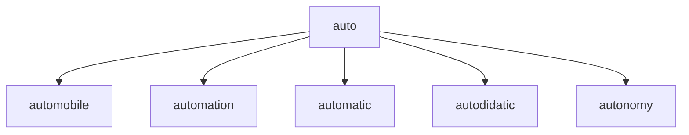

# EnglishHelpsYourCareer

I'm adding helpful notes to the source of truth and I have created a few exercise markdown files.

I will try  to keep these files updated.

## testing

<!DOCTYPE html>
<html lang="en">
   <head>
	 
    </head>
	 
<body>
 <pre><code class="language-mermaid">graph TD;
    auto--> automobile;
    auto--> automation;
    auto--> automatic;
    auto--> autodidatic;
    auto--> autonomy;
</code></pre>

graph LR
A--&gt;B

	
</body>

</html>
