# adjectives suffixes

## mermaid diagrams

To view as diagrams, you need to install: 

https://chrome.google.com/webstore/detail/github-%2B-mermaid/goiiopgdnkogdbjmncgedmgpoajilohe/related

## -able
Meaning: capable of being
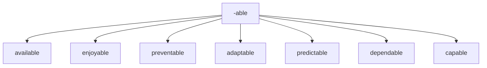

## -ible
Meaning: capable of being
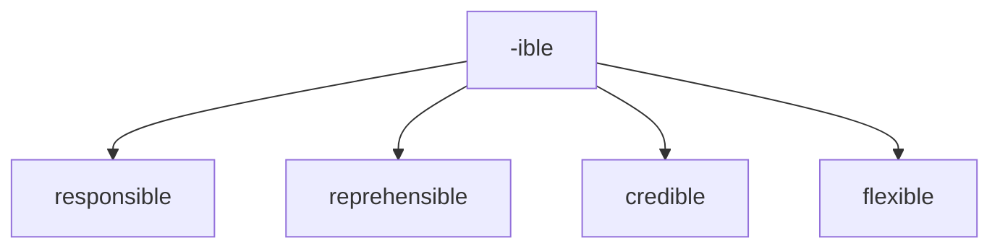

## -al
Meaning: pertaining to

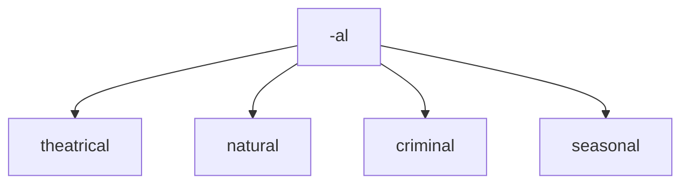

## -ant
Meaning: inclined to or tending to

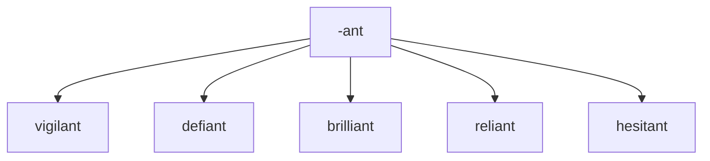

## -ary
Meaning: of or relating to

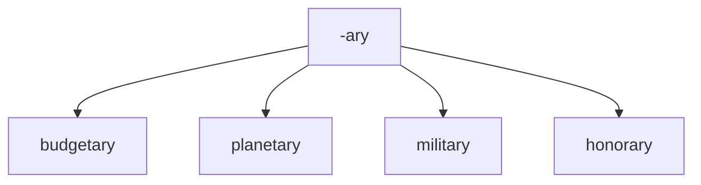

## -ful
Meaning: full of or notable of

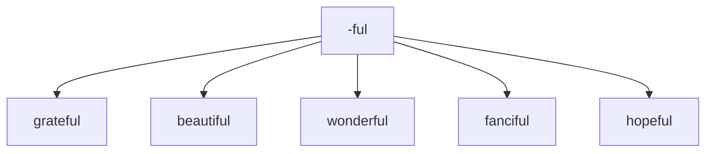

## -ic
Meaning: relating to
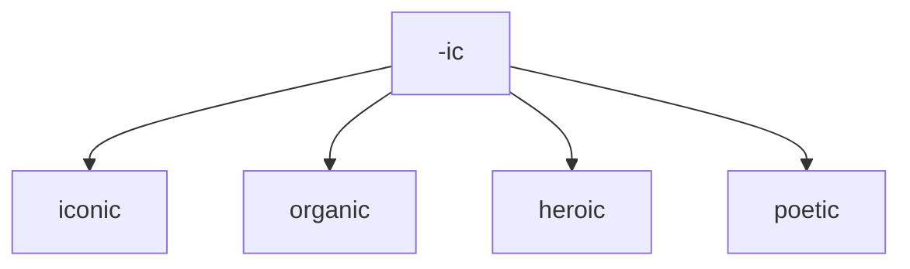

## -ious
Meaning: having qualities of

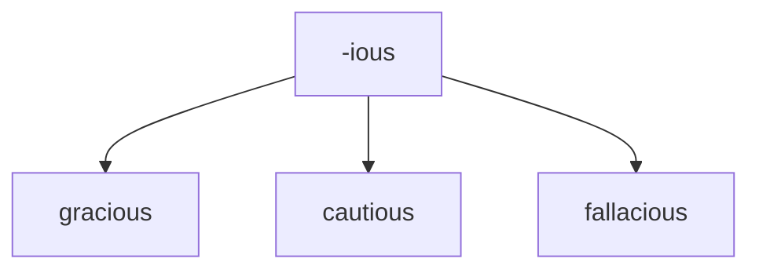

## -ous

Meaning: having qualities of
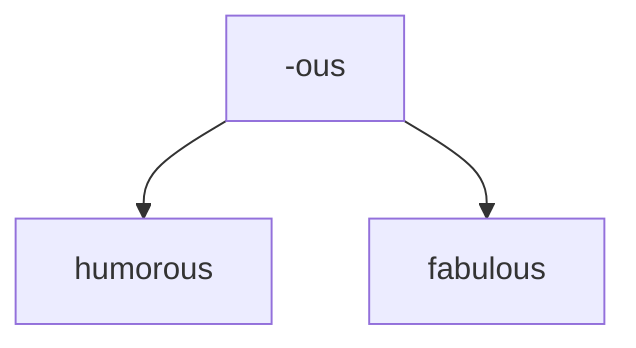

## -ive
Meaning: quality or nature of

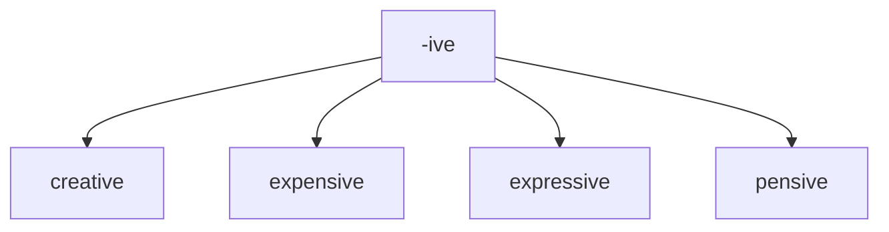

## -less
Meaning: without something

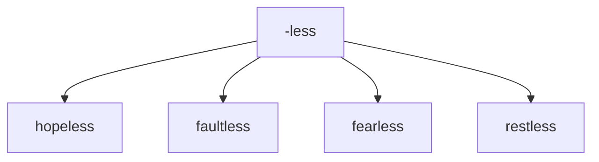

## -y
Meaning: made up of or characterized by
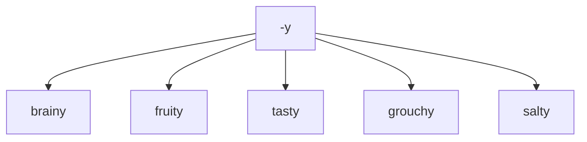
