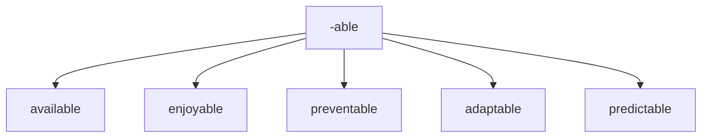
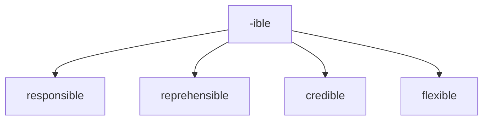
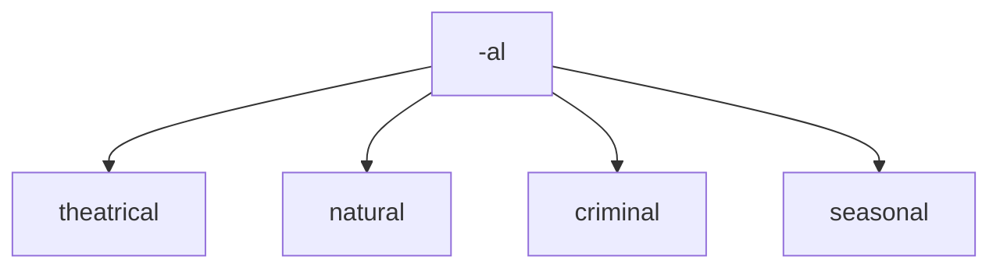
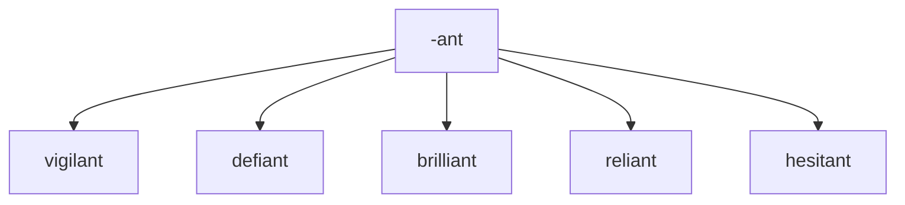
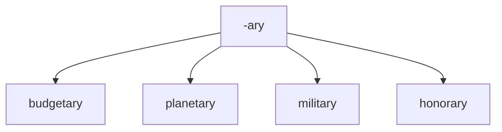
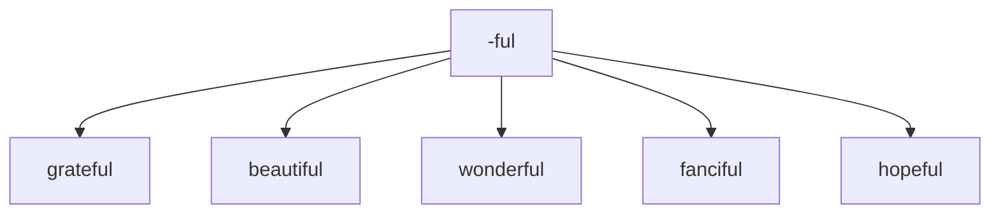

# adjectives suffixes

## mermaid diagrams

To view as diagrams, you need to install: 

https://chrome.google.com/webstore/detail/github-%2B-mermaid/goiiopgdnkogdbjmncgedmgpoajilohe/related

## -able
Meaning: capable of being

## -ible
Meaning: capable of being

## -al
Meaning: pertaining to

## -ant
Meaning: inclined to or tending to

## -ary
Meaning: of or relating to
Examples: 

## -ful
Meaning: full of or notable of

## -ic
Meaning: relating to
Examples: iconic, organic, heroic, poetic

## -ious, 
Meaning: having qualities of
Examples: gracious, cautious, 

## -ous
humorous, fabulous

## -ive
Meaning: quality or nature of
Examples: creative, expensive, expressive, pensive

## -less
Meaning: without something
Examples: hopeless, faultless, fearless, restless

## -y
Meaning: made up of or characterized by
Examples: brainy, fruity, tasty, grouchy