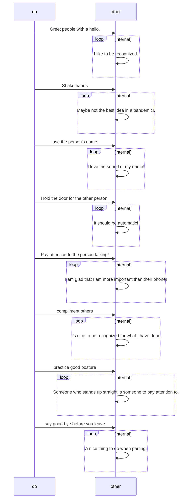

```mermaid
sequenceDiagram
    participant do
    participant other
    do->>other: Greet people with a hello.
    loop internal
        other->>other: I like to be recognized.
    end
    do->>other: Shake hands
    loop internal
        other->>other: Maybe not the best idea in a pandemic!.
    end
    do->>other: use the person's name
    loop internal
        other->>other: I love the sound of my name!
    end
  do->>other: Hold the door for the other person.
    loop internal
        other->>other: It should be automatic!
    end
    do->>other: Pay attention to the person talking!
    loop internal
        other->>other: I am glad that I am more important than their phone!
    end
       do->>other: compliment others
    loop internal
        other->>other: It's nice to be recognized for what I have done.
    end
    do->>other: practice good posture
    loop internal
        other->>other: Someone who stands up straight is someone to pay attention to.
        end
    do->>other: say good bye before you leave
    loop internal
        other->>other: A nice thing to do when parting.
    end
```