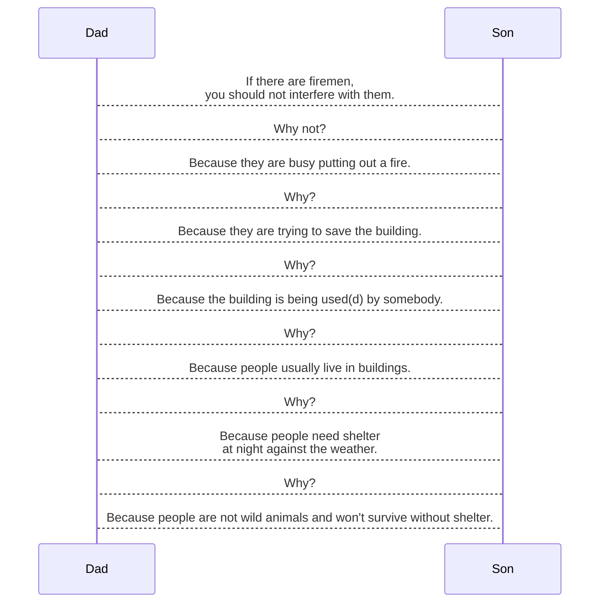

# life rules: fireman

```mermaid
sequenceDiagram
    Dad--> Son: If there are firemen,<br> you should not interfere with them.

    Son -->Dad: Why not?

    Dad--> Son: Because they are busy putting out a fire.

    Son -->Dad: Why?

    Dad--> Son: Because they are trying to save the building.

    Son -->Dad: Why?

    Dad--> Son: Because the building is being used(d) by somebody.

    Son -->Dad: Why?

    Dad--> Son: Because people usually live in buildings.

    Son -->Dad: Why?

    Dad--> Son: Because people need shelter<br>at night against the weather.

    Son -->Dad: Why?

    Dad--> Son: Because people are not wild animals and won't survive without shelter.
```
