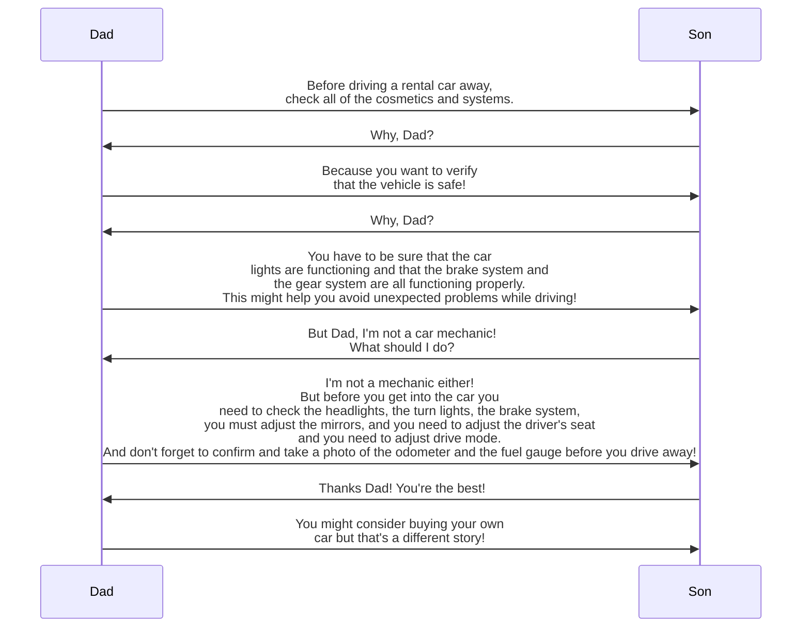

```mermaid
    sequenceDiagram

    Dad->> Son: Before driving a rental car away, <br>check all of the cosmetics and systems.

    Son->> Dad: Why, Dad?

    Dad->> Son: Because you want to verify <br>that the vehicle is safe!

    Son->> Dad: Why, Dad?

    Dad->> Son: You have to be sure that the car<br> lights are functioning and that the brake system and <br>the gear system are all functioning properly. <br>This might help you avoid unexpected problems while driving!

    Son->> Dad: But Dad, I'm not a car mechanic!<br> What should I do?

    Dad->> Son: I'm not a mechanic either!<br> But before you get into the car you <br>need to check the headlights, the turn lights, the brake system, <br>you must adjust the mirrors, and you need to adjust the driver's seat<br> and you need to adjust drive mode. <br>And don't forget to confirm and take a photo of the odometer and the fuel gauge before you drive away!

    Son->> Dad: Thanks Dad! You're the best!

    Dad->> Son: You might consider buying your own <br>car but that's a different story!
```