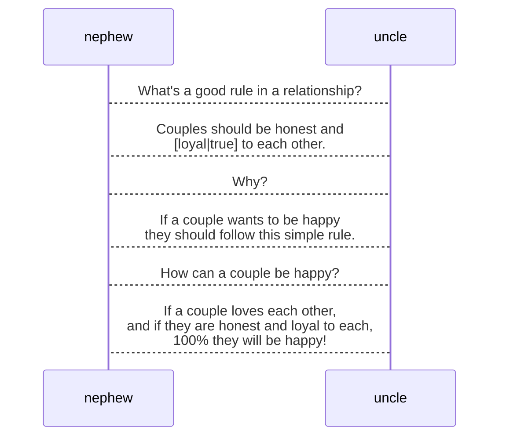

```mermaid
sequenceDiagram
    nephew-->uncle: What's a good rule in a relationship?

    uncle-->nephew: Couples should be honest and<br> [loyal|true] to each other.

    nephew-->uncle: Why?

    uncle-->nephew: If a couple wants to be happy<br> they should follow this simple rule.

    nephew-->uncle: How can a couple be happy?

    uncle-->nephew: If a couple loves each other,<br> and if they are honest and loyal to each,<br> 100% they will be happy!
```
