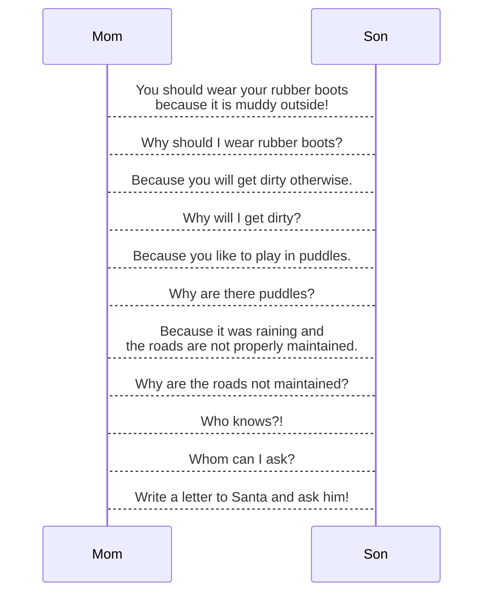

```mermaid
sequenceDiagram
    Mom-->Son: You should wear your rubber boots<br> because it is muddy outside!

    Son-->Mom: Why should I wear rubber boots?

    Mom-->Son: Because you will get dirty otherwise.

    Son-->Mom: Why will I get dirty?

    Mom-->Son: Because you like to play in puddles.

    Son-->Mom: Why are there puddles?

    Mom-->Son: Because it was raining and<br> the roads are not properly maintained.

    Son-->Mom: Why are the roads not maintained?

    Mom-->Son: Who knows?!

    Son-->Mom: Whom can I ask?

    Mom-->Son: Write a letter to Santa and ask him!
```
