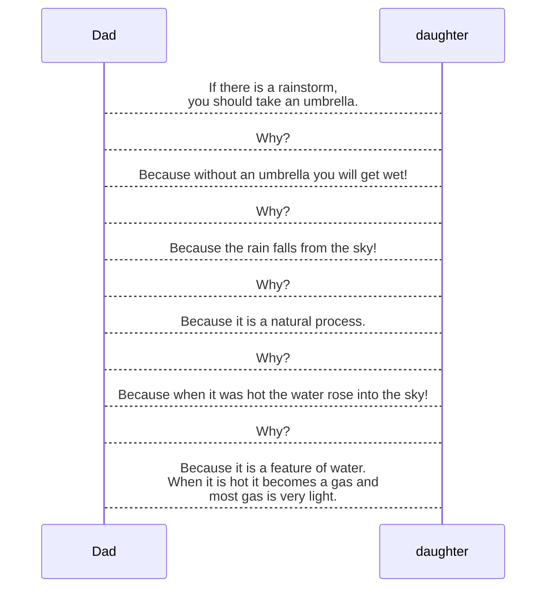

```mermaid
sequenceDiagram
    Dad--> daughter: If there is a rainstorm,<br> you should take an umbrella.
    
	daughter--> Dad: Why?

    Dad--> daughter: Because without an umbrella you will get wet!

    daughter--> Dad: Why?

    Dad--> daughter: Because the rain falls from the sky!

    daughter--> Dad: Why?

    Dad--> daughter: Because it is a natural process.

    daughter--> Dad: Why?

    Dad--> daughter: Because when it was hot the water rose into the sky!

    daughter--> Dad: Why?

    Dad--> daughter: Because it is a feature of water. <br>When it is hot it becomes a gas and<br> most gas is very light.
```
