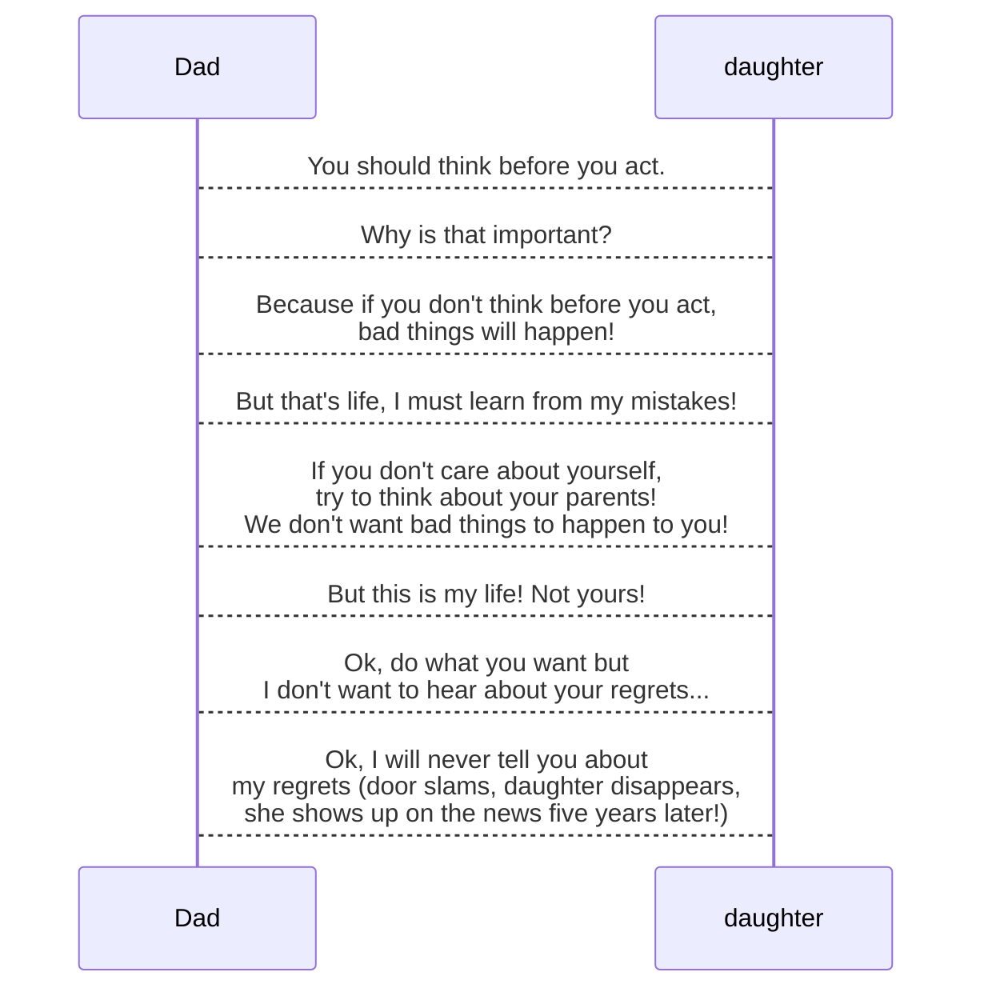

```mermaid
sequenceDiagram
    Dad --> daughter: You should think before you act.

    daughter --> Dad: Why is that important?

    Dad --> daughter: Because if you don't think before you act,<br> bad things will happen!

    daughter --> Dad: But that's life, I must learn from my mistakes!

    Dad --> daughter: If you don't care about yourself,<br> try to think about your parents!<br> We don't want bad things to happen to you!

    daughter --> Dad: But this is my life! Not yours!

    Dad --> daughter: Ok, do what you want but<br> I don't want to hear about your regrets...

    daughter --> Dad: Ok, I will never tell you about<br> my regrets (door slams, daughter disappears, <br>she shows up on the news five years later!)
```
