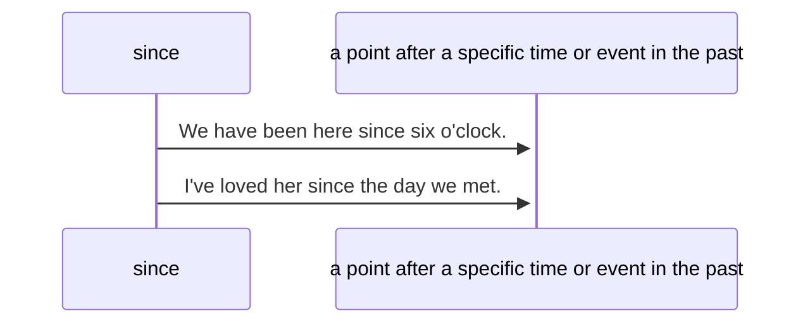

[[grammar]]

```mermaid
	sequenceDiagram

since->>+a point after a specific time or event in the past: We have been here since six o'clock.
since->>+a point after a specific time or event in the past: I've loved her since the day we met.
```

# resources