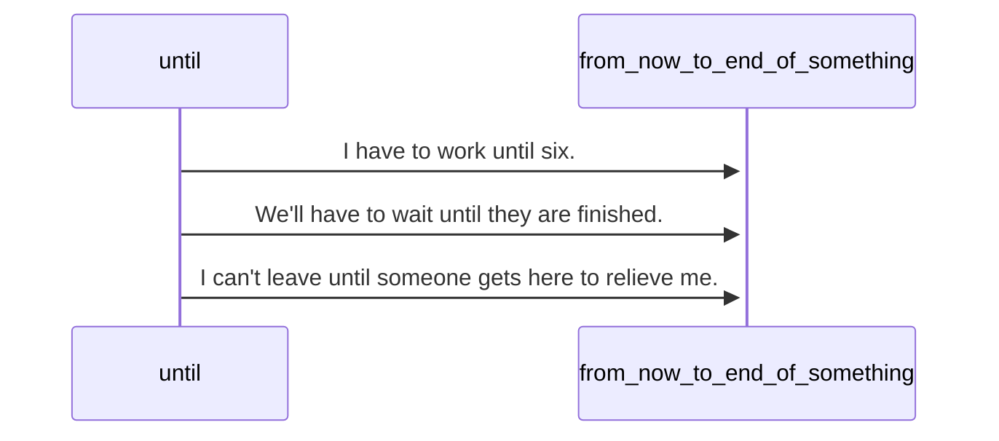

[[grammar]]

```mermaid
sequenceDiagram

until->>+from_now_to_end_of_something:I have to work until six.

until->>+from_now_to_end_of_something: We'll have to wait until they are finished.

until->>+from_now_to_end_of_something: I can't leave until someone gets here to relieve me.


```

# resource
https://www.talkenglish.com/speaking/lessondetails.aspx?ALID=4398