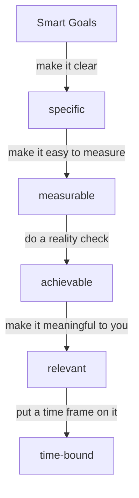

```mermaid
graph TD
start[Smart Goals]-->|make it clear| S[specific]
S[specific] -->|make it easy to measure| M[measurable]
M[measurable] -->|do a reality check| A[achievable]
A[achievable] -->|make it meaningful to you| R[relevant] 
R[relevant] -->|put a time frame on it| T[time-bound]

```

