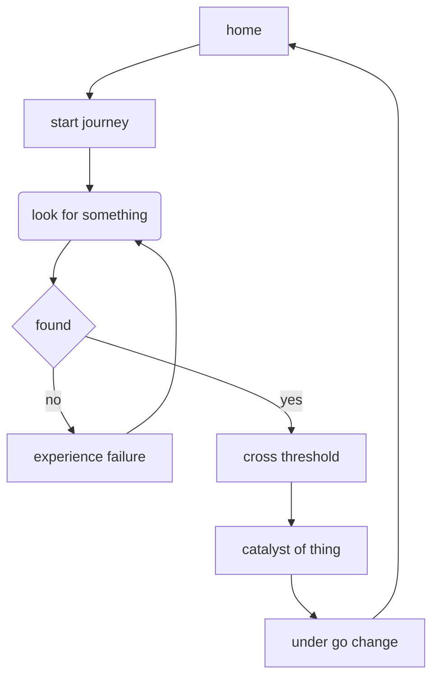

person going on a journey, 
looking for something, 
crossing a threshold, 
finding the thing they were looking for, 
and returning totally changed

source:
https://www.inverse.com/article/36002-rick-and-morty-story-circle-hero-journey-dan-harmon-joseph-campbell