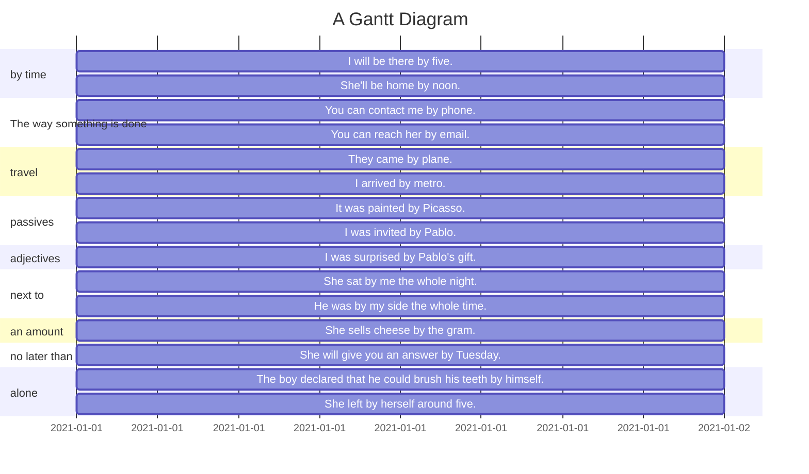

[[grammar]]
[[grammar prepositions]]

```mermaid
gantt

title A Gantt Diagram

dateFormat YYYY-MM-DD


section by time

I will be there by five. : 2021-01-01, 1d
She'll be home by noon. : 2021-01-01, 1d

section The way something is done

You can contact me by phone. : 2021-01-01, 1d
You can reach her by email. : 2021-01-01, 1d


section travel
They came by plane. :2021-01-01 , 1d
I arrived by metro. :2021-01-01 , 1d

  

section passives
It was painted by Picasso. :2021-01-01 , 1d
I was invited by Pablo. :2021-01-01 , 1d


section adjectives
I was surprised by Pablo's gift. :2021-01-01 , 1d

  

section next to

She sat by me the whole night. :2021-01-01 , 1d
He was by my side the whole time. :2021-01-01 , 1d

  

section an amount
She sells cheese by the gram. :2021-01-01 , 1d


section no later than
She will give you an answer by Tuesday. :2021-01-01 , 1d

  

section alone

The boy declared that he could brush his teeth by himself. :2021-01-01 , 1d
She left by herself around five. :2021-01-01 , 1d


```

# resources