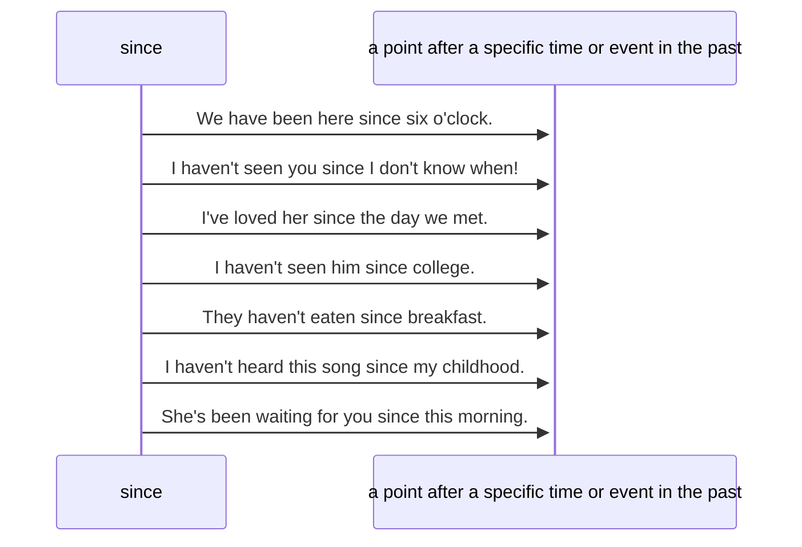

[[grammar elements subordinating conjunctions]]

```mermaid
	sequenceDiagram

since->>+a point after a specific time or event in the past: We have been here since six o'clock.
since->>+a point after a specific time or event in the past: I haven't seen you since I don't know when!
since->>+a point after a specific time or event in the past: I've loved her since the day we met.

since->>+a point after a specific time or event in the past:I haven't seen him since college.
  
since->>+a point after a specific time or event in the past:They haven't eaten since breakfast.
  
since->>+a point after a specific time or event in the past:I haven't heard this song since my childhood.
  
since->>+a point after a specific time or event in the past:She's been waiting for you since this morning.

```

# resources