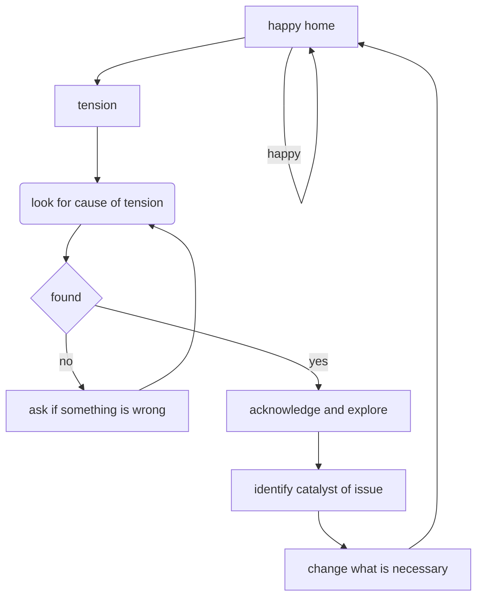

```mermaid
graph TD
home[happy home] -->start
home -->|happy| home
start[tension] -->B(look for cause of tension)
    B --> C{found}
    
    C -->|no| E[ask if something is wrong]
	C -->|yes| D[acknowledge and explore]
	E --> B
	D --> F[identify catalyst of issue]
	F --> G[change what is necessary]
	G --> home
```