# mermaid diagrams

# http://www.uefap.com/vocab/build/building.htm

To view as diagrams on Chrome, you need to install: 

https://chrome.google.com/webstore/detail/github-%2B-mermaid/goiiopgdnkogdbjmncgedmgpoajilohe/related

Or use VS Code or any other MarkDown viewer.

# adjectives suffixes


## -able Meaning: capable of being > adjective
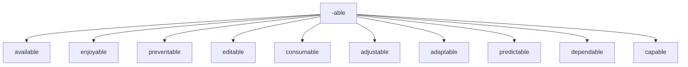

## -ible Meaning: capable of being > adjective 
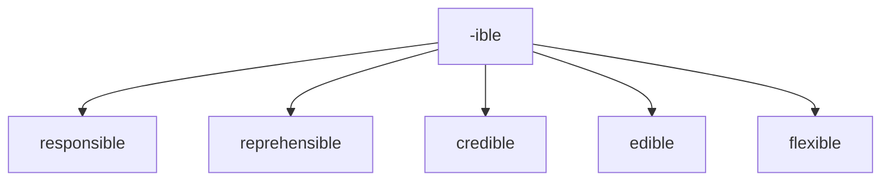


## -al Meaning: pertaining to > adjective

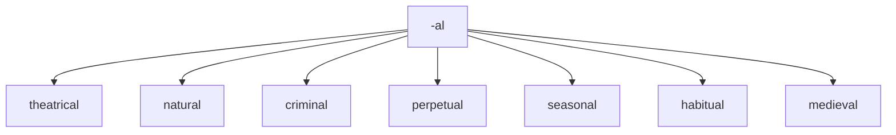

## -al Meaning: result of Verb > noun

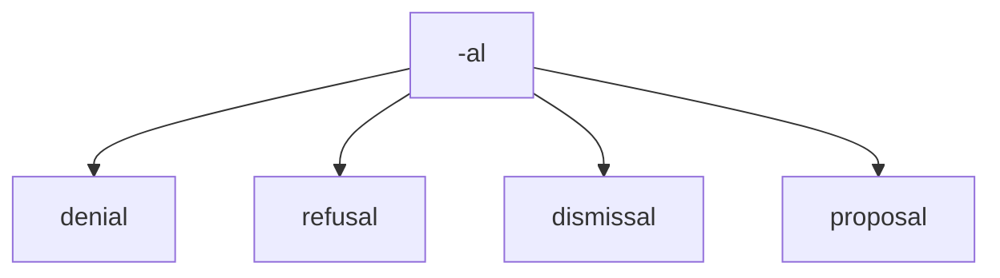


## cede
to go or yield 
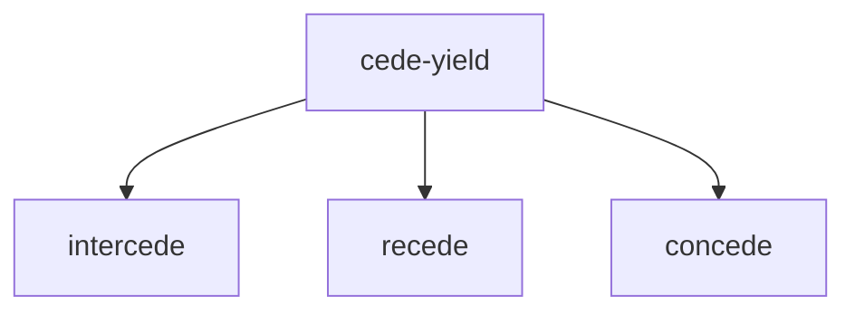


## -ant Meaning:  person who is V+ant > noun 

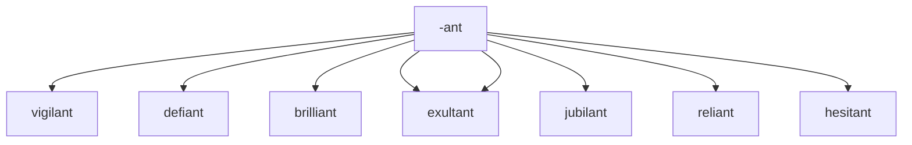


## -ary Meaning: of or relating to

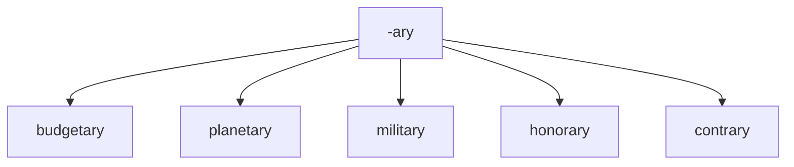

## -ent Meaning:  person who is V+ent > noun 

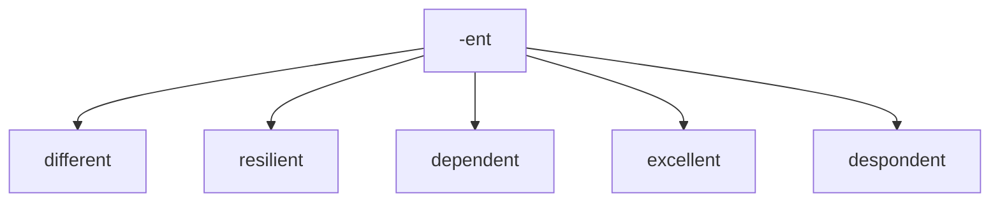


## -ful Meaning: full of or notable of (adjective)

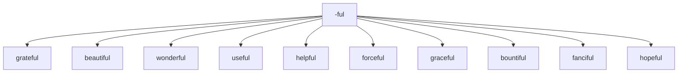

## -ic Meaning: relating to
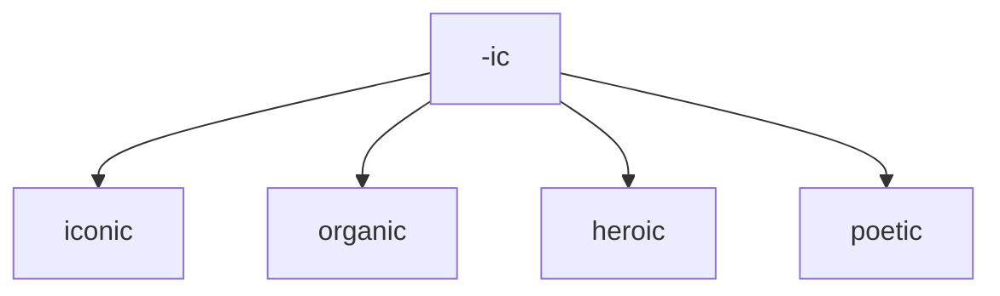

## -ious Meaning: having qualities of

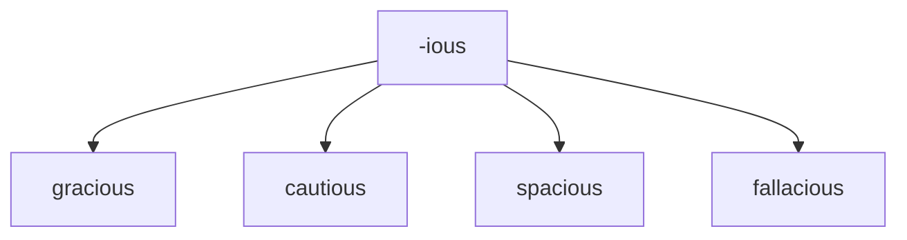

## -ous Meaning: having qualities of

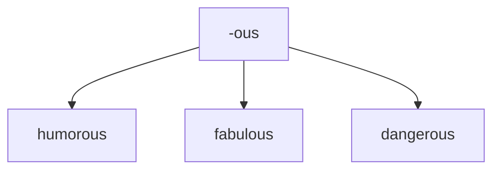


## -ive Meaning: quality or nature of

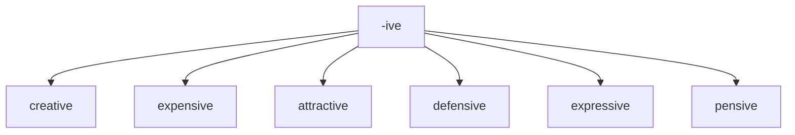

## -less Meaning: without something

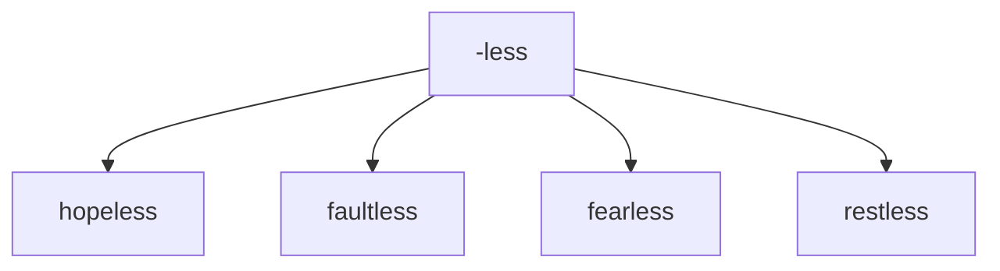

## -y Meaning: made up of or characterized by
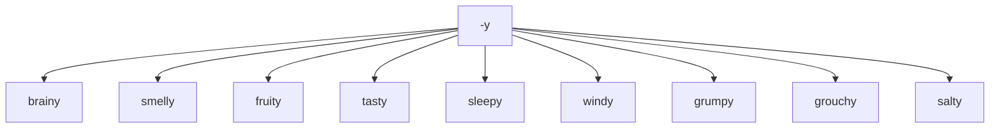


# Prefixes to create negatives 	Examples

## negative + adjective > adjective


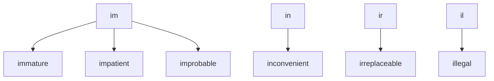
## negative + adjective > adjective
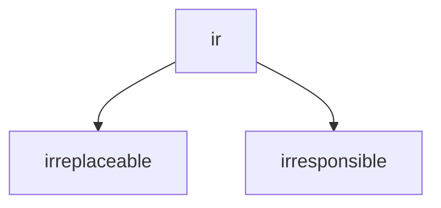

## negative + adjective > adjective


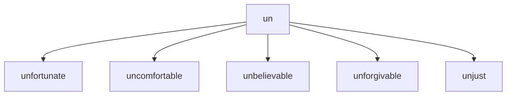
## negative + adjective > adjective

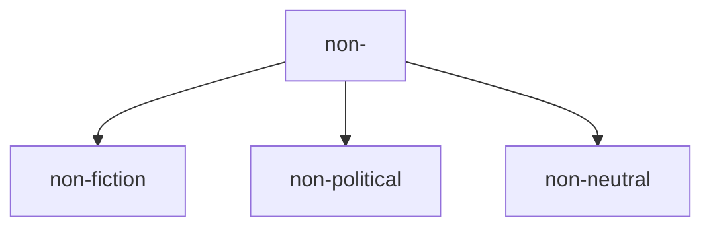


## negative + adjective > adjective

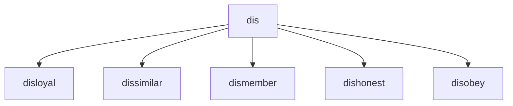

# scope
viewing or staring

```mermaid
graph TD; 
dis --> disloyal;
dis -->  dissimilar;
dis -->  dismember;
dis -->  dishonest;
dis -->  disobey;

```

# Prefix to create new verbs

## re- meaning: again or back
```mermaid
graph TD; 
re --> restructure;
re --> revisit;
re --> reinstate;
```

## dis - meaning: reverse the meaning of the word

```mermaid
graph TD; 
dis --> disappear;
 dis --> disapprove;

```

## over - meaning: too much

```mermaid
graph TD; 
over --> overkill;
over --> overwork;

```
## un - meaning: reverse the meaning of the word


```mermaid
graph TD; 
un --> undead;
un --> unfasten;

```

## mis- meaning: badly or wrongly 	

```mermaid
graph TD; 

mis --> mislead; 
mis --> misinform; 
mis --> misidentify;


```

## out- meaning: more or better than others 	

```mermaid
graph TD; 

out -->outperform;
out --> outbid;
```


## be- 	meaning: make or cause 	

```mermaid
graph TD; 

be--> befriend;
be--> belittle;
be-->beguiled;
```


## co- 	meaning: together 	

This prefix has a couple of different spellings.

```mermaid
graph TD; 

co --> coexist; 
co --> cooperate; 
co --> co-own;
```


## de- 	meaning: do the opposite of 	

```mermaid
graph TD; 

de--> devalue; 
de--> deselect;

```


## fore- meaning: earlier, before 	

```mermaid
graph TD; 

fore--> forecast; 
fore--> foreclose; 
fore--> foresee; 

```


## inter- meaning between 	


```mermaid
graph TD;

inter --> interact; 
inter --> intermix; 
inter --> interface; 
inter --> intercede;
```

## pre- meaning: before 	


```mermaid
graph TD;

pre--> prejudge;
pre--> pretest
```

## sub- meaning under/below 	

```mermaid
graph TD;
sub--> subcontract;sub-->  subdivide;
sub-->  subcontinent;
```

## trans- 	meaning across, over 	

```mermaid
graph TD;
trans --> transform;
trans -->  transcribe;
trans -->  transplant;
trans --> transparent;
```

## under - meaning: not enough

```mermaid
graph TD;
under--> underbelly;
under--> underperform;
```

# suffixes 


## -ity state or quality of being

```mermaid
graph TD;
-ity --> ability;
```

## -ness state or quality of being

```mermaid
graph TD;
-ness --> darkness;
```


## -cy state or quality of being

```mermaid
graph TD;
-cy --> frequency;
```

## -er person concerned with N

```mermaid
graph TD;
-er --> programmer;
-er --> plumber;
```


## -ism doctrine of N

```mermaid
graph TD;
-ism --> capitalism;
```

## -ship state of being  N

```mermaid
graph TD;
-ship --> leadership;
```

## -age collection of N > noun

```mermaid
graph TD;
-age --> baggage;
-age --> storage;

```

## -age action result of > noun

```mermaid
graph TD;
-age --> wastage;
-age --> heritage;
-age --> garbage;
-age -->hostage;
```


## -tion meaning action/instance of V-ing > NOUN

```mermaid
graph TD;
-tion --> alteration;
-tion -->  demonstration;
```

## -sion meaning action/instance of V-ing > NOUN

```mermaid
graph TD;
-sion --> expansion; 
-sion -->inclusion;
-sion --> admission;
```

## -ment meaning	action/instance of V-ing > NOUN

```mermaid
graph TD;
-ment -->development; 
-ment -->punishment; 
-metn -->augment;
-ment -->unemployment;
```


# con prefix
with
```mermaid
graph TD;
con -->concieve;
con -->convince;
```

# roots

# act
to move or do (actor, acting, reenact)
```mermaid
	graph TD;
	act(do)-->actor
	act(do)-->acting
	act(do)-->reenact

```

# ambul
to move or walk
```mermaid
	graph TD;
	ambul(to move)-->ambulance
	ambul(to move)-->ambulate

```


# arbor
tree

```mermaid
	graph TD;
	arbor(tree)-->arboreal
	arbor(tree)-->arboretum

	arbor(tree)-->arborist

```

# cardio
heart
```mermaid
	graph TD;
	cardio(heart)-->cardiovascular
	cardio(heart)-->cardiology
	cardio(heart)-->electrocardiogram

```


# crypt
to hide
```mermaid
	graph TD;
	crypt(hide)-->apocryphal
	crypt(hide)--> cryptic
	crypt(hide)-->encrpyt
	crypt(hide)-->cryptography

```


-   **crypt** - to hide (apocryphal, cryptic, cryptography)


# acri
```mermaid
	graph TD;
	acri(bitter)-->acrid
	acri(bitter)-->acrimony
	acri(bitter)--> acridity

```
# astro
```mermaid
	graph TD;

	astro(star)-->astronaut
	astro(star)--> astronomy
	astro(star)-->astrophysics

```

# aud
hear
```mermaid
	graph TD;

	aud(hear)-->audience
	aud(hear)--> audible
	aud(hear)-->audio

```

# auto
self
```mermaid
	graph TD;

	auto(self)-->autonomy
	auto(self)--> autocrat
	auto(self)-->automatic
	auto(self)-->autodidact

```


# bene
good
```mermaid
	graph TD;

	bene(good)-->benefactor
	bene(good)--> benevolent
	bene(good)--> beneficial
	
```

# carn
flesh
```mermaid
	graph TD;

	carn(flesh)-->carnal
	carn(flesh)--> carnivorous
	carn(flesh)--> reincarnate
	carn(flesh)--> incarnate
	
	
```


# corp
body
```mermaid
	graph TD;

	corp(body)-->corporal
	corp(body)--> corporate
	corp(body)--> corpse
		
	
```

# cred
believe
```mermaid
	graph TD;

	cred(believe)-->credible
	cred(believe)-->credence
	cred(believe)-->incredible
			
```

# dem

people
```mermaid
	graph TD;

	dem(people)-->democracy
	dem(people)-->democrat
	dem(people)-->demographic
			
```


# derm
skin

```mermaid
	graph TD;

	derm(skin)-->dermatology
	derm(skin)-->epidermis
	
			
```


# dict
say
```mermaid
	graph TD;

	dict(say)-->diction
	dict(say)-->dictionary
	dict(say)-->interdict
	dict(say)-->dictate
	dict(say)-->edict
			
```

# ego
I
```mermaid
	graph TD;

	ego(I)-->egotist
	ego(I)-->egocentric
	ego(I)-->egomaniac
			
```

# equi
equal
-   **equi** - equal (equity, equilateral, equidistant)
```mermaid
	graph TD;

	equi(equal)-->equidistant
	equi(equal)-->equity
	equi(equal)-->equilateral
	
			
```


# eu
```mermaid
	graph TD;

	eu(good)-->euphoric
	eu(good)-->Europe
	
			
```


# fac

```mermaid
	graph TD;

	fac(to do)-->factory
	fac(to do)-->faculty
	fac(to do)-->faction
	
			
```

# hypo
sleep
-   **hypno** - sleep (hypnosis, hypnotic, hypnotism)
```mermaid
	graph TD;
	
	hypno(sleep)-->hypnosis
	hypno(sleep)-->hypnotic
	hypno(sleep)-->hypnotism
	
```


# intra
within or into
```mermaid
	graph TD;
	
	intra(within)-->intrapersonal
	intra(within)-->intramural
	intra(within)-->intravenous
```


# gen
```mermaid
	graph TD;
	
	gen(birth)-->genesis
	gen(birth)-->genetics
	gen(birth)-->generate
```


# lum
```mermaid
	graph TD;
	
	lum(light)-->lumen
	lum(light)-->luminary
	lum(light)-->luminous
```

# micro
 small
```mermaid
	graph TD;
	
	micro(small)-->microbiology
	micro(small)-->microcosm
	micro(small)-->microscope
	
```

# multi
```mermaid
	graph TD;
	
	multi(many)-->multilingual
	multi(many)-->multiple
	multi(many)-->multifaceted
	
```


```mermaid
	graph TD;
	
	port(carry)-->portal
	port(carry)-->portable
	port(carry)-->transport	
```


## todo
con -