By learning prefixes, root and suffixes you will rapidly improve your vocabulary!


# Prefixes to create negatives 	Examples


## EM-
negative + adjective > adjective


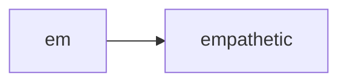


## IM-
negative + adjective > adjective


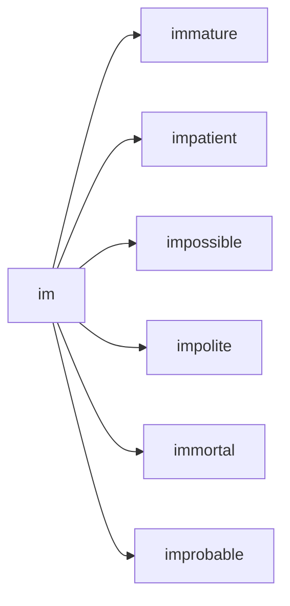

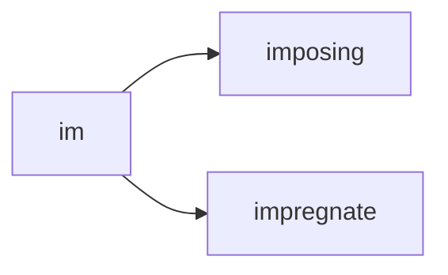


## IL-
negative + adjective > adjective

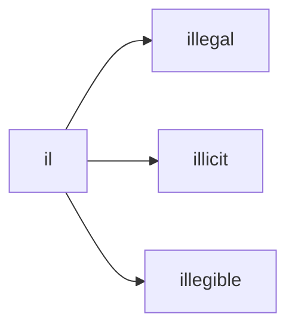


## IN-
not or no
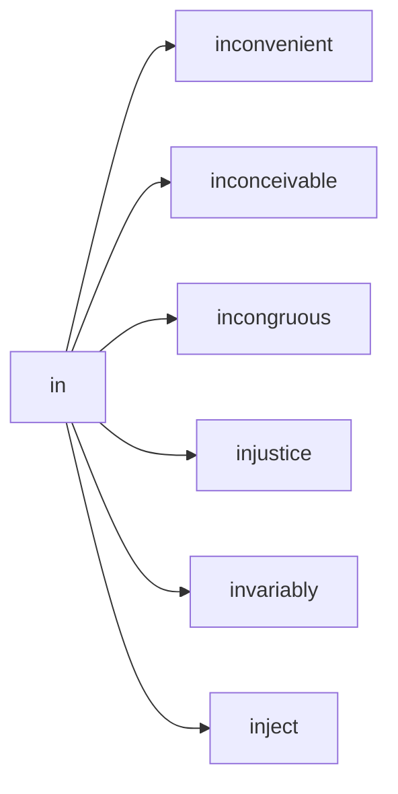

## IN-
not or no
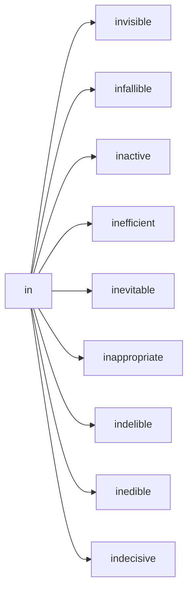


## IR -
not, or no
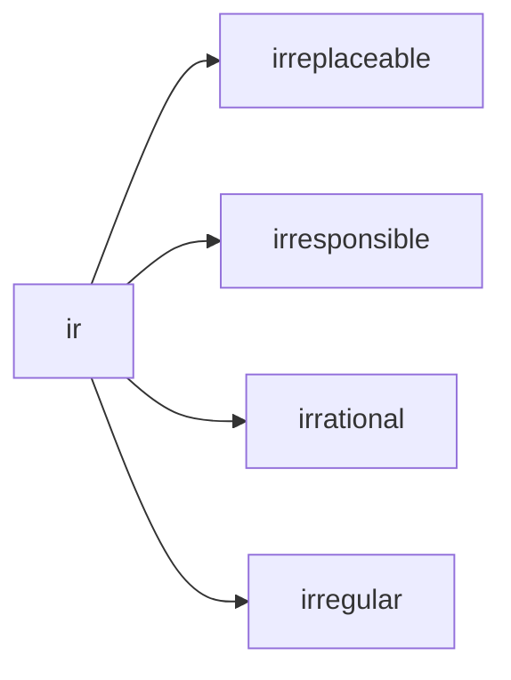


## pro - 
"**forward, forth, toward the front**"
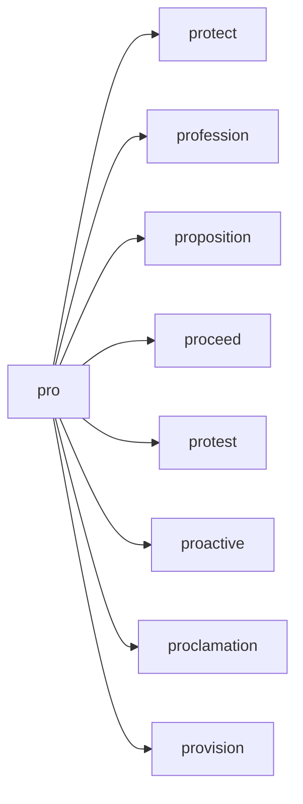

## UN -
negative + adjective > adjective


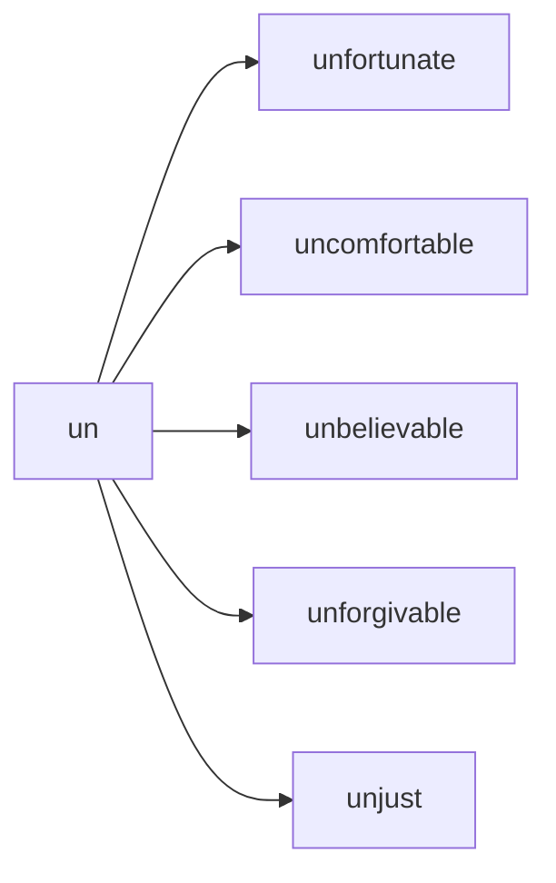
## NON -
negative + adjective > adjective

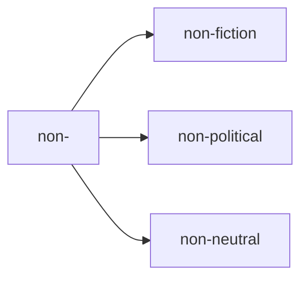


## DIS -
negative + adjective > adjective
apart, not, away from
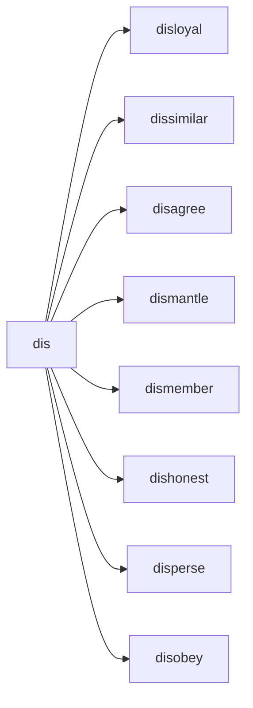


# Prefixes 


## be-

all over, all around

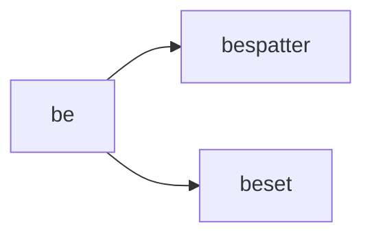
## be
completely

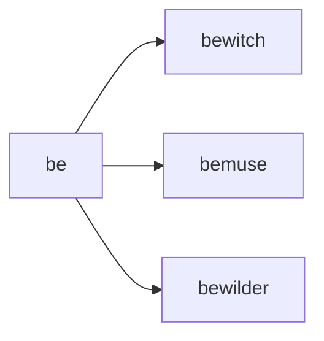
## be
having, covered with
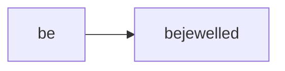

## be
affect with (added to nouns)


## be
cause to be (added to adjectives)

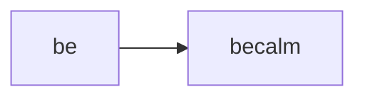


## circum- 
around, about
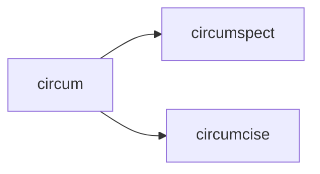

## co -
with / partner

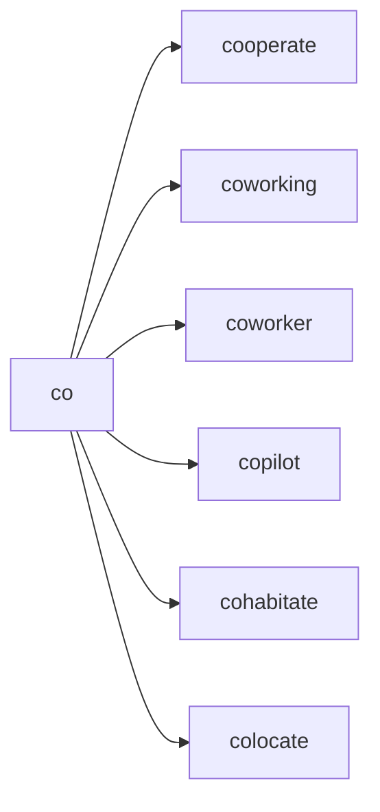


## con- 
with
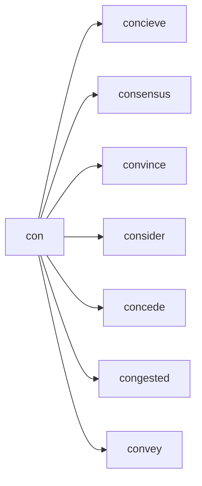


## com- 
with
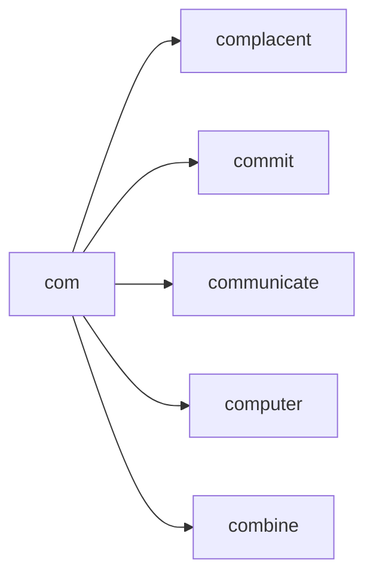


## de - 
“from” or “off”
```mermaid
graph LR; 
de --> deduce;
de --> despite;
de --> dejected;
de --> depravity;
de --> descend;
de --> detect;


```

## dia -
complete, through

```mermaid
graph LR; 
dia --> diagnose;
dia --> dialogue;
dia --> dialysis;
dia --> diameter;
dia --> diaphanous;
dia --> diarrhea;


```


## em  -
put in or into, bring to a certain state
```mermaid
graph LR; 
em --> embellishment;
em --> embarrassment;
em--> embraced;

```


## en -
within, in
```mermaid
graph LR; 
en --> enable;
en --> encounter;
en --> enclose;
en --> encourage;
en --> endanger;
en --> endorse;
en --> enjoy;
en --> envision;
```


## ex-
out of

```mermaid
graph LR; 
ex --> exclaim;
ex --> explain;
ex --> expand;
ex --> extent;
```


## anti -
without or against
```mermaid
graph LR; 
anti --> antipathy;
anti -->antitrust;

```

## re-
meaning: again or back
```mermaid
graph LR; 
re --> restructure;
re --> revisit;
re --> rehearse;
re --> redo;
re --> recollect;
re --> repulsive;

re --> reinstate;
```

## dis - 
meaning: reverse the meaning of the word

```mermaid
graph LR; 
dis --> disappear;
 dis --> disapprove;
 dis --> discharge;
 dis --> discourage;
 dis --> disperse;
 dis --> distress;
 

```

## over - 
meaning: too much

```mermaid
graph LR; 
over --> overestimate;
over --> overstatement;
over --> oversee;
over --> overcharge;

```

## over - 
meaning: too much

```mermaid
graph LR; 
over --> overkill;
over --> overwork;
over --> overlook;
over --> overheated;
over --> oversell;

```


## un - 
meaning: reverse the meaning of the word


```mermaid
graph LR; 
un --> unable;
un --> unbelievable;
un --> uncertain;
un --> undead;
un --> undo;
un --> unfasten;
un --> unfortunate;
un --> ungrateful;
un --> unreachable;
un --> unstoppable;
un --> unsure;
un --> untrusted;


```

## para -
alongside of, beside, near, resembling, beyond, apart from, and abnormal

```mermaid
graph LR; 
para --> parasol;
para --> parallel;
para --> paradigm;


```


## mis- 
meaning: badly or wrongly 	

```mermaid
graph LR; 
mis --> misunderstand; 
mis --> misbehave; 
mis --> mislead; 
mis --> misinform; 
mis --> misidentify;


```

## out- 
meaning: more or better than others 	

```mermaid
graph LR; 

out -->outperform;
out --> outbid;
```


## be- 	
meaning: make or cause 	

```mermaid
graph LR; 

be--> befriend;
be--> belittle;
be-->beguiled;
```


## co- 	
meaning: together 	

This prefix has a couple of different spellings.

```mermaid
graph LR; 

co --> coexist; 
co --> coordinate; 
co --> cooperate; 
co --> cooperative; 
co --> co-own;
```


## de- 	
meaning: do the opposite of 	

```mermaid
graph LR; 

de--> devalue; 
de--> deselect;

```


## fore- 
meaning: earlier, before 	

```mermaid
graph LR; 

fore--> forecast; 
fore--> foreclose; 
fore--> forethought; 
fore--> foresee; 
fore--> foreskin; 


```


## inter- 
between among together - involving two or more


```mermaid
graph LR;

inter --> interact; 
inter --> intermix; 
inter --> internet;
inter --> intermediate;
inter --> intersection;
inter --> interface; 
inter --> intercede;
```

## pre- 
meaning: before 	

```mermaid
graph LR;

pre--> prejudice;
pre--> prevent;
pre--> prepare;
pre--> predate;
pre--> precise;
pre--> prejudge;
pre--> pretest;
```

## sub- 
meaning under/below 	

```mermaid
graph LR;
sub--> subcontract;
sub-->  subdivide;
sub-->  subcontinent;
sub-->  subordinate;
sub-->  submit;
sub-->  submarine;
sub-->  subscribe;

```

## trans- 	
meaning across, over 	

```mermaid
graph LR;
trans --> transform;
trans -->  transcribe;
trans -->  transmission;
trans -->  transplant;
trans --> transparent;
```

## under - 
meaning: not enough

```mermaid
graph LR;
under--> underbelly;
under--> underneath;
under--> underperform;
under --> understatement;
under--> underwear;
under--> underground;
under--> underestimate;
under--> undervalue;
under--> undermine;
```


# roots

## contra
against
```mermaid
graph LR; 
contra-->contradict;
contra-->contrary;

```

## pathos
means suffering, feeling, emotion, calamity

```mermaid
graph LR;
pathos-->pathetic;
pathos-->empathetic;
pathos-->sympathetic;

```


## tect
means **cover**
```mermaid
graph LR;
tect--> detect;
tect --> protect;
```


## mit
 -mit- comes from Latin, where it has the meaning **"send**
```mermaid
graph LR;

mit -->permit;
mit -->remit;
mit -->emit;
mit -->intermittent;
mit -->noncommittal;
mit -->omit;
mit -->remittance;

```

## mit
 -mit- comes from Latin, where it has the meaning **"send**
```mermaid
graph LR;
mit -->submit; 
mit -->commit; 
mit -->transmit; 
mit -->admit;
mit -->committee;


```


## -pute-
root. -pute- comes from Latin, where it has the meaning "**to clean, prune;** **consider;** **think**. ''
```mermaid
graph LR;
pute -->amputate; 
pute -->compute; 
pute -->deputy; 
pute -->dispute; 
pute -->impute; 

```


## theo
god
```mermaid
graph LR;
theo -->theology; 

```


## toxic
poison

```mermaid
graph LR;
-toxic -->intoxicated;
-toxic -->toxicologist;


```

## mem
mind memory
```mermaid
graph LR;

-mem -->memory;
-mem -->memoir;
-mem -->memorabilia;
-mem -->memorandum;
-mem -->memorial;
-mem -->memorize;
-mem -->remember;
-mem -->remembrance;

```


mind memory
```mermaid
graph LR;
-mem -->memorable; 
-mem -->remember;
-mem -->commemorate; 
-mem -->immemorial;
-mem -->memento; 
-mem -->memo;

```


## hood 
particular state or period in someone's life
```mermaid
graph LR;
-hood -->neighborhood; 
-hood --> falsehood; 
-hood --> childhood;
-hood -->fatherhood; 
-hood -->motherhood; 
-hood -->parenthood; 

```


## gest
carry or bear
```mermaid
graph LR;
gest --> congestion;
gest --> digest
gest --> gestation
gest --> gesticulate
gest --> gesture
gest --> ingest
gest --> suggest
```


## fect
make or do
```mermaid
graph LR;
fect --> infect;
fect -->perfect;
fect -->defect;
```

## flect
make or do
```mermaid
graph LR;
flect --> reflect;
flect --> deflect;
flect --> inflect;

```


##  ject 
means **throw**

```mermaid
graph LR;
ject --> trajectory;
ject --> inject;
ject --> reject;
ject --> eject;


```


## cise

cut (down)
```mermaid
graph LR;
cise-->circumcise
cise-->decisive
cise-->incision
cise-->incisive
cise-->incisor
cise-->precise
cise-->scissors

```


## ratio
logic;  reason;  judgment

```mermaid
	graph LR;
	ratio(logic)-->rational;
	

```


## hydro
water

```mermaid
	graph LR;
	hydro(water)-->hydrant;
	hydro(water)-->hydrometer;
	hydro(water)-->hydrogen;
	hydro(water)-->hydrometeor;
	

```


## act
to move or do (actor, acting, reenact)
```mermaid
	graph LR;
	act(do)-->actor;
	act(do)-->acting;
	act(do)-->reenact;
	act(do)-->interact;

```

## crim
judicial, crime
```mermaid
	graph LR;
	crim-->criminal;
	crim-->incriminate;
	crim-->crime;
	

```


## ambul
to move or walk
```mermaid
	graph LR;
	ambul(to move)-->ambulance;
	ambul(to move)-->ambulate;

```


## init
to begin
```mermaid
	graph LR;
	init-->initiate;
	init-->initialize;

```


## arbor
tree

```mermaid
	graph LR;
	arbor(tree)-->arboreal;
	arbor(tree)-->arboretum;

	arbor(tree)-->arborist;

```

## cardio
heart
```mermaid
	graph LR;
	cardio(heart)-->cardiovascular;
	cardio(heart)-->cardiology;
	cardio(heart)-->electrocardiogram;

```


## crypt
to hide
```mermaid
	graph LR;
	crypt(hide)-->apocryphal;
	crypt(hide)--> cryptic;
	crypt(hide)-->encrpyt;
	crypt(hide)-->cryptography;

```


## acri
bitter
```mermaid
	graph LR;
	acri(bitter)-->acrid;
	acri(bitter)-->acrimony;
	acri(bitter)--> acridity;

```
## astro
stars
```mermaid
	graph LR;

	astro(star)-->astronaut;
	astro(star)--> astronomy;
	astro(star)-->astrophysics;

```

## aud
hear
```mermaid
	graph LR;

	aud-->audience;
	aud--> audible;
	aud-->audio;

```

## auto
self
```mermaid
	graph LR;
	auto(self)-->automobile;
	auto(self)-->autonomy;
	auto(self)--> autocrat;
	auto(self)-->automatic;
	auto(self)-->autodidact;

```


## bene
good
```mermaid
	graph LR;

	bene(good)-->benefactor;
	bene(good)--> benevolent;
	bene(good)--> beneficial;
	
```

## carn
flesh
```mermaid
	graph LR;

	carn-->carnal;
	carn--> carnivorous;
	carn--> carnivore;
	carn--> reincarnate;
	carn--> incarnate;
	
	
```


## corp
body
```mermaid
	graph LR;

	corp-->corporal;
	corp--> corporate;
	corp--> corpse;
		
```

## cred
believe
```mermaid
	graph LR;

	cred-->credible;
	cred-->credence;
	cred-->incredible;
			
```

## dem

people
```mermaid
	graph LR;

	dem-->democracy;
	dem-->democrat;
	dem-->demographic;
			
```


## derm
skin

```mermaid
	graph LR;

	derm-->dermatology;
	derm-->epidermis;
	
			
```


## dict
say
```mermaid
	graph LR;

	dict-->diction;
	dict-->dictionary;
	dict-->interdict;
	dict-->dictate;
	dict-->edict;
			
```

## ego
I
```mermaid
	graph LR;

	ego-->egotist;
	ego-->egocentric;
	ego-->egomaniac;
			
```

## equi
equal

```mermaid
	graph LR;

	equi-->equidistant;
	equi-->equity;
	equi-->equilateral;
	
			
```


## eu
```mermaid
	graph LR;

	eu-->euphoric;
	eu-->Europe;
	
			
```


## fac

```mermaid
	graph LR;

	fac-->factory;
	fac-->faculty;
	fac-->faction;
			
```

## herb
plants
```mermaid
	graph LR;
	herb-->herbal;
	herb-->herbivore;
			
```


## hypo
sleep
```mermaid
	graph LR;
	
	hypno(sleep)-->hypnosis;
	hypno(sleep)-->hypnotic;
	hypno(sleep)-->hypnotism;
	
```


## intra
within or into
```mermaid
	graph LR;
	
	intra(within)-->intrapersonal;
	intra(within)-->intramural;
	intra(within)-->intravenous;
```


## gen
```mermaid
	graph LR;
	
	gen(birth)-->genesis;
	gen(birth)-->genetics;
	gen(birth)-->generate;
```


## lum
light
```mermaid
	graph LR;
	
	lum(light)-->lumen;
	lum(light)-->luminary;
	lum(light)-->luminous;
```

## micro
 small
```mermaid
	graph LR;
	
	micro(small)-->microbiology;
	micro(small)-->microcosm;
	micro(small)-->microscope;
	
```

## multi
many
```mermaid
	graph LR;
	
	multi(many)-->multilingual;
	multi(many)-->multiple;
	multi(many)-->multifaceted;

```


## port
```mermaid
	graph LR;
	
	port(carry)-->portal;
	port(carry)-->portable;
	port(carry)-->transport	;
```

## ject
```mermaid
	graph LR;
	
	ject-->abject;
	ject-->reject;
	ject-->object;
	ject-->inject;
	ject-->subject;
	
	
```


## scrib
write
```mermaid
	graph LR;
	
	scrib(write)-->transcribe;
	scrib(write)-->subscribe;
	
	
```


# suffixes 


## -logy 
study of
```mermaid
graph LR;
-logy --> psychology;
-logy --> caridology;
-logy --> theology;
-logy --> geology;
-logy --> toxicology;


```

## -logist
the person who studies or works in the field
```mermaid
graph LR;
-logist --> psychologist;
-logist --> caridologist;
-logist --> toxicologist;
-logist --> dermatologist;
-logist --> archaelologist;
-logist --> theologist;


```


## -ity 
state or quality of being

```mermaid
graph LR;
-ity --> ability;
-ity --> stability;

```

## -ness 
state or quality of being

```mermaid
graph LR;
-ness --> darkness;
-ness --> illness;
```


## -cy 
state or quality of being

```mermaid
graph LR;
-cy --> frequency;
-cy --> urgency;
-cy --> occupancy;


```

## -er 
person concerned with N

```mermaid
graph LR;
-er --> programmer;
-er --> plumber;
-er --> painter;

```


## -atic 
**of the nature of the thing specified**

```mermaid
graph LR;
-atic --> systematic;
-atic --> problematic;
-atic --> erratic;

```


## -ism 
doctrine of N

```mermaid
graph LR;
-ism --> capitalism;
-ism --> communism;
-ism --> socialism;

```

## -ship 
state of being  

```mermaid
graph LR;
-ship --> leadership;
-ship --> friendship;

```

## -age 
collection of N > noun

```mermaid
graph LR;
-age --> baggage;
-age --> storage;
-age --> sabotage;


```

## -age 
action result of > noun

```mermaid
graph LR;
-age --> wastage;
-age --> heritage;
-age --> garbage;
-age -->hostage;
```


## -tion 
meaning action/instance of V-ing > NOUN

```mermaid
graph LR;
-tion --> alteration;
-tion -->  demonstration;
-tion -->  documentation;
-tion -->  presentation;
-sion --> proposition;

```

## -sion 
meaning action/instance of V-ing > NOUN

```mermaid
graph LR;
-sion --> expansion; 
-sion --> inclusion;
-sion --> exclusion;

-sion --> admission;
```

## -ment 
meaning	action/instance of V-ing > NOUN

```mermaid
graph LR;
-ment -->development; 
-ment -->punishment; 
-ment -->augment;
-ment --> impedement;
-ment --> payment;
-ment--> embellishment;
-ment -->unemployment;
-ment -->enticement;
```


# adjectives suffixes


## -able Meaning: capable of being > adjective
```mermaid
graph LR;
    -able--> available;
    -able--> enjoyable;
    -able--> preventable; 
	-able--> editable; 
	-able--> unbearable; 

	-able--> consumable; 
    
```

## -able Meaning: capable of being > adjective
```mermaid
graph LR;
	
	-able--> adjustable; 
    -able--> adaptable;
    -able--> predictable;
    -able--> dependable;
    -able--> capable;
    
```


## -ate showing; full of'
```mermaid
graph LR;
-ate--> elaborate;
-ate--> considerate;

-ate--> passionate;

```


## -ible Meaning: capable of being > adjective 
```mermaid
graph LR;
-ible--> responsible;
-ible--> reprehensible;
-ible--> credible; 
-ible--> edible; 

-ible--> flexible;

```


## -al 
Meaning: pertaining to > adjective

```mermaid
graph LR;
-al--> theatrical; 
-al--> natural; 
-al--> criminal; 
-al--> jovial; 

-al --> perpetual;
-al--> seasonal;
-al--> habitual;

-al--> medieval;

```

## -al Meaning: result of Verb > noun

```mermaid
graph LR;
-al--> denial; 
-al--> refusal; 
-al--> dismissal; 
-al--> proposal; 

```


## -esque 
means **“like” or “resembling**.”

```mermaid
	graph LR;
	esque-->picturesque
	esque-->statuesque
	esque-->lionesque

```


## -cede
to go or yield 
```mermaid
	graph LR;
	cede-yield-->intercede
	cede-yield-->recede
	cede-yield-->concede

```


## -ant 
Meaning:  person who is V+ant > noun 

```mermaid
graph LR;

    -ant--> vigilant;
    -ant-->  defiant; 
    -ant--> brilliant; 
	-ant--> exultant; 
	-ant--> redundant; 
	-ant-->jubilant;
    -ant--> reliant;
    -ant--> hesitant;


```


## -scope
viewing or staring

```mermaid
graph LR; 
	scope --> microscope;
	scope --> telescope;
	scope --> stethoscope;

```


## -ence
action or process 
```mermaid
graph LR;
    -ence--> emergence; 
	-ence-->reference;
    
```


quality or state

```mermaid
graph LR;
    -ence--> despondence; 
	-ence--> evidence; 
	
    
```

## -ary 
of or relating to

```mermaid
graph LR;
    -ary--> budgetary; 
    -ary-->  planetary; 
    -ary-->  military;
     -ary-->  honorary;
     -ary-->  contrary;

```

## -ent 
Meaning:  person who is V+ent > noun 

```mermaid
graph LR;
-ent -->different;
-ent -->resilient;
-ent --> dependent;
-ent--> excellent;
-ent-->despondent;
```


## -ful 
Meaning: full of or notable of (adjective)

```mermaid
graph LR;

-ful-->  beautiful; 
-ful-->  bountiful; 
-ful-->  eventful;
-ful-->  forceful; 
-ful-->  fanciful;
-ful--> grateful; 
```


## -ful 
Meaning: full of or notable of (adjective)

```mermaid
graph LR;

-ful--> thoughtful; 
-ful-->  graceful;
-ful-->  careful;
-ful-->  delightful;
-ful-->  helpful; 
-ful-->  hopeful;
-ful-->  useful; 
-ful-->  wonderful; 
```


## -ic 
Meaning: relating to
```mermaid
graph LR; 
-ic-->  heroic; 
-ic--> iconic;
-ic-->  organic; 
-ic-->  poetic
```

## -ious 
Meaning: having qualities of

```mermaid
graph LR; 
-ious--> gracious; 
-ious-->  cautious; 
-ious-->  spacious; 
-ious-->  fallacious
```

## -ous 
Meaning: having qualities of

```mermaid
graph LR; 
-ous--> humorous; 
-ous-->  fabulous;
-ous-->  dangerous;
-ous--> joyous; 
-ous--> cantankerous; 


```


## -ive 
Meaning: quality or nature of

```mermaid
graph LR; 
-ive-->  creative; 
-ive-->  expensive; 
-ive-->  attractive; 
-ive-->  defensive; 
-ive-->  expressive; 
-ive-->  pensive;
```

## -less 
Meaning: without something

```mermaid
graph LR; 
-less-->  baseless; 
-less-->  faultless; 
-less-->  faithless; 
-less-->  fearless; 


```

## -less 
Meaning: without something

```mermaid
graph LR; 

-less--> hopeless; 
-less--> reckless; 
-less-->  restless;
-less-->  rudderless; 
-less-->  soulless; 

```


## -y 
Meaning: made up of or characterized by
```mermaid
graph LR; 
-y--> brainy; 
-y--> smelly; 
-y-->  fruity; 
-y-->  tasty; 
-y-->  sleepy; 
-y-->  windy; 
-y-->  grumpy; 
-y-->  grouchy;
-y-->  salty;
```