# mermaid diagrams

# http://www.uefap.com/vocab/build/building.htm

To view as diagrams on Chrome, you need to install: 

https://chrome.google.com/webstore/detail/github-%2B-mermaid/goiiopgdnkogdbjmncgedmgpoajilohe/related

Or use VS Code or any other MarkDown viewer.

# adjectives suffixes


## -able Meaning: capable of being > adjective
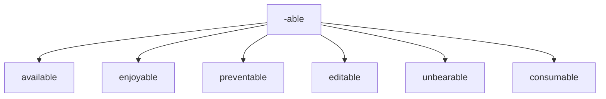

## -able Meaning: capable of being > adjective
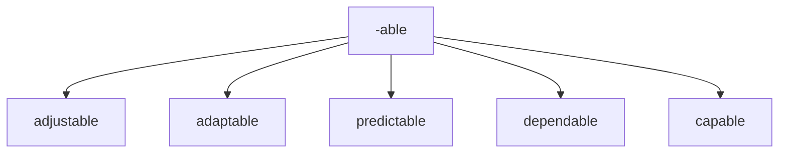


## -ate showing; full of'
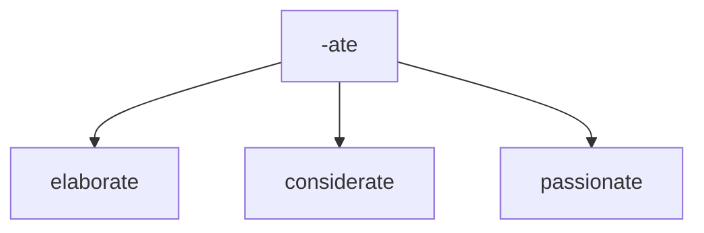


## -ible Meaning: capable of being > adjective 
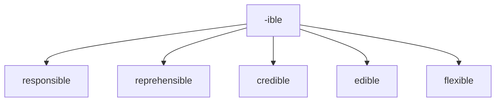


## -al 
Meaning: pertaining to > adjective

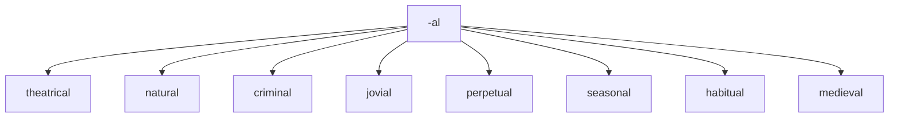

## -al Meaning: result of Verb > noun

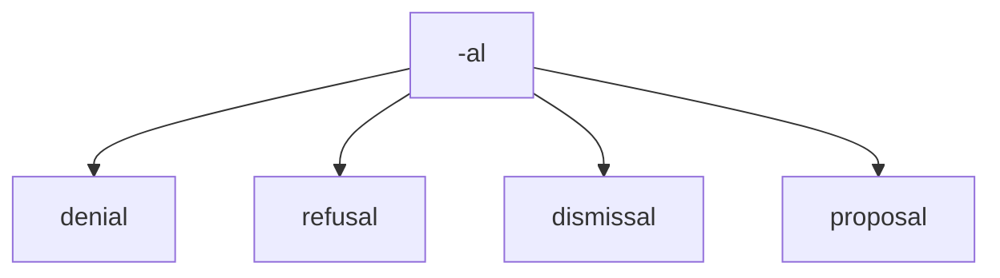


# suffix
## -cede
to go or yield 
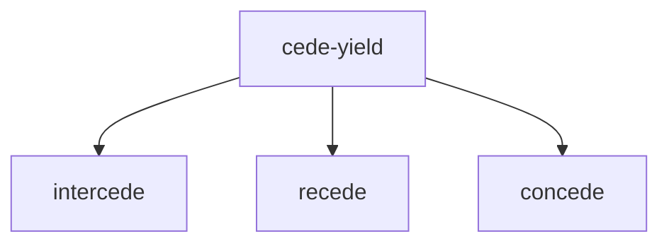


## -ant 
Meaning:  person who is V+ant > noun 

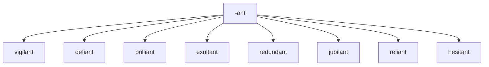


## -scope
viewing or staring

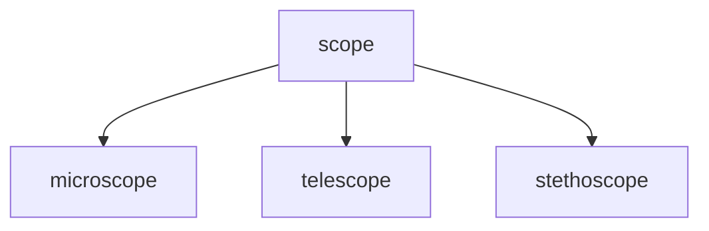


## -ence
action or process 
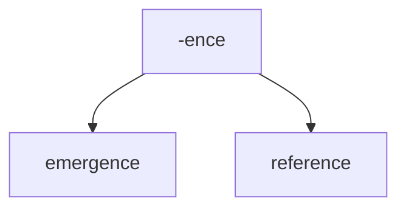


quality or state

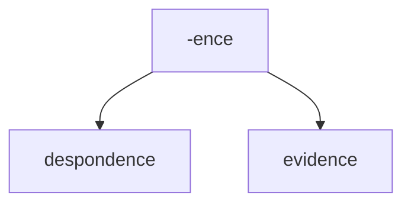

## -ary 
of or relating to

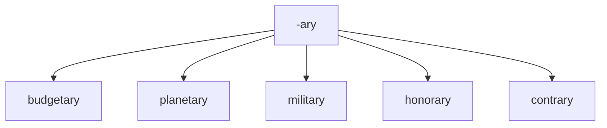

## -ent 
Meaning:  person who is V+ent > noun 

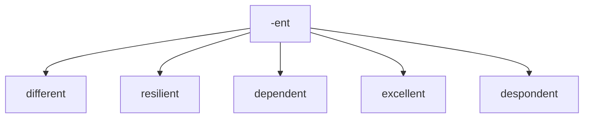


## -ful 
Meaning: full of or notable of (adjective)

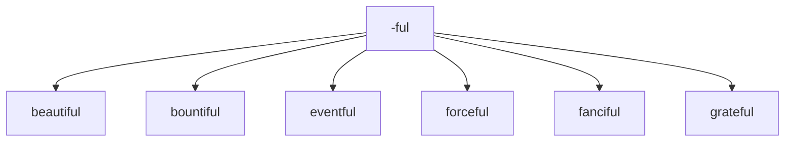


## -ful 
Meaning: full of or notable of (adjective)

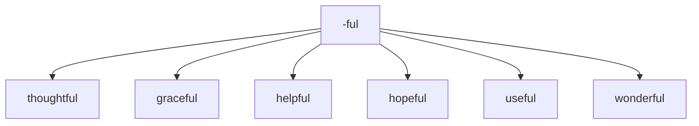


## -ic 
Meaning: relating to
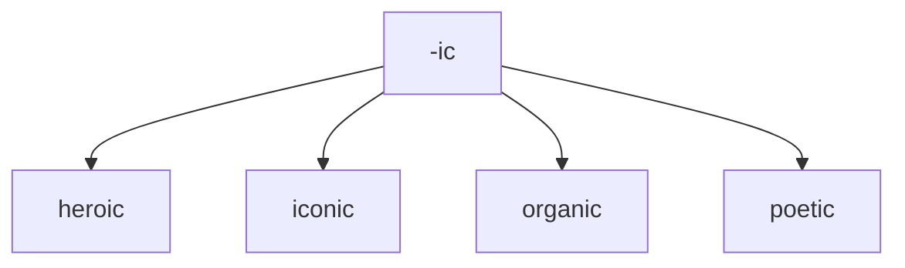

## -ious 
Meaning: having qualities of

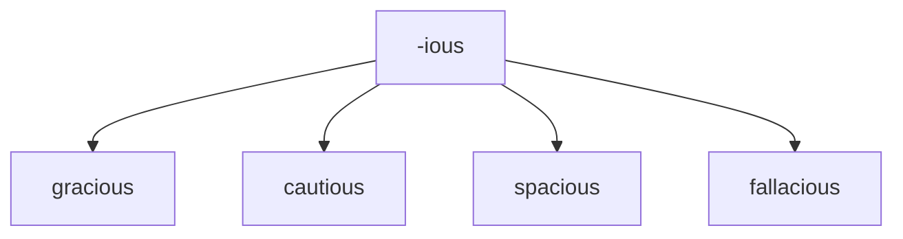

## -ous 
Meaning: having qualities of

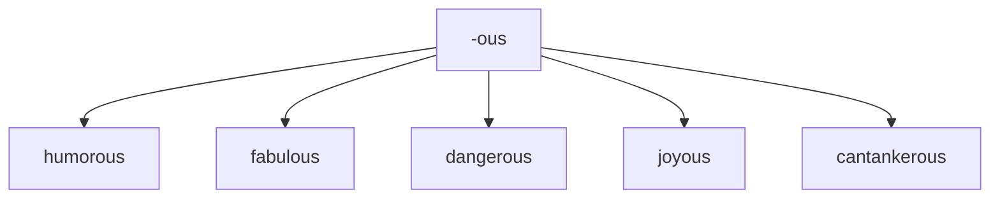


## -ive 
Meaning: quality or nature of

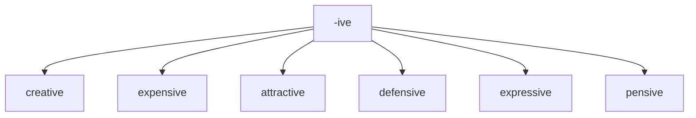

## -less 
Meaning: without something

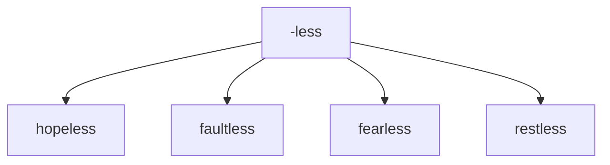

## -y 
Meaning: made up of or characterized by
```mermaid
graph TD; 
-y--> brainy; 
-y--> smelly; 
-y-->  fruity; 
-y-->  tasty; 
-y-->  sleepy; 
-y-->  windy; 
-y-->  grumpy; 
-y-->  grouchy;
-y-->  salty;
```


# Prefixes to create negatives 	Examples

## IM-
negative + adjective > adjective


```mermaid
graph TD; 
im --> 	immature;
im --> impatient;
im --> impolite;
im --> immortal;
im --> improbable; 
im--> imposing;


```

## IL-
negative + adjective > adjective

```mermaid
graph TD; 

il --> illegal;
il --> illicit;
il --> illegible;

```


## IN-
not or no
```mermaid
graph TD; 

in --> inconvenient; 
in --> inconcievable; 
in --> incongrous; 
in --> injustice; 
in --> invariably; 
in --> inject; 

```

## IN-
not or no
```mermaid
graph TD; 

in --> invisible;
in --> infallible;
in --> inactive; 
in --> inevitable;
in --> indelible;
in --> inedible;
in --> indecisive;
```


## IR -
not, or no
```mermaid
graph TD; 
 
ir --> irreplaceable;
ir --> irresponsible;
ir --> irrational;
ir --> irregular;


```


## pro - 
"**forward, forth, toward the front**"
```mermaid
graph TD;
pro--> protect; 
pro--> profession; 
pro--> proceed; 
pro--> protest; 
pro--> proactive;
pro--> proclamation; 


```

## UN -
negative + adjective > adjective


```mermaid
graph TD; 

un --> unfortunate; 
un --> uncomfortable;
un --> unbelievable;
un --> unforgivable;
un -->  unjust;


```
## NON -
negative + adjective > adjective

```mermaid
graph TD; 

non- --> non-fiction; 
non- --> non-political; 
non- --> non-neutral;


```


## DIS -
negative + adjective > adjective
apart, not, away from
```mermaid
graph TD; 
dis --> disloyal;
dis -->  dissimilar;
dis -->  disagree;
dis -->  dismantle;
dis -->  dismember;
dis -->  dishonest;
dis --> disperse;
dis -->  disobey;

```


# Prefixes 

## be-

all over, all around

```mermaid
graph TD; 
be --> bespatter;
be --> beset;

```

completely

```mermaid
graph TD; 
be --> bewitch;
be --> bemuse;
be --> bewilder;

```
having, covered with
```mermaid
graph TD; 
be --> bejewelled;

```

affect with (added to nouns)

```mermaid
graph TD; 
be --> befog;

```

cause to be (added to adjectives)

```mermaid
graph TD; 
be --> becalm;

```


## dia -
complete, through

```mermaid
graph TD; 
dia --> diagnose;
dia --> dialogue;
dia --> dialysis;
dia --> diameter;
dia --> diaphanous;
dia --> diarrhea;


```

## circum- 
around, about
```mermaid
graph TD;
circum -->circumspect;
circum -->circumcise;

```


## con- 
with
```mermaid
graph TD;
con -->concieve;
con -->convince;
con -->consider;
con -->congested;

```


## em  -
put in or into, bring to a certain state
```mermaid
graph TD; 
em --> embellishment;
em --> embarrassment;
em--> embraced;

```


## en -
within, in
```mermaid
graph TD; 
en --> endorse;
en-->endanger;
en -->encounter;
en -->enclose;
en --> enable;
```


## ex-
out of

```mermaid
graph TD; 
ex --> exclaim;
ex --> explain;
ex --> extent;
```


## anti -
without or against
```mermaid
graph TD; 
anti --> antipathy;
anti -->antitrust;

```

## re-
meaning: again or back
```mermaid
graph TD; 
re --> restructure;
re --> revisit;
re --> rehearse;
re --> redo;

re --> repulsive;

re --> reinstate;
```

## dis - 
meaning: reverse the meaning of the word

```mermaid
graph TD; 
dis --> disappear;
 dis --> disapprove;
 dis --> discharge;
 dis --> discourage;
 dis --> disperse;
 dis --> distress;
 

```

## over - 
meaning: too much

```mermaid
graph TD; 
over --> overkill;
over --> overwork;
over --> overlook;
over --> oversee;
over --> overcharge;

```
## un - 
meaning: reverse the meaning of the word


```mermaid
graph TD; 
un --> undead;
un --> unfasten;
un --> undo;
un-->unable;


```

## para -
alongside of, beside, near, resembling, beyond, apart from, and abnormal

```mermaid
graph TD; 
para --> parasol;
para --> parallel;
para --> paradigm;


```


## mis- 
meaning: badly or wrongly 	

```mermaid
graph TD; 
mis --> misunderstand; 
mis --> misbehave; 
mis --> mislead; 
mis --> misinform; 
mis --> misidentify;


```

## out- 
meaning: more or better than others 	

```mermaid
graph TD; 

out -->outperform;
out --> outbid;
```


## be- 	
meaning: make or cause 	

```mermaid
graph TD; 

be--> befriend;
be--> belittle;
be-->beguiled;
```


## co- 	
meaning: together 	

This prefix has a couple of different spellings.

```mermaid
graph TD; 

co --> coexist; 
co --> cooperate; 
co --> co-own;
```


## de- 	
meaning: do the opposite of 	

```mermaid
graph TD; 

de--> devalue; 
de--> deselect;

```


## fore- 
meaning: earlier, before 	

```mermaid
graph TD; 

fore--> forecast; 
fore--> foreclose; 
fore--> forethought; 
fore--> foresee; 
fore--> foreskin; 


```


## inter- 
meaning between 	


```mermaid
graph TD;

inter --> interact; 
inter --> intermix; 
inter --> interface; 
inter --> intercede;
```

## pre- 
meaning: before 	

```mermaid
graph TD;

pre--> prejudice;
pre--> prevent;
pre--> prepare;
pre--> predate;
pre--> precise;
pre--> prejudge;
pre--> pretest;
```

## sub- 
meaning under/below 	

```mermaid
graph TD;
sub--> subcontract;
sub-->  subdivide;
sub-->  subcontinent;
sub-->  subordinate;
sub-->  subscribe;

```

## trans- 	
meaning across, over 	

```mermaid
graph TD;
trans --> transform;
trans -->  transcribe;
trans -->  transmission;
trans -->  transplant;
trans --> transparent;
```

## under - 
meaning: not enough

```mermaid
graph TD;
under--> underbelly;
under--> underneath;
under--> underperform;
under--> undermine;
```

# suffixes 


## -logy 
study of
```mermaid
graph TD;
-logy --> psychology;
-logy --> caridologist;

```


## -ity 
state or quality of being

```mermaid
graph TD;
-ity --> ability;
-ity --> stability;

```

## -ness 
state or quality of being

```mermaid
graph TD;
-ness --> darkness;
-ness --> illness;
```


## -cy 
state or quality of being

```mermaid
graph TD;
-cy --> frequency;

```

## -er 
person concerned with N

```mermaid
graph TD;
-er --> programmer;
-er --> plumber;
-er --> painter;

```


## -atic 
**of the nature of the thing specified**

```mermaid
graph TD;
-atic --> systematic;
-atic --> problematic;
-atic --> erratic;

```


## -ism 
doctrine of N

```mermaid
graph TD;
-ism --> capitalism;
-ism --> communism;
-ism --> socialism;

```

## -ship 
state of being  

```mermaid
graph TD;
-ship --> leadership;
-ship --> friendship;

```

## -age 
collection of N > noun

```mermaid
graph TD;
-age --> baggage;
-age --> storage;
-age --> sabotage;


```

## -age 
action result of > noun

```mermaid
graph TD;
-age --> wastage;
-age --> heritage;
-age --> garbage;
-age -->hostage;
```


## -tion 
meaning action/instance of V-ing > NOUN

```mermaid
graph TD;
-tion --> alteration;
-tion -->  demonstration;
-tion -->  documentation;
-tion -->  presentation;

```

## -sion 
meaning action/instance of V-ing > NOUN

```mermaid
graph TD;
-sion --> expansion; 
-sion -->inclusion;
-sion -->exclusion;

-sion --> admission;
```

## -ment 
meaning	action/instance of V-ing > NOUN

```mermaid
graph TD;
-ment -->development; 
-ment -->punishment; 
-ment -->augment;
-ment --> impedement;
-ment--> embellishment;
-ment -->unemployment;
-ment -->enticement;
```


# roots

## mem
mind memory
```mermaid
graph TD;

-mem -->memoir;
-mem -->memorabilia;
-mem -->memorandum;
-mem -->memorial;
-mem -->memorize;
-mem -->memory;
-mem -->remember;
-mem -->remembrance;

```


mind memory
```mermaid
graph TD;
-mem -->memorable; 
-mem -->remember;
-mem -->commemorate; 
-mem -->immemorial;
-mem -->memento; 
-mem -->memo;

```


# hood 
```mermaid
graph TD;
-hood -->neighborhood; 
-hood -->fatherhood; 
-hood -->parenthood; 

```


## gest
carry or bear
```mermaid
graph TD;
gest --> congestion;
gest --> digest
gest --> gestation
gest --> gesticulate
gest --> gesture
gest --> ingest
gest --> suggest
```


## fect
make or do
```mermaid
graph TD;
fect --> infect;
fect -->perfect;
fect -->defect;
```

## flect
make or do
```mermaid
graph TD;
flect --> reflect;
flect --> deflect;
flect --> inflect;

```


##  ject 
means **throw**

```mermaid
graph TD;
ject --> trajectory;
ject --> inject;
ject --> reject;
ject --> eject;


```


## cise

cut (down)
```mermaid
graph TD;
cise-->circumcise
cise-->decisive
cise-->incision
cise-->incisive
cise-->incisor
cise-->precise
cise-->scissors

```


## ratio
logic;  reason;  judgment

```mermaid
	graph TD;
	ratio(logic)-->rational;
	

```


## hydro
water

```mermaid
	graph TD;
	hydro(water)-->hydrant;
	hydro(water)-->hydrometer;
	hydro(water)-->hydrogen;
	hydro(water)-->hydrometeor;
	

```


## act
to move or do (actor, acting, reenact)
```mermaid
	graph TD;
	act(do)-->actor;
	act(do)-->acting;
	act(do)-->reenact;
	act(do)-->interact;

```

## crim
judicial, crime
```mermaid
	graph TD;
	crim-->criminal;
	crim-->incriminate;
	crim-->crime;
	

```


## ambul
to move or walk
```mermaid
	graph TD;
	ambul(to move)-->ambulance;
	ambul(to move)-->ambulate;

```


## init
to begin
```mermaid
	graph TD;
	init-->initiate;
	init-->initialize;

```


## arbor
tree

```mermaid
	graph TD;
	arbor(tree)-->arboreal;
	arbor(tree)-->arboretum;

	arbor(tree)-->arborist;

```

## cardio
heart
```mermaid
	graph TD;
	cardio(heart)-->cardiovascular;
	cardio(heart)-->cardiology;
	cardio(heart)-->electrocardiogram;

```


## crypt
to hide
```mermaid
	graph TD;
	crypt(hide)-->apocryphal;
	crypt(hide)--> cryptic;
	crypt(hide)-->encrpyt;
	crypt(hide)-->cryptography;

```


## acri
bitter
```mermaid
	graph TD;
	acri(bitter)-->acrid;
	acri(bitter)-->acrimony;
	acri(bitter)--> acridity;

```
## astro
stars
```mermaid
	graph TD;

	astro(star)-->astronaut;
	astro(star)--> astronomy;
	astro(star)-->astrophysics;

```

## aud
hear
```mermaid
	graph TD;

	aud-->audience;
	aud--> audible;
	aud-->audio;

```

## auto
self
```mermaid
	graph TD;
	auto(self)-->automobile;
	auto(self)-->autonomy;
	auto(self)--> autocrat;
	auto(self)-->automatic;
	auto(self)-->autodidact;

```


## bene
good
```mermaid
	graph TD;

	bene(good)-->benefactor;
	bene(good)--> benevolent;
	bene(good)--> beneficial;
	
```

## carn
flesh
```mermaid
	graph TD;

	carn-->carnal;
	carn--> carnivorous;
	carn--> carnivore;
	carn--> reincarnate;
	carn--> incarnate;
	
	
```


## corp
body
```mermaid
	graph TD;

	corp-->corporal;
	corp--> corporate;
	corp--> corpse;
		
```

## cred
believe
```mermaid
	graph TD;

	cred-->credible;
	cred-->credence;
	cred-->incredible;
			
```

## dem

people
```mermaid
	graph TD;

	dem-->democracy;
	dem-->democrat;
	dem-->demographic;
			
```


## derm
skin

```mermaid
	graph TD;

	derm-->dermatology;
	derm-->epidermis;
	
			
```


## dict
say
```mermaid
	graph TD;

	dict-->diction;
	dict-->dictionary;
	dict-->interdict;
	dict-->dictate;
	dict-->edict;
			
```

## ego
I
```mermaid
	graph TD;

	ego-->egotist;
	ego-->egocentric;
	ego-->egomaniac;
			
```

## equi
equal

```mermaid
	graph TD;

	equi-->equidistant;
	equi-->equity;
	equi-->equilateral;
	
			
```


## eu
```mermaid
	graph TD;

	eu-->euphoric;
	eu-->Europe;
	
			
```


## fac

```mermaid
	graph TD;

	fac-->factory;
	fac-->faculty;
	fac-->faction;
			
```

## herb
plants
```mermaid
	graph TD;
	herb-->herbal;
	herb-->herbivore;
			
```


## hypo
sleep
```mermaid
	graph TD;
	
	hypno(sleep)-->hypnosis;
	hypno(sleep)-->hypnotic;
	hypno(sleep)-->hypnotism;
	
```


## intra
within or into
```mermaid
	graph TD;
	
	intra(within)-->intrapersonal;
	intra(within)-->intramural;
	intra(within)-->intravenous;
```


## gen
```mermaid
	graph TD;
	
	gen(birth)-->genesis;
	gen(birth)-->genetics;
	gen(birth)-->generate;
```


## lum
light
```mermaid
	graph TD;
	
	lum(light)-->lumen;
	lum(light)-->luminary;
	lum(light)-->luminous;
```

## micro
 small
```mermaid
	graph TD;
	
	micro(small)-->microbiology;
	micro(small)-->microcosm;
	micro(small)-->microscope;
	
```

## multi
many
```mermaid
	graph TD;
	
	multi(many)-->multilingual;
	multi(many)-->multiple;
	multi(many)-->multifaceted;

```


## port
```mermaid
	graph TD;
	
	port(carry)-->portal;
	port(carry)-->portable;
	port(carry)-->transport	;
```

## ject
```mermaid
	graph TD;
	
	ject-->abject;
	ject-->reject;
	ject-->object;
	ject-->inject;
	ject-->subject;
	
	
```


## scrib
write
```mermaid
	graph TD;
	
	scrib(write)-->transcribe;
	scrib(write)-->subscribe;
	
	
```


