# mermaid diagrams

http://www.uefap.com/vocab/build/building.htm

To view as diagrams, you need to install: 

https://chrome.google.com/webstore/detail/github-%2B-mermaid/goiiopgdnkogdbjmncgedmgpoajilohe/related


# act
to move or do (actor, acting, reenact)
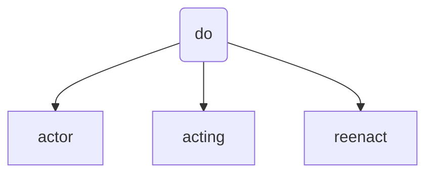

# ambul
to move or walk
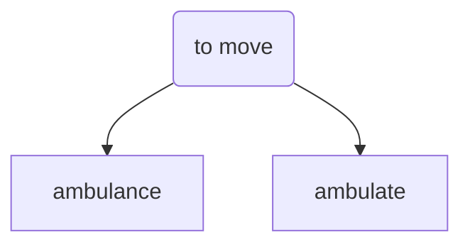


# arbor
tree

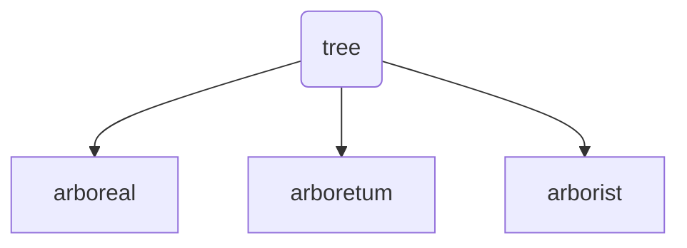

# cardio
heart
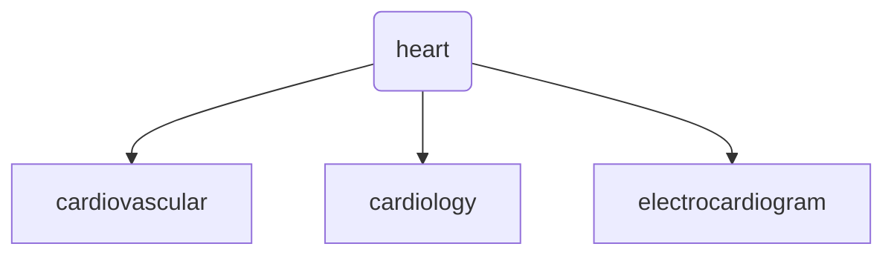


# crypt
to hide
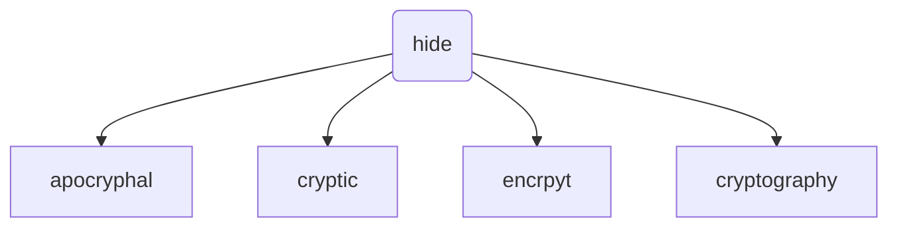


-   **crypt** - to hide (apocryphal, cryptic, cryptography)


# acri
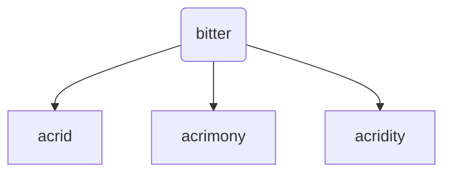
# astro
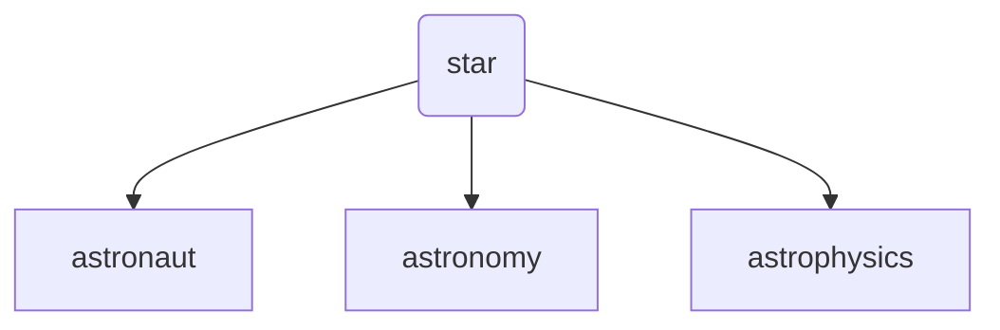

# aud
hear
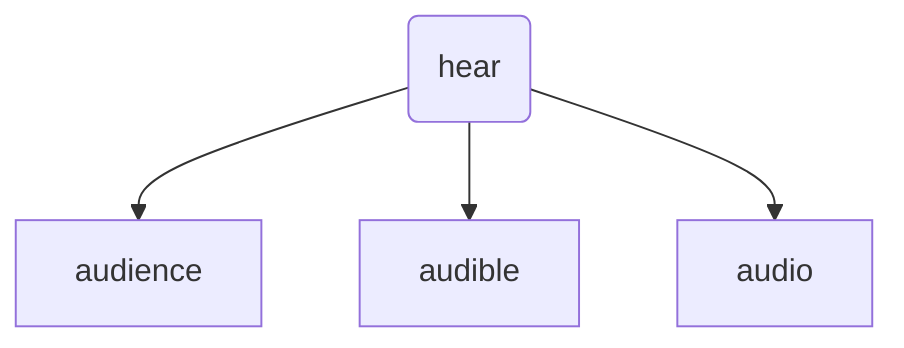

# auto
self
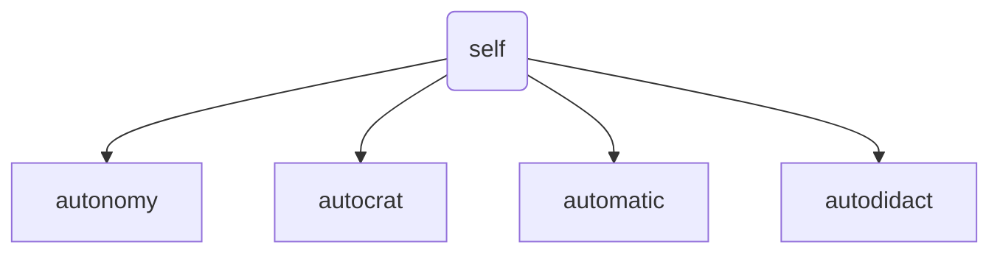


# bene
good
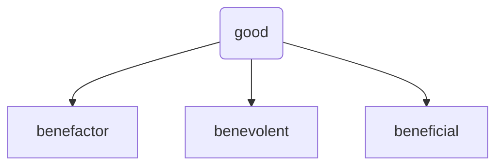

# carn
flesh
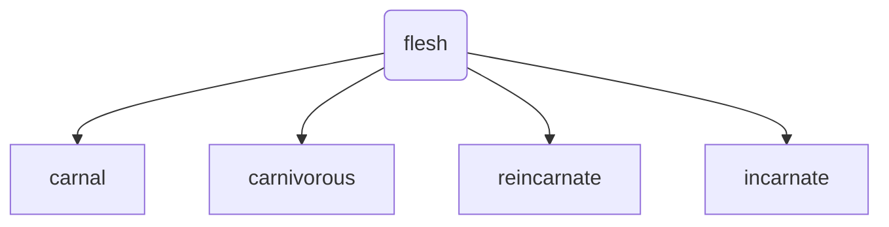


# corp
body
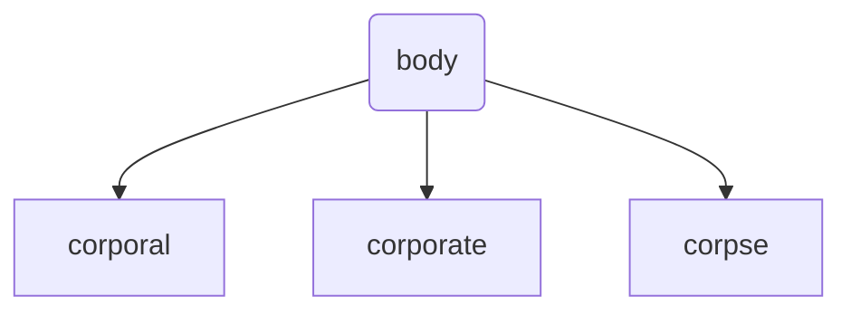

# cred
believe
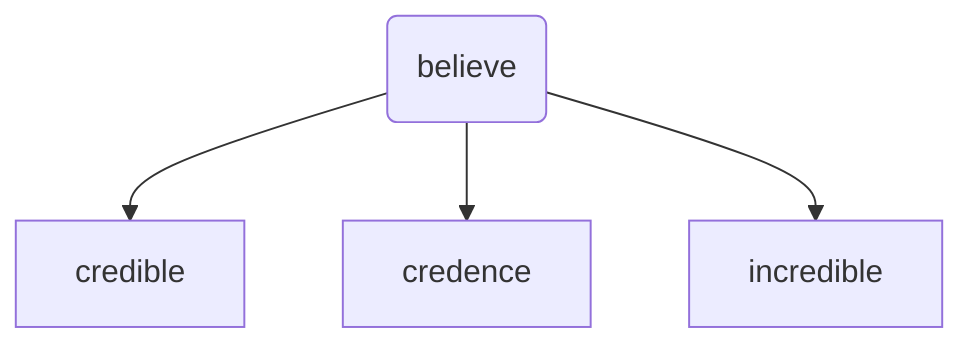

# dict
say
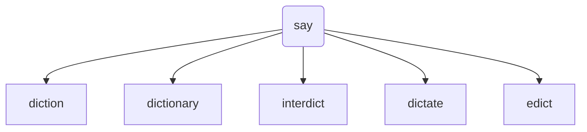

# ego
I
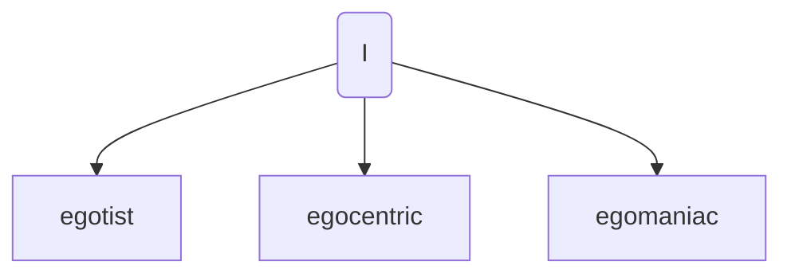

# eu
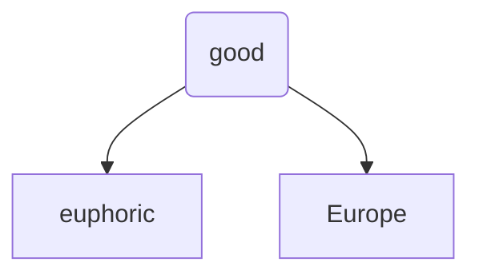


# fac

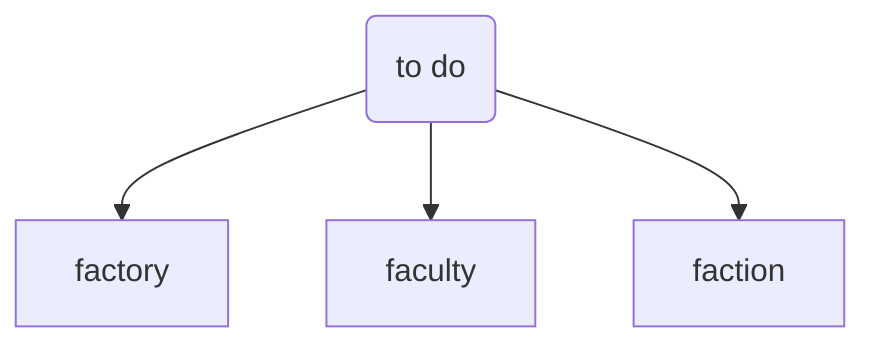

# gen
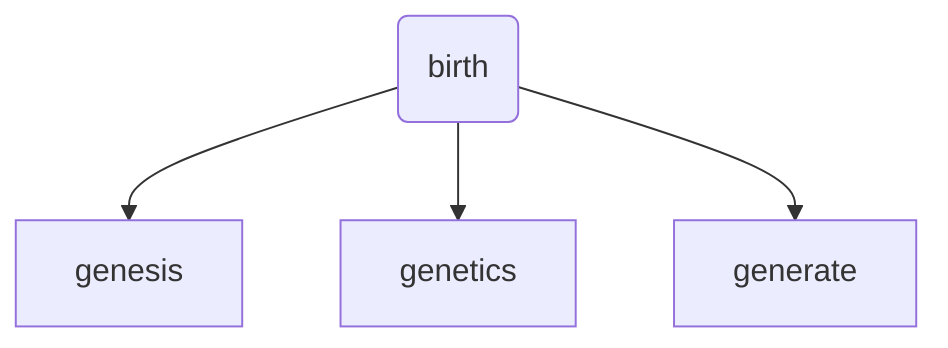


# lum
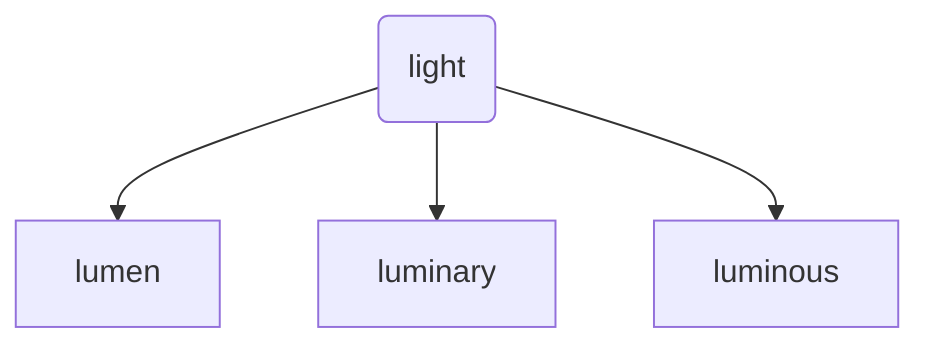

# micro
-   **micro** - small (microbiology, microcosm, microscope)
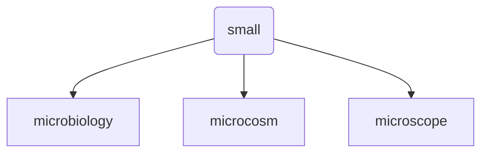

# multi
```mermaid
	graph TD;
	
	multi(many)-->multilingual
	multi(many)-->multiple
	multi(many)-->multifaceted
	
```


```mermaid
	graph TD;
	
	port(carry)-->portal
	port(carry)-->portable
	port(carry)-->transport	
```


## todo
con -