# adjectives suffixes

## mermaid diagrams

Made with Mermaid!

## -able
Meaning: capable of being
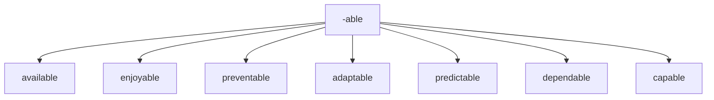

## -ible
Meaning: capable of being
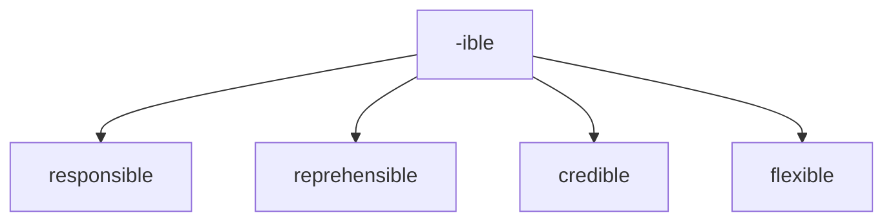


## -al
Meaning: pertaining to

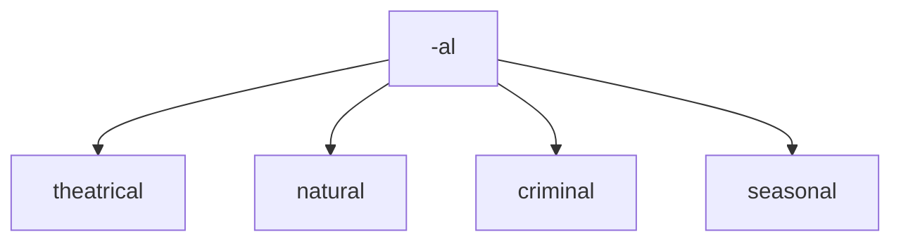


## -ant
Meaning: inclined to or tending to

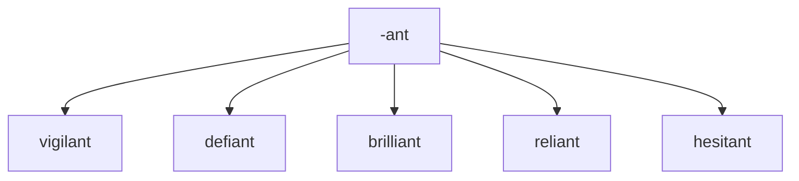


## -ary
Meaning: of or relating to

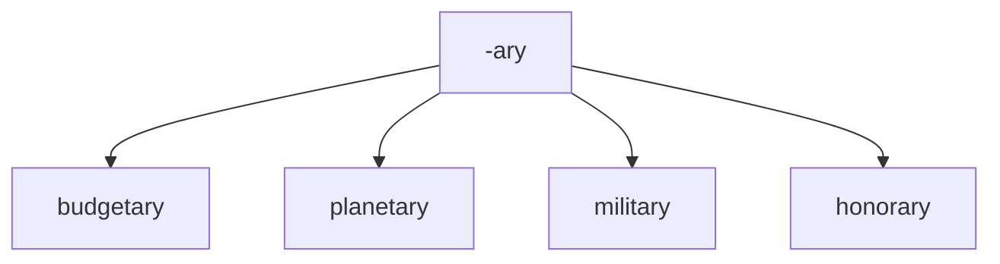


## -ful
Meaning: full of or notable of

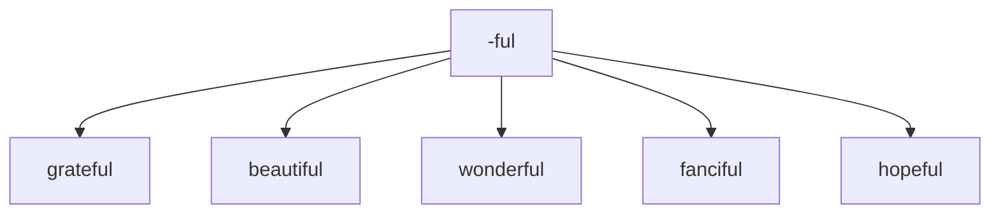

## -ic
Meaning: relating to
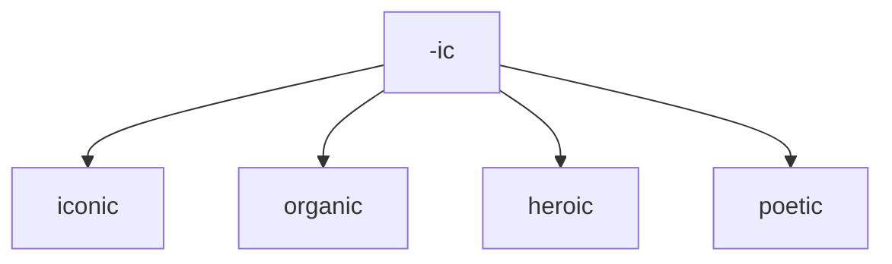

## -ious
Meaning: having qualities of

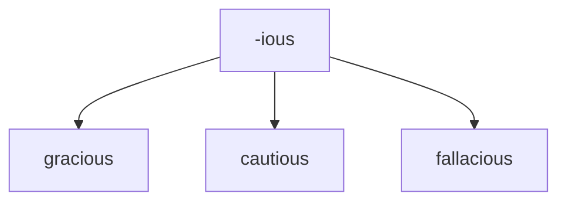

## -ous

Meaning: having qualities of
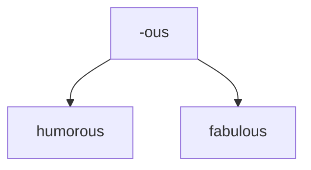


## -ive
Meaning: quality or nature of

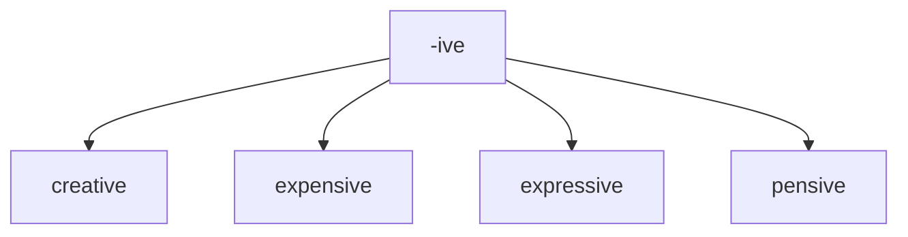

## -less
Meaning: without something

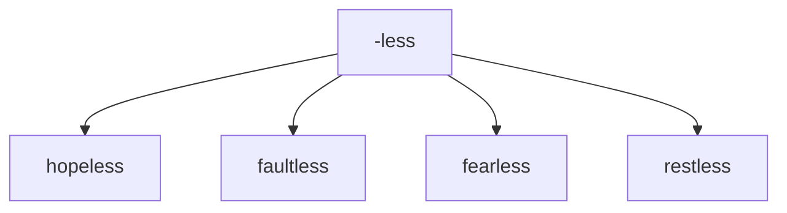

## -y
Meaning: made up of or characterized by
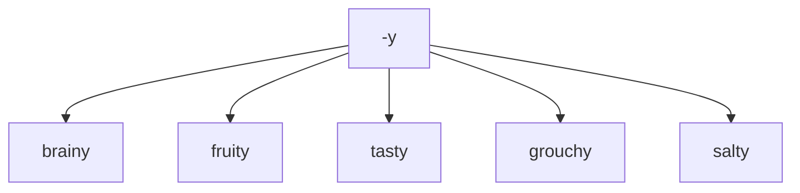


# Prefix to create negatives 	Examples

## negative + adjective > adjective


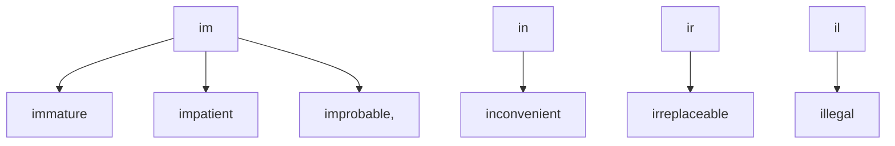
## negative + adjective > adjective
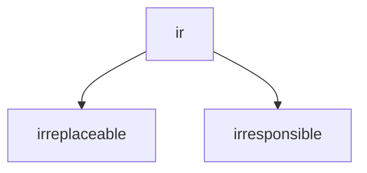


## negative + adjective > adjective


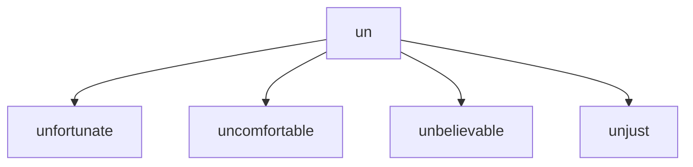
## negative + adjective > adjective

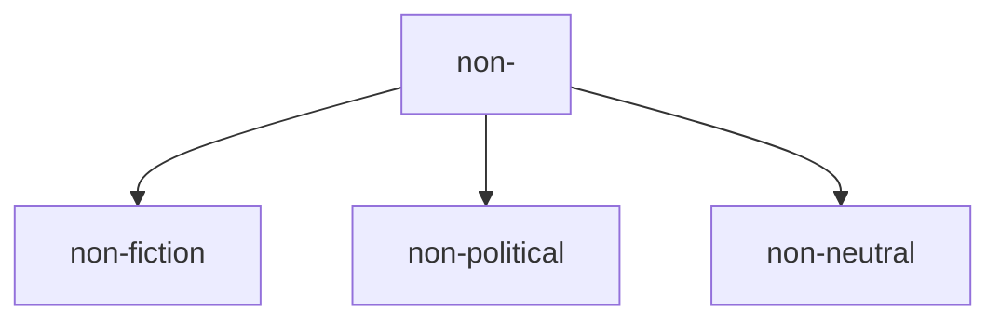


## negative + adjective > adjective

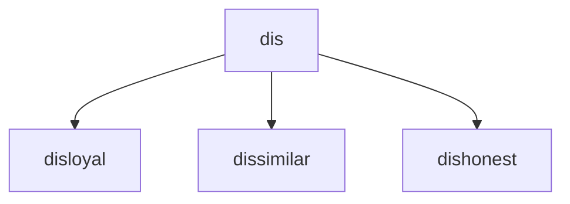


---
```mermaid
graph TD; 


```

```mermaid
graph TD; 


```
