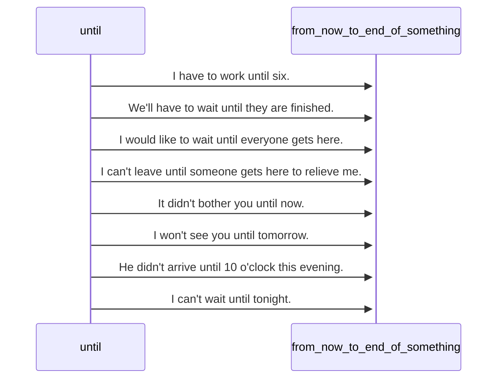

[[grammar elements subordinating conjunctions]]

```mermaid
sequenceDiagram

until->>+from_now_to_end_of_something:I have to work until six.

until->>+from_now_to_end_of_something: We'll have to wait until they are finished.

until->>+from_now_to_end_of_something: I would like to wait until everyone gets here.


until->>+from_now_to_end_of_something: I can't leave until someone gets here to relieve me.


until->>+from_now_to_end_of_something: It didn't bother you until now.
  
until->>+from_now_to_end_of_something: I won't see you until tomorrow.
  
until->>+from_now_to_end_of_something: He didn't arrive until 10 o'clock this evening.
 
until->>+from_now_to_end_of_something: I can't wait until tonight.


```

# resource
https://www.talkenglish.com/speaking/lessondetails.aspx?ALID=4398