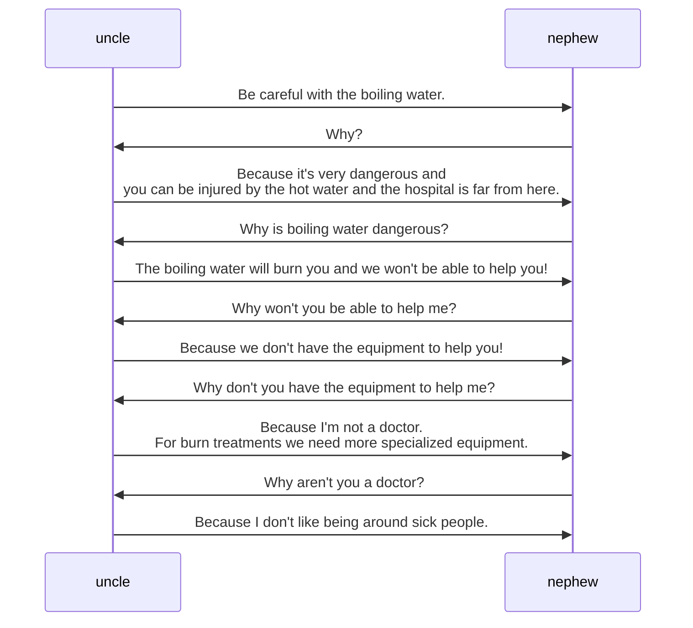

```mermaid 
sequenceDiagram
    participant uncle
    participant nephew
    uncle->>nephew: Be careful with the boiling water.

    nephew->>uncle: Why?

    uncle->>nephew: Because it's very dangerous and<br> you can be injured by the hot water and the hospital is far from here.

    nephew->>uncle: Why is boiling water dangerous?

    uncle->>nephew: The boiling water will burn you and we won't be able to help you!

    nephew->>uncle:  Why won't you be able to help me?

    uncle->>nephew: Because we don't have the equipment to help you!

    nephew->>uncle: Why don't you have the equipment to help me?

    uncle->>nephew: Because I'm not a doctor. <br>For burn treatments we need more specialized equipment.

    nephew->>uncle: Why aren't you a doctor?

    uncle->>nephew: Because I don't like being around sick people.
```