# mermaid diagrams

# http://www.uefap.com/vocab/build/building.htm

To view as diagrams, you need to install: 

https://chrome.google.com/webstore/detail/github-%2B-mermaid/goiiopgdnkogdbjmncgedmgpoajilohe/related


# adjectives suffixes


## -able Meaning: capable of being > adjective
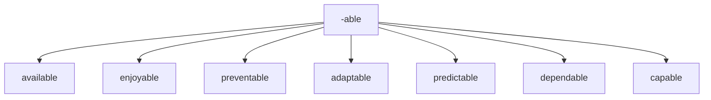

## -ible Meaning: capable of being > adjective 
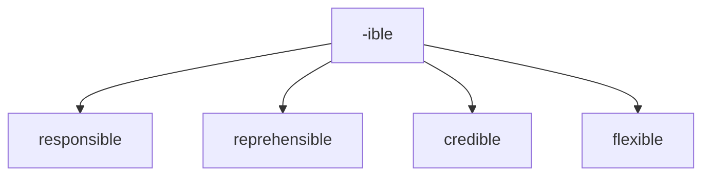


## -al Meaning: pertaining to > adjective

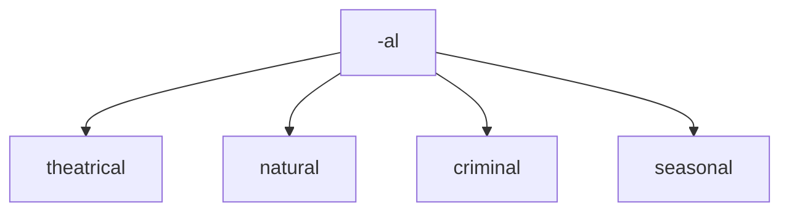

## -al Meaning: result of Verb > noun

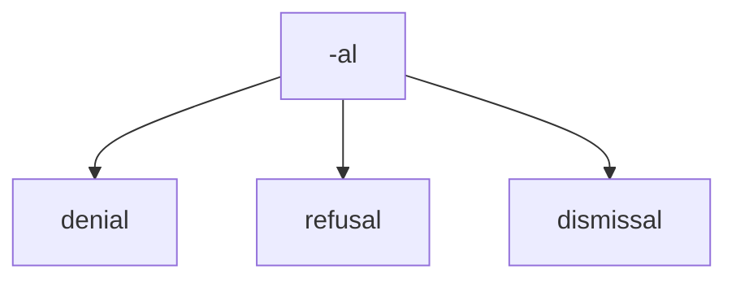


## -ant Meaning:  person who is V+ant > noun 

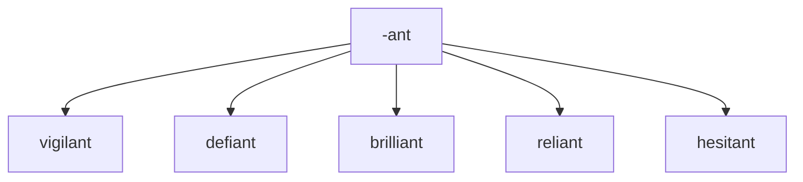


## -ary
Meaning: of or relating to

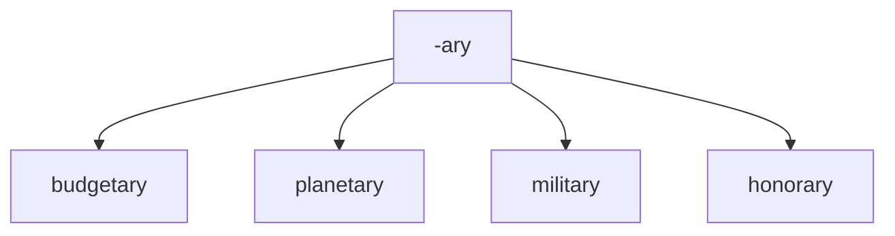

## -ent Meaning:  person who is V+ant > noun 

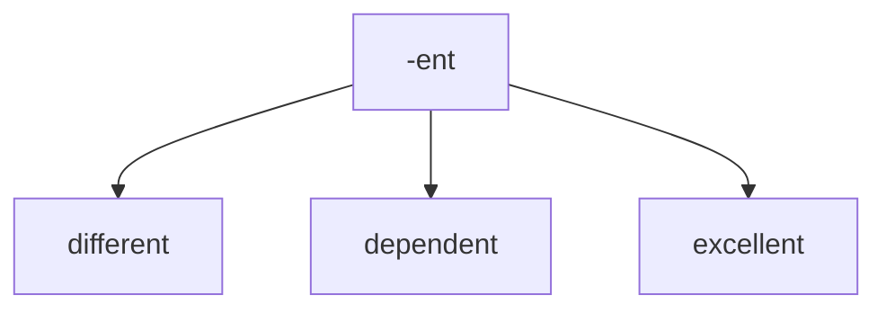


## -ful
Meaning: full of or notable of

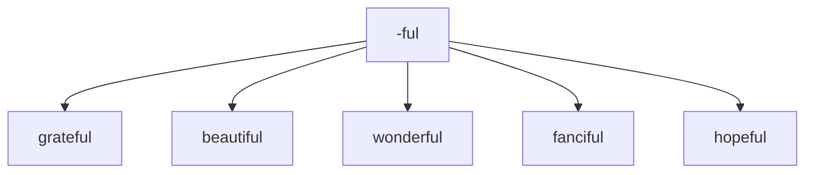

## -ic
Meaning: relating to
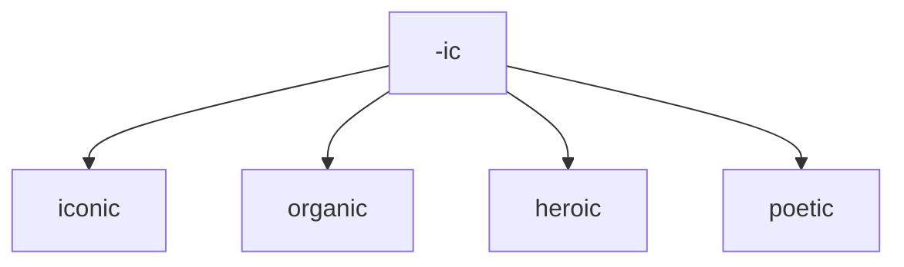

## -ious
Meaning: having qualities of

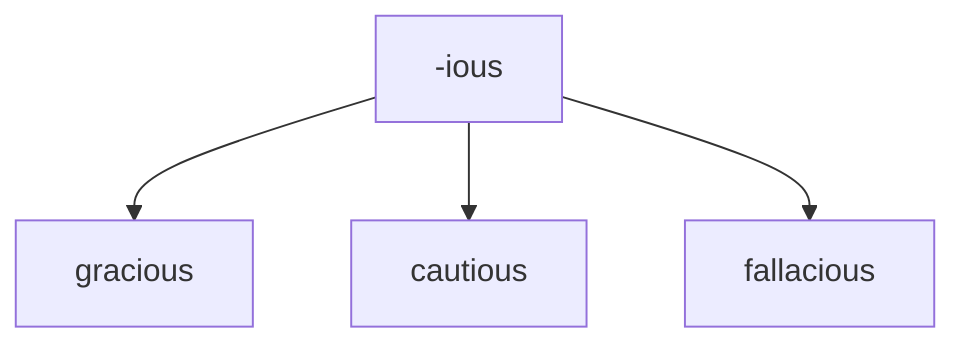

## -ous

Meaning: having qualities of
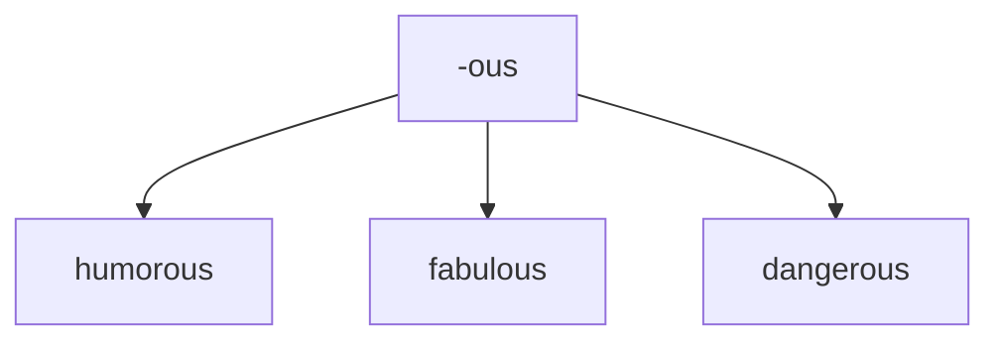


## -ive
Meaning: quality or nature of

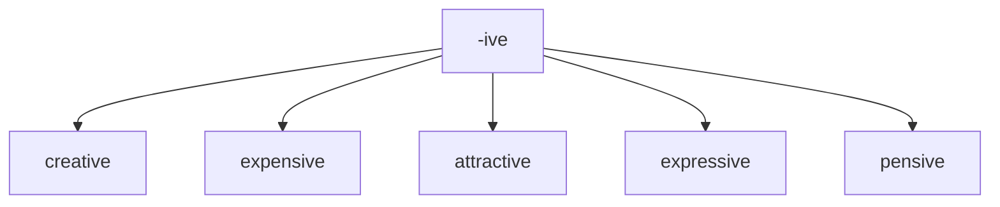

## -less
Meaning: without something

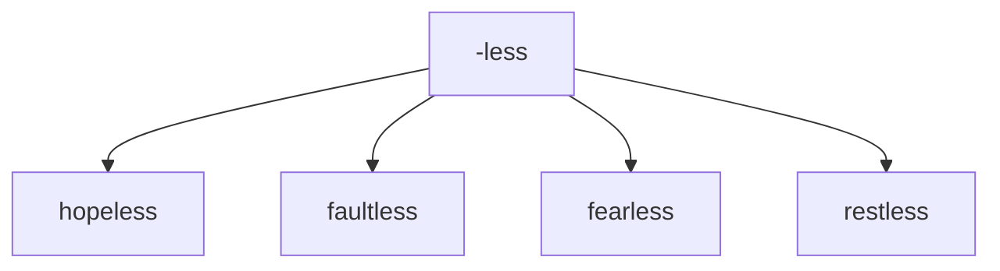

## -y
Meaning: made up of or characterized by
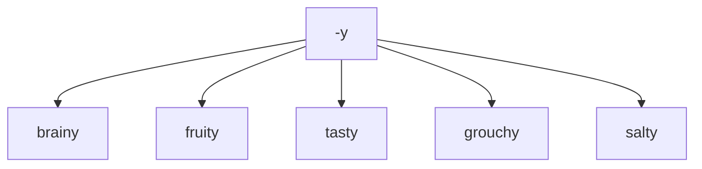


# Prefixes to create negatives 	Examples

## negative + adjective > adjective


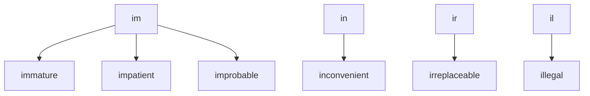
## negative + adjective > adjective
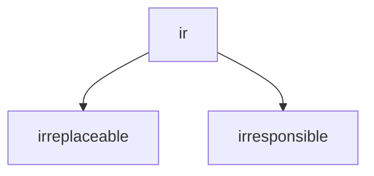


## negative + adjective > adjective


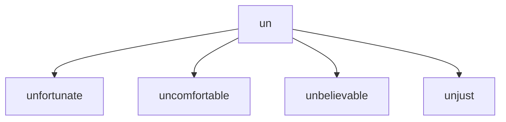
## negative + adjective > adjective

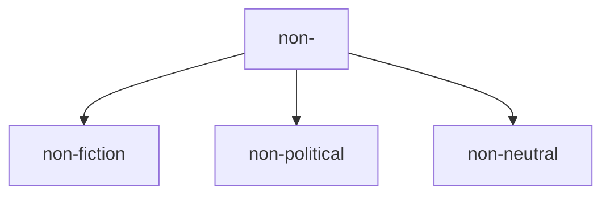


## negative + adjective > adjective

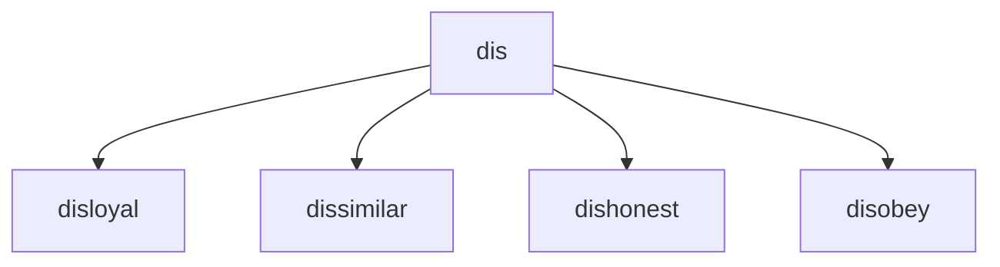


---

# Prefix to create new verbs

## re-

meaning: again or back
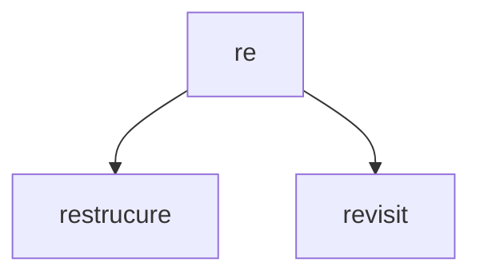

## dis - 

meaning: reverse the meaning of the word

```mermaid
graph TD; 
dis --> disappear;
 dis --> disapprove;

```

## over -

meaning: too much

```mermaid
graph TD; 
over --> overkill;
over --> overwork;

```
## un -

meaning: reverse the meaning of the word


```mermaid
graph TD; 
un --> undead;
un --> unfasten;

```

## mis- 	

meaning: badly or wrongly 	

```mermaid
graph TD; 

mis --> mislead; mis --> misinform; mis --> misidentify;


```

## out- 	

meaning: more or better than others 	

```mermaid
graph TD; 

out -->outperform;
out --> outbid;
```


## be- 	

meaning: make or cause 	
```mermaid
graph TD; 

be--> befriend;
be--> belittle;
```


## co- 	

meaning: together 	

This prefix has a couple of different spellings.

```mermaid
graph TD; 


co --> coexist; 
co --> cooperate; 
co --> co-own;
```


## de- 	

meaning: do the opposite of 	

```mermaid
graph TD; 

de--> devalue; 
de--> deselect;

```


## fore- 	

meaning: earlier, before 	

```mermaid
graph TD; 

fore--> forecast; 
fore--> foreclose; 
fore--> foresee; 

```


## inter- 	

meaning between 	


```mermaid
graph TD;

inter --> interact; inter --> intermix; inter --> interface; inter --> intercede;
```

## pre- 	

meaning: before 	


```mermaid
graph TD;
pre-->pre-expose;pre--> prejudge;pre--> pretest
```

## sub- 	

meaning

under/below 	

```mermaid
graph TD;
sub--> subcontract;sub-->  subdivide;
sub-->  subcontinent;
```


## trans- 	
meaning

across, over 	

```mermaid
graph TD;
trans --> transform;trans -->  transcribe;trans -->  transplant;
```

## under -

meaning: not enough

```mermaid
graph TD;
under--> underbelly;
under--> underperform;
```

# suffixes 


## -ity state or quality of being

```mermaid
graph TD;
-ity --> ability;
```

## -ness state or quality of being

```mermaid
graph TD;
-ness --> darkness;
```


## -cy state or quality of being

```mermaid
graph TD;
-cy --> frequency;
```

## -er person concerned with N

```mermaid
graph TD;
-er --> programmer;
-er --> plumber;
```


## -ism doctrine of N

```mermaid
graph TD;
-ism --> capitalism;
```

## -ship state of being  N

```mermaid
graph TD;
-ship --> leadership;
```

## -age collection of N > noun

```mermaid
graph TD;
-age --> baggage;
-age --> storage;
```

## -age action result of > noun

```mermaid
graph TD;
-age --> wastage;
-age --> heritage;
```


## -tion meaning action/instance of V-ing > NOUN

```mermaid
graph TD;
-tion --> alteration;
-tion -->  demonstration;
```

## -sion meaning action/instance of V-ing > NOUN


```mermaid
graph TD;
-sion --> expansion; 
-sion -->inclusion;
-sion --> admission;
```

## -ment meaning	action/instance of V-ing > NOUN

```mermaid
graph TD;
-ment -->development; 
-ment -->punishment; 
-ment -->unemployment;