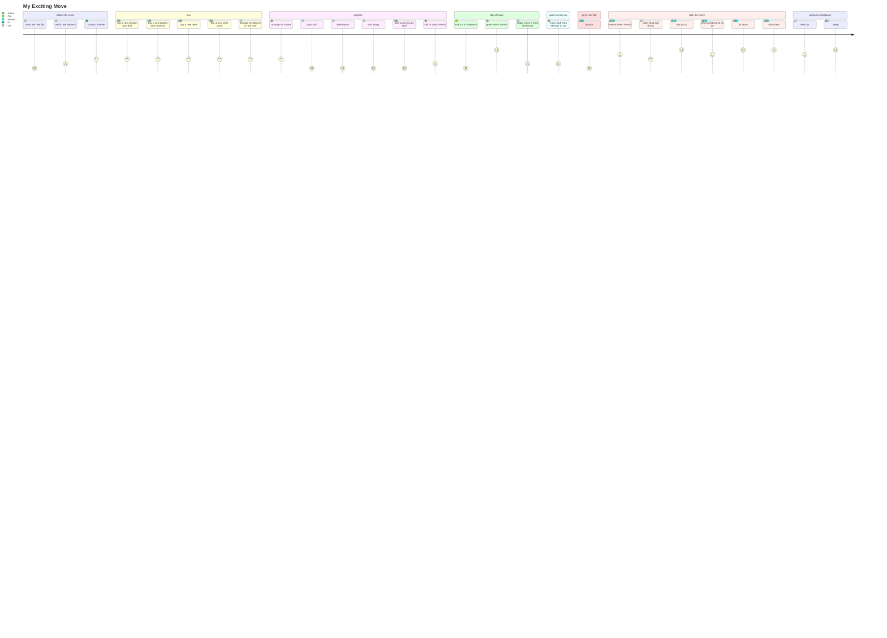

# questions
- Why are you moving?
- Where are you moving to?
- Are you planning to move?
- Will you be using a moving company?
- Where did you your boxes?
- How will you reward your friends for helping?
- When was the last time you moved?

# statements
- We are moving the day after tomorrow.
- We need strong backs.
- We will need to buy some new kitchen appliances.
- We did some chores around the house.
- It's twice as expensive.
- We are using the old boxes from our last move!
- We will be asking our friends for help.
- We have boxes of the things that we bought while we were living here!

# dialogs
#mermaid 

- Q:
- A:

---

# phrases
- Please be careful!
- Don't drop it!
- Where do I put this?
- You can put it [here| there| bathroom| kitchen].

# verbs
- to move
- to call 
- to drive
- to help
- to pack
- to put stuff into something
- to seal
- to tape 

# nouns
- vacuum cleaner
# adjectives

# resources

[![](https://mermaid.ink/img/eyJjb2RlIjoiICBqb3VybmV5XG4gICAgdGl0bGUgTXkgRXhjaXRpbmcgTW92ZVxuICAgIHNlY3Rpb24gYmVmb3JlIHRoZSBtb3ZlXG4gICAgICAgIGNsZWFuIHRoZSBuZXcgZmxhdDogMTogbWVcbiAgICAgICAgdmVyaWZ5IG5ldyBhZGRyZXNzOiAyOiBtZVxuICAgICAgICBjb25uZWN0IGludGVybmV0OiAzOiBtZVxuXG4gICAgc2VjdGlvbiBidXlcbiAgICAgICAgYnV5IGEgbmV3IFF1ZWVuIFNpemUgYmVkOiAzOiBtZSwgQXJ0ZW1cbiAgICAgICAgYnV5IGEgbmV3IFF1ZWVuIFNpemUgbWF0dHJlc3M6IDM6IG1lLCBBcnRlbVxuICAgICAgICBidXkgYSBuZXcgZGVzazogMzogbWUsIEFydGVtXG4gICAgICAgIGJ1eSBhIG5ldyBuaWdodCBzdGFuZDogMzogbWUsIEFydGVtXG4gICAgICAgIGFycmFuZ2UgZm9yIGRlbGl2ZXJ5IG9mIG5ldyBzdHVmZjogMzogbWVcbiAgICBcbiAgICBzZWN0aW9uIHByZXBhcmVcbiAgICAgICAgYXJyYW5nZSBmb3IgbW92ZXI6IDM6IEFydGVtXG4gICAgICAgIHBhY2sgc3R1ZmY6IDE6IG1lXG4gICAgICBsYWJlbCBib3hlczogMTogbWVcbiAgICAgIHNvcnQgdGhpbmdzOiAxOiBtZVxuICAgICAgdG9zcyB1bm5lY2Vzc2FyeSBzdHVmZjogMTogbWUsIEFydGVtXG4gICAgICBjYWxsIHRvIHZlcmlmeSBmcmllbmRzOiAyOiBBcnRlbVxuICAgIHNlY3Rpb24gZGF5IG9mIG1vdmVcbiAgICAgIGxvY2sgY2F0IGluIGJhdGhyb29tOiAxOiBDYXRcbiAgICAgIGdyZWV0IEFydGVtIGZyaWVuZHM6IDU6IEFydGVtXG4gICAgICBzdGFnZSBtb3ZlIGluIGZyb250IG9mIGVsZXZhdG9yOiAyOiBtZSBcbiAgICBcbiAgICBzZWN0aW9uIHBhY2sgbW92aW5nIGNhclxuICAgICAgbW92ZSBzdHVmZiBmcm9tIGVsZXZhdG9yIHRvIGNhcjogMjogQXJ0ZW1cbiAgICBzZWN0aW9uIGdvIHRvIG5ldyBmbGF0XG4gICAgICAgIHVucGFjazogMTogbWUsIEFydGVtLCBmcmllbmRzXG4gICAgICBcbiAgICBzZWN0aW9uIGFmdGVyIHRoZSBtb3ZlXG4gICAgICAgIHJld2FyZCBBcnRlbSBmcmllbmRzOiA0OiBBcnRlbSxtZSwgZnJpZW5kc1xuICAgICAgICBvcmRlciBmb29kIGFuZCBkcmlua3M6IDM6IG1lXG4gICAgICAgIGVhdCBwaXp6YTogNTogQXJ0ZW0sbWUsIGZyaWVuZHNcbiAgICAgICAgZmluZCBzb21ldGhpbmcgdG8gc2l0IG9uOiA0OiBBcnRlbSxtZSwgZnJpZW5kc1xuICAgICAgICBTaXQgZG93bjogNTogbWUsIEFydGVtLCBmcmllbmRzXG4gICAgICAgIGRyaW5rIGJlZXI6NTogbWUsIEFydGVtLCBmcmllbmRzXG4gICAgc2VjdGlvbiBnbyBiYWNrIHRvIG9sZCBwbGFjZVxuICAgICAgICBcbiAgICAgICAgZmVlZCBjYXQ6IDQ6IG1lXG4gICAgICAgIHNsZWVwOiA1OiBBcnRlbSwgbWUiLCJtZXJtYWlkIjp7InRoZW1lIjoiZGVmYXVsdCJ9LCJ1cGRhdGVFZGl0b3IiOmZhbHNlLCJhdXRvU3luYyI6dHJ1ZSwidXBkYXRlRGlhZ3JhbSI6ZmFsc2V9)](https://mermaid-js.github.io/mermaid-live-editor/edit##eyJjb2RlIjoiICBqb3VybmV5XG4gICAgdGl0bGUgTXkgRXhjaXRpbmcgTW92ZVxuICAgIHNlY3Rpb24gYmVmb3JlIHRoZSBtb3ZlXG4gICAgICAgIGNsZWFuIHRoZSBuZXcgZmxhdDogMTogbWVcbiAgICAgICAgdmVyaWZ5IG5ldyBhZGRyZXNzOiAyOiBtZVxuICAgICAgICBjb25uZWN0IGludGVybmV0OiAzOiBtXG5cbiAgICBzZWN0aW9uIGJ1eVxuICAgICAgICBidXkgYSBuZXcgUXVlZW4gU2l6ZSBiZWQ6IDM6IG1lLCBBcnRlbVxuICAgICAgICBidXkgYSBuZXcgUXVlZW4gU2l6ZSBtYXR0cmVzczogMzogbWUsIEFydGVtXG4gICAgICAgIGJ1eSBhIG5ldyBkZXNrOiAzOiBtZSwgQXJ0ZW1cbiAgICAgICAgYnV5IGEgbmV3IG5pZ2h0IHN0YW5kOiAzOiBtZSwgQXJ0ZW1cbiAgICAgICAgYXJyYW5nZSBmb3IgZGVsaXZlcnkgb2YgbmV3IHN0dWZmOiAzOiBtZVxuICAgIFxuICAgIHNlY3Rpb24gcHJlcGFyZVxuICAgICAgICBhcnJhbmdlIGZvciBtb3ZlcjogMzogQXJ0ZW1cbiAgICAgICAgcGFjayBzdHVmZjogMTogbWVcbiAgICAgIGxhYmVsIGJveGVzOiAxOiBtZVxuICAgICAgc29ydCB0aGluZ3M6IDE6IG1lXG4gICAgICB0b3NzIHVubmVjZXNzYXJ5IHN0dWZmOiAxOiBtZSwgQXJ0ZW1cbiAgICAgIGNhbGwgdG8gdmVyaWZ5IGZyaWVuZHM6IDI6IEFydGVtXG4gICAgc2VjdGlvbiBkYXkgb2YgbW92ZVxuICAgICAgbG9jayBjYXQgaW4gYmF0aHJvb206IDE6IENhdFxuICAgICAgZ3JlZXQgQXJ0ZW0gZnJpZW5kczogNTogQXJ0ZW1cbiAgICAgIHN0YWdlIG1vdmUgaW4gZnJvbnQgb2YgZWxldmF0b3I6IDI6IG1lIFxuICAgIFxuICAgIHNlY3Rpb24gcGFjayBtb3ZpbmcgY2FyXG4gICAgICBtb3ZlIHN0dWZmIGZyb20gZWxldmF0b3IgdG8gY2FyOiAyOiBBcnRlbVxuICAgIHNlY3Rpb24gZ28gdG8gbmV3IGZsYXRcbiAgICAgICAgdW5wYWNrOiAxOiBtZSwgQXJ0ZW0sIGZyaWVuZHNcbiAgICAgIFxuICAgIHNlY3Rpb24gYWZ0ZXIgdGhlIG1vdmVcbiAgICAgICAgcmV3YXJkIEFydGVtIGZyaWVuZHM6IDQ6IEFydGVtLG1lLCBmcmllbmRzXG4gICAgICAgIG9yZGVyIGZvb2QgYW5kIGRyaW5rczogMzogbWVcbiAgICAgICAgZWF0IHBpenphOiA1OiBBcnRlbSxtZSwgZnJpZW5kc1xuICAgICAgICBmaW5kIHNvbWV0aGluZyB0byBzaXQgb246IDQ6IEFydGVtLG1lLCBmcmllbmRzXG4gICAgICAgIFNpdCBkb3duOiA1OiBtZSwgQXJ0ZW0sIGZyaWVuZHNcbiAgICAgICAgZHJpbmsgYmVlcjo1OiBtZSwgQXJ0ZW0sIGZyaWVuZHNcbiAgICBzZWN0aW9uIGdvIGJhY2sgdG8gb2xkIHBsYWNlXG4gICAgICAgIFxuICAgICAgICBmZWVkIGNhdDogNDogbWVcbiAgICAgICAgc2xlZXA6IDU6IEFydGVtLCBtZSIsIm1lcm1haWQiOiJ7XG4gIFwidGhlbWVcIjogXCJkZWZhdWx0XCJcbn0iLCJ1cGRhdGVFZGl0b3IiOmZhbHNlLCJhdXRvU3luYyI6dHJ1ZSwidXBkYXRlRGlhZ3JhbSI6ZmFsc2V9)